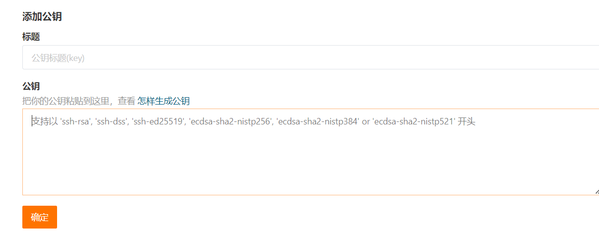

#### Git

*简介：首先版本控制与问题追踪一直是软件工程中非常重要的一点，我们在开发的时候因为某一步而造成了不可逆转的情况就需要将版本恢复到之前未修改的状况，如果我们不使用版本控制相关的程序的话那么我们就需要对每一次都做一下手动备份，非常的麻烦。但是在引入了版本控制工之后我们就能使用这些工具中提供的一系列命令来实现本地代码的推送，以及对之前版本的恢复等操作。刚开始比较通用的一款版本控制软件是svn，不过这款软件他是集中式的版本管理也就是代码都放在同一个服务器中，所有的操作都要从中心服务器中拉去以及提交，通常是在一个局域网中使用svn搭建中心服务器，这样虽然局限性比较大但是有很强的安全性。后面兴起的一款版本控制软件就是Git了，Git是基于Linux内核制作的一款分布式版本控制软件 分布式相比于集中式的最大区别在于开发者可以提交到本地，每个开发者通过克隆（git clone），在本地机器上拷贝一个完整的Git仓库，然后再完成的时候推送到远程服务器中实现统一管理，这种的好处就是不受地理位置的局限，只要是有网就能实现多人协同的开发。*

##### 第一回 “Git的安装，与简单的创建一个仓库”

- Git的安装可以说是非常非常的简单了，我们只要在官网下载对应的安装包然后剩下就是傻瓜式安装，一直下一步。最后我们会发现在右键的菜单上有这两个选项就算是安装成功了。

  官网：https://git-scm.com/

  右键菜单：

  

- 然后我们就要配置我们的用户名与邮箱地址

  > 使用如下命令来初始化你的用户名与邮箱
  >
  > ~~~bash
  > $ git config --global user.name "Your Name"
  > $ git config --global user.email "email@example.com"   
  > ~~~
  >
  > 然后你设置好你的用户名与密码之后使用这两个命令可以查看，如下效果即为修改成功
  >
  > 

- 我们在配置完毕之后之后就需要在本地创建一个仓库

  首先我们要进入 “想要被Git管理” 的项目文件夹 ，然后右键菜单选中  Git Bash Here 进入Git命令窗口，然后输入命令git init 来实现初始化如下图。

  

  当初始化完毕之后他会在这个文件夹中产生一个.git文件夹，但是这个文件夹是默认隐藏的需要开启显示隐藏的文件才能正常看见。

##### 第二回 “Git中的常用命令”

- 因为Git是一个基于Linux的版本控制软件所以他的命令几乎就和Linux的命令一样，我们今天就先介绍一些比较常用的命令们。

  1. git init 初始化指令，使用这个可以将我们的文件夹(项目文件夹)标记为被git管理的项目，这个命令我们在上面已经使用过了。

  2. git add指令，使用这个指令可以将我们后来添加到这个文件夹中的文件添加到Git的暂存区中，这个区域是暂时存在内存中的，我们只有添加到暂存区后在能提交。

  3. git status指令，使用这个指令能够看到我们当前被Git托管的文件夹(项目)中文件的状态。

  4. git commit -m ’msg‘ 指令，使用这个指令能让我们将暂存区中的内容提交到这个项目中。

  5. git log 查看之前的提交日志，使用这个指令能够让我们看到我们之前所有的提交操作日志。而这也正是我们后面回滚时的重要依据。

  6. git reset --hard “提交日志的id”，使用这个指令能够让我们回退到任意一个提交前的状态，前提是在日志中能够查询到的提交状态。

  7. 当然在git中有一些文件我们不希望他被git管理我们就可以创建一个文件 “.gitignore”然后再里面田间要被忽略的文件即可 比如 *.xml 就代表所有以.xml结尾的都不会被添加到git中，比如/targe/**就代表所有targe文件夹下的都不会被添加到git中。

     - 实操一波，首先我们在当前文件夹中添加一个文件a.txt

       

       然后我们使用 git status 查看当前的状态，然后发现我们创建的文件a.txt是红色的并且git告诉我们说 “使用 git add 文件名 来讲文件加入暂存区，然后才能commit 提交”

       

       就tm听你的，我们使用 git add 将他添加到暂存区，然后我们发现文件颜色变绿了。此时我们可以选择提交或者继续修改文件

       

       但是我们发现我们一旦修改文件的内容之后在使用git status，就会显示他已经被修改又变红了，那么这就需要我们再次执行一遍add指令。

       

       然后我们再次添加一遍，然后使用提交指令完成提交，在这里你会发现我使用了add . 这个指令的意思就是将当前文件夹中未add的文件全部添加到暂存区中。而且对于 commit指令我们必须要为它添加 -m “message” 也就是描述，用来描述我们这次提交的添加或者修改内容是什么。

       

       我们先创建几个文件来模拟多一点操作日志。然后我们查看日志可以看到我们之前的三次提交操作确实都保存了下来，并且标注了作者以及commit id等等信息。

       

       然后我们就来尝试恢复到创建文件b之前的状态。我们执行完毕指令 git reset 之后，他确实也提示我们回滚成功了现在的提交状态未我们重置的那个状态。然后再查看文件夹确实b.txt文件也消失了。

       

       

##### 第三回 “Git中的分支与冲突”

- 为什么要有分支捏？就拿我们正在运行的项目来说吧，一个已经上线并且稳定运行的项目我们要添加一些新功能并且这些功能根主项目比起来不那么重要。我们肯定不能将项目暂时下线然后去修改他的主分支然后等修改完毕之后再让主分支上线，这是十分不符合逻辑以及实际使用的。所以我们需要不同的分支，当添加新功能的时候我们就拉出来一个新分支，然后再新分支中完成这些操作然后最后再将他合并到主分支中就ok辣。

- 那么我们如何再git中创建分支以及合并分支呢？

  1. git branch 查看分支指令，使用这个指令能够查看当前拥有的分支

  2. git branch ’分支名字‘ 再当前使用的分支的基础上创建一个新的分支

  3. git checkout ’分支名字‘ 切换分支

  4. git merge ’分支名字‘ 再当前使用的分支基础上合并另外一个分支

  5. git branch -d b1 删除分支删除前会检查是否有没合并的分支，git branch -D b1 不做检查直接删除分支，当然都不能删除当前正在使用的分支。

     - 实操一波吧，首先我们创建一个新的分支dev01

       

       然后我们切换到dev01分支上，并且再dev01上执行一些其他的操作

       

       再dev01上添加一个文件c.txt并且提交

       

       然后我们切换到master分支上,此时我们发现确实切换到了master分支上并且文件夹中的c.txt消失了，我们确实要的就是这样的效果修改其他的分支不会影响到另外的分支。

       

       此时我们将dev01分支合并到master上，我们发现分支确实合并上了并且c.txt文件也出现了。

       

       这种是没有发现冲突的，如果我们两个分支都对同一个文件进行了不同的修改，那么必然会有冲突，冲突要如何处理？然后我们分别在master分支与dev01分支中修改了a.txt此时合并就发生了冲突，我们可以在git中进入a.txt查看信息。

       

       我们想要保留master分支下的就只能将其他不需要的删除掉。可以手动进入被修改的文件中删也可以使用cat修改删除。

       

##### 第四回 “在IDEA中使用GIT”

- 我们在上面几个章节都是在本地使用Git命令的方式操作本地仓库，但是在实际开发的时候我们必定会用到远程仓库，也就是将我们本地的git项目部署到远程仓库，然后远程仓库可以供多个用户同时使用实现协同开发。

- 首先我们要创建一个远程仓库的账户，目前比较主流的是国外的GitHub，但是因为在外网我们访问十分的不方便所以我们在国内一般使用的是Gitee，这是阿里云搭建的一款远程代码托管平台我们可以使用这个来做我们的原厂仓库，上传与拉取的速度会比较快。

  1. 创建Gitee账号，然后我们要在Git中生成密钥并且添加到Gitee中作为我们后续上传代码与拉去代码的凭证。

     创建账号我就不在演示了，进入码云官网(http://gitee.com)使用邮箱创建一个即可。

     主要我们演示一下密钥的生成与配置

     - 首先我们要在git中创建一波公钥

       使用指令 `ssh-keygen -t rsa` 然后不断回车就会生成一个公钥文件，我们通常可以在 这个目录C:\Users\dell\\.ssh下找到对应的公钥文件 id_rsa.pub 然后我们可以使用记事本打开这个文件，这个文件中的所有内容就是我们所需要的公钥了。

     - 有了公钥我们就可以去Gitee中创建仓库并且配置公钥信息了

       首先还是进入Gitee官网，登录用户，然后点进设置页面

       

       然后进入这个页面，配置公钥

       

       如下图，说的十分清楚了，就将我们上一步生成出来的密钥粘贴进去，并且修改一个你认为合适的标题然后点击确定你就会发现上面多出来了一个公钥，当然你账号里面的仓库想要让其他用户访问也需要将其他用户的公钥添加进去。

       

       添加成功就如下图

       

  2. 再Gitee中创建一个仓库并且尝试使用git将本地的仓库推送上去。

     - 来我们先在Gitee上创建一个仓库，这个仓库是用来存放我们要上传过来的git项目。然后我们只要照着让填写的栏目简单填写一下然后点击提交就ok了。提交完毕之后我们会发现一个仓库的git地址我们选择ssh这一项，找到对应的ssh连接即可。

       

       

     - 然后我们就要使用指令的形式将本地仓库关联到远程仓库并且推送(push)上去以及如何拉取，以及克隆。

       首先我们要找一个之前写过的项目然后初始化成本地仓库。就拿之前写过的BillDemo来做演示。     首先在此项目的目录下打开git的shell窗口。然后执行 git init 指令完成基础的初始化。

       

       然后我们使用指令 git remote add ‘为关联的远程仓库起的名字’ 远程仓库地址来关联远程仓库，如下图我们确实把本地仓库关联到了gitee上的原厂仓库。

       

       然后我们就为次项目添加.gitignore文件过滤掉targer文件夹里面的所有内容。

       

       此时我们就可以使用 git add指令将次目录下的文件添加给git管理了，然后再使用git commit 指令提交上去。

       

       提交完毕之后我们就可以使用指令 git push 远程仓库名 要推送到的分支名 将他推送到远程仓库,然后如下图就代表我们确实推送上去了。

       

       

       

       

       当然我们对于一个远程仓库使用者肯定不止一个人，那么我们就需要在下次工作前拉取其他用户的操作之后再去做自己的操作，此时就用到pull 指令 pull ‘远程仓库名’ 远程分支:本地分支，就如下图所示。

       

       当然我们要是像将远程仓库之间搬到一个新的生产环境，此时我们就可以使用clone指令，这个指令可以从远程仓库的代码克隆到我们本地。使用格式 git clone 远程仓库的地址，如下图所示我们就已经从远程仓库将代码克隆出来了。

       

     - 此时我们就已经将使用git shell的 拉取 推送 克隆讲完了就简单的几个指令 clone，remote add ，push，pull，那么我们下面就简单的使用idea测试一遍拉取，推送，克隆。

       首先是代码的克隆，当然对于图形化界面总归是简单的拉取代码只需要选择下面图中的选项，然后讲拉取的远程仓库地址粘贴上去点击克隆即可。然后我们可以看到确实克隆下来了

       

       

       

       然后我们尝试一下添加与提交，随便改一下文件然后推送一波，我们可以再右上角看到这三个按钮，分别代表着 拉取，提交，推送。我们点击中间这个√也就是提交他自动会帮助我们进行 添加，提交的操作。然后我们看第二个图片他会自动分析出你变更的内容，然后提交。当然还是要写提交的描述信息的

       

       

       然后我们点击最右边的标记就可以将本地的内容推给远程仓库了

       

       当然我们点击最左边的按钮就可以将远程仓库中的信息拉取过来，当然对于多人协作工程很容易出现冲突的问题，并且再idea中冲突非常的容易解决只要选择你觉着合适的代码即可，他会自己帮你添加上。在这就不在演示了。