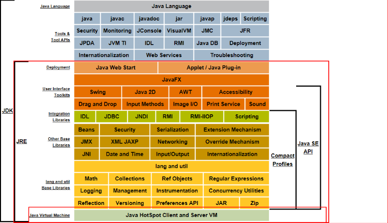
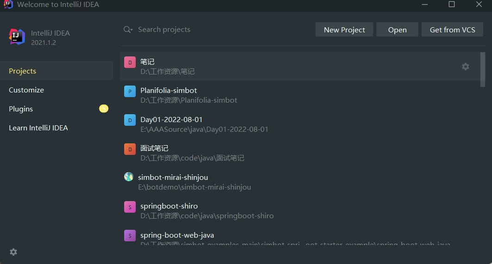
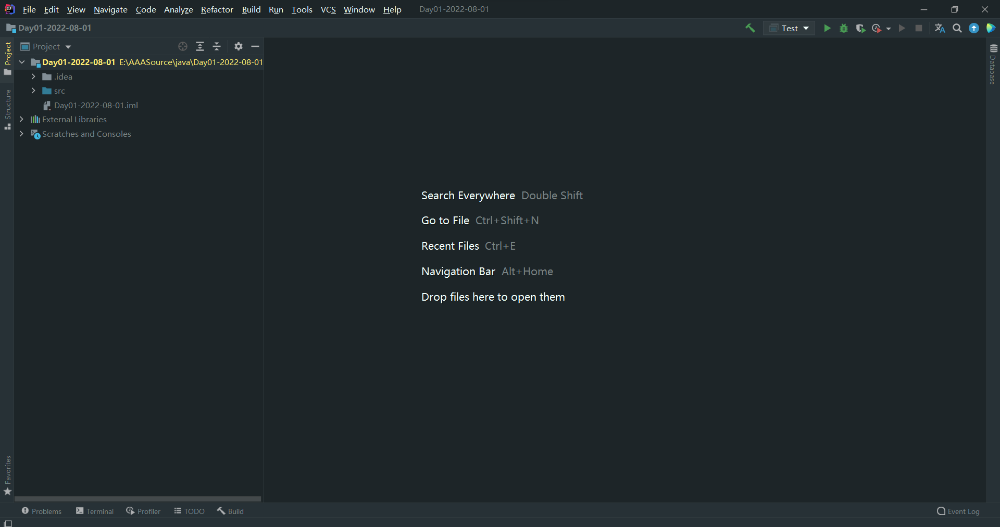
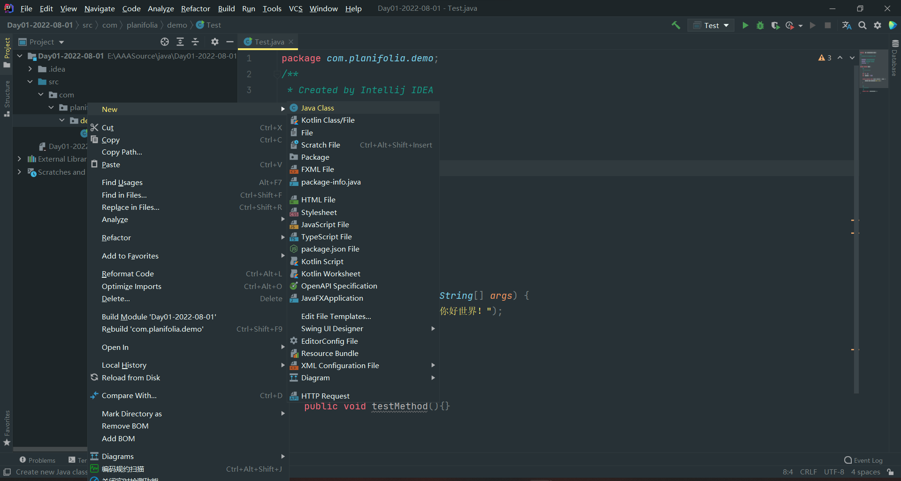
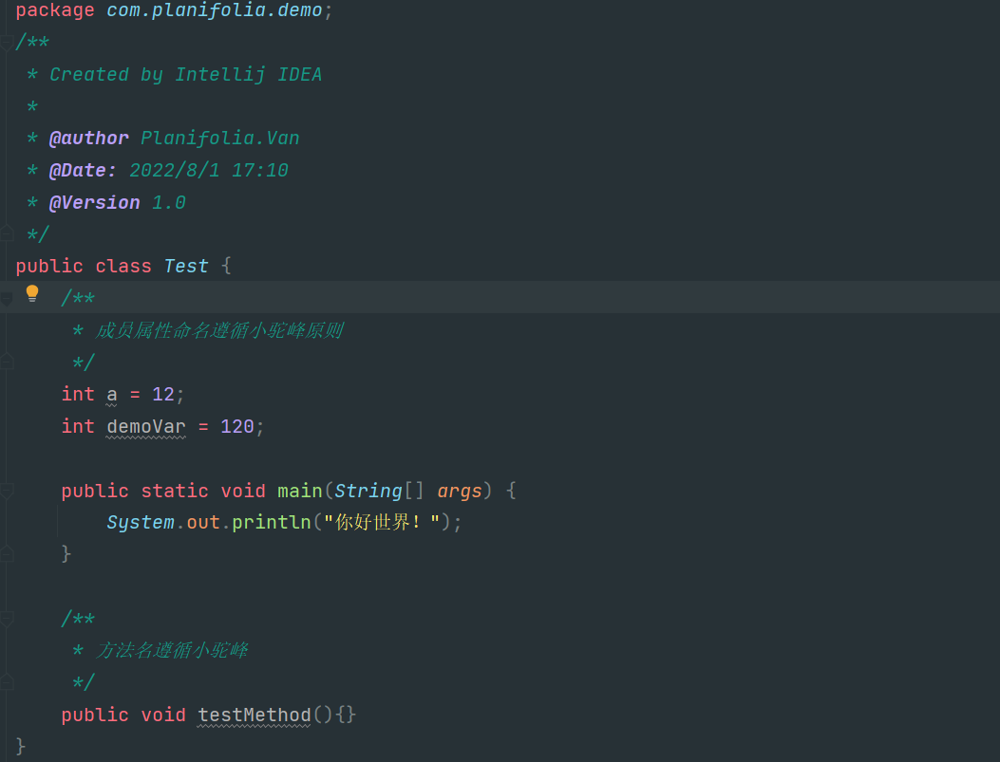
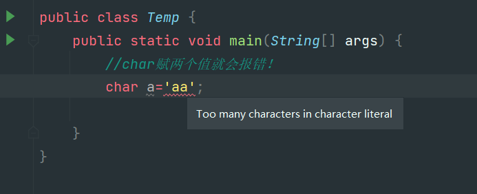
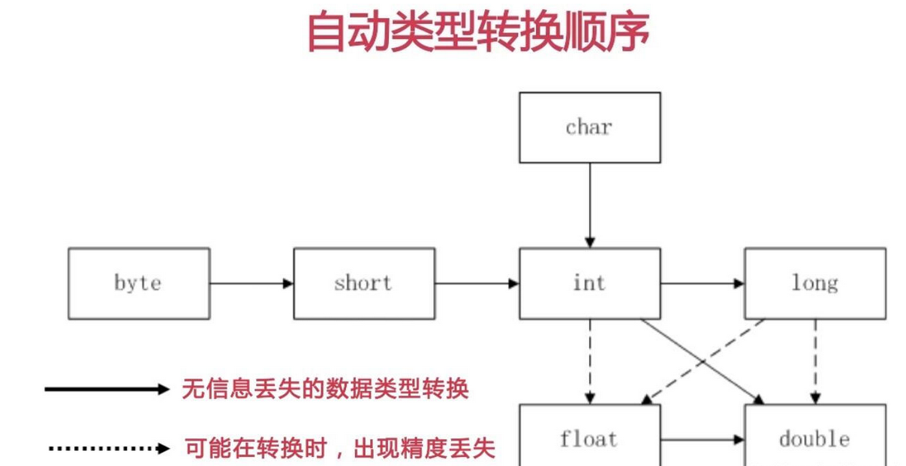
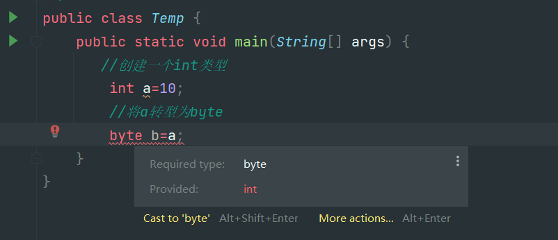
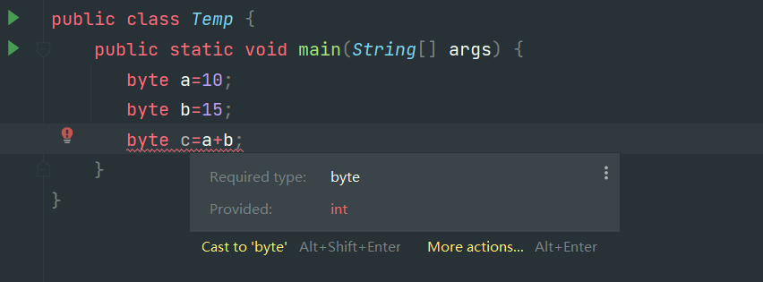

## JavaEE第一天

1.从今天开始我们就结束了前端web的学习正式进入到了Java的学习，下面我们就简单的介绍一下java需要了解的一些内容。

1.1 Java是一门开源的，强约束的，面向对象的语言起源于1995年SUN公司的‘詹姆斯·高瑟林’团队后来因为某些原因被被Oracle公司收购直至今天，仍然是最火的语言之一。Java到如今总计有三个大的发展方向 JavaEE(Java桌面应用开发，也就是桌面应用类)，JavaSE(Java服务器级应用开发，也就是我们主要学习的服务器类应用开发)，JavaME(Java嵌入式开发，像传统的机器程序，手机应用等等)，所以我们作为零基础入门学习就从最简单的JavaEE开发开始！

1.2 什么是JDK，JRE，JVM？我们从后往前说。

* JVM是java虚拟机，顾名思义他是一个虚拟的机器，是用来运行.class文件的。一次编译到处运行这种跨平台的特性就是jvm虚拟机带来的。java开发人员会根据不同的操作系统去创建不同版本的jvm虚拟机但是这些虚拟机都能够运行一种文件“.class”文件。所以我们只需要将编译好的.class文件交给jvm虚拟机让他运行就行了，而不需要关心他到底运行在哪种操作系统上。
* JRE是Java Runtime Environmen(java运行环境)，他是java程序.class文件运行的环境没有他我们就不能运行java程序，当然在jre中集成了jvm虚拟机并且有着java程序运行的一些类库。但是当我们想要开发Java程序的时候或者运行web项目的时候jre就不够我们用了！因为我们要将编写的java文件编译为.class文件/将jsp文件解析为.calss文件此时我们就需要jdk了。
* JDK全程是Java Development Kit(Java 开发环境工具包)顾名思义，jdk是用于开发java程序的他其中包括了JRE的所有内容，所有其实我们只需要安装一下JDK就能够满足我们的所有需求了，JDK在其中还集成了java的编译程序既能够运行java程序还能编译java程序。



1.3 IEDA的使用，我们在这之前已经了解了java的一些相关知识。"工欲善其事必先利其器"这种烂俗的话我也不想写😓，但是确实是这样我们想要高效率的开发java程序必然要有一个好用的IDE，所以作为当前最火的JavaIDE(IDEA)便成了我们的不二之选，接下来我们就简单介绍一下IDEA的使用。

* 首先安装IDEA，这一步不做过多的展示，网上资源太多了你只需要在百度上动动你的手指就能找到合适的资源然后按照教程安装或者解压就行了。当然欢迎正版！！！当你安装完毕之后打开一顿确认之后会得到这个界面

  
* 然后点击右上角的NewProject创建一个新项目，然后选择Java项目选择合适的SDK也就是之前安装的jdk8然后输入项目名，这个没啥特殊要求不要有中文就行了，我上面的图片请无视！！！

  然后创建完毕之后就会得到下面这个图片。很显然我们能看到上面一排的选择框其实看起来这么多常用的就一个File。然后第二拍右边几个按钮比较重要。绿色锤子代表构建目前还用不到，然后是选择运行的内容，再后面的绿色三角是运行按钮，在后面是debug按钮在后面不常用pass!!想了解的自行百度。
  然后看左边一列的内容，展开项目之后有几个映入眼帘的文件夹分别是.idea idea的配置文件。src 看见吗这个文件夹是蓝色的，那他必然不一般！对了我们的java代码就是在这里面写的这个我们后面在讲，继续往下看有一个.iml文件这个也是配置文件不管了。

  
* 在IDEA中编写第一个java文件，在写java代码之前我想很有必要讲一下java中的编写规范，我们做开发的都知道看别人的代码特别是大公司规范的代码十分的舒畅因为他们写的规范，规范并不是一种规矩约束，而是大家都遵守的一些约定，当我们使用这些约定进行开发的时候会提升我们代码的可读性，可维护性，赏心悦目性(我编的)所以按照规范编写代码十分的重要。

  和其他语言不同我们编写java代码要写在包中，包名一般是作为域名的反写就像百度www.baidu.com的域名那么他的包名可能就是com.baidu.xxx，包名要求所有为英语并且全部小写。然后类必须写在包里面，而类的编写要求见名知意，并且要遵循大驼峰原则（单词的每个字母大写）。我们写好一个类文件之后编辑器会自动创建一个与文件名一样的公共类，而且需要注意的是在类中编写变量与方法都有一定的命名规范要遵循小驼峰原则，具体案例可以看下面的图片；

  创建类文件

  

  类文件内容编码规范

  
* 我们在看了上面的文件图片之后，不禁有些疑问，啥是类啊 啥是方法啊 啥事成员属性啊。这些内容我们不需要了解太多只需要了解他的编写规范即可，到后面面向对象的时候我们会讲解一下他们的具体含义，目前我们只要知道。成员属性(全局变量)可以在方法中使用，方法就等价于我们之前js中写的函数，main方法就是整个程序的入口。对了顺便提一嘴，在Java中的注释与js中的类似单行 多行 文档注释。

1.4 Java中的八种数据类型，Java是一种强语言他对每一种数据类型都进行了约束，所以我们就不能像js中一样统统用var进行定义(当然在jdk10中引入var这种新特性)在Java中总共有四类八种数据类型，下面我们就进行仔细讲解。

* 整数类，在java中有四种整数类的数据类型，可见整数类的重要性，他们分别是 byte(一个字节) short(两个字节) int(四个字节) long(八个字节)，他们从小到大存储的数据长度依次增大。

  ```java
  public class Temp {
      public static void main(String[] args) {
          /**
           * 四种整形数据类型
           */
          byte a=10;
          short b=10;
          int c=10;
          long d=10;
          System.out.println(a+","+b+","+c+","+d);
      }
  }
  ```
* 浮点类，在java中有两种浮点类的数据类型，他们分别是 float单精度浮点数(4个字节) double双精度浮点数(八个字节)他们从小到大存储的数据长度即数据的精确度依次增大。

  ```java
   public static void main(String[] args) {
          /**
           * 四种浮点形数据类型
           */
          float a=12.68f;
          double b=12345.4987749;
          System.out.println(a+","+b+);
      }
  ```
* 布尔类型，在java中有用来表示正确错误的两个状态的变量称之为布尔类型，布尔类型也是占一个字节并且只有两个取值 true与false。这里不再演示
* 字符类型，char(两个字节)，这也是为什么java中的char类型可以存储中文汉字的原因，它占两个字节。而且汉字也正好占连个字节，有需要主要的一点是虽然char有两个字节的内存空间但是他赋值的时候只能赋一个字符就行 char a='x';那么char a='ac';这样就是错误的！

  

1.5 自动类型转换,在java中我们可以用这样一句话来概括自动类型转换：取值范围小的可以自动转换为取值范围大的类型，数据精度低的能够自动转型为数据精确度高的数据类型。

* 这样一来我们根据这个特性就能分析出java中的自动转型了。比如byte可以转型为short，short可以转型为int，char可以转型为int，int可以转型为long，float可以转型为double这些都是自然而然根据上面的经验可以得出的。当然也有一些特殊情况就像int类型可以转型为float但是可能会丢失精度，long也可以转化成float也可能丢失精度，long转化成double也是一样的效果。下面我就挑几个有代表性的进行演示。

  ```java
  public class Temp {
      public static void main(String[] args) {
          //创建一个byte的变量
          byte byteA=10;
          //byte变量自动转型为int
          int intA=byteA;
          //int变量自动转型为long
          long longA=intA;
          //long类型转化成float,注意的是会转换成科学计数法
          long longB=12561841234565L;
          float floatB=longB;
      }
  }
  ```

  具体内容可以参考这个图片

  

1.6 强制类型转换，我们得知了在java中从小范围数据到大范围数据的转型是自然的不需要外部声明的但是我们想要让大范围高精度的数转型为小范围低精度的数就需要进行强制类型转换，强转的个数为 变量a=(转型的类型)变量b 强制类型转换其实是欺骗编译器来实现编译通过。具体见下代码

* 显然这样会报错说需要的int类型却给了byte类型



* 强转为byte,编译通过


1.7 运算符 在java中运算符几乎和js中的一模一样也可以分成三大类，一目运算符，二目运算符，三目运算符。我们在下面只做简单的介绍不做具体的演示了。

* 一目运算符，java中的一目运算符无外乎 ++ --，就是变量自增一但是在java中有一个特性，当++ -- 放在变量前面的时候则是将运算后的值赋给前面的变量，而++ --放在后边的时候则是将运算前的值赋给前面的变量

  ```java
  public class Temp {
      public static void main(String[] args) {
         //创建一个变量a
          int a=10;
          System.out.println(a++);
          System.out.println(++a);
      }
  }
  ```
* 二目运算符，java中的二目运算符就几乎和js一模一样了也是 + - * / % > < = >= <= == !=这几种作用我们就不在过细的阐述了
* 三目运算符，java中的三目运算符编写格式也是 (表达式)?(真值A):(假值B)
* 在这我们在讲解一下java的特性吧。关于运算提升的，当我们两个不同类型的变量/数值进行运算的时候得到的结果会自动升格为范围/精确度更高的那个数据类型，就像我们一个byte和int的数据类型进行运算那么结果就是int类型,int类型与float类型进行运算结果就为float数据类型。
* 还有一点 隐式类型转换，也就是jvm的优化，当我们创建两个byte变量的时候我们让这两个byte变量进行运算的时候我们在吧结果给一个byte变量c，按照正常思维来想的话，嗯很合理啊！但是我们在IDE写完这三行代码会发现一个非常诡异的事情！😱报错了！提示我们不能把int类型的数据赋值给byte需要强转。？？？我们明明没有创建任何int变量啊！

  这就是jvm的优化，它会认为我们使用byte是比较不合理的很容易就爆数据了所以在运算的时候自动帮我们升格为了int数据类型就会出现这种错误！

  

1.8 流程控制 嗨呀🙋‍，老生常谈的语法格式啦，常见的while循环 for循环 if判断语句 switch多分支选择语句等等等，我们在js章节中讲的比较多了再次不做过多阐述。
