# `第一阶段JavaSe`

## JavaSE第一天

1.从今天开始我们就结束了前端web的学习正式进入到了Java的学习，下面我们就简单的介绍一下java需要了解的一些内容。

1.1 Java是一门开源的，强约束的，面向对象的语言起源于1995年SUN公司的‘詹姆斯·高瑟林’团队后来因为某些原因被被Oracle公司收购直至今天，仍然是最火的语言之一。Java到如今总计有三个大的发展方向 JavaEE(Java桌面应用开发，也就是桌面应用类)，JavaSE(Java服务器级应用开发，也就是我们主要学习的服务器类应用开发)，JavaME(Java嵌入式开发，像传统的机器程序，手机应用等等)，所以我们作为零基础入门学习就从最简单的JavaEE开发开始！

1.2 什么是JDK，JRE，JVM？我们从后往前说。

* JVM是java虚拟机，顾名思义他是一个虚拟的机器，是用来运行.class文件的。一次编译到处运行这种跨平台的特性就是jvm虚拟机带来的。java开发人员会根据不同的操作系统去创建不同版本的jvm虚拟机但是这些虚拟机都能够运行一种文件“.class”文件。所以我们只需要将编译好的.class文件交给jvm虚拟机让他运行就行了，而不需要关心他到底运行在哪种操作系统上。
* JRE是Java Runtime Environmen(java运行环境)，他是java程序.class文件运行的环境没有他我们就不能运行java程序，当然在jre中集成了jvm虚拟机并且有着java程序运行的一些类库。但是当我们想要开发Java程序的时候或者运行web项目的时候jre就不够我们用了！因为我们要将编写的java文件编译为.class文件/将jsp文件解析为.calss文件此时我们就需要jdk了。
* JDK全程是Java Development Kit(Java 开发环境工具包)顾名思义，jdk是用于开发java程序的他其中包括了JRE的所有内容，所有其实我们只需要安装一下JDK就能够满足我们的所有需求了，JDK在其中还集成了java的编译程序既能够运行java程序还能编译java程序。


1.3 IEDA的使用，我们在这之前已经了解了java的一些相关知识。"工欲善其事必先利其器"这种烂俗的话我也不想写😓，但是确实是这样我们想要高效率的开发java程序必然要有一个好用的IDE，所以作为当前最火的JavaIDE(IDEA)便成了我们的不二之选，接下来我们就简单介绍一下IDEA的使用。

* 首先安装IDEA，这一步不做过多的展示，网上资源太多了你只需要在百度上动动你的手指就能找到合适的资源然后按照教程安装或者解压就行了。当然欢迎正版！！！当你安装完毕之后打开一顿确认之后会得到这个界面

  
* 然后点击右上角的NewProject创建一个新项目，然后选择Java项目选择合适的SDK也就是之前安装的jdk8然后输入项目名，这个没啥特殊要求不要有中文就行了，我上面的图片请无视！！！

  然后创建完毕之后就会得到下面这个图片。很显然我们能看到上面一排的选择框其实看起来这么多常用的就一个File。然后第二拍右边几个按钮比较重要。绿色锤子代表构建目前还用不到，然后是选择运行的内容，再后面的绿色三角是运行按钮，在后面是debug按钮在后面不常用pass!!想了解的自行百度。
  然后看左边一列的内容，展开项目之后有几个映入眼帘的文件夹分别是.idea idea的配置文件。src 看见吗这个文件夹是蓝色的，那他必然不一般！对了我们的java代码就是在这里面写的这个我们后面在讲，继续往下看有一个.iml文件这个也是配置文件不管了。

  
* 在IDEA中编写第一个java文件，在写java代码之前我想很有必要讲一下java中的编写规范，我们做开发的都知道看别人的代码特别是大公司规范的代码十分的舒畅因为他们写的规范，规范并不是一种规矩约束，而是大家都遵守的一些约定，当我们使用这些约定进行开发的时候会提升我们代码的可读性，可维护性，赏心悦目性(我编的)所以按照规范编写代码十分的重要。

  和其他语言不同我们编写java代码要写在包中，包名一般是作为域名的反写就像百度www.baidu.com的域名那么他的包名可能就是com.baidu.xxx，包名要求所有为英语并且全部小写。然后类必须写在包里面，而类的编写要求见名知意，并且要遵循大驼峰原则（单词的每个字母大写）。我们写好一个类文件之后编辑器会自动创建一个与文件名一样的公共类，而且需要注意的是在类中编写变量与方法都有一定的命名规范要遵循小驼峰原则，具体案例可以看下面的图片；

  创建类文件

  

  类文件内容编码规范

  
* 我们在看了上面的文件图片之后，不禁有些疑问，啥是类啊 啥是方法啊 啥事成员属性啊。这些内容我们不需要了解太多只需要了解他的编写规范即可，到后面面向对象的时候我们会讲解一下他们的具体含义，目前我们只要知道。成员属性(全局变量)可以在方法中使用，方法就等价于我们之前js中写的函数，main方法就是整个程序的入口。对了顺便提一嘴，在Java中的注释与js中的类似单行 多行 文档注释。

1.4 Java中的八种数据类型，Java是一种强语言他对每一种数据类型都进行了约束，所以我们就不能像js中一样统统用var进行定义(当然在jdk10中引入var这种新特性)在Java中总共有四类八种数据类型，下面我们就进行仔细讲解。

* 整数类，在java中有四种整数类的数据类型，可见整数类的重要性，他们分别是 byte(一个字节) short(两个字节) int(四个字节) long(八个字节)，他们从小到大存储的数据长度依次增大。

  ```java
  public class Temp {
      public static void main(String[] args) {
          /**
           * 四种整形数据类型
           */
          byte a=10;
          short b=10;
          int c=10;
          long d=10;
          System.out.println(a+","+b+","+c+","+d);
      }
  }
  ```
* 浮点类，在java中有两种浮点类的数据类型，他们分别是 float单精度浮点数(4个字节) double双精度浮点数(八个字节)他们从小到大存储的数据长度即数据的精确度依次增大。

  ```java
   public static void main(String[] args) {
          /**
           * 四种浮点形数据类型
           */
          float a=12.68f;
          double b=12345.4987749;
          System.out.println(a+","+b+);
      }
  ```
* 布尔类型，在java中有用来表示正确错误的两个状态的变量称之为布尔类型，布尔类型也是占一个字节并且只有两个取值 true与false。这里不再演示
* 字符类型，char(两个字节)，这也是为什么java中的char类型可以存储中文汉字的原因，它占两个字节。而且汉字也正好占连个字节，有需要主要的一点是虽然char有两个字节的内存空间但是他赋值的时候只能赋一个字符就行 char a='x';那么char a='ac';这样就是错误的！

  

1.5 自动类型转换,在java中我们可以用这样一句话来概括自动类型转换：取值范围小的可以自动转换为取值范围大的类型，数据精度低的能够自动转型为数据精确度高的数据类型。

* 这样一来我们根据这个特性就能分析出java中的自动转型了。比如byte可以转型为short，short可以转型为int，char可以转型为int，int可以转型为long，float可以转型为double这些都是自然而然根据上面的经验可以得出的。当然也有一些特殊情况就像int类型可以转型为float但是可能会丢失精度，long也可以转化成float也可能丢失精度，long转化成double也是一样的效果。下面我就挑几个有代表性的进行演示。

  ```java
  public class Temp {
      public static void main(String[] args) {
          //创建一个byte的变量
          byte byteA=10;
          //byte变量自动转型为int
          int intA=byteA;
          //int变量自动转型为long
          long longA=intA;
          //long类型转化成float,注意的是会转换成科学计数法
          long longB=12561841234565L;
          float floatB=longB;
      }
  }
  ```

  具体内容可以参考这个图片

  

1.6 强制类型转换，我们得知了在java中从小范围数据到大范围数据的转型是自然的不需要外部声明的但是我们想要让大范围高精度的数转型为小范围低精度的数就需要进行强制类型转换，强转的个数为 变量a=(转型的类型)变量b 强制类型转换其实是欺骗编译器来实现编译通过。具体见下代码

* 显然这样会报错说需要的int类型却给了byte类型


* 强转为byte,编译通过


1.7 运算符 在java中运算符几乎和js中的一模一样也可以分成三大类，一目运算符，二目运算符，三目运算符。我们在下面只做简单的介绍不做具体的演示了。

* 一目运算符，java中的一目运算符无外乎 ++ --，就是变量自增一但是在java中有一个特性，当++ -- 放在变量前面的时候则是将运算后的值赋给前面的变量，而++ --放在后边的时候则是将运算前的值赋给前面的变量

  ```java
  public class Temp {
      public static void main(String[] args) {
         //创建一个变量a
          int a=10;
          System.out.println(a++);
          System.out.println(++a);
      }
  }
  ```
* 二目运算符，java中的二目运算符就几乎和js一模一样了也是 + - * / % > < = >= <= == !=这几种作用我们就不在过细的阐述了
* 三目运算符，java中的三目运算符编写格式也是 (表达式)?(真值A):(假值B)
* 在这我们在讲解一下java的特性吧。关于运算提升的，当我们两个不同类型的变量/数值进行运算的时候得到的结果会自动升格为范围/精确度更高的那个数据类型，就像我们一个byte和int的数据类型进行运算那么结果就是int类型,int类型与float类型进行运算结果就为float数据类型。
* 还有一点 隐式类型转换，也就是jvm的优化，当我们创建两个byte变量的时候我们让这两个byte变量进行运算的时候我们在吧结果给一个byte变量c，按照正常思维来想的话，嗯很合理啊！但是我们在IDE写完这三行代码会发现一个非常诡异的事情！😱报错了！提示我们不能把int类型的数据赋值给byte需要强转。？？？我们明明没有创建任何int变量啊！

  这就是jvm的优化，它会认为我们使用byte是比较不合理的很容易就爆数据了所以在运算的时候自动帮我们升格为了int数据类型就会出现这种错误！

  

1.8 流程控制 嗨呀🙋‍，老生常谈的语法格式啦，常见的while循环 for循环 if判断语句 switch多分支选择语句等等等，我们在js章节中讲的比较多了再次不做过多阐述。

## **JavaSE第二天**

1. 面向对象浅谈，众所周知Java是一门纯面向对象的语言，正所谓在Java中万物即对象，那么到底什么是对象呢？我们常说的是类是对象的抽象，而对象的类的具体，这样来说还是比较空洞，下面我们就具体的阐述一下两者的关系

1.1 对象的作用，我们在昨天已经学会了如何去创建一个类，今天我们就简单的了解一下对象。对于对象的作用我们不妨理解为它是一个实体，而在这个实体中我们可以存放一些具体的数据(对象的属性)，我们可以添加一些操作(对象中的成员方法)，然后我们可以通过对象.属性值/方法名的形式对他们进行调用。

1.2 对象的创建，我们已经了解了对象可以用来干啥的了我们下面就介绍下如何去创建对象，Java中的对象创建是通过new关键字+构造方法进行创建的(我们还没有讲构造方法在这只做了解罢，后面会细讲)其实本质上就是new关键字调用了类中的构造方法去创建了一个对象，当new出来了一个对象之后Java就会在堆内存上创建这个对象实例，里面有着对象的 所有信息包括成员变量，成员方法等等等... 然后我们创建出来这个对象之后我们就可以通过 对象.xxx 对象.xxx()的方法去访问成员变量，调用成员方法，具体见下代码。

```java
/**
 * 一个Phone类，里面有一些成员方法与方法
 */
public class Phone {
    String uid="DSA56984612";

    public void sendMail(){
        System.out.println("发短信");
    }

    public void call(){
        System.out.println("打电话");
    }

    public void sum(int a,int b){
        System.out.println(a + b);
    }

    public void cube(int a){
        System.out.println(a * a * a);
    }
}

```

```java
/**
 * 创建一个测试类创建对象并且访问成员变量调用长远方法
 */
public class TestB {

    public static void main(String[] args) {
        //创建对象
        Phone phoneA=new Phone();
        //访问成员变量
        System.out.println(phoneA.uid);
        //调用成员方法
        phoneA.sendMail();
        phoneA.call();
        phoneA.sum(120,150);
        phoneA.cube(2);
    }
}
```

1.3 我们在上面的案例中也看到了一个新内容(成员方法)。其实我们从一开始就接触了一个方法main方法，这个方法是整个程序的入口，我们运行一个类就是通过main方法开始的。但是我们今天学习到的方法和main方法不太一样，它是写在某一个类中的而且可以有多个，我们都自动main方法作为程序的入口一个类中只能有多个。但是成员方法(实例方法)可以有多个，并且我们调用成员方法(非静态)的方式只能通过      对象.方法名()的形式去调用。并且在java中成员方法的编写有着严格的规范，必须遵循以下模板，否则就会报错！

权限修饰符(public protect private) 返回值类型(void+数据类型) 方法名(参数列表){ 方法体 }

1.4 方法中的参数列表与返回值，很显然我们是需要使用方法来进行某些业务的处理的，也就是我们需要方法有I/O功能，也就是能够输入数据处理完毕之后再返回数据，所以在java中的方法也规定了输入参数与返回值，所以我们可以通过传入参数为方法传入我们要处理的数据，然后再将处理后的值返回到调用处。这样就真正的实现了通过方法来帮助我们完成某些业务的功能。，具体见下案例

```java
public class BodyType {
    /**
     * 通过一个方法计算出体重信息<br>
     * 本方法共有两个参数，分别是体重与身高，然后镜经过处理之后会返回具体的身体信息。
     * @param w 体重
     * @param h 身高
     * @return 体重信息
     */
    public String bodyMsg(double w,double h){
        double stand=h-105;
        double temp=w-stand;

        if (temp>5){
            return "偏胖";
        }else if (temp<-5){
            return "偏瘦";
        }else {
            return "正常";
        }
    }
}
```

```java
public class Test {
    public static void main(String[] args) {
        //创建BodyType对象
        BodyType bt=new BodyType();

        //创建Scanner对象用来通过控制台输入信息
        Scanner scanner=new Scanner(System.in);
        System.out.println("请输入体重");
        double w = scanner.nextDouble();
        System.out.println("请输入身高");
        double h = scanner.nextDouble();

        //输出方法处理完毕的信息
        System.out.println(bt.bodyMsg(w, h));
    }
}

```

1.5 gs方法(get set 方法)get set方法也是属于Java中的特性之一，我们虽然还没有讲到java的三大特性(继承，封装，多态)但是gs方法的引入，成员变量私有化就是java中封装的核心涵义，java不推荐让外部通过对象随便的访问成员变量，而是推荐通过对象调用方法的形式来对成员变量进行修改查询操作，所以就引入了这样的概念，成员属性私有化，gs方法公开。

在java中gs方法的书写格式一般是推荐写成 getArg(){ return this.arg; } / setArg(Type arg){ this.arg=arg; }

```java
public class People {
  
    private long pid;
    private String pname;
    private int age;
    private String address;

    public long getPid() { return pid; }

    public void setPid(long pid) { this.pid = pid; }

    public String getPname() { return pname; }

    public void setPname(String pname) { this.pname = pname; }

    public int getAge() { return age; }

    public void setAge(int age) { this.age = age; }

    public String getAddress() { return address; }

    public void setAddress(String address) { this.address = address; }
}
```

1.6 权限修饰符 我们在之前其实已经接触过了权限修饰符，public根据字面意思其实我们就能够理解它的意思，公开的嘛，谁都可以访问的，所以在Java中我们通常将对外开放的方法也成为接口api设置为public方便我们在任何地方去访问他们。并且我们在创建上面几个变量的时候引入了第二种权限修饰符 private 私有的。他的作用如果你仔细看了上一节的内容那么你也应该理解了就是将某个属性，或者某个方法，或者某个类声明为私有的只能够在当前的类内访问的。

当然你在这应该感觉到不对了！类如果设成private那就没任何意义了只能在当前类下访问！所以我们一般只将成员变量设置成私有的限制外部的访问。

当然除了上面的这两种还有其他的权限修饰符，从大到小可以排列为 public protected default private，他们的具体关系如下

public允许在任何地方访问，protected允许同包内访问以及继承访问，default只允许包内访问，private只允许自己类内访问具体可以看下面的图片。

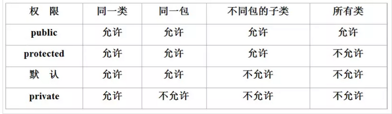

1.7 toString()方法，toString方法顾名思义转化成字符串的方法，但是我们会发现一个奇怪的事情，明明我们没有写toString方法但是我们却可以使用，并且输出结果也是一个奇怪的东西！

```java
public class Temp {
    public static void main(String[] args) {
        People p=new People();
        System.out.println(p.toString());
    }
}
```


这是因为在Java中我们所有的类都是默认继承自Object类，拥有Object中的所有方法，我们去翻阅Object中的方法就能够得到答案，原来在Object类中有一个toString方法并且在这个方法会返回当前类的 全限定名+当前对象的hashCode。

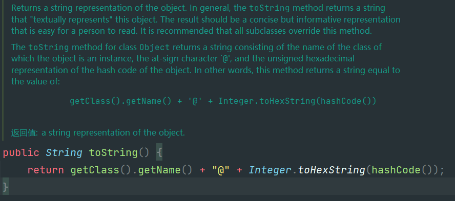

1.8 **构造器** 这位更是重量级，在Java中我们其实一开始就接触了构造器只是我们不知道罢了，你很自然而然的就通过new 类名()方式去创建一个新的对象但是你有没有想过 new 只是一个调用的关键字，而类名()是一个方法！哎呀不对啊，我在我写的类里面并没有写这个方法啊，对着就涉及到了Java构造器的第一个特性了，如果你没有自定义任何构造方法那么java就会自动的帮你创建一个无参的空构造方法，因为虽然你没有通过构造方法去初始化成员变量但是你需要它去帮你创建出来这个对象。这也是构造方法第一个功能也是最重要的功能创建对象实例，通过new关键字去调用构造方法之后java会帮我们在堆内存中创建出一个对象实例供我们后来使用。

```java
People p=new People();
```

我们当然也可以尝试自己去写构造方法，但是需要注意的一点是构造方法是类中特殊的方法，这样是构造方法的第二特性，它不允许有任何的返回值并且要求必须是被public修饰，便于我们在外部随意的调用来创建类的对象。

```java
public People(){}
```

那么我们要是想要在创建对象的时候就去初始化类中的成员变量那要怎么办呢？很显然我们可以在创建对象的时候通过传入参数值的方式并且在构造方法中进行赋值！见下代码

```java
 public People(){}
  
    public People(long pid,String pname,int age,String address){
        this.address=address;
        this.pid=pid;
        this.age=age;
        this.pname=pname;
    }
```

```java
public static void main(String[] args) {
        People p1 = new People();
        People p2 = new People(41148154564652L,"CZY",22,"HN");
    }
```

哎呀！怪了，你怎么能写俩名一样的方法啊，肯定报错！我的评价是 哈哈😄，Java的特性，方法的重载了解一下。在Java中允许方法重载的形式出现也就是在同一个类中允许多个方法名相同但是参数列表不同就能够完成方法的重载，并且在不同的重载方法中可以写不同的方法体。其实这个特性非常的简单也好理解只需要在同名方法中让他的参数列表中的，参数个数，参数种类，参数顺序不同就可以了。

*提问？为什么返回值不同不能作为重载的依据呢？*

因为我们进行方法重载，那必须要让编译器理解我们想要要进行重载，我们使用参数列表不同进行重载，编译器就能很容易的根据我们书写的不同的参数列表来选择要去调用那个重载方法，但是如果我们以返回值当作依据来进行重载，那么只有等执行完毕得到返回值之后才能知道到底是哪个方法，而且在这矛盾就来了，编译器压根就不知道你调用的是那个方法怎么会给你执行并且给你返回值呢？

## JavaSE第三天

1.Java面向对象的三大特性其一 继承。我们都知道Java是一门面向对象的语言而其有三大特性，封装，继承，多态。就这简单的三个词语有着巨大的学问，我们今天就先了解一下继承。

1.1 继承语法格式浅谈，说起继承的语法格式其实非常非常的简单，在java中我们实现继承只需要 类A extends 类B 这样就完成了类a对类b的继承，并且子类(类a)拥有并且可以使用父类(类b)中的所有非private属性与方法，但是就仅仅的这样一个特性就可以实现很多很多的功能。

如下代码：

```java
public class Demo01 {
    public static void main(String[] args) {

        Dog dog=new Dog();
        dog.name="大黄";
        dog.age=18;
        dog.hobby="吃饭";
        dog.price=1999;
     }
}
 
class Animal{
    int age;
    String name;
}
class AnimalSp extends Animal{
    int price;
}
class Dog extends AnimalSp{
    String hobby;
}
```

1.2 我们为什么要用继承？我们了解了继承的语法格式那么我们就来探究一下我们能使用继承来干什么？就比如说我们现在有这样一个需求，一个动物园中有如下动物，老虎🐅 狗🐕 猫🐱 猪🐖 这四种动物他们有共有的属性与共有的动作，比如名字，年龄 动作有吃饭。当然也有不同的属性与动作，比如猫有价格，狗有品种，猪有体重，老虎有家乡。并且他们的叫声也不一样那么我们要怎样才能实现这个需求呢？哎 这就出现了特性他们都有共有的属性与方法，那么我们就可以将他们这些共有的属性都抽取出来放在父类Animal中然后让这些动物去继承Animal类，并且针对自己的特性去添加其他的属性。这样就很完美的实现了我们的需求，并且节省了很多的代码量但是需要注意的是我们不能将父类中的属性设置为private那么我们子类就没法使用父类中的属性了！具体可参照下代码

```java
public class Demo01 {
    public static void main(String[] args) {
  
        Dog dog=new Dog();
        dog.name="大黄";
        dog.age=18;
        dog.hobby="吃饭";
        dog.price=1999;

        Cat cat=new Cat();
        cat.name="Neko";
        cat.age=2;
        cat.home="city";
        cat.price=199;

        Pig pig=new Pig();
        pig.name="pike";
        pig.weight=199;
        pig.age=8;

        Tiger tiger=new Tiger();
        tiger.name="泰格";
        tiger.age=16;
        tiger.zoomAddress="zz";
  

    }
}
class Animal{
    int age;
    String name;
}
class AnimalSp extends Animal{
    int price;
}
class Dog extends AnimalSp{
    String hobby;
}
class Cat extends AnimalSp{
    String home;
}
class Pig extends Animal{
    double weight;
}
class Tiger extends Animal{
    String zoomAddress;
}
```

1.3 继承的语法进阶，我们上面第一节已经简单的了解了是如何继承的那么我们接下来我们学习一下继承的高级内容。

Java源于c++但是高于c++它摒弃了c中许多晦涩难懂的内容比如多继承多重指针，所以在java中只允许进行单继承，但是可以实现多个接口。并且在接口中允许多继承。就是说我们一个类最多只能继承一个类但是可以实现多个接口。

* 提问：java是单继承还是多继承？
* 这样的话我们就要分情况讨论了，如果是接口的话允许继承多个接口，但是对于类只允许单继承。

在Java中有一个超级父类Object，可以这样说在Java中的所有类都直接或者间接的继承了Object类，因为我们在创建类的时候如果我们没有继承其他类那么这个类就会自动继承Object类，如果继承了其他类那也会通过其他的类间接的继承Object类。所以我们在通过对象.方法名去调用方法的时候会发现总会有那几个方法我们就算没有在类中创建它都能够直接调用，因为这些方法都是object中预先定义的一些方法我们创建的类都继承了Object类自然就能使用这些方法了

* 很显然我们可以看到我们在Temp与TempSon类中并没有定义toString这个方法却能使用

  ```java
  public class Test {
      public static void main(String[] args) {
          Temp temp=new Temp();
          temp.toString();
          TempSon tempSon=new TempSon();
          tempSon.toString();
      }
  }
  class Temp{}
  class TempSon extends Temp{}
  ```
* 口说无凭，我们去查看Object的源码，可以发现如下这段话，并且我们发现了确实是有我们之前发现的那些方法

  *”Class Object is the root of the class hierarchy. Every class has Object as a superclass. All objects, including arrays,
  implement the methods of this class.“
  (类Object是类层次结构的根。每个类都有 Object 作为超类。所有对象，包括数组，都实现了这个类的方法。)*

  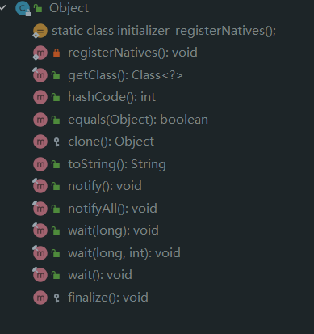

那么如果我们在某个类的子类中也写了一个方法，并且恰好这个方法的名字与父类中的方法名一样，那么我们在通过使用子类对象调用这个方法的时候到底会调用那个方法呢？因为按照我们继承的惯例子类拥有父类的所有非私有方法，那么对于这种情况到底会发生什么呢？可能大多数人都会说那必然是调用子类中的方法，这是我们的第一反应。没错！确实是先调用子类的方法但是你知道为什么吗？在这里我们就要引入另一个概念了，重写Override,重写是java中继承的一大特性，子类中若出现和父类同名的方法那么就会去覆盖掉父类中的原方法，并且允许子类对父类的原方法进行修改。其实这只是我们口头上的解释如果想要彻底的解释这个线下我们则需要浅显的了解一下java中的内存以及类加载机制。在后面我们在细说。

* 所以说了一大堆我们到底能用重写这个特性干啥？其实我们最常见的例子就是toString方法我们都知道在object类中已经为我们创建了toString方法了，但是我们很多时候都要去重写toString方法，因为在父类中的源方法不能满足我们的需求或者我们要对父类的方法进行拓展我们就要对他进行重写，还是toString方法object中的toString仅仅是打印出来类的全限定名+类的hashcode。你想想哪个正经人会去看这玩意啊！我们在实体类中大多要去重写toString方法去输出当前类的一些属性信息具体如下代码。

  ```java
  public class People {

      public People(){}

      public People(long pid,String pname,int age,String address){
          this.address=address;
          this.pid=pid;
          this.age=age;
          this.pname=pname;
      }

      private long pid;
      private String pname;
      private int age;
      private String address;

      protected long getPid() { return pid; }

      public void setPid(long pid) { this.pid = pid; }

      public String getPname() { return pname; }

      public void setPname(String pname) { this.pname = pname; }

      public int getAge() { return age; }

      public void setAge(int age) { this.age = age; }

      public String getAddress() { return address; }

      public void setAddress(String address) { this.address = address; }

      @Override
      public String toString() {
          return "People{" +
                  "pid=" + pid +
                  ", pname='" + pname + '\'' +
                  ", age=" + age +
                  ", address='" + address + '\'' +
                  '}';
      }
  }
  ```
* 重写toString后的输出，sout方法其实会自动帮我们调用toString，我们这样只是便于读者理解

  ```java
  public class Temp {
      public static void main(String[] args) {
          People p=new People();
          System.out.println(p.toString());
      }
  }
  ```

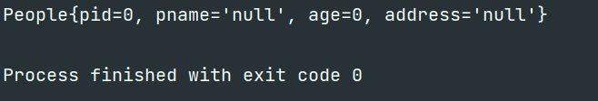

初探多态！子类对象指向父类引用的特性。何为子类对象指向父类的引用我简单写个例子你应该就理解了 Father father=new Sone();就是前面写父类型的变量后面创建的则是子类的对象。哎有人要问了这样也行吗，当然可以，这就是多态中比较重要的一环，子类对象指向父类引用。具体可以看下面的代码

* 嘿！我不仅可以这样写我还能去调用你的方法，并且执行的还是子类的方法体

  ```java
  public class Test {
      public static void main(String[] args) {
          Father father=new Son();
          father.say();
      }
  }
  class Father{
      public void say(){}
  }

  class Son extends Father{
      @Override
      public void say(){}
      public void say1(){}
  }
  ```
* 但是，如果是子类中有的方法但是在父类中没有我们则不能使用这种方式调用，否则会报找不到这个方法的错误，毕竟是父类的引用嘛肯定不能和子类的引用完全一样。

  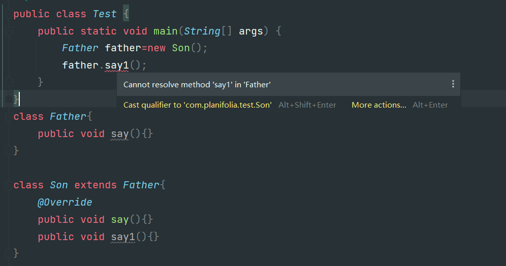
* 有人就要问了，哎这到底有啥意义啊我不这样写也能实现这样的功能啊！这一点我们就到下节课讲多态的时候在做探讨我们在这只了解有这个特性就行了。

JVM内存 类的加载机制初探。在java虚拟机中有着完整的内存区块(堆区，栈区，方法区，并且在方法区中有着运行时常量池)而这些内存区块的具体分工也不同。其中堆区保存的都是new出来的对象实例，栈区则保存的是对象的引用以及定义的一些局部变量等，而在方法区中保存的则是类的加载信息，并且将类中一些被使用的常量保存到常量池中。jvm中的内存空间大致与下图一致。（在这里我们仅堆jdk1.7版本中的jvm内存进行了解，深究部分等到后面真正学到jvm再说）

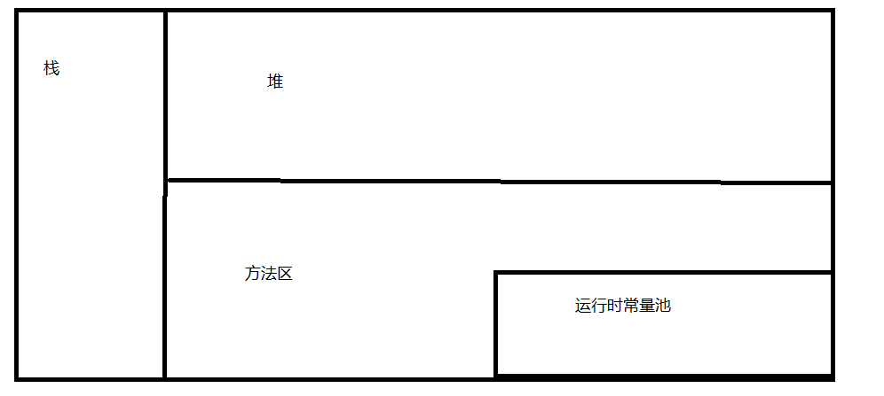

* 简单方法内常量变量的内存分配过程，当我们在一个类中使用 int arg=10；这种类型的变量声明时jvm中的内存分配大概如下。程序自上而下，从右往左的运行，首先它发现了一个常量 ‘10’ 所以会为在运行时常量池中先为10分配内存空间，然后执行到int a之后，jvm会为变量a在栈中开辟一块空间，并且会将常量‘10’在运行时常量池中的内存地址保存到变量a在栈中的内存空间中，这样就完成了这一步的赋值操作。具体可以参照下例子

  案例1：

  ```java
  public static void main(String[] args) {
          int a = 10;
          int b = a;
          a = 20;
          System.out.println(b);
  }
  ```
* 内存图

  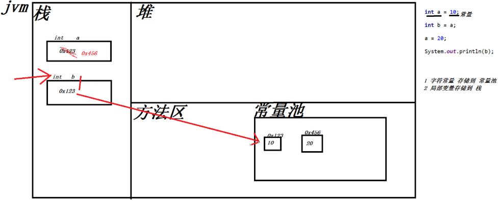
* 但是如果我们创建的是一个对象比如 Cat neko=new Cat()，jvm则会先在堆内存中创建一个对象实例，这个对象实例中会保存对象的**成员变量**与实例方法的**引用**因为真正的方法内容是保存在方法区中的并且同样也会在栈内存中保存一个neko的变量用于保存刚才创建的cat对象的内存地址，并且如果我们再次创建一个对象的引用比如 Cat cat=neko 这样cat保存的也是我们刚才创建的那个对象的内存地址，并且我们使用cat引去操作Cat对象和我们使用neko引用去操作Cat对象是一样的效果！但是需要注意的一点是在对象中创建的成员变量它的内存地址是保存在堆中的。

  案例2：

  ```java
   public static void main(String[] args) {

          Cat c1 = new Cat();

          c1.age = 18;

          Cat c2 = c1;

          c2.age = 20;

          System.out.println(c1.age);

      }
  ```
* 内存图

  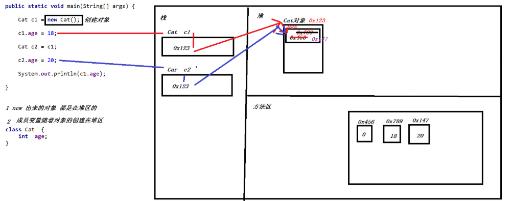
* 如果我们创建的类中涉及到了继承，那么我们就要讲一讲java类加载的一个特性了，在Java中父类总是优先于子类被加载，优先于子类被实例化，比如我们创建了一个类Cat这个类又继承了Animal类那么我们在实例化Cat类的时候jvm首先会在堆内存中为Animal对象分配内存空间然后才会为Cat对象分配内存空间，并且在这两个类中有着预先定义好的 ‘this’ ‘super’ 关键字，这两个关键字分别指代着当前类(this)与父类(super)也正是这两个关键字实现了父类与子类之间的关系，能够让子类很方便的去访问父类中的内容。

  案例3：

  ```java
  public class JavaTest {

      public static void main(String[] args) {

          Cat c1 = new Cat();

          c1.age = 18;
          c1.name = "张三";
      }
  }
  class Haha {
      String name;
  }

  class Cat  extends Haha{
      int  age;

  }

  ```
* 内存图

  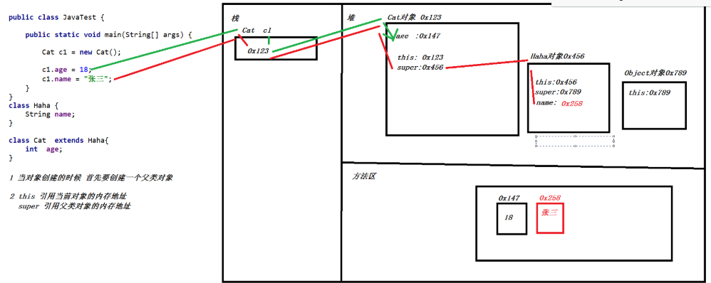
* 那么问题来了为什么，父类总能在子类之前被创建并且能在我们不知道的情况下被创建，这是因为如果我们的父类有有无参的构造方法那么在子类中的构造方法中的第一行会自动调用父类的构造方法 super()，但是如果我们在父类中没有无参的的构造方法那么我们必须在子类的构造方法中手动去调用父类的构造方法super(Type arg...),否则就会报错

  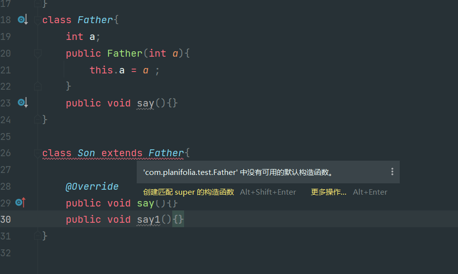
* 那么问题又来了为什么我们重写之后子类的方法能够覆盖掉父类的方法呢？因为我们的类虽然是从父类先加载先创建但是方法的调用确实先从当前类在往上调用如果当前类没有这个方法才会去向父类中找。所以我们在子类中重写了并且使用子类的对象去调用这个方法那必然会优先执行子类中的方法。

  案例4：

  ```java
  public class JavaTest {
      public static void main(String[] args) {
          Haha cat = new Cat();
          cat.eat();
      }
  }
  class Haha {
      public void eat(){
          System.out.println("动物要吃饭");
      }
  }
  class Cat extends Haha {
      @Override
      public void eat(){
          System.out.println("猫爱吃鱼");
      }
  }
  ```
* 内存图

  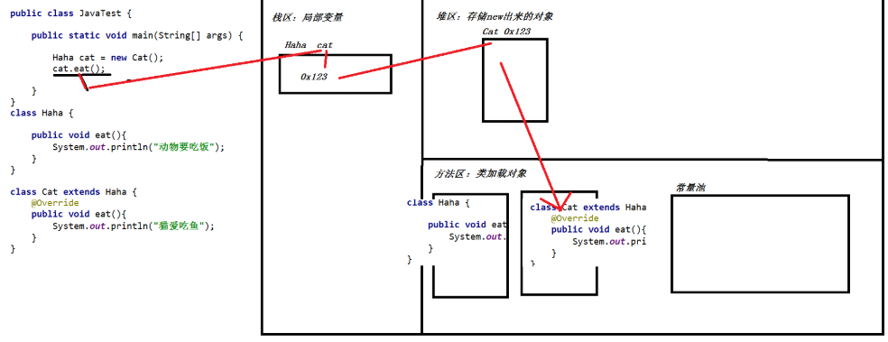

## JavaSE第四天

1. 抽象类与多态，为什么会产生一个新的语法格式？那必然是有需求，就拿我们昨天的例子做对比吧，还是动物饲养员要喂三种动物 老虎 猪 狗。如果在我们没有学习方法重置之前那必然我们要写三个对于的方法，但是我们觉着这样非常的麻烦于是我们引入了一个新语法 方法的重载，解决了我们明明是相似的功能却要记住许多方法名的麻烦，但是我们发现我们虽然不需要记住那么多方法名但是我们还是要在people中写很多的重载方法，为每一个动物类都写一个对应的重载方法，所以我们想能不能直接写一个方法就能完成这类操作呢？于是多态这个语法就出现了。

   没引入多态之前，非常的麻烦

   ```java
   public class Temp {
       public static void main(String[] args) {
           People people=new People();
           people.feed(new Cat());
           people.feed(new Dog());
           people.feed(new House());
       }
   }

   /**
    * 定义的三个动物类
    */

   class Cat{
       public void eat(){
           System.out.println("猫猫要吃鱼");
       }
   }
   class Dog{
       public void eat(){
           System.out.println("小狗要吃肉");
       }
   }
   class House{
       public void eat(){
           System.out.println("马儿要吃草");
       }
   }

   /**
    * people类如果我们不去使用多态我们就要重载三个feed方法,非常的麻烦
    */
   class People{

       public void feed(Cat cat){
           cat.eat();
       }
       public void feed(Dog dog){
           dog.eat();
       }
       public void feed(House house){
           house.eat();
       }
   }
   ```
2. 多态的语法格式，Father father = new SonA(); Father father = new SonB(); 简单的来说就子类对象指向父类引用，并且需要在子类中去重写父类中的方法，然后我们就可以使用指向不同子类对象的父类引用去调用对应的方法而得出不同的结果。这种现象我们称之为多态，接下来我们就使用多态的方式去解决上面的问题

   ```java
   public class Temp {
       public static void main(String[] args) {
           People people=new People();
           people.feed(new Cat());
           people.feed(new Dog());
           people.feed(new House());
       }
   }

   /**
    * 定义一个动物里我们在里面预先定义好eat方法并且让下面的三个动物去继承它来实现多态
    */

   class Anmial{
       public void eat(){}
   }

   /**
    * 定义的三个动物类,分别去继承Animal类
    */
   class Cat extends Anmial{
       @Override
       public void eat(){
           System.out.println("猫猫要吃鱼");
       }
   }
   class Dog extends Anmial{
       @Override
       public void eat(){
           System.out.println("小狗要吃肉");
       }
   }
   class House extends Anmial{
       @Override
       public void eat(){
           System.out.println("马儿要吃草");
       }
   }

   /**
    * 我们在引入多态之后只要在People类中添加一个feed方法但是传入参数为Animal类型
    */
   class People{

       public void feed(Anmial anmial){
           anmial.eat();
       }
   }
   ```

   很显然在我们引入多态之后people类简便了许多并且我们以后再次添加新的动物并不需要再去修改people类了只需要让新动物去继承Animal类就行了
3. 那么我们有没有发现一个问题，就是我们的Animal类中的eat有意义吗？答案必然是有意义的它为我们的多态语法提供了基础支持，但是它的方法体确实是没有意义的因为我们没有在方法体里面写任何内容。而且还有一点多态是必须要子类重写父类方法的但是我们使用传统的继承方式子类可以选择重写或者不重写，这就很难对编写者起到约束提醒的功能，所以我们想能不能有一个语法能让父类方法没有方法体并且要求它的子类必须重写这个方法。有！这就是java中的抽象类与抽象方法，在抽象类中可以写抽象方法并且抽象方法不允许有方法体，要求继承抽象类的子类必须重写父类中的抽象方法，除非继承抽象类的那个子类也是抽象类！哇，这正好符合我们的要求啊，赶快上代码试试吧！
   显然我们换成抽象类之后同样好使，并且更加的规范了！

   ```java
   public class Temp {
          public static void main(String[] args) {
              People people=new People();
              people.feed(new Cat());
              people.feed(new Dog());
              people.feed(new House());
          }
      }

      /**
       * 定义一个动物里我们在里面预先定义好eat方法并且让下面的三个动物去继承它来实现多态
       */

      abstract class Anmial{
          public abstract void eat();
      }

      /**
       * 定义的三个动物类,分别去继承Animal类
       */
      class Cat extends Anmial{
          @Override
          public void eat(){
              System.out.println("猫猫要吃鱼");
          }
      }
      class Dog extends Anmial{
          @Override
          public void eat(){
              System.out.println("小狗要吃肉");
          }
      }
      class House extends Anmial{
          @Override
          public void eat(){
              System.out.println("马儿要吃草");
          }
      }

      /**
       * 我们在引入多态之后只要在People类中添加一个feed方法但是传入参数为Animal类型
       */
      class People{

          public void feed(Anmial anmial){
              anmial.eat();
          }
      }

   ```

* 我们下面就总结一下抽象类与抽象方法的语法格式
  1.抽象类需要使用abstract关键字进行修饰，其定义的方法如下 abstract class ClassName{}
  2.抽象类中可以写抽象方法也可以写普通方法也可以写成员变量等等，虽然抽象类拥有构造方法但是不允许new对象
  3.抽象类要求继承它的子类必须重写抽象类中的抽象方法，除非子类也是抽象类
  4.抽象类允许被其他类继承也允许继承抽象类
  5.抽象方法只能写在抽象类中，并且不能写方法体
  6.抽象方法不能被这些关键字private final static修饰，因为这些关键字修饰的内容无法实现继承

4. 那么问题又来了，比如我们修改需求了，要求有三个动物 猫只能吃饭，马只能奔跑，狗既能奔跑也能吃饭那么我们如何实现这个需求呢？哎我们发现问题了就是猫只能吃饭，马只能跑显然这两种不能继承自同一个类实现多态因为如果我们要去继承同一个类那必然需要在父类中定义两个方法，这样就不能使用抽象类了而且使用马类也能调用eat方法虽然调用的是父类的。又回到了最开始。。。。那么我们有办法解决这个问题吗？当然！Java的开发人员同样也遇到了我们这种问题并且提出了一个新的语法规范 ‘接口’ 虽然java中只能单继承但是引入接口之后java可以实现多个接口并且在接口之间可以多继承，这就很好的解决了我们之前遇见的问题。

* 我们不妨去定义两个接口一个是Run其中定义run方法，另一个是Eat其中定义方法eat。然后让Dog类去实现这俩接口，Horse类实现Run接口，Cat实现Eat接口。然后我们在People类中的play方法与feed方法其参数列表只要写Run类型与Eat类型即可！

  ```java
  public class Temp {
      public static void main(String[] args) {
          People people=new People();
          people.play(new Dog());
          people.play(new Horse());
          people.eat(new Dog());
          people.eat(new Neko());
      }
  }
  interface Run{
      void run();
  }
  interface Eat{
      void eat();
  }
  class Dog implements Run,Eat{

      @Override
      public void run() {
          System.out.println("🐕Run!");
      }
      @Override
      public void eat() {
          System.out.println("🐕Eat!");

      }
  }
  class Horse implements Run{
      @Override
      public void run() {
          System.out.println("🐎Run!");
      }
  }
  class Neko implements Eat{
      @Override
      public void eat() {
          System.out.println("🐱Eat");
      }
  }
  class People{
      void play(Run run){
          run.run();
      }
      void eat(Eat eat){
          eat.eat();
      }
  }
  ```
* 那么我们已经使用接口去解决这个问题了，但是我们还是不太了解接口到底是一个什么样的东西，其实我们通过类比就能发现接口其实是一个特殊的抽象类，它特殊在哪里呢？

  1.接口定义使用interface，而抽象类是class

  2.接口之间可以多继承，并且接口可以被多实现。抽象类只能单继承

  3.接口中只能写抽象方法，并且在接口中的方法默认被 public static abstract修饰并且要求必须被实现类实现抽象方法这与抽象类不同抽象类允许写普通方法。

  4.接口中没有构造方法并且不能创建对象这一点与抽象类不同抽象类只是不能创建对象但是有构造方法

  5.接口中的变量(常量)都是被public static final修饰的

  sp.所以总的来说抽象类与接口的区别，抽象类有构造方法但是接口没有 抽象类只能单继承接口可以多继承并且可以被多实现 抽象类中可以写普通方法但是接口中只能写抽象方法，并且默认被 public static abstract修饰

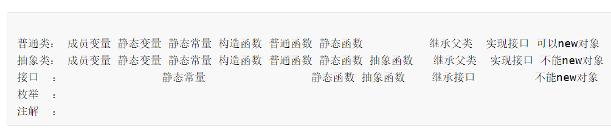

5. 从上面接口引出来的什么是static？static表面意思静态的。被static修饰的东西(变量，方法)都属于class类的，可以通过类名.方法/参数名的形式去调用。其实static的语法格式就这么多，如果去深究的话。java中的静态变量也就是被static修饰的内容当类被加载的时候会被一并加载到方法区中，并且在对象实例话的时候也不会加载在堆中，而是在方法区中，所以被static修饰是变量与方法在java中是‘独一份’的无论我们通过那个对象去调用本质上调用的都是同一个内容，所以被static修饰的内容推荐使用类名.的方式去调用。

   ```java
   public class Temp {

       public static void main(String[] args) {
           System.out.println(Neko.A);

           Neko.test();

           System.out.println(Neko.A);
       }
   }

   class Neko implements Eat{

       public static int A=100;

       public static void test(){
           System.out.println("喵喵喵");
       }
       @Override
       public void eat() {
           System.out.println("🐱Eat");
       }
   }
   ```
6. final，final的字面意思是最终的，final可以去修饰成员变量，静态变量，方法，类。不同的内容被final修饰拥有的效果不同。

* final修饰变量之后，该变量必须并且只能在创建的时候或者构造器中进行初始化，而且不允许在初始化之后修改。

  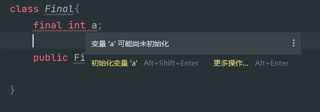
* final修饰静态变量之后，该变量必须并且只能在创建的时候或者在静态代码块中进行初始化并且不允许在初始化之后修改。

  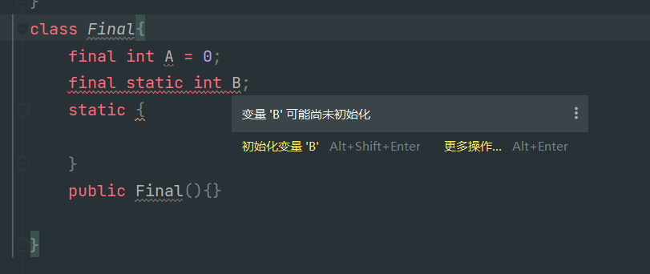
* 正确写法

  ```java
  class Final{
      final int A = 0;
      final static int B;
      static {
          B=10086;
      }
      public Final(){

      }
  }
  ```
* final修饰方法之后方法不允许被重写，所以也是这个特性让final不能修饰抽象方法。

  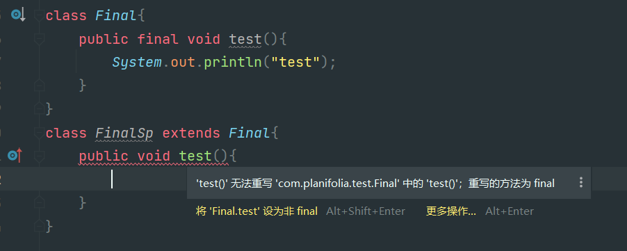
* final修饰类之后类不允许被继承。

  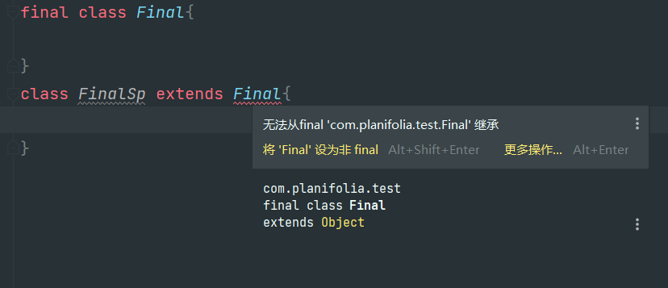
* final的注意事项以及用途，被final修饰的常量其命名规范：必须全大写或者下划线而且有意义，最常用的就是静态常量 作为代替代码中的魔法值使用起到语义化的功能.

## JavaSE第五天

1. java中的数组，数组是一种喜闻乐见的数据结构，在大多数的编程语言中都有出现，它常常作为其他集合框架的底层实现出现，像Java中的ArrayList，HashMap等等底层原理都使用了数组。

* 数组的书写格式，在java中数组的创建有三种方式分别是 int[] arr=new int[10]; int[] arr={1,2,3};              int[] arr=new int[]{1,2,3}; 这三种就是数组初始化的方式，而且需要提一嘴的是数组是一种数据结构，他可以是任意类型的也就是说他可以是基本数据类型的，可以是引用数据类型的，声明为哪一种数据类型那么他的数组体就必须存储这种数据类型。
* 代码如下

  ```java
  public class Test {
      public static void main(String[] args) {
          int[] arr1 = new int[12];
          int[] arr2 = new int[]{1, 2, 3, 4, 5};
          int[] arr3 = {1, 5, 9, 7};
      }
  }
  ```
* 数组的赋值与取值,数组中的取值与存值都与其他高级语言中相似，其核心都是数组的下标，我们可以通过数组下标去访问数组中的内容并且进行修改等操作。比如存值：arr[index]=12; 取值：var temp=arr[index]; 具体代码实例如下

  ```java
      public static void main(String[] args) {
          int[] arr3 = {1, 5, 9, 7};

          System.out.println(arr3[1]);
          arr3[1]=100;
          System.out.println(arr3[1]);
      }
  ```
* 数组中的越界异常，java中的数组不像js中的数组一样可以无限制的自增操作，如果我们创建好了数组那么数组的长度也就随之确定了，我们要是添加的数据超出了数组的索引范围则就会爆出数组越界错误，具体如下。

  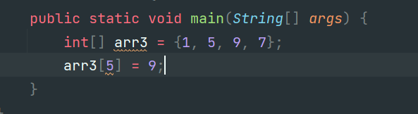

  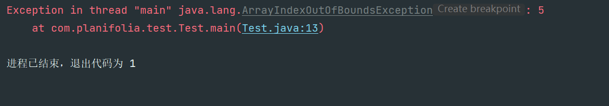

2. 我们发现使用Java中的数组几乎没有为我们提供任何的api，用起来非常的繁琐与麻烦，所以我们去封装一个数组工具类里面能够对数据进行一些简单的操作，比如格式化输出，排序，比较两个数组是否相等，找到数组中指定值的下标索引.....

* 数组规范化输出，显然我们进行数组输出的时候需要每次都进行遍历操作非常的麻烦所以我们不妨将这个功能封装到数组工具类中,然后我们想要输出数组只需要调用工具类中的方法传入对应的数组即可。

  ```java
      /**
       * int数组格式化输出的方法
       * @param arr 传入数组
       * @return 返回格式化后的数组
       */
      public static  String arrayPrint(int[] arr){
          StringBuilder str= new StringBuilder("[");
          for (int i = 0; i < arr.length; i++) {
              str.append(arr[i]);
              if(i==arr.length-1){
                  str.append("]");
              }else {
                  str.append(",");
              }
          }
          return str.toString();
      }
  ```
* 数组中找到最大值，显然这个也是我们比较常用到的从一个数组中找到最大值，每次寻找同样也要便利一遍数组，所以我们也可以把他封装成工具类，调用时只要给他传递一个数组对象即可。

  ```java
   /**
       * int找到当前数组最大值的方法
       *
       * @param arr 传入数组
       */
      public static int getMax(int[] arr) {
          if (arr == null || arr.length == 0) {
              throw new NullPointerException("数组不得为空！");
          }

          int max = arr[0];
          for (int i : arr) {
              if (i > max) {
                  max = i;
              }
          }
          return max;
      }
  ```
* 数组中找到指定值的索引下标，这个虽然不太常见根据数组值去找到数字在数组中的位置，但是我们对他也进行了封装，调用时需要给他转递一个数组对象与检索值。

  ```java
  /**
       * 查找传入值在数组中的索引
       * @param arr  传入数组
       * @param data 传入值
       * @return 传入值在数组中的索引
       */
      public static int getIndex(int[] arr, int data) {
          if (arr.length == 0) {
              return -1;
          }
          for (int i = 0; i < arr.length; i++) {
              if (arr[i] == data) {
                  return i;
              }
          }
          return -1;
      }
  ```
* 判断两个数组是否完全相等，这个也比较常见，我们需要先比较两个数组的内存地址，然后比较两数组的长度，最后就是便利两个数组然后进行逐一判断。

  ```
   /**
       * 判断两个数组是否完全一致
       * @param arr1 数组1
       * @param arr2 数组2
       * @return 比较结果
       */
      public static boolean equals(int[] arr1, int[] arr2) {
          if (arr1 == arr2) {
              return true;
          }
          if (arr1.length != arr2.length) {
              return false;
          }
          for (int i = 0; i < arr1.length; i++) {
              if (arr1[i] != arr2[i]) {
                  return false;
              }
          }
          return true;
      }
  ```
* 数组排序,数组内容排序算是最常用的工具类之一了吧，所以我们在ArrayTool中也封装了一个数组排序其中采用了冒泡排序的思想。

  ```java
      public static void sort(int[] arr) {
          if (arr.length == 0) {
              throw new RuntimeException("数组不得为空！");
          }
          for (int i = 1; i < arr.length; i++) {
              for (int j = 0; j < arr.length - i; j++) {
                  if (arr[j] > arr[j + 1]) {
                      int temp = arr[j];
                      arr[j] = arr[j + 1];
                      arr[j + 1] = temp;
                  }
              }
          }
      }
  ```

3. Java中自带是数组是定长的，我们使用非常的不方便，我们想要实现一个自增长的数组所以我们仿照ArrayList对数组进行进一步的封装，实现自动扩容等功能。

   自增数组结构 首先我们需要创建一个类结构里面包括一个空的数组引用 int[] elements；一个数组长度标记 int size; 以及一个有参的构造方法用于创建一个初始化的数组并且指向数组引用 elements;

   ```java
   public class ArrayPlus {
       /**
        * size:数组的长度
        */
       private int[] element;
       private int size;

       public ArrayPlus(){}

       /**
        * 有参构造器，会根据传入的长度来动态的创建一个数组
        * @param count 创建ArrayPlus的长度
        */
       public ArrayPlus(int count){
           element = new int[count];
       }
   }
   ```

   然后就是数组的添加方法与扩容了，对应数组的添加方法很简只要让size自增长并且让size作为数组添加的下标来实现，但是对于数组的扩容则有一点点的难度，我们可以添加一次判断，当数组length==size的时候就说明我们数组实际存值的的长度与数组总长度相等。此时我们就必须先进行数组扩容在执行添加操作否则就会出现数组越界的异常！

   ```java
   /**
        * 数组的添加方法，并且加入了动态扩容的机制，当数组满员的时候会扩充原数组为原来的1.5倍
        * @param a 添加的数组元素
        */
       public void add(int a){
           if (element.length == size){
               element = Arrays.copyOf(element,size + (size >> 1));
           }
           element[size++] = a;
       }
   ```

   然后就是数组的随机访问与返回长度的方法没啥技术含量直接上代码

   ```java
   /**
        * 按索引找到对应的元素
        * @param index MyArray的索引下标
        * @return 对应MyArray索引下标的数组元素
        */
       public int get(int index){
           return element[index];
       }

       /**
        * 数组长度
        * @return 返回长度
        */
       public int size(){
           return this.size;
       }
   ```

   最后就是数组的输出方法，我们希望使用sout打印数组对象就能直接输出数组内容所以我们需要去重写toString方法并且让这个方法直接返回格式化完毕的数组内容。

   ```java
    @Override
       public String toString() {
           StringBuilder str=new StringBuilder("[");
           for (int i = 0; i < size; i++) {
               str.append(element[i]);
               if (i==size-1){
                   str.append("]");
               }else {
                   str.append(",");
               }
           }
           return str.toString();
       }
   ```
4. 我们上面这两块是对数组的功能与结构进行的进一步封装，所以到底什么是封装？在Java中封装是指隐藏对象的属性和实现细节，仅对外公开接口，控制在程序中属性的读和修改的访问级别；将抽象得到的数据和行为（或功能）相结合，形成一个有机的整体，也就是将数据与操作数据的源代码进行有机的结合，形成“类”，其中数据和函数都是类的成员。

   所以在Java中封装大概有一下三类 1.数据模型类封装(私有化成员变量，对外提供get set方法) 2.工具类封装(将一些常用的工具方法封装到一个类中，使用时只需调用即可减少了代码量)  3.对jdk原本 数据结构/类的进一步封装拓展原功能
5. 异常与处理异常

   为什么要有异常？异常是错误吗？因为我们在运行代码的时候可能总会有一些意想不到的异常，这些异常是因为我们代码写的有问题或者是传入传出内容不规范但是这些是不可避免的所以我们就需要进行异常处理。因为如果我们不进行处理那么他可能就会导致虚拟机终止从而导致我们在出现异常后面的代码不执行。就比如下面的代码,如果此时我们往方法里面传入的是一个空数组呢？显然这是不合理的空数组根本没有最大值，那么Java会如何执行呢？

   ```java
   public static int getMax(int[] arr) {

           int max = arr[0];
           for (int i : arr) {
               if (i > max) {
                   max = i;
               }
           }
           return max;
       }
   class Test {
       public static void main(String[] args) {
           System.out.println(ArrayTool.getMax(null));
           System.out.println("测试结束");
       }
   }

   ```

   显然控制台报错了并且后续的代码不能执行，这显然在我们开发过程中是不合理的

   

   所以我们需要在工具类代码中对可能出现异常的地方添加判断并且抛出异常(throw new Expection("ExpectionMessage") ) 然后再调用处选择继续抛出异常或者使用try catch捕获并且处理异常try{ 代码块 }catch(Exeption e){ 处理形式 }finally{最终要执行的代码块}具体处理代码形式如下

   ```java

   public static int getMax(int[] arr) {
           if (arr == null || arr.length == 0) {
               throw new NullPointerException("数组不得为空！");
           }
           int max = arr[0];
           for (int i : arr) {
               if (i > max) {
                   max = i;
               }
           }
           return max;
       }

   public class Test {
       public static void main(String[] args) {
           try {
               System.out.println(ArrayTool.getMax(null));
           }catch (Exception e){
               System.out.println(e.toString());
           }
           System.out.println("测试结束");
       }
   }
   ```

   

   所以我们根据上面发现了有返回值的方法其实不返回内容只抛出异常也是可以的，所以我们就要修改之前的理论了。‘在Java中，有返回值的方法必须要有能够执行的return语句或者trow的异常’，能够正常执行的就return，出现异常的就throw异常对象。

   那么还有一个疑问？为什么我们最开始没有进行任何异常处理控制台是怎么打印出错误堆栈信息的呢？因为在Java中异常的默认处理机制是向上抛出也就说，在Java中如果你没有在当前类中处理异常那么他就会一直往上抛出直到抛到jvm层，然后jvm对异常进行处理处理内容就是打印错误跟踪栈信息并且终止jvm！

   

   当然有可能一段代码中可能会有多异常我们就可以通过try进行捕获然后再try代码块下面添加多个catch进行处理然后当try中出现对应的异常时catch会捕获到该对应的异常并且处理！

   ```java
   如果我们需要不同的异常类型 使用不同的解决处理方案 此时就需要 分类捕获异常
    public static void main(String[] args)  {
           int[] arr = {};
           try {
               int max = ArrayTool.getMax(arr);
               System.out.println(max);
               .....
           }catch (NullPointerException e){
               e.printStackTrace();
           }catch (ArrayIndexOutOfBoundsException e){
               e.printStackTrace();
           }catch (RuntimeException e){
               e.printStackTrace();
           }catch (Exception e){
               e.printStackTrace();
           }
           System.out.println("你好世界");
    }
   执行流程是：1  当try中代码出现异常之后  就会直接跳到catch中
             2  会一个catch一个catch的寻找 当前异常是否匹配捕获内容

   所以分类捕获的时候 大异常不能写上面

   如果所有的异常 解决方案都是一样的 此时只需要捕获一种总异常类型
   public static void main(String[] args)  {

           int[] arr = {};

           try {
               int max = ArrayTool.getMax(arr);
               System.out.println(max);
           }catch (Exception e){
               e.printStackTrace();
           }

           System.out.println("你好世界");
       }
   ```

   但是和不用trycatch的代码块 一样，再try代码块中出现异常以后，后续的代码也不会继续执行了所以我们想要让代码无论如何都执行就需要用到finally代码块了，finally代码块是无论如何都会执行的除非jvm突然终止，线程突然中断。否则即使发生异常也会执行！就像下面代码中finally中的代码是一定会执行的，所以我们通常都是在finally中进行资源的关闭等操作。

   ```java
   public class Test {
       public static void main(String[] args) {
        try {
               System.out.println("开启保险库大门");
               System.out.println("取钱");
               int a = 1/0;
               System.out.println("测试结束");

           }catch (Exception e){
               System.out.println(e.getMessage());
           }finally {
               System.out.println("关闭保险库大门");
           }
       }
   }
   ```

   

   finally与final相关的面试题：

   1. finally与final的区别

      finally用于包裹代码块，用finally包裹的代码块是必须要执行的即使main方法中出现了异常还是main方法中已经执行了return语句，那么finally里面的代码块还是会执行的！但是有一点要注意如果在finally之前执行了system.exit()或者系统中断了亦或者jvm虚拟机崩溃了此时finally中的代码都不会执行！

      final用于修饰 类，方法，成员变量，静态变量。当final修饰类的时候这个类不允许被继承(最终的)，当final修饰方法的时候这个方法不允许被修改(不可变更的)，当final修饰成员变量时成员变量只能被赋值一次即创建时或者在构造方法中，修饰静态变量也是只能被赋值一次在创建时或者在静态代码块中完成。
   2. finally 的应用场景

      ```java

      public class JavaTest {
          public static void main(String[] args)  {
              int haha = haha();
              System.out.println(haha);
          }
          public static int haha(){
              int a = 20;
              try {
                 return  a;
              }finally {
                 a = 30;
              }
          }
      }
      输出20，因为在在程序自上而下运行的时候finally中运行的代码赋值是在return之后才执行的

       public class JavaTest {
          public static void main(String[] args)  {
              int haha = haha();
              System.out.println(haha);
          }
          public static int haha(){
              try {
                 return  20;
              }finally { 
                 return  30;
              }
          }
      }

      运行结果30，因为在finally中的return语句执行在正常的return的后面所以会返回30
      ```

      3.异常的分类与自定义异常

      总的来说java中的异常Exception继承自Throwable类，并且Throwable类还有一个子类Error类，其中Error代表的是错误，并且在jdk中明确的写明了错误不允许捕获以及处理.。

      常见的错误有：OutOfMemoryError(内存溢出错误)，AWTError(Awt错误)，出现错误之后必须要终止虚拟机并且没有通过代码的方式解决
      常见的异常有：NullPointExeption(空指针异常) IOExeption(IO异常) IndexOutOfBoundsException(索引越界异常)

      而且对于异常又可以分为两大类运行时异常与非运行时异常，运行时异常就是在程序运行时可能会出现的异常比如NullPointExeption，而非运行时异常与之相反只要我们写了代码就必须给他添加try catch进行异常的捕获与处理，比如IO异常。

      那么我们已经了解了异常的大致内容，那么我们如何去自定义一个异常类?我们不妨先去查看一下JDK源码中是如何定义这些异常类型的譬如空指针异常：

      ```java
      //很显然空指针异常仅仅是继承了RuntimeException
      public
      class NullPointerException extends RuntimeException {
          private static final long serialVersionUID = 5162710183389028792L;

          /**
           * Constructs a {@code NullPointerException} with no detail message.
           */
          public NullPointerException() {
              super();
          }

          /**
           * Constructs a {@code NullPointerException} with the specified
           * detail message.
           *
           * @param   s   the detail message.
           */
          public NullPointerException(String s) {
              super(s);
          }
      }

      //那么这仅仅是巧合吗，我们在来看另外一个异常类IOExecption

      //显然IOExecption也是继承了Exeption类并且去原封不动的去调用父类的一系列方法
      public
      class IOException extends Exception {
          static final long serialVersionUID = 7818375828146090155L;

          /**
           * Constructs an {@code IOException} with {@code null}
           * as its error detail message.
           */
          public IOException() {
              super();
          }

          /**
           * Constructs an {@code IOException} with the specified detail message.
           *
           * @param message
           *        The detail message (which is saved for later retrieval
           *        by the {@link #getMessage()} method)
           */
          public IOException(String message) {
              super(message);
          }

          /**
           * Constructs an {@code IOException} with the specified detail message
           * and cause.
           *
           * <p> Note that the detail message associated with {@code cause} is
           * <i>not</i> automatically incorporated into this exception's detail
           * message.
           *
           * @param message
           *        The detail message (which is saved for later retrieval
           *        by the {@link #getMessage()} method)
           *
           * @param cause
           *        The cause (which is saved for later retrieval by the
           *        {@link #getCause()} method).  (A null value is permitted,
           *        and indicates that the cause is nonexistent or unknown.)
           *
           * @since 1.6
           */
          public IOException(String message, Throwable cause) {
              super(message, cause);
          }

          /**
           * Constructs an {@code IOException} with the specified cause and a
           * detail message of {@code (cause==null ? null : cause.toString())}
           * (which typically contains the class and detail message of {@code cause}).
           * This constructor is useful for IO exceptions that are little more
           * than wrappers for other throwables.
           *
           * @param cause
           *        The cause (which is saved for later retrieval by the
           *        {@link #getCause()} method).  (A null value is permitted,
           *        and indicates that the cause is nonexistent or unknown.)
           *
           * @since 1.6
           */
          public IOException(Throwable cause) {
              super(cause);
          }
      }
      ```

## JavaSe第六天

1. String类

   1.1 string类可以说是我们最常用的类之一了，并且jdk官方知道String的常用，以至于创建了一个特殊的语法，让我们能够如同创建基本数据类型一样的去创建一个字符串比如 String str = "abc"; 但是最需要注意的一点是String是一个引用数据类型，而绝非基础数据类型也就是说String中有许许多多的方法可以通过 "abc" 这种形式的字符串进行直接调用！所以今天我们就主要来介绍一下String类的特性以及常用的方法以及常见的面试题。

   1.2 如何去创建一个String对象，我们上面也说了String是一个非常常用的对象甚至常用到Java官方为他单独发明了一款快速创建方式，所以我们就可以知道String对象的创建方式多种多样。

   ```java
   第一种：常规的对象创建形式,常规的创建对象 new 关键字 + 构造方法
       String str = new String("abcdefg");
     如果你是在idea中编写的程序的话你会发现idea会说你的构造方法是冗余的！显然官方推荐我们使用这种方式去创建String对象
   第二种：String的快捷创建方式，String应用 = 字符串；
       String str = "abc";
   ```

   1.3 String的常用API函数，因为String的常用Jdk为我们提供了大量的工具方法用于处理字符串，可以这样说遇见的70%字符串问题都可以通过查阅API文档找到解决方案。

   ```java
   //返回字符串长度 str.length()，返回int类型
   System.out.println(str.length());

   //修剪字符串前后的空格 str.trim()，返回新字符串
   System.out.println(" aaa ".trim());

   //找到字符串中第index个字符 str.charAt(index),返回char字符
   System.out.println(str.charAt(1));

   //找到子字符串第一次出现的索引 str.indexOf("t"),返回int类型
   System.out.println(str.indexOf("wo"));

   //截取字符串中索引为[1,5)的子字符串左闭右开，返回子字符串
   System.out.println(str.substring(1, 5));

   //按照rgx切割字符串并且返回字符数组 str.split(rgx),返回字符串数组
   System.out.println(str.split(rgx));

   //字符串替换，将字符串中的内容x替换为y str.replace("x", "y"),返回新字符串
   System.out.println(str.replace("x", "y"));

   纸短而言不尽，读者大可去阅读String源码或者JDK官方中文API手册去了解剩下的内容，在这仅仅对String类中的方法进行一个介绍具体还是要靠查阅手册与翻阅源码。
   ```

   1.4 String的底层原理，以及String为什么不可变以及不可变带来的问题.虽然Java是一门面向对象语言，尽管去调用已经封装好的方法，不需要去过深的追究他具体是如何实现的。但是如果我们想要去提高自己以及更深层面的理解Java那么就需要我们去研读源码。

   ```java
   那么研读源码要怎样开始呢？首先我们要了解这个类的构造方法以及这个类的数据结果体系。首先我们使用
   ctrl+左键点进源码。首先我们可以看到：String这个类被final修饰了也就是Java官方不希望以及不允许我们去继承String类并且改写他的功能与结构
       public final class String
       implements java.io.Serializable, Comparable<String>, CharSequence{}
   然后继续往下看，首先映入眼帘的就是一个字符数组并且是被final修饰的字符数据，提前剧透一下这个就是String的底层原理，并且使用了final修饰也确保了他无法进行第二次修改，这也是字符串对象不可变的原理。
        /** 该值用于字符存储 */
       private final char value[];
   然后找到构造方法，开始看无参的没什么好说的无参的构造方法就是将 空字符串 "".value（""的字符数组）赋值给this.value（当前对象的字符数组）
       public String() {
           this.value = "".value;
       }
   当然有参的也和无参的大同小异，只不过是将传入参数.value赋值给this.value
           public String(String original) {
           this.value = original.value;
           this.hash = original.hash;
       }
   当然后面也有一些重载的构造方法，大家亦可自己查看，在这不做过多赘述。当然对于String常用函数的实现原理还是希望读者自己阅读源码。
   ```

   ```

   1.4 String面试题，string类中设计到的基础知识点还是比较多的所以喜欢出面试题，我们下面就对String中的经典面试题进行一波探究。

   ​```java
   1.在string中 == 是干什么的
     == 判断的是两个引用地址是否相同，如果两个对象的引用地址相同则属于同一个对象返回true否则返回false
     如下代码，因为jvm虚拟机会优化我们的代码比如“hello”+“world”就会优化成“helloworld”，那么拿来和s1“helloworld”进行==对比当然是相同的了，因为“helloworld”存在于字符串常量池中所有这俩是同属于一个对象！拓展：字符串常量池，因为我们知道在java中字符串是不可变的一旦创建了就无法修改，所以java引入了字符串常量池能够将已经创建的字符串暂时保存到这里面，并且在用到的时候不在创建新的而是直接拿来用。
       @Test
       public void test11(){

           String  str = "hello";
           String  s1 = "helloworld";
           String  s2 = "hello"+"world";
           String  s3 = str+"world";

           System.out.println(s1 == s2); // true
           System.out.println(s1 == s3); // false 
       }
   代码编译之后是这个样子的 编译器会优化代码 
   String  s2 = "helloworld";
   String  s3 = new StringBuilder().append(str).append("world").toString();

   2.== 与 equals 的区别
       当面试官问出这个问题的时候，一知半解的人通常会说，啊 ==比较的是地址，equals比较的是值。。。这种回答显然是扣分项。我对这两者的区别简单的说一下。对于基本数据类型 == 比较的是基本数据类型的值，所以如果是基本数据类型则可以直接使用==进行比较，而对于引用数据类型 == 比较的是内存地址的引用是否相等也就是是否为同一个对象，而equals不能用于基本数据类型，只能用于引用数据类型并且！如果类没有重写equals方法那么就会去调用Object中的equals方法，而且Object中的equals方法的底层也是调用了==也就是未经重写的equals方法也是比较的内存地址引用
        public boolean equals(Object obj) {
           return (this == obj);
       }
   那么如果我们类中重写了equals方法那么他就可以自定义equals判断的内容，就比如String类重写了equals方法让他去判断字符串的值而不是内存地址引用！
   3. String是否能被继承
       不可以因为String类被final修饰了，被final修饰的类不能被继承
   4.String中常用的方法有那些
       charAt(index)返回索引为index的字符
       split(ragex)根据ragex切割字符串，并且返回字符串数组
       replace(str1,str2)将字符串中的str1替换成str2
       indexOf(str)返回str中第一次出现的索引
   5.string中是否有length()函数以及数组中是否有length函数
       string中有length函数，数组中没有length函数只有lenght属性
   6.下面代码创建了几个字符串
       String  s1 = "AAA";
       String  s2 = new String("BBB");
       一个两个或者三个，为什么呢？因为在jdk中引入了字符串常量池，创建过的字符串可能会暂时保存在里面，但是对于new关键字则是一定会创建一个新的对象的所以！上门两行代码 new String("BBB")是一定会创建一个对象的因为出现了new关键字，对于"AAA" "BBB" 则是先要看字符串常量池中是否有这个东西。
   7.请问下面的代码创建了几个对象
        String s1="aaa"+"bbb";
   8.可变字符串
        因为我们上面得知了字符串的特性，所以这题答案就很简单了 0 1 2 3都有可能，因为如果“aaa” “bbb” “aaabbb”都没有在常量池的话则就会创建三个对象以此类推。
   拓展：那么我们如果进行大量的+字符串拼接的话，必然会影响到性能甚至可能会出现虚拟机内存溢出的错误！所以我们推荐在进行大量字符串拼接的地方使用StringBuffer，append(str)的方法对字符串进行拼接会节省大量的空间！   
   ```

## JavaSe第七天

1. 集合框架概述，在编程语言中其中最逃不掉的属于是数据结构了，因为在实际开发过程中需要存储各种各样的数据，所以开发者们就总结发明出来了一套数据结构。常用的有 堆，栈，队列，集合，图，树等等。这些数据结构各式各样，各自有优缺点，选择合适的数据结构去存储对应的数据能够大幅度的提升程序的效率。

   ```txt
   在计算机科学的发展过程中，数据结构也随之发展。程序设计中常用的数据结构包括如下几个。 
   数组(Array)
   数组是一种聚合数据类型，它是将具有相同类型的若干变量有序地组织在一起的集合。数组可以说是最基本的数据结构，在各种编程语言中都有对应。一个数组可以分解为多个数组元素，按照数据元素的类型，数组可以分为整型数组、字符型数组、浮点型数组、指针数组和结构数组等。数组还可以有一维、二维以及多维等表现形式。  
   ```

   栈( Stack)
   栈是一种特殊的线性表，它只能在一个表的一个固定端进行数据结点的插入和删除操作。栈按照先进后出或后进先出的原则来存储数据，也就是说，先插入的数据将被压入栈底，最后插入的数据在栈顶，读出数据时，从栈顶开始逐个读出。栈在汇编语言程序中，经常用于重要数据的现场保护。栈中没有数据时，称为空栈。

   队列(Queue)
   队列和栈类似，也是一种特殊的线性表。和栈不同的是，队列只允许在表的一端进行插入操作，而在另一端进行删除操作。一般来说，进行插入操作的一端称为队尾，进行删除操作的一端称为队头。队列中没有元素时，称为空队列。

   链表( Linked List)
   链表是一种数据元素按照链式存储结构进行存储的数据结构，这种存储结构具有在物理上存在非连续的特点。链表由一系列数据结点构成，每个数据结点包括数据域和指针域两部分。其中，指针域保存了数据结构中下一个元素存放的地址。链表结构中数据元素的逻辑顺序是通过链表中的指针链接次序来实现的。

   树( Tree)
   树是典型的非线性结构，它是包括，2个结点的有穷集合K。在树结构中，有且仅有一个根结点，该结点没有前驱结点。在树结构中的其他结点都有且仅有一个前驱结点，而且可以有两个后继结点，m≥0。

   图(Graph)
   图是另一种非线性数据结构。在图结构中，数据结点一般称为顶点，而边是顶点的有序偶对。如果两个顶点之间存在一条边，那么就表示这两个顶点具有相邻关系。

   堆(Heap)
   堆是一种特殊的树形数据结构，一般讨论的堆都是二叉堆。堆的特点是根结点的值是所有结点中最小的或者最大的，并且根结点的两个子树也是一个堆结构。

   散列表(Hash)
   散列表源自于散列函数(Hash function)，其思想是如果在结构中存在关键字和T相等的记录，那么必定在F(T)的存储位置可以找到该记录，这样就可以不用进行比较操作而直接取得所查记录。

   ```

   Java是一门面向对象的语言，Java的开发者们将这些晦涩难懂的数据结构给我们封装成了一个个常用的工具类“ 集合框架”，我们在使用的过程中不用去管他底层是如何去实现的而只要去查阅对应的api手册就能快速的上手集合框架的使用，并且又能实现底层数据结构几乎一样的功能！

   在java集合框架中的体系如下：所有的容器都继承于Iterable(迭代器)并且使用迭代器也能便利出集合中的内容，然后Iterable的子接口有两个分别是 Collection (集合类型)他分别有有着三个子接口分别代表三种类型：List列表 Set集合 Queue队列，这三种各有差异。

   其中List代表着列表中的数据是有序且可重复的，而它又有两个具体的实现类ArrayList LinkedList，arrayList的实现原理是对象数组，并且因为数组的特性进行随机访问修改比较便捷，因为我们可以根据下标索引很容易的找到对应的数组元素。而LinkedList它的底层原理是双向链表，基于链表的特性则是插入删除比较便捷而随机访问比较麻烦因为每次都要从头/尾检索一遍。

   其中Set代表着集合，而集合则是不可重复的也就是说我们往set中存数据如果后面的与之前的重复了则会替换掉之前的内容，Set的实现类也有两种HashSet，TreeSet，其中HashSet是基于HashMap的他使用HashMap的key不可重复性实现的不可重复，并且里面的内容根据Hash算法计算后位置是随机的所以大家都喜欢叫他无序的！而TreeSet则是根据二叉树算法的排序方式是按照二叉树的算法进行的。

   其中Queue代表着队列，队列就是先入先出不常用仅作了解。

   而对应另一大派生接口Map，他有两个实现类HashMap，TreeMap和Set比较类似，HashMap数据保存格式是以key value的形式其中在hashMap中key是不可以重复的，而value是可以重复的并且我们在后面添加与之前相同的key的时候后添加的value会覆盖掉之前key的value。HashMap的底层原理是Object数组与双向链表，其中Object数组用于保存信息，双向链表解决hash冲突的问题。
   ```


   ```
2. Java中集合框架中的内容

~~~java

   2.1 ArrayList 数组列表，他是堆Java中的数组进一步的封装，并且添加了自动扩容机制以及其他的一些api方法能让我们非常方便的使用ArrayList，接下来我们就从构造方法开始了解一下ArrayList的使用方式与原理


   1.ArrayList的创建方式

    通过无参构造函数去创建一个新的数组列表，这个数组列表的初始内容为{}也就是空
    List<Object> objects = new ArrayList<>();
    当然也可以使用有参的构造方法去创建一个有初始容量的ArrayList
    List<Object> objects = new ArrayList<>(10);

   2.ArrayList的元素添加与扩容机制

     比如说我们在创建过一个空ArrayList之后他的默认容量为0也就是{}所以在我们第一次执行add方法的时候他会进行依次扩容操作grow()并且根据一些算法如
   果从0开始扩的话会直接扩容到大小为10如果有在10以后就每次扩容1.5倍。扩容之后再向数组中添加元素。我们翻阅源码可以得知
//首先再add中调用了ensureCapacityInternal()方法
   public boolean add(E e) {
           ensureCapacityInternal(size + 1);  // Increments modCount!!
           elementData[size++] = e;
           return true;
       }
//然后继续点入查看发发现源码信息如下，又是往下调用继续点

   private void ensureCapacityInternal(int minCapacity) {
           ensureExplicitCapacity(calculateCapacity(elementData, minCapacity));
       }
//我们发现了这个方法是用来确保数组最小容量的，如果我们的数组是空数组那么就进行判断我们创建的数组是否小于10如果小于10的话就直接返回10，若不为空数组则返回数组的创建时容量
   private static int calculateCapacity(Object[] elementData, int minCapacity) {
           if (elementData == DEFAULTCAPACITY_EMPTY_ELEMENTDATA) {
               return Math.max(DEFAULT_CAPACITY, minCapacity);
           }
           return minCapacity;
       }
//然后继续返回到上一层，点进去ensureExplicitCapacity方法这个方法则是记录扩容次数与判断是否真正的需要扩容的，当我们想要的容量大于数组长度的时候就执行grow()增长扩容操作

private void ensureExplicitCapacity(int minCapacity) {
        modCount++;

        // overflow-conscious code
        if (minCapacity - elementData.length > 0)
            grow(minCapacity);
    }
//接下来我们就继续看grow函数都干了啥，他根据我们传入的数据堆elementData数组(也就是保存ArrayList
数据的数组)进行扩容，如果经过依次位运算之后(扩充1.5倍)还是没有达到我们传入的长度要求那么就直接将我们的数组长度扩容为我们的传入长度。然后将老数组拷贝过去
    private void grow(int minCapacity) {
        // overflow-conscious code
        int oldCapacity = elementData.length;
        int newCapacity = oldCapacity + (oldCapacity >> 1);
        if (newCapacity - minCapacity < 0)
            newCapacity = minCapacity;
        if (newCapacity - MAX_ARRAY_SIZE > 0)
            newCapacity = hugeCapacity(minCapacity);
        // minCapacity is usually close to size, so this is a win:
        elementData = Arrays.copyOf(elementData, newCapacity);
    }
  
3.ArrayList的常用方法与源码探究
  indexOf(Object o)返回首次出现o元素的索引下标，查看源码可以得知，他也就是先进行了非空判断然后再去便利数组查看能否找到这个值，找到返回下标找不到返回-1
  
   public int indexOf(Object o) {
        if (o == null) {
            for (int i = 0; i < size; i++)
                if (elementData[i]==null)
                    return i;
        } else {
            for (int i = 0; i < size; i++)
                if (o.equals(elementData[i]))
                    return i;
        }
        return -1;
    }
  remove(int index)移除下标为index的元素同样看源码克值他是先进行了安全判断确保你传入的值是合法的然后他是去调用了本地方法去将你的数组需要移除的那个元素的索引后面的所有元素往前移动一位。
  
  public E remove(int index) {
        rangeCheck(index);

        modCount++;
        E oldValue = elementData(index);

        int numMoved = size - index - 1;
        if (numMoved > 0)
            System.arraycopy(elementData, index+1, elementData, index,
                             numMoved);
        elementData[--size] = null; // clear to let GC do its work

        return oldValue;
    }
  ArrayList中的内置常用方法大致都与我们之前自己封装的数组工具类方法类似所以读者完全可以去翻阅源码查看其使用方法以及底层原理。
  2.2 LinkedList 双向链表
      linkedList,是用链表数据结构实现的列表，虽然他的底层原理与ArrayList不相同但是LinkedList的使用方式却和ArrayList大同小异，其实这就是面向对象的魅力
    
      LinkedList的类主要结构，我们点进去LinkedList之后可以看到在类中有三个成员变量一个int类型的size两个Node类型的 last first，其中size代表着链表的长度，last代表着链表的尾指针，first代表着链表的头部指针
      transient int size = 0;

    /**
     * Pointer to first node.
     * Invariant: (first == null && last == null) ||
     *            (first.prev == null && first.item != null)
     */
    transient Node<E> first;

    /**
     * Pointer to last node.
     * Invariant: (first == null && last == null) ||
     *            (last.next == null && last.item != null)
     */
    transient Node<E> last;
  
    然后我们点进他的构造方法可以看到，他只有两个构造方法的重载，其中一个是有参的一个是无参的有参的只是完成了对象的初始化没有进行任何其他的操作，而有参的并且只能传入Collection类型的参数，也就是说有参的只能将其他集合转换成双向链表。
  
    /**
     * Constructs an empty list.
     */
    public LinkedList() {
    }

    /**
     * Constructs a list containing the elements of the specified
     * collection, in the order they are returned by the collection's
     * iterator.
     *
     * @param  c the collection whose elements are to be placed into this list
     * @throws NullPointerException if the specified collection is null
     */
    public LinkedList(Collection<? extends E> c) {
        this();
        addAll(c);
    }
  
    接下来我们来看一下类中的add方法，我们可以看到add方法仅仅只是调用了linkLast方法，然后将传入的参数进一步的进行传递。
  
    public boolean add(E e) {
        linkLast(e);
        return true;
    }
    然后进一步往下点，进入linkLast方法，他先是创建了两个Node节点然后将l节点指向了尾部节点指针，然后创建了一个新节点，其中新节点的头指针指向整个链表的last，内部元素为e，也就是我们传入的参数，尾部指针为null，然后修改老链表的尾部指针为新节点，显然我们这样就已经将新节点关联到链表的尾部了，并且已经处理好整个链表的尾部指针了。因为我们这是双向链表，我们只要在根据链表插入之前的状态去修改链表与新节点的关联即可。然后继续往下看，判断l是否为空，也就是看当前的链表是否为空，若为空就直接将头部指针也指向刚才创建的新节点，如果不为空就把尾部节点的next关联到新节点上。
      void linkLast(E e) {
        final Node<E> l = last;
        final Node<E> newNode = new Node<>(l, e, null);
        last = newNode;
        if (l == null)
            first = newNode;
        else
            l.next = newNode;
        size++;
        modCount++;
    }
  
    最后我们在来看一下其中的get方法，因为链表的特殊行，每次寻找都要从头或者从尾部开始一步步的进行检索，所以在链表中进行随机访问要比在数组中慢的多，我们下面就来看一下他的实现原理。
    显然我们可以看出，get方法只是去调用了其他的方法，checkElementIndex，node，第一个很显然就是检查输入索引的合法性第二个就是真正的检索链表中内容了，所以我们直接点入第二个方法。
    public E get(int index) {
        checkElementIndex(index);
        return node(index).item;
    }
    我们看到node方法显示进行了一个判断，如果我们要找的内容在整个链表的后半段就从尾部开始找，若在前半段就从头开始找，算是一个简单的性能优化。判断完毕之后就是使用for循环依次便利寻找值没啥好说的。
  
     Node<E> node(int index) {
        // assert isElementIndex(index);

        if (index < (size >> 1)) {
            Node<E> x = first;
            for (int i = 0; i < index; i++)
                x = x.next;
            return x;
        } else {
            Node<E> x = last;
            for (int i = size - 1; i > index; i--)
                x = x.prev;
            return x;
        }
    }

我们同样也可以看到linkedList中也是有add，remove，get等等的方法，因为这些类都继承于List类都实现了在List类中定义的接口。

  
2.3 HashSet与HashMap
    HashSet指的是集合，在集合中不允许重复的元素出现也就是说set中的元素是唯一的我们添重复的元素会覆盖掉原本的元素，并且HashSet的底层是HashMap，利用了HashMap中key的不可重复性，以及通过Hash算法实现了散列布局，也就是无序性。
    因为HashMap的底层实现比较复杂我们在此只对HashSet与HashMap其基本操作进行演示。
    HashSet的添加，删除，判空，大小。
     @Test
    public void test03(){

        Set  set = new HashSet();

        set.add("张三");
        set.add("李四");
        set.add("王五");
        set.add("张三");
        set.add(null);

         //   [null, 李四, 张三, 王五]  无序 去重 可以为null
        System.out.println(set);

        set.remove("张三");

        boolean empty = set.isEmpty();
        boolean contains = set.contains("李四");
        int size = set.size();
}
   HashSet的几种便利方法
     A 迭代器方法
       //set的便利方法，迭代器
        Iterator<Object> iterator = set.iterator();
        while (iterator.hasNext()){
            System.out.print(iterator.next());
        }
     B foreach方法便利
        //foreach方法
        for (Object next : set) {
            System.out.println(next);
        }
     C Stream流便利
        //set的便利方法，stream流
        set.forEach(System.out::println);
        set.stream().filter("赵云"::equals).forEach(System.out::println);
   HashMap的添加，移除，替换，根据key查找的方法
    @Test
    public void test04(){    
        // 存储的形式是 key  value 的形式,key去重  key和value都可以为null  无序
        Map h1 = new HashMap();

        h1.put("name","张三");
        h1.put("age" , 18);
        h1.put("address","北京");
        h1.put("name","王五");
        h1.put("money",18);

        System.out.println(h1);

        h1.put("name","王柳");
        h1.replace("name","王琦");

        h1.remove("name");

        Object age = h1.get("age");
   
    }
  HashMap的便利方法，在hashMap中没有直接便利的方法，必须先拿到keySet然后再进行元素便利
    A 迭代器
        //迭代器获取方法
        Iterator<Object> iterator = map.keySet().iterator();      
        while (iterator.hasNext()){
            Object next = iterator.next();
            System.out.println(next + ":" + map.get(next));
        }
    B foreach
        //foreach方法
        map.keySet().forEach(e ->
                System.out.println(e + ":" + map.get(e))
        );
~~~

3. 泛型初探，再集合框架中使用泛型

   再Java中有泛型这个特性，泛型可以加载类，方法，接口上可以对内部的内容通过泛型进行约束，我们下面就来了解一下如何再集合框架中使用泛型。

   在集合框架中Java官方推荐我们使用泛型来对新创建的对象进行约束，并且如果不进行约束的话默认则是Object类型，可以传入任何类型的数据。那么入如何使用泛型进行约束，我们直接上代码

   ~~~java
   //为常用的集合框架添加泛型，然后再添加数据的时候就只能添加对应的数据了
   @Test
       public void test06(){

           List<String> objects1 = new ArrayList<String>();
           // JDK1.7之后的写法
           List<String> objects2 = new ArrayList<>();
           Set<Integer>  s1 = new HashSet<>();
           Map<String,Object> m1 = new HashMap<>();

           List< Map<String,Object> >  haha = new ArrayList<>();
       }

   ~~~

## JavaSe第八天

1. File类与Io

   1.1 Java中的IO简介：

   ```
   在java中提供了IO流用于处理文件的输入输出，但是其中需要注意的一点是io流中I/O都是针对Java程序说的i是读取外部文件到Java程序中，o是从Java程序写到外部文件中，这两者相结合就完成了Java程序的输入输出操作。
   ```

   1.2 在Java中IO流可以按照不同的形式进行划分如下

   ```
   按照流向来划分：输入流(xxxInputStream) 将文件读入Java程序 ,输出流(xxxOutputStream) 将Java程序的内容写出去.
   ```

   ```
   按照流的形式来划分：字符流(xxxReader,xxxWriter)读取与写入的内容是字符，字节流(xxxInputStream,xxxOutputStream)读写的内容是字节
   ```

   ```
   按功能来分：节点流(也就是Java中的四种基流)，过滤流(也叫包装流，他是对基流的进一步包装会基于基流拓展一些新的功能)
   ```

   1.2 File类简介

   ```
   我们刚才简单介绍了一些IO流，那么在java中同样有一个经常和IO流搭配使用的类File类，File类能够关联一个文件对象然后做与这个文件对象的一系列操作，比如文件的删除，文件的创建，文件的重命名，文件路径的获取等等。
   ```

   1.3 File的基本操作

   ~~~java
   File类的创建：像大多数类一样File类也有自己的构造方法，并且Java官方重载了许多File类的构造方法方便我们根据不同的形式去打开文件，其中最常用的莫过于根据文件路径创建文件对象了。具体如下。

       File file = new File("C:/aaa/test.txt");
   在这需要注意的一点是，在java中\代表转义字符如果我们想要使用这个符号来作为路径分隔符的话那么我们就得用两个\\符号，但是有一点要注意的是我们Java程序是跨平台的，但是我们使用的符号\确是windows独有的如果这样的话我们的程序就只能运行在windows平台上了，但是windows却对Linux平台的分隔符做了适配所以为了跨平台性我们直接就使用/即可

   使用File对象去创建文件与文件夹，File类中为我们提供好了创建文件与文件夹的方法可以根据我们创建File对象构造方法中传入的参数来在操作系统上创建对应的文件。
       //创建文件
        File file2 = new File("E:/filetest/1");
           file2.mkdir();
   	//创建文件夹
        File file3 = new File("E:/filetest/11/2/3/4/5/6/7");
        file3.mkdirs();

   通过File对象去删除文件，与创建文件实例一样，删除文件也是通过一个方法来删除.delete()
        File file = new File("C:/aaa.txt");
   	 file.delete();

   但是！我们这个方法无法去删除有内容的文件夹，也就是说我们想要去删除一个有内容的文件夹就必须从最里面往外删，所以我们这就要用到了递归删除的思想。
       具体代码如下

           public void deleteDir(File file) {
           //因为我们传入的是一个文件夹，需要获取他的子文件夹去一一删除
           File[] files = file.listFiles();

           assert files != null;
           for (File file1 : files) {
               //如果当前遍历的是文件夹那么我们就进行递归调用，再次进入这个文件夹的内部
               if (file1.isDirectory()){
                   deleteDir(file1);
                   //递归结束时候再去删除当前的文件夹
                   file1.delete();
               }else {
                   //若为文件则直接删除就行了
                   file1.delete();
               }
           }
           file.delete();
       }
   当然在File类中还有一些不那么常用的修改查询方法，我们在这只做展示
           @Test
       public void test03() throws Exception {

           File file = new File("E:/filetest");
           System.out.println("是否为文件："+file.isFile());
           System.out.println("是否为文件夹："+file.isDirectory());

           File file1 = new File("E/filetest/2sp.txt");
           System.out.println("获取绝对路径："+file1.getAbsolutePath());
           System.out.println("获取文件名字："+file1.getName());
           System.out.println("获取路径："+file1.getPath());
           System.out.println("上级目录："+file1.getParent());

           //获取当前file对象的子文件名数组
           String[] list = file.list();
           //获取当前file对象的子文件对象列表
           File[] files = file.listFiles();
           //判断当前文件对象是否存在
           boolean exists = file.exists();
       }
   ~~~
   1.4 IO流的基本操作

   ~~~Java
   在Java中的IO流过于庞杂我们目前在这只挑几个基流做为讲解，而且同一种类型的的流使用方式大致相同
       字节输入流，我们通常会进行这样的操作就是将本地文件读取到Java程序中，这时我们就要使用到In流输入流，输入流的基本操作就是：1.创建in流关联实体文件 2.使用while循环，循环读入in流中的东西到byte数组 3.处理数据可以是直接展示也可以是在进行out操作。
           @Test
       public void test5() throws Exception {
           //创建 inputStream关联本地文件
           FileInputStream fis = new FileInputStream("temp.txt");
           //创建缓冲数组，作为读取文件的木桶
           byte[] bytes = new byte[20];
           int count;
           StringBuilder sb = new StringBuilder();
           //循环读入in流中的内容到bytes中并且在count中保存读取的行数
           while ((count=fis.read(bytes))>0){
               sb.append(new String(bytes,0,count));
           }
           System.out.println(sb);
       }

       字节输出流，我们有时候也会进行这样的操作就是将我们Java程序中的内容写到外面去，可以是写到外面的文件中这种情况是最普遍的。下面就展示使用字节输入流往文件里面追加内容。他的输入套路如下 1.创建输出的目标文件
   2.创建输出流 3.往输出流里面写内容      
        public static void main(String[] args) throws Exception {
           File file = new File("test.txt");
           System.out.println(!file.exists());
           if (!file.exists()){
               file.createNewFile();
           }
           System.out.println(file.getAbsolutePath());
           FileOutputStream fos = new FileOutputStream(file,true);
           Scanner scanner = new Scanner(System.in);
           System.out.println("请输入你要写入到文件中的内容");
           while (true){
               String s = scanner.nextLine();
               System.out.println("======================================");
               if ("/end".equals(s)){
                   break;
               }
               fos.write((s+"\n").getBytes(StandardCharsets.UTF_8));
           }
           System.out.println("bye");
           fos.close();
       }

        字节输入输出流结合，模拟记事本操作通过控制台可以实现文件的写入写出。显然在这个案例中我们要用到文件输入输出流，分别来读取与追加写入文件,然后我们要实现三个功能 写入文件并且要在写入之前读取之前写完的文件 读取文件，展示之前写入的内容，退出系统。并且在追加写入文件与选择功能的时候要用到循环判断。
            public static void main(String[] args) throws Exception {
           //若文件不存在就创建一个
           File file = new File("test.txt");
           System.out.println(!file.exists());
           if (!file.exists()) {
               file.createNewFile();
           }
           //创建 in流与out流
           FileOutputStream fos = new FileOutputStream(file, true);
           FileInputStream fis = new FileInputStream(file);
           Scanner scanner = new Scanner(System.in);

           //循环录入命令来判断要干什么
           while (true) {
               System.out.println("======== 1.开始创作 ======== 2.阅读文章 ======== 0.退出系统 ========");
               String order = scanner.nextLine();
               //0退出系统
               if ("0".equals(order)) {
                   System.out.println("bye");
                   return;
               //1开始创作，但是创作前要把之前写的文章展示出来
               } else if ("1".equals(order)) {

                   byte[] datas = new byte[1024];
                   int count;
                   StringBuilder sb = new StringBuilder();
                   //使用while循环将文件中的内容读取出来，并且打印安东控制台上
                   while ((count = fis.read(datas)) > 0) {
                       sb.append(new String(datas,0,count));
                   }
                   System.out.print(sb);
                   //然后在循环的录入文章
                   while (true) {
                       String text = scanner.nextLine();
                       //当结束符为/end的时候退出创作返回上一级
                       if ("/end".equals(text)) {
                           break;
                       }else {
                           //写入到fos流中，并且在最后关闭流以及刷新写入内容
                           fos.write((text+"\n").getBytes(StandardCharsets.UTF_8));
                       }
                   }
               }else if ("2".equals(order)) {
                   byte[] datas = new byte[1024];
                   int count;
                   StringBuilder sb = new StringBuilder();
                   //引入sb循环读取文件中的内容展示到控制台上
                   while ((count = fis.read(datas)) > 0) {
                       sb.append(new String(datas,0,count));
                   }
                   System.out.print(sb);
               }
           }
       }

       最经常出现的文件输入输出流案例，文件的下载与拷贝，显然在我们实际开发中最常用的莫过于文件的拷贝了并且JDK在Nio中也为我们提供了一些新的工具方法来实现文件的拷贝操作。
          /**
        * 文件的下载与拷贝，若是文件的下载则不妨将in流的来源换成网络资源
        */
       @Test
       public void test1() {
           //文件拷贝先引入in out 流
           FileInputStream fis = null;
           FileOutputStream fos = null;
           //将in流与out流分别关联被拷贝文件与拷贝文件
           try {
               fis = new FileInputStream("1.txt");
               fos = new FileOutputStream("hello.txt");
           } catch (FileNotFoundException e) {
               e.printStackTrace();
           }
           //创建换成数组来节省时间
           byte[] buffer = new byte[1024];
           int i;

           try {
               assert fis != null;
               //while循环将in流中的东西写道out流中
               while ((i = fis.read(buffer)) > 0) {
                   assert fos != null;
                   fos.write(buffer, 0, i);
               }
           } catch (IOException e) {
               e.printStackTrace();
           }
       }

   Nio中的拷贝新方法
        @Test
       public void test4() throws IOException {
           //NIO中的方法，可以直接实现文件的拷贝，其中第一个参数是本地文件的路径，第二个参数是out流
           Files.copy(Paths.get("temp.txt"),new FileOutputStream("1copy.txt"));
       }
   字符流实现文件拷贝的操作，在Java中因为使用字节流去拷贝字符文件很可能会导致乱码等等一系列问题所以Java又创建了字符流这个东西通常是用于文本文件形式的字符文件，字符流的使用方式几乎和字节流一模一样所以我们在这不做过多介绍直接上个字符流拷贝文件的案例。
           @Test
       public void test7() throws Exception{
           FileWriter fw = new FileWriter("tempcp.txt");
           FileReader fr = new FileReader("temp.txt");

           int count;
           char[] chars = new char[128];

           while ((count = fr.read(chars)) > 0){
               fw.write(chars,0,count);
           }
           fr.close();
           fw.close();
       }
   ~~~
   1.5 IO中的流关闭与异常处理

   我们在之前的写的代码中将异常都统统的向上转移了，虽然在代码中显得十分的简洁美观但是在实际开发中我们是不能一味的将异常外上转移的，需要对一些异常进行对应的处理以及对于必须执行的代码还要写到finally代码块中，我们下面就以使用字符流拷贝文件当作案例来讲解一下IO流中如何关闭以及异常处理。

   初始代码

   ~~~java
    @Test
       public void test7() throws Exception{
           FileWriter fw = new FileWriter("tempcp.txt");
           FileReader fr = new FileReader("temp.txt");

           int count;
           char[] chars = new char[128];

           while ((count = fr.read(chars)) > 0){
               fw.write(chars,0,count);
           }
           fr.close();
           fw.close();
       }
   ~~~
   A 将原来的向上转移异常修改为try-catch包裹如同下代码，但是这样显然有个问题，我们是无论是否程序出错都必须要关闭流的，但是我们这样的写法可能在try中某一处程序报错就无法执行了，我们显然要把关闭流的两个操作放在finally代码块中

   ~~~java
       @Test
       public void test7() {
           FileReader fr = null;
           FileWriter fw = null;
           try {
                fw = new FileWriter("tempcp.txt");
                fr = new FileReader("temp.txt");
               int count;
               char[] chars = new char[128];
               while ((count = fr.read(chars)) > 0) {
                   fw.write(chars, 0, count);
               }
               fr.close();
               fw.close();
           } catch (Exception e) {
               e.printStackTrace();
           }
       }
   ~~~
   B 转移到代码块中，显然我们又发现了个问题就是finally中的两个关闭流操作也是要进行try捕获异常的，所以我们要在finally中分别为这俩语句进行trycatch处理

   ~~~java
    @Test
       public void test7() {
           FileReader fr = null;
           FileWriter fw = null;
           try {
                fw = new FileWriter("tempcp.txt");
                fr = new FileReader("temp.txt");
               int count;
               char[] chars = new char[128];
               while ((count = fr.read(chars)) > 0) {
                   fw.write(chars, 0, count);
               }

           } catch (Exception e) {
               e.printStackTrace();
           }finally {
               fr.close();
               fw.close();
           }
       }
   ~~~
   C 在finally中为close方法添加trycatch处理，此时虽然不报错了但是我们发现一个问题就是fr与fw可能会为空所以我们要进行一次非空判断

   ~~~java
       @Test
       public void test7() {
           FileReader fr = null;
           FileWriter fw = null;
           try {
                fw = new FileWriter("tempcp.txt");
                fr = new FileReader("temp.txt");
               int count;
               char[] chars = new char[128];
               while ((count = fr.read(chars)) > 0) {
                   fw.write(chars, 0, count);
               }

           } catch (Exception e) {
               e.printStackTrace();
           }finally {
               try {
                   fr.close();
               } catch (IOException e) {
                   e.printStackTrace();
               }
               try {
                   fw.close();
               } catch (IOException e) {
                   e.printStackTrace();
               }
           }
       }
   ~~~
   D 添加非空判断，此时我们的代码才算的上是’万无一失‘

   ~~~java

    @Test
       public void test7() {
           FileReader fr = null;
           FileWriter fw = null;
           try {
               fw = new FileWriter("tempcp.txt");
               fr = new FileReader("temp.txt");
               int count;
               char[] chars = new char[128];
               while ((count = fr.read(chars)) > 0) {
                   fw.write(chars, 0, count);
               }

           } catch (Exception e) {
               e.printStackTrace();
           } finally {
               try {
                   if (fr != null) {
                       fr.close();
                   }
               } catch (IOException e) {
                   e.printStackTrace();
               }
               try {
                   if (fw != null) {
                       fw.close();
                   }
               } catch (IOException e) {
                   e.printStackTrace();
               }
           }
       }
   ~~~
   1.6 包装流 我们在最上面也说过Java中的包装流，包装流是对基流的进一步包装然后对其拓展了一些功能同样也是Java的面向对象思想，我们能够使用包装流就如同使用我们之前学习的基流一样，下面我们就展示一下字节缓冲流的文件拷贝。显然我们可以看到缓冲包装流的使用方法几乎和基流一样，所以没啥好说的。

   ~~~java
    @Test
       public void test4() throws Exception {
           BufferedInputStream bis = new BufferedInputStream(new FileInputStream("temp.txt"));
           BufferedOutputStream bos = new BufferedOutputStream(new FileOutputStream("tempcp.txt"));

           int count;
           byte[] datas = new byte[128];

           while ((count = bis.read(datas)) > 0) {
               bos.write(datas, 0, count);
           }
           bos.close();
           bis.close();
       }
   ~~~
   1.6sp 在Java中有一个特殊的包装类是用于完成对象的持久化操作的也就是对象包装流，他可以将java对象转化成一串流进行IO操作同样也能将IO流转化成Java对象。但是稍微有一点要我们注意的是我们在使用对象包装流的时候要让目标类实现Serializable接口否则会报出类无法序列化的异常。

   我们都知道Java中的接口有三大作用 这个接口中没有任何规定方法在这只是起到添加标记的功能。还有一点需要我们注意的是String类默认实现了Serializable接口所以我们在之前的案例中才能直接将String对象序列化(流化)

   下面我们就基本演示一下对象包装类的使用方式

   ~~~java
   //被序列化的类
   public class Peoples implements Serializable {
       String name;
       int levae;
       double money;

       public Peoples(String name, int levae, double money) {
           this.name = name;
           this.levae = levae;
           this.money = money;
       }

       @Override
       public String toString() {
           return "Peoples{" +
                   "name='" + name + '\'' +
                   ", levae=" + levae +
                   ", money=" + money +
                   '}';
       }
   }
   //对象包装流的使用方式
       @Test
       public void test6() throws Exception {
           //将对象转化为流写到txt文件里
           ObjectOutputStream oos = new ObjectOutputStream(new FileOutputStream("people.txt"));
           Peoples p = new Peoples("张三", 18, 18000);
           oos.writeObject(p);
           oos.close();

           //读取txt文件并且读取出来
           ObjectInputStream ois = new ObjectInputStream(new FileInputStream("people.txt"));
           System.out.println(ois.readObject());
       }
   ~~~
   我们在对象包装流使用的时候会发现我们但凡修改一下目标类就无法在读取之前的对象流了，这是为啥呢？我们通过查看控制台的保存信息就可以知道，是序列化版本不一样，因为这个序列化版本是根据类实时计算的如果类修改了那么类的版本信息也就随着变了

   ~~~java
   java.io.InvalidClassException: cn.van.planifolia.empty.Peoples; local class incompatible: stream classdesc serialVersionUID = -318569660510257121, local class serialVersionUID = -9131551818269293819
   ~~~
   如果我们想要让他的序列化版本号一直保持不变的化就需要我们预先为他设置号版本号就如下行代码一样

   ```java
   private static final long serialVersionUID = -56821654789126345L;
   ```
   这样设置完毕之后无论我们如何去修改类内容都不会影响读取序列化对象了

   ```
   其实到此我们的Java基础的课程就告一段落了，从Java的发展历程，到IDEA的使用方式，然后是Java的八大数据类型与基础语法，然后是面向对象的编程思想 “继承 封装 多态” ，然后是Java中的数据结构与集合框架阅读了集合框架的源码，最后就是对IO中的基流包装流的使用方式进一步的学习，内容相当的庞杂语法格式相当的复杂，但是当真正的深刻的理解了Java的基础语法之后,无论是源码的阅读，还是后面的框架学习都会迎刃而解，所以希望读者能够对这一块的内容多做斟酌与复习，永远不要嫌弃基础内容简单，基础内容无论复习多少遍都能有新的收获。
   ```

   ```
   努力共勉。
   ```

   ```
   @Data: 2022/08/16
   ```

   ```
   @Author : Planifolia.Van
   ```
