## JavaWeb

##### 引言

​		我们之前也说过在Java中大致可以分为三个方向 JavaSe(Java核心芝士) ，JavaEE(Java企业级开发)，JavaMe(Java移动端开发)。我们在之之前的很长一段时间完成了JavaSe部分知识的学习学习了Java的基础内容以及JDBC等内容，但是这仅仅是Java学习历程的开始，后面我们将进入JavaEE企业级开发，我们之前也说过JavaEE企业级开发也正是Java擅长的地方，所以我们在之后会去学习如何使用Java去开发网站以及使用各种各样的框架去更好的开发Java后台。

​		在JavaEE的体系结构中JavaWeb是非常重要的一个模块，他提供了JSP/Servlet去实现外部的请求以及将处理完毕的内容填充到jsp页面中然后动态的显示给不同的用户。其中Servlet主要是实现处理请求，返回响应数据，而jsp则是专注于将相应的信息动态的显示给用户。在JavaWeb中我们主要学习的内容有如下，Servlet的使用，Servlet的原理探析，Jsp(Java服务器页面)的学习，会话跟踪技术(cookie Session) ，Filter Listener

##### 第一回 '"如何创建JavaWeb项目"

- JavaWeb项目与普通的Java项目的区别

  普通的Java项目是直接跑在我们的jvm虚拟中的通常在Main函数中执行完毕之后就结束了，二JavaWeb项目则是运行在Web容器中的，Web容器中会保存我们预先写好的页面与Java程序，然后等待需要的时候再去加载与执行。

- 什么是Web容器

  Web容器，顾名思义就是用来存放web资源的服务器，这个服务器可以运行我们编写的Java代码(Servlet/jsp)然会对外部用户提供服务。目前在JavaWeb中最火的Web容器无外乎TomCat了，他是阿帕奇基金会提供的一款服务器专门用于运行javaWeb项目的，同样他的安装也是非常方便只要解压出来就能完成安装，但是这是我们配置好Java环境变量的前提下。

  - 安装步骤

    1. 首先在https://tomcat.apache.org/下去下载对应的Tom🐱版本

    2. 将下载下来的压缩包解压到一个没有中文路径的文件夹下

    3. 运行bin目录下的startup.bat文件

    4. 然后访问localhost:8080网址当出现下面的内容证明你安装成功了

       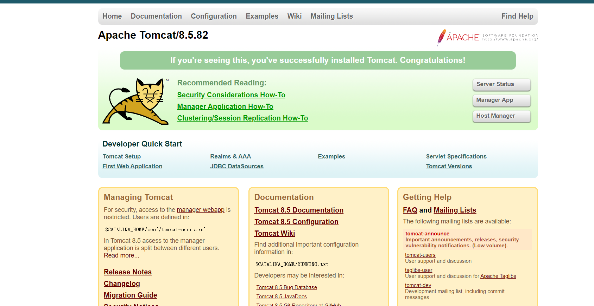

##### 第二回 "IEDA中便捷的创建web项目"

- 我们在之前的学习中IEDA这个软件帮了们很大的忙，当然在日后的学习甚至工作中他仍然是我们的好帮手好老师(前提是安装的为专业版的IDEA)2021版本的IEDA能够很便捷的去创建一个用Maven管理的Web项目。你问我maven是啥？这个后面再将目前你只要了解这是一个很方便的用来导jar包的东西就行了。

- 具体创建Web项目的步骤

  1. 首先打开IDEA点击新建项目（

  2. 选择JavaEnterprise项目

     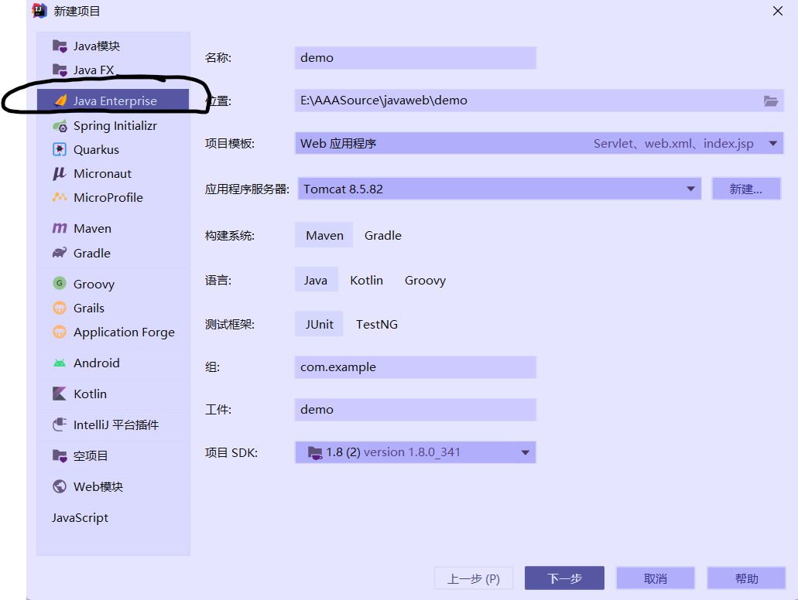

     3.填写好你需要改变的项目信息，以及将你之前安装的Tom🐱的路径填写上，以及选择JDK的安装信息

     4.然后一直下一步下一步完成

     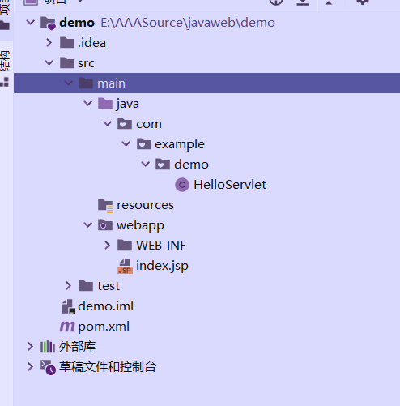

     5.映入眼帘你可以看到他已经预先给你创建好了一个模板，以及告诉了你jsp文件要写在那里(src包下的webapp中)，servlet与Java源文件要写在那里(main文件夹下的Java文件夹)，以及引入jar包的方式

     5sp.拓展 如何使用maven引入jar包

     - 就拿我们之前用到的jdbc驱动吧，首先我们要去maven中心仓库找到我们要用的jar包

       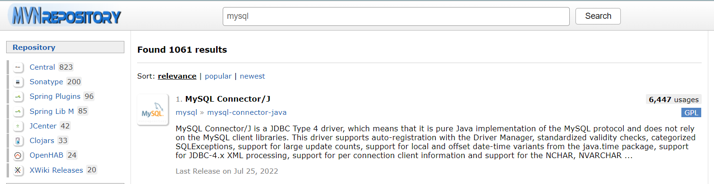

     - 选择合适的版本

       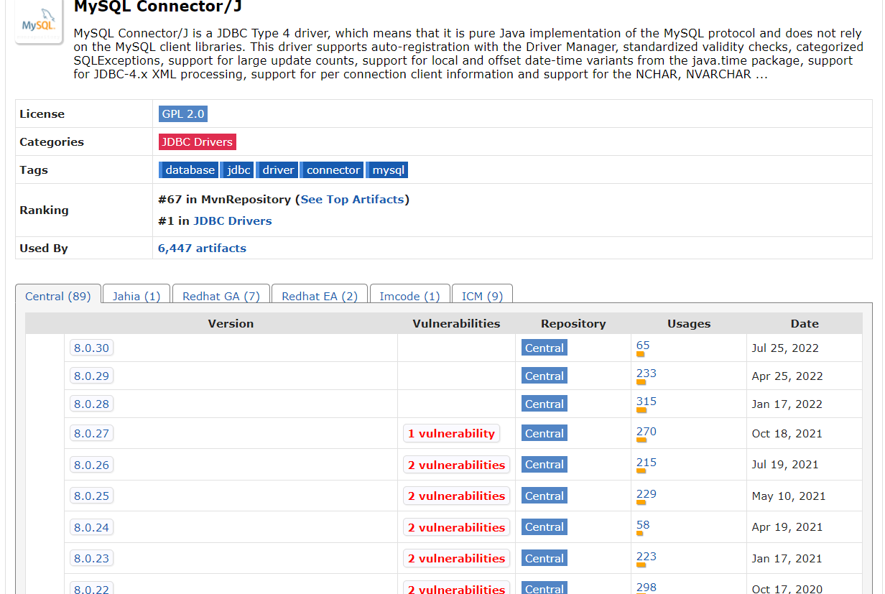

     - 复制坐标代码到项目里面的pom文件中

       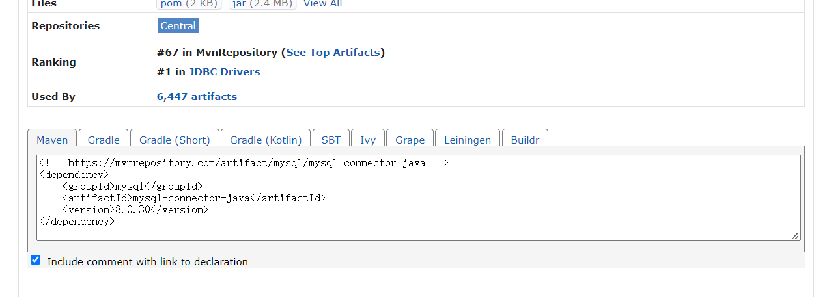

       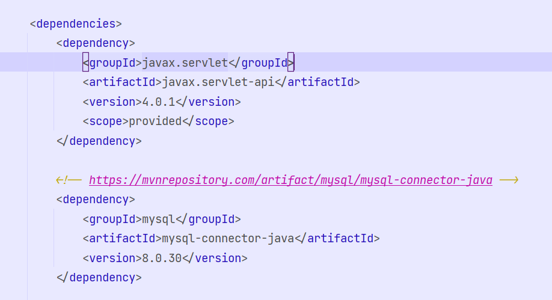

     - 然后右键maven重新加载项目让他导入

     - 完毕

##### 第三回 "初探Servlet"

- 什么是Servlet

  Servlet(服务端小程序)是JavaWeb中至关重要的一个模块，甚至可以说整个JavaWeb就是基于Servlet的Servlet其主要作用就是用于处理用户的请求，并且将处理完毕的内容返回给用户，Servlet其实和普通的Java类一样可以正常的写Java程序代码，但是他却继承了HttpServlet，然后我们就可以在这Servlet中重写HttpServlet中的doGet/doPost方法分别去处理Get与Post请求。

- 如何去编写一个Servlet

  首先我们需要去创建一个web项目，然后我们会发现他已经预先帮我们创建好了一个模板，所以我们不妨去模仿他的写法去写一个Servlet

  - 首先在同级包下创建一个Java类

  - 然后我们也是去模仿模板去继承HttpServlet，然后重写他的doGet方法，并且在里面通过response创建PrintWriter对象，去打印一个helloWorld，但是咱们也发现问题了，我们没法去访问这个servlet啊，我们必然要去用一个东西将浏览器的请求与这个servlet关联上，我们发现了他在模板使用了注解来实现关联，但是我们是初学者我们建议在web.xml文件中对servlet进行配置。

    ~~~java
    public class DemoServlet extends HttpServlet {
        @Override
        protected void doGet(HttpServletRequest req, HttpServletResponse resp) throws ServletException, IOException {
            PrintWriter out = resp.getWriter();
            out.println("hello world");
        }
    }
    ~~~

  - 如何在xml文件中对servlet进行配置，其实这个知识点我们之前没有接触过也没有接触过类似的。我只能告诉你还是老实的记住这个写法就行了。并不算复杂

    - 首先即是在web.xml中使用对我们的servlet进行声明，这样我们就在web.xml中将他注册到里面了，但是我们还是要使用servlet-mapper对他进行关联映射

      ~~~xml
          <servlet>
              servlet名
              <servlet-name>demoServlet</servlet-name>
              servlet类的全限定名
              <servlet-class>com.example.demo.DemoServlet</servlet-class>
          </servlet>
      ~~~

    - 然后我们在写<servlet-mapping>标签将servlet与浏览器的请求关联起来，其中servlet-name中写的是上面我们注册的servlet名字，url-pattern则为servlet在浏览器上的请求映射

      ~~~xml
          <servlet-mapping>
              <servlet-name>demoServlet</servlet-name>
              <url-pattern>/demo</url-pattern>
          </servlet-mapping>
      ~~~

  - 当我们编写完毕去尝试启动并且访问这个servlet的时候，只需要点击右上角的启动按钮去启动tomcat，然后正常情况下idea会自动帮你启动浏览器并且打开index.jsp主页，或者你也可以去修改tomcat的配置然后修改访问的url路径如下图

    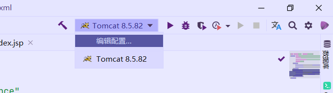

    在这将这两处访问路径分别修改为你想要访问的路径

    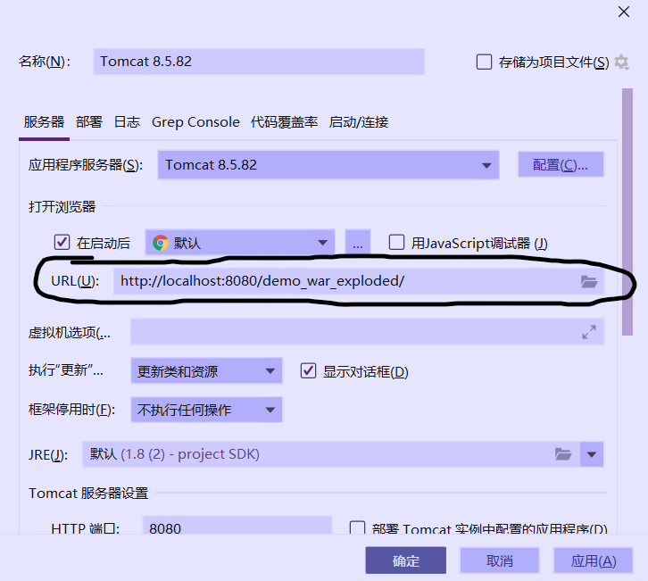

    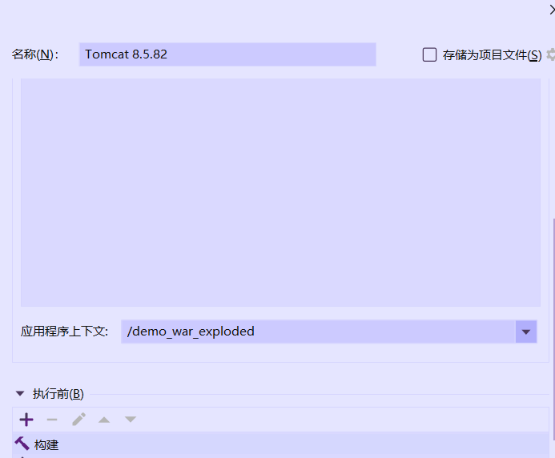

  - 修改完毕之后我们进行访问servlet测试成功

    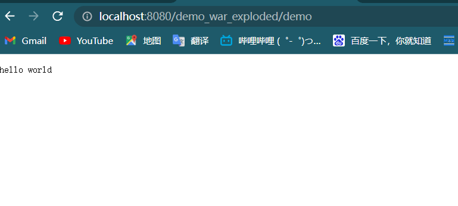

##### 第四回 "知识迁移！dao模式与Web的结合"

- 我们在上节课中使用dao模式简单的建立了一个基于控制台的记账系统，我们今天既然学习了JavaWeb，我们就来尝试一下能否将之前记账系统的内容迁移到JavaWeb中。

- 首先还是老样子建立好一个JavaWeb项目(这里就不在具体演示了)

- 然后将我们之前写的dao层代码，实体类代码，工具类代码都粘贴进去，项目结构如下

  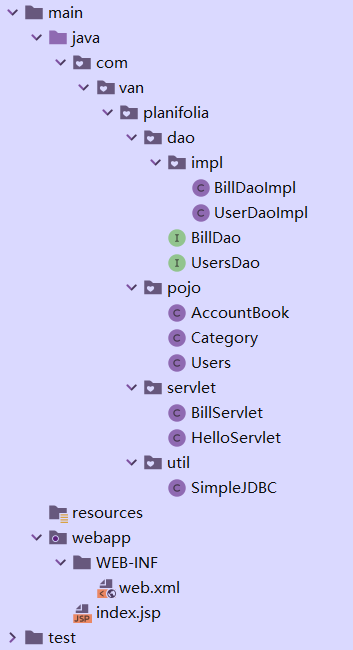

- 其实我们发现我们之前写的控制台的功能几乎和servlet一样，都是负责 接收请求，调用dao层，处理结果，展示给调用者。所以我们只要在servlet中完成这些内容就行了。

  - 创建好servlet并且在xml中注册
  - 在servlet中调用dao方法
  - 处理dao方法返回的信息
  - 将处理完毕的信息打印到网页中

  ~~~java
  public class BillServlet extends HttpServlet {
  
      @Override
      protected void doGet(HttpServletRequest req, HttpServletResponse resp) throws ServletException, IOException {
          // 处理乱码
          resp.setContentType("text/html");
          resp.setCharacterEncoding("UTF-8");
          req.setCharacterEncoding("UTF-8");
          //获取输出流
          PrintWriter out = resp.getWriter();
          //调用dao层
          BillDao billDao = new BillDaoImpl();
          List<AccountBook> accountBooks = billDao.selectAccountByUser("安迪");
  
          //处理返回结果并且打印到浏览器上
          out.println("<html>");
          out.println("<body>");
          out.println("<table>");
          out.println("<tr>");
          out.print("<td>");
          out.print("订单编号");
          out.print("</td>");
  
          out.print("<td>");
          out.print("订单信息");
          out.print("</td>");
  
          out.print("<td>");
          out.print("创建时间");
          out.print("</td>");
  
          out.print("<td>");
          out.print("金额");
          out.print("</td>");
  
          out.print("<td>");
          out.print("用户姓名");
          out.print("</td>");
  
          out.print("<td>");
          out.print("账单类型");
          out.print("</td>");
  
          out.println("</tr>");
          for (AccountBook accountBook : accountBooks) {
              out.println("<tr>");
  
              out.print("<td>");
              out.print(accountBook.getAbid());
              out.print("</td>");
  
              out.print("<td>");
              out.print(accountBook.getDetails());
              out.print("</td>");
  
              out.print("<td>");
              out.print(accountBook.getCreate_datetime().toString());
              out.print("</td>");
  
              out.print("<td>");
              out.print(accountBook.getMoney());
              out.print("</td>");
  
              out.print("<td>");
              out.print(accountBook.getUsers().getNikename());
              out.print("</td>");
  
              out.print("<td>");
              out.print(accountBook.getCategory().getName());
              out.print("</td>");
              out.println("</tr>");
          }
          out.println("</table>");
          out.println("</body>");
          out.println("</html>");
      }
  }
  
  ~~~

- 然后我们启动tomcat在浏览器上测试是否确实能将查询到的信息展示出来

  - 我们发现确实能正确的将安迪的账单信息查询出来

    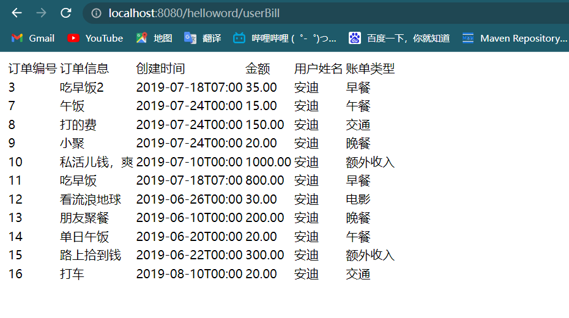

##### 第五回 "深入了解Servlet"

- servlet在Java中的体系结构，从下图我们可以知道我们可以简单的了解到我们自定义的Servlet的继承体系，所以我们深入了解的话不妨从顶层的Servlet接口开始看。

  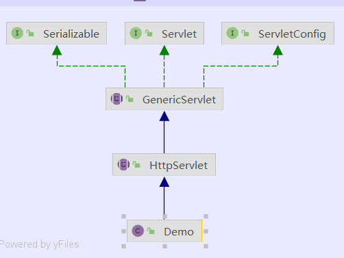

  - 首先是Servlet接口，我们点进去可以看到整个接口的结构 init方法(初始化整个Servlet的只会在创建的时候执行一次，这也是Servlet的单例特性)，service方法(service方法在Servlet每被调用一次的时候就回执行一次，可以说这个方法是Servlet提供服务的核心方法)，destory方法(这个方法会在Servlet销毁的时候执行一次也就是在整个服务器关闭的时候)。这三个方法是比较重要的，也是servlet的声明周期的体现

    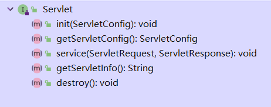

  - 然后我们会发现，我们直接去实现Servlet接口似乎也能拿到Request与Response去处理请求与给出跳转，但是我们实现接口要重写他的所有方法，这无疑是不合理的因为我们几乎只用得到sevice方法，所以我们继续往下看GenericServlet抽象类，GenericServlet抽象类几乎实现了Servlet中的所有方法并且拓展了一些可以获取其他信息的方法，这一层他帮我们实现了其他无关紧要的方法只留下了Service方法去给我们进行接收请求，返回响应。

    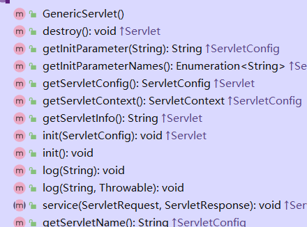

  - 但是我们开发的是web项目，也就是基于网站的项目，在web网页上会有各种类型的请求比如get，post等等，所以我们把这么多种类的请求都交给Service这个方法去处理的话是相当的不合理，无法能合理的为这些不同的请求进行处理所以在下一层HttpServlet中不仅实现了Service方法而且创建了doGet，doPost这些针对不同中请求的方法，我们只要对应不同的请求去重写不同的方法就行了。

    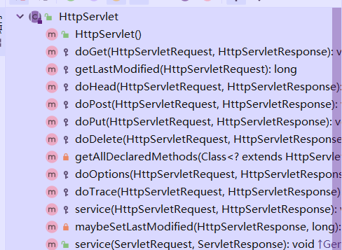

- 我们从上面可以看出Service方法是整个Servlet的核心方法，那么我们就来分析一下HttpServlet中Service方法中的信息。

- 首先是参数 " HttpServletRequest "

  - 这个参数是代表了客户端的请求，里面包含了所有客户端的请求信息，当一个请求处理方法被创建的时候服务器就会创建这个对象，里面会携带着用户的请求参数等等。他常用的方法如下表

    | 返回值            | 方法声明                                                 | 说明                                                         |
    | ----------------- | -------------------------------------------------------- | ------------------------------------------------------------ |
    | String            | getParameter(String name)                                | 根据请求参数名称获取请求参数值,若该参数不存在，则返回一个null |
    | void              | setAttribute(String name,Object value)                   | 向请求对象（作用域）存一个键值                               |
    | Object            | getAttribute(String name)                                | 通过键从请求对象（作用域）获取一个值                         |
    | void              | setCharacterEncoding(String encoding)                    | 设置请求的字符集                                             |
    | Cookie[]          | **[getCookies](HttpServletRequest.html#getCookies())**() | 获取客户端的所有Cookie                                       |
    | RequestDispatcher | getRequestDispatcher(Stirng path)                        | 获取请求转发对象                                             |

- 然后是他的孪生兄弟HttpServletResponse

  - 这个参数是代表着服务器对客户端的相应，同样当一个请求处理方法被调用的时候服务器会创建这个对象，携带着服务器对客户端的所有响应信息。

    | 返回值 | 方法声明                                                     | 说明                               |
    | ------ | ------------------------------------------------------------ | ---------------------------------- |
    | void   | **[sendRedirect](HttpServletResponse.html#sendRedirect(java.lang.String))**(java.lang.String location) | 转向（重定向）到指定的资源location |
    | void   | addCookie(Cookie c)                                          | 向客户端保存有个Cookie             |
    | void   | setContentType(String type)                                  | 设置响应文档类型                   |

- Servlet的生命周期，我们在之前查看Servlet的过程中也简单的分析了一下Servlet中一些方法的执行流程，我们下面就深入的讲解一下Servlet的声明周期

  - Servlet随着用户的第一次请求而诞生在这个时候会去创建这个Servlet对象，并且只会创建这一次(单例性)

  - Servlet会在创建完毕后去执行一次init()方法，完成对Servlet对象的初始化，同样这一步也只会执行一次

  - Servlet每被访问一次都会去调用一次Service方法，然后Service方法会根据请求code的不同去执行对应的doXXX方法来

  - destroy方法则会在关闭tomcat服务器的时候也就是在Servlet销毁的时候执行一遍完成Servlet的销毁

    总之因为Servlet是单例的他会在第一次被调用的时候去创建以及初始化和，然后后面被调用的时候都会通过多线程去处理请求。然后当服务器被关闭的时候servlet也会随着被销毁。

- 案例使用Servlet去实现登录注册，以及展示当前用户的订单。

  - 首先登录与注册我们要写两个html网页来作为用户输入信息并且调用Servlet的入口，不需要太复杂只要有能输入输出的表单控件就行了。

    ~~~html
    <!DOCTYPE html>
    <html lang="en">
    <head>
        <meta charset="UTF-8">
        <title>登录</title>
    </head>
    <body>
    <form action="login" method="post">
        <label>
            邮箱:
            <input name="email">
             
            密码:
            <input type="password" name="password">
             
        </label>
        <input type="submit" value="登录">
    </form>
    </body>
    </html>
    ~~~

    ~~~html
    <!DOCTYPE html>
    <html lang="en">
    <head>
        <meta charset="UTF-8">
        <title>注册</title>
    </head>
    <body>
    <form action="regist" method="get">
      <label>
        邮箱:
        <input name="email">
         
        昵称:
        <input name="nikeName">
         
        密码:
        <input type="password" name="password">
         
      </label>
      <input type="submit" value="提交">
    </form>
    </body>
    </html>
    ~~~

  - 然后我们要去编写Servlet来处理这个前端传递过来的请求，在这里面通过request来获取到前端传递过来的参数 账户，密码，然后再方法里面去调用dao中的方法，并且将前端传递来的参数通过dao方法来验证是否能够登录，或者是否注册成功。如果注册成功则会跳转到用户登录页面，注册失败会提示然后让你重新注册。若登录成功则会显示该用户对应的账单信息，否则会返回登录界面重新登录。

    ~~~java
    public class RegistServlet extends HttpServlet {
        @Override
        protected void doGet(HttpServletRequest req, HttpServletResponse resp) throws ServletException, IOException {
            // 引入dao层
            UsersDao usersDao = new UserDaoImpl();
            // 设置编码
            req.setCharacterEncoding("UTF-8");
            resp.setContentType("text/html");
            resp.setCharacterEncoding("UTF-8");
            //获取前端传递过来的参数
            String email = req.getParameter("email");
            String nikeName = req.getParameter("nikeName");
            String password = req.getParameter("password");
            //创建dao的参数user对象
            Users users = new Users();
            users.setEmail(email);
            users.setNikename(nikeName);
            users.setPassword(password);
            // 执行dao并且获取到更新的行数
            int register = usersDao.register(users);
    
            if (register > 0){
                resp.sendRedirect("login.html");
            }else {
                resp.sendRedirect("regist.html");
            }
        }
    }
    
    
    ~~~

    ~~~java
    /**
     * Created by Intellij IDEA 
     *
     * @author Planifolia.Van
     * @version 1.0
     * @date 2022/8/31 16:47
     */
    public class LoginServlet extends HttpServlet {
        @Override
        protected void doGet(HttpServletRequest req, HttpServletResponse resp) throws ServletException, IOException {
            // 引入userdao与billdao
            UsersDao usersDao = new UserDaoImpl();
            BillDao billDao = new BillDaoImpl();
    
            req.setCharacterEncoding("UTF-8");
            resp.setContentType("text/html");
            resp.setCharacterEncoding("UTF-8");
    
            //获取输出流
            PrintWriter out = resp.getWriter();
            
            //获取前端传递过来的参数
            String email = req.getParameter("email");
            String password = req.getParameter("password");
    
            //创建dao传入参数用户对象
            Users users = new Users();
            users.setEmail(email);
            users.setPassword(password);
            
            //获取dao方法的执行状态来判断是否登录成功
            Users login = (Users) usersDao.login(users);
            System.out.println(login);
    
            //处理返回结果并且打印到浏览器上
            out.println("<html>");
            out.println("<body>");
            out.println("<table>");
            out.println("<tr>");
            out.print("<td>");
            out.print("订单编号");
            out.print("</td>");
    
            out.print("<td>");
            out.print("订单信息");
            out.print("</td>");
    
            out.print("<td>");
            out.print("创建时间");
            out.print("</td>");
    
            out.print("<td>");
            out.print("金额");
            out.print("</td>");
    
            out.print("<td>");
            out.print("用户姓名");
            out.print("</td>");
    
            out.print("<td>");
            out.print("账单类型");
            out.print("</td>");
    
            out.println("</tr>");
    
            if (login!=null){
                resp.getWriter().println("欢迎你！用户"+login.getNikename());
                List<AccountBook> accountBooks = billDao.selectAccountByUser(login.getNikename());
                for (AccountBook accountBook : accountBooks) {
                    out.println("<tr>");
    
                    out.print("<td>");
                    out.print(accountBook.getAbid());
                    out.print("</td>");
    
                    out.print("<td>");
                    out.print(accountBook.getDetails());
                    out.print("</td>");
    
                    out.print("<td>");
                    out.print(accountBook.getCreate_datetime().toString());
                    out.print("</td>");
    
                    out.print("<td>");
                    out.print(accountBook.getMoney());
                    out.print("</td>");
    
                    out.print("<td>");
                    out.print(accountBook.getUsers().getNikename());
                    out.print("</td>");
    
                    out.print("<td>");
                    out.print(accountBook.getCategory().getName());
                    out.print("</td>");
                    out.println("</tr>");
                }
                out.println("</table>");
                out.println("</body>");
                out.println("</html>");
                System.out.println("你好");
            }else {
                resp.sendRedirect("login.html");
            }
        }
        @Override
        protected void doPost(HttpServletRequest req, HttpServletResponse resp) throws ServletException, IOException {
            doGet(req, resp);
        }
    }
    ~~~

##### 第六回 "实现动态页面的福音 JSP"

- 虽然我们能使用servlet很方便的去处理请求，但是很难使用servlet去实现动态网页，因为我们在servlet中输出内容都要使用printWriter流中的print方法来实现，这样虽然能写出来动态的网页但是回产生大量的多余代码，在每输出一个标签的时候都要去调用一次print方法。所以Java官方就推出了jsp这种动态网页，在jsp中不仅能够编写原来的html标签还能写Java脚本，以及使用java脚本来实现标签的循环输入。

- jsp的基础语法格式

  在jsp中我们写的内容可以分为两大部分，html代码与java代码，html代码则直接写在文件体中，Java代码则需要写在<%%>标签内。

  ~~~java
  <%@ page contentType="text/html; charset=UTF-8" pageEncoding="UTF-8" %>
  <!DOCTYPE html>
  <html>
  <head>
      <title>JSP - Hello World</title>
  </head>
  <body>
  

  <table border="1px">
  
  <%
      for (int i = 0; i < 10; i++) {
  %>
      <h1>你好世界</h1>
  <%
      }
  %>
  
  </table>
  

  </body>
  </html>
  ~~~

  其实jsp的本质还是servlet，jsp在执行的时候会先被翻译为java代码，也就是生成对应的servlet，我们看源码可以得知它还是将我们在jsp中写的标签使用 out.write();方法输出了出来，然后将这些内容都写到了_jspService方法，也就是servlet中的service方法中。

- jsp中的表达式<%=%>

  在jsp中我们可以写这样的语法格式<%= 表达式 %>，他会直接计算出表达式中的内容，或者取出变量中的内容然后输出出来。

- jsp中的方法/变量定义<%!%>

  我们在上面看过jsp翻译后的源码，可以知道我们在jsp中写的内容都会被填充在_jspService方法中，在方法中写的变量是属于局部变量每次被调用/访问都会刷新变量的值，并且在方法中是无法定义新的方法的所以，我们要是想要在jsp中定义新的方法与成员变量则需要直接写在<%!%>标签中，并且写在这个标签中的信息会填充到类中。

- jsp中的指令 <%@ 指令名字 %>

  jsp中的指令大致分为三大类

  1. <%@ page %> 用于标记这个页面，以及设置编码等等
  2. <%@ include %>  用于引入新的界面，在这引入界面是直接将原来的界面原封不动的放进来，不推荐使用，并且在jsp中有另一种引入<jsp:include>这个引入是动态的引入，一般推荐使用这种方式。
  3. <%@ taglib %> 这个标签是用于导入第三方标签库，我们后面再说

- jsp中的九大内置对象

  在JSP里不用声明就可以直接使用的对象。

  1、out 来源于Java.io.Writer类，它用于发送输出流到客户端。
  2、request 来源于javax.servlet.http.HttpServletRequest接口。它被关联到每一个HTTP请求。
  3、response 来源于javax.servlet.http.HttpServletResponse。response对象用于把取得的数据返回到客户端。
  4、pageContext 提供访问JSP页面的命名空间。它也提供用来访问其他的JSP隐含对象。
  5、session 来源于javax.servlet.http.HttpSession。它用于存储客户端请求的信息，因此它是有状态交互式的。
  6、application 来源于javax.servlet.ServletContext。
  7、config 来源于ServletConfig，它包含了当前JSP/Servlet所在的WEB应用的配置信息。
  8、page 来源于当前被访问JSP页面的实例化。它实际使用的是JSP转换成的Servlet。
  9、exception 用于捕获JSP抛出的异常。它只有在JSP页面属性isErrorPage=true时才可用。

- EL表达式

  在jsp中内置了el表达式，能够让我们更加舒服的去取值，我们在通过进行取值的时候要么使用<%%>脚本代码块搭配out.print()来使用，要么就是使用<%=%>来取值，非常的麻烦，所以jsp内置了el表达式能够让我们非常灵活的去取存放在三大作用域内的值，具体用法如下。

  ~~~jsp
  <%--
    Created by IntelliJ IDEA.
    User: dell
    Date: 2022/9/1
    Time: 20:54
    To change this template use File | Settings | File Templates.
  --%>
  <%@ page contentType="text/html;charset=UTF-8" language="java" %>
  <html>
  <head>
      <title>Title</title>
  </head>
  <body>
  <fieldset>
      <legend>普通字符串</legend>
      ${nstr}
  </fieldset>
  
  <fieldset>
      <legend>特殊字符串，会将标签等元素直接输出到网页上然后会被浏览器解析</legend>
      ${spstr}
  </fieldset>
  
  <fieldset>
      <legend>通过对象.的方式来取出对象，本质上是去调用了类的get方法</legend>
      ${user.email} 
      ${user.nikename} 
      ${user.password} 
  </fieldset>
  
  <fieldset>
      <legend>el表达式取集合中的元素是通过下标来进行访问的</legend>
      ${userlist[0]} 
      ${userlist[1]} 
      ${userlist[2]} 
  </fieldset>
  
  <fieldset>
      <legend>el表达式甚至可以直接取出之前存入的字符串进行数值运算</legend>
      nub+100=${nub}+100
  </fieldset>
  
  <fieldset>
      <legend>el表达式可以进行判断是否为空，可以判断null值，可以判断空字符串，可以判断空集合</legend>
      ${empty empt1} 
      ${empty empt2} 
      ${empty empt3} 
      ${empty empt4} 
      ${empty emptsss} 
  </fieldset>
  
  <fieldset>
      <legend>总结</legend>
      我们其实可以看出，el表达式如果去取存入的资源是非常的方便且强大的，甚至能将存入的任何类型内容进行算数运算，但是他也是有他自己的
      不足之处，比如对于集合数组等元素便利非常的不方便需要使用下标进行运算，而且不能依赖for循环。
      el表达式也有一个特性，他会从最底层的page开始找，一层层的往上开始找 request/session/application
  </fieldset>
  
  </body>
  </html>
  ~~~

- 当然el表达式显然不是万能的,它虽然能很方便的取出值但是它却不擅长取循环的内容，那么就需要引入另外一个东西了，jstl标签，jstl是阿帕奇组织开发的一套  方便的标签原本是准备给那些不擅长Java的开发人员使用的，但是后来因为比较好用大部分人都使用jstl来简化jsp中的脚本代码，jstl用处最多的可能就是if判断与foreach循环了。具体使用案例如下

  ~~~java
  
  <%@ taglib prefix="c" uri="http://java.sun.com/jsp/jstl/core" %>
  <%--
    Created by IntelliJ IDEA.
    User: dell
    Date: 2022/9/1
    Time: 21:19
    To change this template use File | Settings | File Templates.
  --%>
  <%@ page contentType="text/html;charset=UTF-8" language="java" %>
  <html>
  <head>
      <title>Title</title>
  </head>
  <body>
  <fieldset>
      <legend>jstl中取特殊字符串，默认是进行转移</legend>
      <c:out value="${spstr}">
  
      </c:out>
  </fieldset>
  
  <fieldset>
      <legend>jstl中取特殊字符串，escapeXml="{false}是不转义，true则为u转义"</legend>
      <c:out value="${spstr}" escapeXml="{false}"></c:out>
  </fieldset>
  
  <fieldset>
      <legend>jstl中的if判断,test中写表达式，为true才执行标签中的内容</legend>
      <c:if test="${!empty userlist}">
          userlist,是空吗？能看到我吗？
      </c:if>
  </fieldset>
  
  <fieldset>
      <legend>jstl中的choose语句when语句当when中的test条件满足就会执行里面的语句,但是当执行了一个when之后就会终止</legend>
      <c:choose>
          <c:when test="${empty nstr}">
              empty不为空
          </c:when>
          <c:when test="${nub==123456}">
              ${nub}
          </c:when>
      </c:choose>
  </fieldset>
  
  <fieldset>
      <legend>jstl能够很方便的去便利存入的数组元素</legend>
      <c:forEach items="${userlist}" var="e">
          ${e}
      </c:forEach>
  </fieldset>
  </body>
  </html>
  ~~~

- 综合案例，尝试使用jstl与el表达式来简化之前写的用户账单与账单类型

  显然我们在之前写的用户账单信息是直接输出到servlet中的并且写了大量的out.print，我们现在学习了jsp以及jstl那么我们就能很轻松的使用循环来实现List内容的便利。

  ~~~java
  @WebServlet("/login")
  public class LoginServlet extends HttpServlet {
      @Override
      protected void doGet(HttpServletRequest req, HttpServletResponse resp) throws ServletException, IOException {
          // 引入userdao与billdao
          UsersDao usersDao = new UserDaoImpl();
          BillDao billDao = new BillDaoImpl();
  
          req.setCharacterEncoding("UTF-8");
          resp.setContentType("text/html");
          resp.setCharacterEncoding("UTF-8");
  
          //获取输出流
          PrintWriter out = resp.getWriter();
  
          //获取前端传递过来的参数
          String email = req.getParameter("email");
          String password = req.getParameter("password");
  
          //创建dao传入参数用户对象
          Users users = new Users();
          users.setEmail(email);
          users.setPassword(password);
  
          //获取dao方法的执行状态来判断是否登录成功
          Users logins = (Users) usersDao.login(users);
          System.out.println(logins);
          if (logins!=null){
              //登录成功则将用户信息以及订单信息保存到req作用域中
              req.setAttribute("user",logins);
              List<AccountBook> accountBooks = billDao.selectAccountByUser(logins.getNikename());
              req.setAttribute("accountBooks",accountBooks);
              req.getRequestDispatcher("userBill.jsp").forward(req,resp);
  
          }else {
              resp.sendRedirect("login.html");
          }
      }
      @Override
      protected void doPost(HttpServletRequest req, HttpServletResponse resp) throws ServletException, IOException {
          doGet(req, resp);
      }
  }
  
  ~~~

  ~~~jsp
  <%@ page contentType="text/html;charset=UTF-8" language="java" %>
  <%@taglib prefix="c" uri="http://java.sun.com/jsp/jstl/core" %>
  <html>
  <head>
      <title>Title</title>
  </head>
  <body>
      <h2>${user.nikename}</h2>
      <table border="1px">
          <tr>
              <th>订单编号</th>
              <th>订单信息</th>
              <th>创建时间</th>
              <th>金额</th>
              <th>用户姓名</th>
              <th>账单类型</th>
          </tr>
  <%--        取出在servlet中保存到request中的List数组--%>
          <c:forEach items="${accountBooks}" var="e">
              <tr>
                  <td>${e.abid}</td>
                  <td>${e.details}</td>
                  <td>${e.create_datetime}</td>
                  <td>${e.money}</td>
                  <td>${e.users.nikename}</td>
                  <td>${e.category.name}</td>
              </tr>
          </c:forEach>
      </table>
  </body>
  </html>
  ~~~

##### 第七回 "功能强大的Filter和没啥卵用的Listener"

- 我们在使用便捷方式去创建Servlet的时候可以发现在Servlet的下面还有两个其他的，一个过滤器一个监听器，这两个人如其名，过滤器就是过滤请求的，监听器则是监听事件的。

  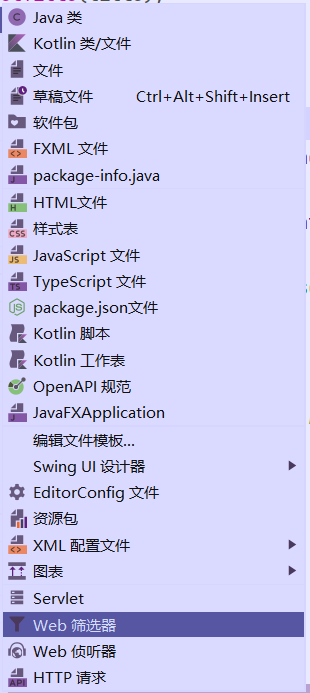

- Filter 过滤器，过滤器我们在上面也说了，过滤器是会拦截所有符合映射规则的请求，然后经过过滤器中的业务逻辑处理后继续往下传递，根据这个特性我们可以想到我们可以在过滤器中写整个项目中的重复代码，就比如我们之前每次都要处理的中文乱码问题我们就能可以写在过滤器中并且将关系映射写成 /* 这个则会拦截所有的请求并且我们在监听器中设置request与response的编码格式为UTF-8就可以了。使用过滤器实现乱码处理如下。

  ~~~Java
  @WebFilter("/*")
  public class CharEncodingFilter implements Filter {
      @Override
      public void init(FilterConfig filterConfig) throws ServletException { System.out.println("过滤器初始化"); }
  
      @Override
      public void destroy() { System.out.println("过滤器销毁"); }
  
      @Override
      public void doFilter(ServletRequest request, ServletResponse response, FilterChain chain) throws IOException, ServletException {
          // 设置request的编码格式为utf-8
          request.setCharacterEncoding("utf-8");
          // 设置response的编码格斯为utf-8
          response.setCharacterEncoding("utf-8");
          // 让过滤器继续往下走，不然请求与响应就会被拦截在这里了
          chain.doFilter(request, response);
      }
  }
  ~~~

  - 我们在最后一行看见了一个之前没有见过的方法，chain.doFilter(request,response)，因为过滤器会拦截所有符合映射路径的请求，所以我们要在这让他这个请求在处理之后继续的往下走此时就要用到方法chain.doFilter(request, response)方法，这样才能把请求继续执行下去。否则请求就会断在这里。

  - 当然Filter的使用方法不仅如此，还有其他比如权限过滤器，比如一些只有登录才能执行的功能比如修改登录用户的信息，进入用户主页等等这些请求都要去通过过滤器去判断一波若确定登录了才让继续访问，没有登录则跳转到登录页面。除此之外还有记录日志的一些功能，其实总而言之过滤器就是用来处理那些大量的重复工作而生的毕竟所有符合映射路径的请求都会被过滤器拦截。

- Linstener 监听者其实监听者我们用到的确实少，但是他设计的功能还是比较强大的.

  - 监听器一共有三大类分别是两个Session级别的监听器，HttpSessionListener，HttpSessionAttributeListener这两个分别是去监听Session的生命周期（比如session的创建，销毁等等）的以及Session中的属性值变化的变化(Session中的属性值的添加，属性值的修改等等)。除了Session层面之外还有一个ServletContext层面的监听器，这个监听器会去监听tomcat服务器的初始化以及销毁等等（我们通常是将一些要永久使用的数据在服务器启动的时候查出来并且放到ServletContext作用域中，以此来实现数据在服务器生命周期中的永久保存），下面我们就来用代码来演示一下ServletContextLinstener的使用场景。

  ~~~java
  
  @WebListener
  public class ApplicationListener implements ServletContextListener {
      @Override
      public void contextInitialized(ServletContextEvent sce) {
  
          //因为订单类型信息是经常使用并且不会轻易改变的所以在初始化的时候将订单类型信息都存到application中，方便后面的存取
          BillDao billDao = new BillDaoImpl();
          List<Category> allCategory = billDao.getAllCategory();
          sce.getServletContext().setAttribute("allCate",allCategory);
          System.out.println(allCategory);
  
      }
      @Override
      public void contextDestroyed(ServletContextEvent sce) { }
  }
  ~~~

##### 第八回 "划时代的创举，Ajax(异步js与xml)"

- 为什么要有ajax

  我们传统的web去发出一条请求无外乎两种方式 1.通过表单去发出请求 2.通过超链接去发出请求，但是这两种方式无论如何都会进行一次跳转，而且会刷新整个网页的内容。使用这种方式不仅会发出大量无意义的请求，而且可能会对服务器造成大量的负担(可能我们在网页中只是去刷新一行信息，若使用传统方式则会请求整张网页)所以我们想能不能不去请求整张网页而是去实现局部刷新。其实这种技术在现在是十分的常见，比如注册的时候右边提示邮箱是否可用，搜索框下的建议等等，都是使用Ajax进行局部刷新来实现的。

- 如何使用Ajax发送请求

  通常Ajax是有三种写法，分别是两种比较简单的$.get()方法与$.psot()方法，当然根据这名字我们就能想出来，这俩分别是执行get请求与psot请求的这种Ajax的编写格式具体如下
  
  $.get(
  
  ​	"请求地址",
  
  ​	{请求参数JSON格式},
  
  ​	function(后端回调传递的参数){
  
  ​		回调方法体
  
  ​	}
  
  )
  
  psot的请求与这个大致相同，我们只要吧get修改为post就行了，下面我们就来拿Ajax来做一个简单的前端实时时间刷新的程序。
  
  ~~~htm
  <body>
  

  </body>
  
  ~~~
  
  ~~~java
  
  @WebServlet(name = "GetTimeServlet", value = "/GetTimeServlet")
  public class GetTimeServlet extends HttpServlet {
      @Override
      protected void doGet(HttpServletRequest request, HttpServletResponse response) throws ServletException, IOException {
          Date date = new Date();
          response.getWriter().println(date.toLocaleString());
      }
  }
  ~~~
  
  显然这个程序并没有什么难点，就是在前端使用定时器循环发出一次请求，然后接收到后端传递过来的数据再次展示到前端页面上，但是我们这次的请求方式确实是摒弃了传统的跳转请求方式，通过使用ajax实现异步的局部刷新，大大的提高了用户的使用体验。
  
- 当然我们多数情况下发出的请求不仅有响应值而且还应该有请求参数，就比如最常见的注册id检测，检测当前的id是否已经呗注册，若已经被注册则给出提示id已被占用，若没被注册则给出提示id可以使用。那么我们就要简单的分析一波了，我们要实现这种实时的检测触发条件是什么？根据我们多年的使用经验来看应该是用户的输入框失去焦点的时候去发出一次请求，请求之后我们只要根据传递过来的id数据去查询一次表看看到底有没有这个人然后返回两个标记值。然后前端再根据传过来的标记值进行一波判断与显示即可。

  ~~~html
  <body>
  
  
  邮箱<input type="text" class="form-control" id="email"> 
  昵称<input type="text" class="form-control" id="nikename"> 
  密码<input type="text" class="form-control" id="password">
  
  
  </body>
  ~~~

  ~~~java
  @WebServlet("/EmailServlet")
  public class EmailServlet extends HttpServlet {
      @Override
      protected void doPost(HttpServletRequest req, HttpServletResponse resp) throws ServletException, IOException {
          String em = req.getParameter("em");
          UserDao userDao = new UserDaoImpl();
          System.out.println(em);
          User login = userDao.login(em);
          System.out.println(login);
          if (login!=null){
              resp.getWriter().print("erro");
          }else {
              resp.getWriter().print("success");
          }
      }
  }
  ~~~

  我们根据这个案例可以得知，使用Ajax能够很方便的实现前后端交互，我们使用json格式的数据传递给后端，后端能够很容易的使用request的getParmarter()方法来获取到对应的数据,然后后端同样也是能将数据很容易的推送到前端，并且前端Ajax能够很方便的通过回调函数中的参数来拿到对应的值。

- 当然我们在实际开发中显然不能仅仅局限于传递一个简单的数据到前台来，很多时候我们会在后台查询到很多信息会封装成一个对象或者对象数组，但是前端他不认对象或者数组啊，他只认识json，所以我们要在后台将查到的数据封装成json再去返回到前端，前端在使用js去解析json信息然后将他显示到页面上。

  下面我们就来实现一个简单的搜索关联词的小程序，每当输入新的内容时若数据库有对应的信息就将他显示到搜索栏的下面，显然对于这个需求我们不难想到要去监听键盘事件，当键盘的按键抬起时让他发出一个请求，根据我们输入的内容进行模糊查询，然后将结果封装成json数组返回给前端，前端在js中利用for循环或者其他将返回的数据展示到页面上。

  ~~~java
  <input type="text" class="form-control" id="suggests">
  <input type="button" value="搜索" id="btn_search"> 
  

  
  
  
  ~~~

  ~~~java
  @WebServlet(name = "SuggestServlet", value = "/SuggestServlet")
  public class SuggestServlet extends HttpServlet {
      @Override
      protected void doGet(HttpServletRequest request, HttpServletResponse response) throws ServletException, IOException {
          // 处理乱码
          request.setCharacterEncoding("utf-8");
          response.setCharacterEncoding("utf-8");
          String msg = request.getParameter("msg");
  
          SuggestDao suggestDao = new SuggestDaoImpl();
          //执行模糊查询，返回list数组
          List<Suggest> suggests = suggestDao.suggestQuery(msg);
          //使用fastjson将数组转化成json数组
          String s = JSON.toJSONString(suggests);
          System.out.println(s);
          //推送到前端页面
          response.getWriter().print(s);
      }
  
  }
  
  ~~~

- 从上面的例子我们可以看到我们在Java中能够使用工具类很容易的实现Java对象转成json数据，然后我们将json数据传递给前端之后又能够很容易的解析出来json中的具体信息，这样就很完美的解决了Java中的数据结构与前端数据结构不匹配的问题。可能在之前还有使用xml文件来传递前后端数据的情况，但是在现在基本上都是开始使用json来实现数据传递了。

##### 番外1"何为经典？MVC设计模式"

- 在JavaWeb的项目中有着一个非常非常经典的设计模式，MVC设计模式。它起源于1978年，到如今仍然被各大项目使用，可以说绝大部分的项目都多多少少的使用了MVC的设计模式。

- 什么是MVC

  首先MVC三个大写字母的缩写那么它必然为三个字母的缩写M(model 模型),V(view 视图),C(controller 控制器)。这三个模块其中model指的是数据模型，它主要是负责与数据库进行交互，其中常见的Service层，dao层，entity实体类层都是属于M层中的模块。View指的则是视图层，也就是那些html页面，jsp页面他们则负责接受数据，并且展示到页面上以及对controller层发出一些请求。对于controller层则是负责接受前端的请求，然后交给dao层进行处理，最后再把数据返回给前端页面。

- 为什么要有MVC

  在没有引入mvc设计模式之前，jsp页面中要写大量的Java代码，那时候jsp既负责数据的展示又负责处理请求导致代码结构非常的混乱，并且不容易后期的代码维护所以就引入了mvc设计模式，将各个功能模块分离开，各司其职降低了代码的耦合度，使代码更加的便于维护。

- servlet向controller的转变

  我们在之前的项目中会对每一个请求都去写一个Servlet，感觉确实不是很合理，导致有大量的Servlet类出现，所以我们想能否将同一个类中的请求都交给一个一个Servlet来处理，显然这是可以的我们创建一个Servlet不去重写具体的doGet或者doPost方法而是去重写Service方法，因为Service方法回拦截所有类型的请求，我们接收到请求之后只要对请求的Url进行判断，具体请求的是什么内容然后再根据请求的url信息然后来选择执行那个方法去调用dao层。

  其实在SpringMvc中使用的就是这种模式创建一个Controller类然后再类中创建许许多多的方法，每一个方法都代表着一个请求。虽然我们还额米有学习SSM框架，我们在这就使用Servlet简单的模拟一下这种执行方式。

- 因为项目简单以及没有设置事务等等就不在引入Service层了。

  1. 首先来看一下项目结构，Java代码中分别是pojo实体类，dao dao层，controller controller层，util中则是编写的数据库访问工具类。页面中则就是单纯的jsp网页使用了el表达式以及JSTL来展示数据。

     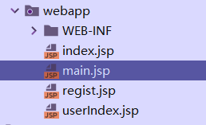

     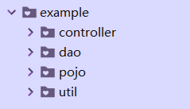

  2. 然后我们来看一下controller中我们改造的Servlet，我们修改了传统的Servlet让他再Service方法中接受所有的请求，并且根据url请求的不同来调用Controller中不同的方法。再下面的代码中我们首先是使用UserServlet/*拦截到了所有以UserServlet开头的请求，并且通过字符串截取的方式拿到了请求连接中的最后一个参数来决定到底是请求的是这个模块中的什么功能，然后实现处理不同的请求。

     ~~~java
     @WebServlet("/UserServlet/*")
     public class UserServlet extends HttpServlet {
         UserDao userDao = new UserDao();
         @Override
         protected void service(HttpServletRequest req, HttpServletResponse resp) throws ServletException, IOException {
             req.setCharacterEncoding("utf-8");
             resp.setCharacterEncoding("utf-8");
             String requestURL = req.getRequestURL().toString();
             String[] strs = requestURL.split("/");
             String method = strs[strs.length - 1];
             switch (method){
     
                 case "login" :
                     System.out.println("login");
                     login(
                             req.getParameter("email"),
                             req.getParameter("password"),
                             req,
                             resp
                     );
                     break;
     
                 case "regist":
                     System.out.println("regist");
     
                     User user = new User();
                     user.setNikename(req.getParameter("nikename"));
                     user.setEmail(req.getParameter("email"));
                     user.setPassword(req.getParameter("password"));
     
                     regist(user,req,resp);
                     break;
                 default:
                     System.out.println("def");
             }
         }
         private void login(String email,String password,HttpServletRequest req, HttpServletResponse resp) throws IOException {
             User login = userDao.login(email, password);
             if (login!=null){
                 req.getSession().setAttribute("user",login);
                 resp.sendRedirect("/UserMsg");
             }else {
                 resp.sendRedirect("/index.jsp");
             }
         }
         private void regist(User user ,HttpServletRequest req, HttpServletResponse resp) throws IOException{
             int regist = userDao.regist(user);
             resp.sendRedirect("/main.jsp");
         }
     }
     ~~~

- 后面的dao内容就是还和之前一样的调用工具类来对数据库进行具体的操作，代码比较重复不在这里赘述只做代码的粘贴

  1. 用户的dao层,登录与注册

     ~~~java
     package com.example.dao;
     
     import com.example.pojo.User;
     import com.example.util.BaseDao;
     
     import java.util.Map;
     
     /**
      * Created by Intellij IDEA 
      * 用户的dao层，集成了BaseDao。 
      * @author Planifolia.Van
      * @version 1.0
      * @date 2022/9/14 15:25
      */
     public class UserDao extends BaseDao {
         /**
          * 用户登录的方法
          * @param email 用户的邮箱
          * @param password 用户的密码
          * @return 登录成功的用户对象
          */
         public User login(String email,String password){
             Map<String, Object> map = super.dataQueryToMap(
                     "select * from users where email=? and password=?",
                     email,
                     password
             );
             if (!map.isEmpty()){
                 User user = new User();
                 user.setUid((Integer) map.get("uid"));
                 user.setEmail((String) map.get("email"));
                 user.setPassword((String) map.get("password"));
                 user.setNikename((String) map.get("nikename"));
                 return user;
             }else {
                 return null;
             }
         }
     
         /**
          * 用户的注册方法
          * @param user 注册的用户对象信息
          * @return 是否注册成功
          */
         public int regist(User user){
             if (user!=null){
                 return super.dataModify(
                         "insert into users(email,password,nikename) values(?,?,?)",
                         user.getEmail(),
                         user.getPassword(),
                         user.getNikename()
                 );
             }
             return 0;
         }
     }
     
     ~~~

     2.登录页面

     ~~~java
     <%@ page contentType="text/html; charset=UTF-8" pageEncoding="UTF-8" %>
     <!DOCTYPE html>
     <html>
     <head>
         <title>JSP - Hello World</title>
     </head>
     <body>
      
     
     ======================================登录========================================
      
     <form method="get" action="/UserServlet/login">
         email:<input type="text" name="email">
         password:<input type="password" name="password">
         <input type="submit" value="登录">
         <input type="button" value="注册" onclick="location.href='regist.jsp'">
     </form>
     </body>
     </html>
     
     ~~~

     

     

  

