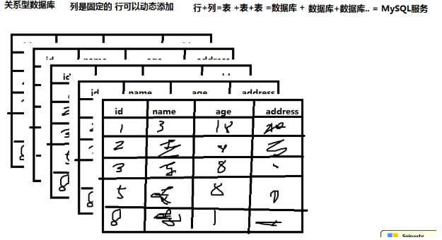
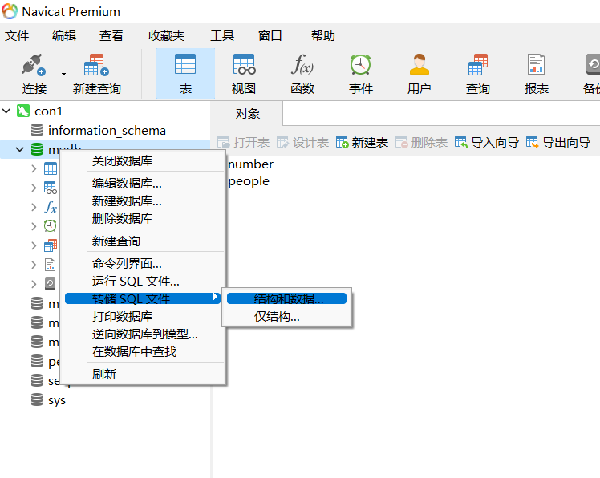
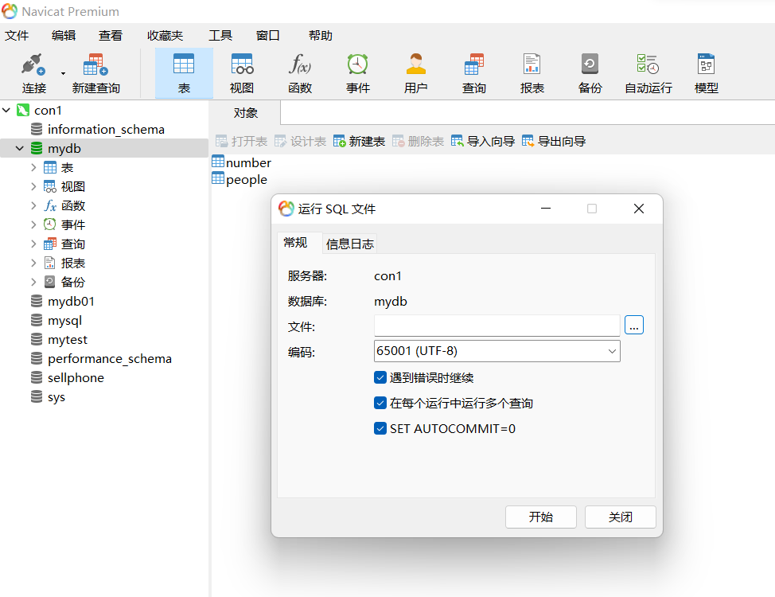
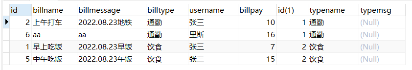
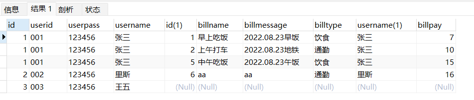
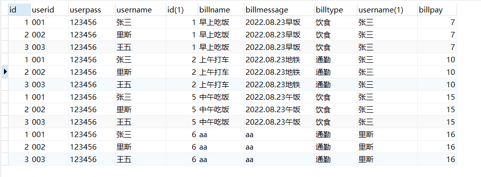
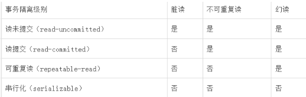
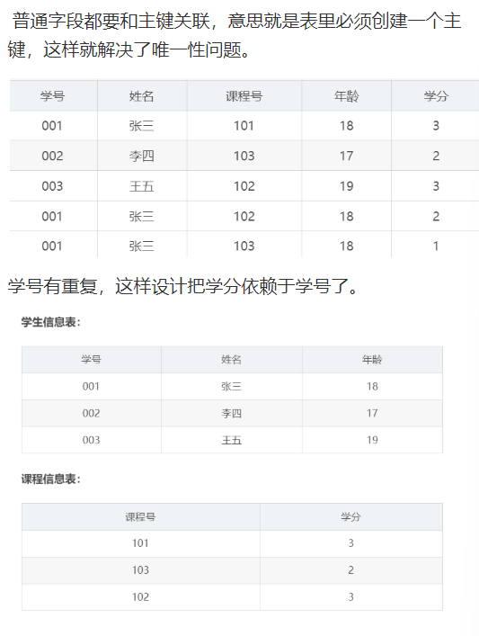
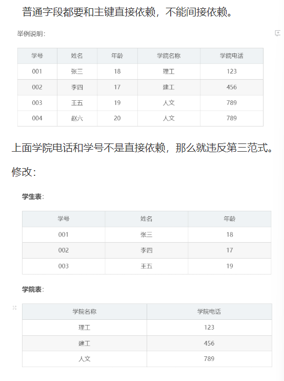

# `第二阶段MySQL`

## MySQL第一天

​		*从今天开始我们就进入了MYSQL数据库的学习了，可以说在我们后端学习的过程中数据库的知识是至关重要的，因为我们后面写的项目与练习无时无刻不在对数据进行增删改查，所以作为我们后续学习的数据源 ‘mysql’ 阶段的学习就显得至关重要，所以我们要在这个阶段首先就是要学好sql语句的语法格式，掌握MySQL的查询特性，以及后期对MySQL存储引擎以及高级特性的学习，都需要多费功夫，切莫因为sql语句相对容易而懈怠。*

#### 一. 本章基础知识点

##### 1. 什么是数据库？

​		数据库是作为数据的存储介质，其本质上就是用于存储大量数据的，因为我们要将程序中的数据进行**持久化**，以及在内存中很难我们实际开发中要用到的大量数据，所以我们引入了数据库这个东西来协助我们进行从存储处理数据。从80年代开始数据库就出现了当时有三大类型的数据库 关系型数据库，网状型数据库，层次型数据库。但是随着时代的发展现如今只剩下了 关系型数据库与非关系型数据库(NoSQL)。

##### 2. MySQL是什么数据库，这种数据库的特性是什么？

​	MySQL是关系型数据库，关系型数据库是指采用了关系模型来组织数据库，它的特性是指采用了关系模型的数据库，其采用行和列的形式进行存储数据，列不能轻易的改变它决定着一张表的结构，约定了你能添入啥样的数据。行是可以随便插入的但是数据格式要遵循你列设置的格式。许多行组成一张表，然后许多张表可以组成一个数据库。用户可以通过查询，插入，更新，删除语句对数据库进行操作。常见的关系型数据库有 MySQL，SQL service，Oracle。

​		非关系型数据库：NoSQL最常见的解释是“non-relational”， “Not Only SQL”也被很多人接受。NoSQL仅仅是一个概念，泛指非关系型的数据库，区别于关系数据库，它们不保证关系数据的ACID特性。NoSQL是一项全新的数据库革命性运动，其拥护者们提倡运用非关系型的数据存储，相对于铺天盖地的关系型数据库运用，这一概念无疑是一种全新的思维的注入。NoSQL的出现并不是为了取代关系型数据库 而是作为关系型数据库的有效补充。

| **分类**              | **Examples举例**                                      | 典型应用场景                                                 | 数据模型                                        | 优点                                                         | 缺点                                                         |
| --------------------- | ----------------------------------------------------- | ------------------------------------------------------------ | ----------------------------------------------- | ------------------------------------------------------------ | ------------------------------------------------------------ |
| **键值（key-value）** | Tokyo Cabinet/Tyrant， Redis， Voldemort， Oracle BDB | 内容缓存，主要用于处理大量数据的高访问负载，也用于一些日志系统等等。 | Key 指向 Value 的键值对，通常用hash table来实现 | 查找速度快                                                   | 数据无结构化，通常只被当作字符串或者二进制数据               |
| **列存储数据库**      | Cassandra， HBase， Riak                              | 分布式的文件系统                                             | 以列簇式存储，将同一列数据存在一起              | 查找速度快，可扩展性强，更容易进行分布式扩展                 | 功能相对局限                                                 |
| **文档型数据库**      | CouchDB， MongoDb                                     | Web应用（与Key-Value类似，Value是结构化的，不同的是数据库能够了解Value的内容） | Key-Value对应的键值对，Value为结构化数据        | 数据结构要求不严格，表结构可变，不需要像关系型数据库一样需要预先定义表结构 | 查询性能不高，而且缺乏统一的查询语法。                       |
| **图形(Graph)数据库** | Neo4J， InfoGrid， Infinite Graph                     | 社交网络，推荐系统等。专注于构建关系图谱                     | 图结构                                          | 利用图结构相关算法。比如最短路径寻址，N度关系查找等          | 很多时候需要对整个图做计算才能得出需要的信息，而且这种结构不太好做分布式的集群方案。 |

##### 3. MySQL与SQL语句

​		我们虽然说我们现在学的是MySQL数据库，但是我们目前学习的仅仅是简单的SQL语言，那么SQL语句与MySQL数据库有什么关系呢？

~~~sql
   MySQL数据库是一种数据库而SQL语言则是一门编程语言称之为 ‘结构化查询语言’ 它不是属于MySQL的它可以用于任何一种关系型数据库上可以对数据库本身以及数据库内存取的内容的进行 查询，修改，删除，更新的操作。SQL语言从概念上可以分为6大类如下。
   
   1、数据查询语言（DQL: Data Query Language）：其语句，也称为“数据检索语句”，用以从表中获得数据，确定数据怎样在应用程序给出。保留字SELECT是DQL（也是所有SQL）用得最多的动词，其他DQL常用的保留字有WHERE，ORDER BY，GROUP BY和HAVING。这些DQL保留字常与其它类型的SQL语句一起使用。
   DQL:用于执行查询操作
    
2、数据操作语言（DML：Data Manipulation Language）：其语句包括动词INSERT、UPDATE和DELETE。它们分别用于添加、修改和删除。 
    DML:用于执行增删改操作
3、事务控制语言（TCL）：它的语句能确保被DML语句影响的表的所有行及时得以更新。包括COMMIT（提交）命令、SAVEPOINT（保存点）命令、ROLLBACK（回滚）命令。
    TCL:用于实现事务的提交回滚等操作
4、数据控制语言（DCL）：它的语句通过GRANT或REVOKE实现权限控制，确定单个用户和用户组对数据库对象的访问。某些RDBMS可用GRANT或REVOKE控制对表单个列的访问。 
    DCL:则是管理用户权限的
5、数据定义语言（DDL）：其语句包括动词CREATE,ALTER和DROP。在数据库中创建新表或修改、删除表（CREATE TABLE 或 DROP TABLE）；为表加入索引等。
    DDL:是用于实现 表 库的增删改操作的
6、指针控制语言（CCL）：它的语句，像DECLARE CURSOR，FETCH INTO和UPDATE WHERE CURRENT用于对一个或多个表单独行的操作。
   CCL:用于对多个表单独行的操作。
~~~

​           我们接下来就对DQL，DML，DDL进行一些演示

~~~sql
DDL(库表的管理语言)
1.创建一个数据库
create database test1
2.进入数据库test1
use test1
3.创建一个表hello
create table hello(
hello1 int primary key auto_increment comment'a',
hello2 varchar(10) not null ,
hello3 int default 0
)engine=innodb default charset=UTF8
4.删除表
drop table  hello
5.删除库
drop database test1
6.为表添加字段
ALTER table temp add i(列名) int(字段数据类型) after c(添加的新列在列‘c’后面)
7.为表删除字段
ALTER table temp drop i 
9.修改字段的类型
alter table temp(表名) modify(关键字) i(列名) char(10)(修改后的数据类型)
10.修改字段名与类型
alter table temp(表名) change(关键字) i(原列名) j(新列名) int(新列的数据类型);
11.修改字段的约束
alter table temp(表名) alter i(列名) set default 100;
DML(数据操作语言)
1.插入一些信息
insert into hello
values(null,'54653',11),
(null,'dasdsadsa',0)
2.修改之前插入的信息
update hello set hello2='hehe'
where hello1=1
需要注意的一点是，自动增长的内容我们可以不写，但是要是写了就不能与之前主键的重复(主键的唯一非空约束但是我们还不能用简单的非空约束来代替主键，因为mysql会根据主键去创建索引来提高检索性能)
3.删除一些信息
delete from hello
where hello1=1
DQL(数据查询语言)
1.根据第一类查询hello表中的信息
select * from hello
where hello1=1
~~~

##### 4. MySQL中的数据类型

在MySQL中同样有各种各样的数据类型，大部分与Java中的数据类型类似但是相较于Java中的数据库的数据类型更加的细致一点。

在mysql中int家族就有很多种类，tinyint( 1byte ) smallint( 2byte ) mediumint( 3byte ) int/integer( 4byte )

bigint( 8byte ),然后就是小数家族与Java类似 double float 四字节与八字节，但是在mysql中我们处理货币类型的不用这种数据类型而是使用DECIMAL，能更加准确的表述钱数。

除去普通类型之后剩下的就是字符类型，同样在mysql中字符类型也分了很多种 基本的char 可变的varchar，tinyblod存储二进制流的，text存储大量文本的

当然最后也少不了日期类型，date日期类型格式YYYY-MM-DD，time时间类型格式hh:mm:ss,YEAR年份类型格式YYYY，DateTime复合时间格式为date与time的组合。timestamp时间戳，从1970-01-01开始按毫秒做偏移值来计算

详细的内容见下面表格

数值类型

MySQL支持所有标准SQL数值数据类型。

这些类型包括严格数值数据类型(INTEGER、SMALLINT、DECIMAL和NUMERIC)，以及近似数值数据类型(FLOAT、REAL和DOUBLE PRECISION)。

关键字INT是INTEGER的同义词，关键字DEC是DECIMAL的同义词。

BIT数据类型保存位字段值，并且支持MyISAM、MEMORY、InnoDB和BDB表。

作为SQL标准的扩展，MySQL也支持整数类型TINYINT、MEDIUMINT和BIGINT。下面的表显示了需要的每个整数类型的存储和范围。

| 类型         | 大小                                     | 范围（有符号）                                               | 范围（无符号）                                               | 用途            |
| ------------ | ---------------------------------------- | ------------------------------------------------------------ | ------------------------------------------------------------ | --------------- |
| TINYINT      | 1 byte                                   | (-128，127)                                                  | (0，255)                                                     | 小整数值        |
| SMALLINT     | 2 bytes                                  | (-32 768，32 767)                                            | (0，65 535)                                                  | 大整数值        |
| MEDIUMINT    | 3  bytes                                 | (-8 388 608，8 388 607)                                      | (0，16 777 215)                                              | 大整数值        |
| INT或INTEGER | 4  bytes                                 | (-2 147 483 648，2 147 483 647)                              | (0，4 294 967 295)                                           | 大整数值        |
| BIGINT       | 8  bytes                                 | (-9,223,372,036,854,775,808，9 223 372 036 854 775 807)      | (0，18 446 744 073 709 551 615)                              | 极大整数值      |
| FLOAT        | 4  bytes                                 | (-3.402 823 466 E+38，-1.175 494 351 E-38)，0，(1.175 494 351 E-38，3.402 823 466 351 E+38) | 0，(1.175 494 351 E-38，3.402 823 466 E+38)                  | 单精度 浮点数值 |
| DOUBLE       | 8  bytes                                 | (-1.797 693 134 862 315 7 E+308，-2.225 073 858 507 201 4 E-308)，0，(2.225 073 858 507 201 4 E-308，1.797 693 134 862 315 7 E+308) | 0，(2.225 073 858 507 201 4 E-308，1.797 693 134 862 315 7 E+308) | 双精度 浮点数值 |
| DECIMAL      | 对DECIMAL(M,D) ，如果M>D，为M+2否则为D+2 | 依赖于M和D的值                                               | 依赖于M和D的值                                               | 小数值          |

如果我们要在数据库中存储 钱 等数据 此时不能使用 float  double 因为这些类型会丢失精度  要使用DECIMAL

------

日期和时间类型

表示时间值的日期和时间类型为DATETIME、DATE、TIMESTAMP、TIME和YEAR。

每个时间类型有一个有效值范围和一个"零"值，当指定不合法的MySQL不能表示的值时使用"零"值。

TIMESTAMP类型有专有的自动更新特性，将在后面描述。

| 类型      | 大小 ( bytes) | 范围                                                         | 格式                | 用途                     |
| --------- | ------------- | ------------------------------------------------------------ | ------------------- | ------------------------ |
| DATE      | 3             | 1000-01-01/9999-12-31                                        | YYYY-MM-DD          | 日期值                   |
| TIME      | 3             | '-838:59:59'/'838:59:59'                                     | HH:MM:SS            | 时间值或持续时间         |
| YEAR      | 1             | 1901/2155                                                    | YYYY                | 年份值                   |
| DATETIME  | 8             | 1000-01-01 00:00:00/9999-12-31 23:59:59                      | YYYY-MM-DD HH:MM:SS | 混合日期和时间值         |
| TIMESTAMP | 4             | 1970-01-01 00:00:00/2038  结束时间是第 **2147483647** 秒，北京时间 **2038-1-19 11:14:07**，格林尼治时间 2038年1月19日 凌晨 03:14:07 | YYYYMMDD HHMMSS     | 混合日期和时间值，时间戳 |

------

字符串类型

字符串类型指CHAR、VARCHAR、BINARY、VARBINARY、BLOB、TEXT、ENUM和SET。该节描述了这些类型如何工作以及如何在查询中使用这些类型。

| 类型       | 大小                  | 用途                            |
| ---------- | --------------------- | ------------------------------- |
| CHAR       | 0-255 bytes           | 定长字符串                      |
| VARCHAR    | 0-65535 bytes         | 变长字符串                      |
| TINYBLOB   | 0-255 bytes           | 不超过 255 个字符的二进制字符串 |
| TINYTEXT   | 0-255 bytes           | 短文本字符串                    |
| BLOB       | 0-65 535 bytes        | 二进制形式的长文本数据          |
| TEXT       | 0-65 535 bytes        | 长文本数据                      |
| MEDIUMBLOB | 0-16 777 215 bytes    | 二进制形式的中等长度文本数据    |
| MEDIUMTEXT | 0-16 777 215 bytes    | 中等长度文本数据                |
| LONGBLOB   | 0-4 294 967 295 bytes | 二进制形式的极大文本数据        |
| LONGTEXT   | 0-4 294 967 295 bytes | 极大文本数据                    |

**注意**：char(n) 和 varchar(n) 中括号中 n 代表字符的个数，并不代表字节个数，比如  CHAR(30) 就可以存储 30 个字符。

CHAR 和 VARCHAR 类型类似，但它们保存和检索的方式不同。它们的最大长度和是否尾部空格被保留等方面也不同。在存储或检索过程中不进行大小写转换。

BINARY 和 VARBINARY 类似于 CHAR 和 VARCHAR，不同的是它们包含二进制字符串而不要非二进制字符串。也就是说，它们包含字节字符串而不是字符字符串。这说明它们没有字符集，并且排序和比较基于列值字节的数值值。

BLOB 是一个二进制大对象，可以容纳可变数量的数据。有 4 种 BLOB 类型：TINYBLOB、BLOB、MEDIUMBLOB 和 LONGBLOB。它们区别在于可容纳存储范围不同。

问题： MySQL能不能存储音频 视频图片文件 ？

可以的 将音视频图片 转换成流 存储到数据库 blob  但是我们数据库 不存文件

文件一般存到磁盘  然后数据库中存储文件路径

有 4 种 TEXT 类型：TINYTEXT、TEXT、MEDIUMTEXT 和 LONGTEXT。对应的这 4 种 BLOB 类型，可存储的最大长度不同，可根据实际情况选择。 

##### 5.MySQL中的约束

~~~sql
非空约束 被声明为非空约束的列插入值时不得为空   not null
唯一约束 被声明为唯一约束的列不得有两行重复的 unique
主键约束 被声明为主键约束的会根据主键生成索引并且非空唯一 primary key
检查约束 要求这一类插入的内容符合某种规则，MySQL中没有这个东西 check
默认约束 没有插入值的时候使用默认设定的值 default
外键约束 外键让本表与外表产生关系，保证数据一致性完整性 foreign key
~~~

##### sp. 小拓展 

- varchar 和 char 的区别，在mysql中varchar和char有明显的区别

  1.char是定长的并且最大长度为255字符并且没用到的会用空格填充，varchar最大长度为65535没用到的不会用空格填充。

  2.因为char是定长的会浪费内存空间，但是varchar根据填入的字符来决定不会浪费空间。

  3.char能提高查找效率，varchar查找效率低

  4.char插入时的空格可省略，varchar查找时会忽略空格

  5.应用场景，如果是对于一些比较短小的数据可以使用char来进行存储，因为若是使用varchar的话还会额外占用字节来存储数据的长度。对于定长的信息也可以采用char来存储。对于频繁变更的信息也尽量使用char来进行存储因为若使用varchar还需要进行额外的计算。

- utf-8 和 utf-8mb4 区别？

  utf-8mb4是指 most bytes 4 在mysql中传统的utf-8编码格式采用三个字节来存储虽然三个字节已经能兼容大部分的汉字了但是对于一些特殊字符仍然是无法存储比如说，Emoji标签就需要用四个字节来存储，所以传统的utf-8无法实现存储在mysql5.5.3之后推出了新的编码格式utf-8mb4可以存储四个字节，

- MySQL的存储引擎，MySQL中有两种存储引擎一种是innodb这个也是MySQL的默认存储引擎，一个是myisam存储引擎

  1.innodb采用的事务隔离级别为可重复读，并且支持事务与行锁，以及外键约束。并且在innodb存储引擎中采用b+树来作为索引的实现方式，innodb会在运行时建立缓冲池，将表的索引与查询到的缓冲内容暂时保存到里面，但是该引擎不支持 全文搜索，同时启动也比较的慢，它是不会保存表的行数的，所以当进行 selectcount(*) from table 指令的时候，需要进行扫描全表。由于锁的粒度小，写操作是不会锁定全表的,所以在并发度较高的场景下使用会提升效率的。 

  2.Myisam 的存储文件有三个，后缀名分别是 .frm、.MYD、MYI，其中 .frm 是表的定义文件，.MYD 是数据文件，.MYI 是索引文件。

  Myisam 只支持表锁，且不支持事务。Myisam 由于有单独的索引文件，在读取数据方面的性能很高 。MyIASM 引擎是保存了表的行数，于是当进行 select count(*) from table 语句时，可以直接的读取已经保存的值而不需要进行扫描全表。所以，如果表的读操作远远多于写操作时，并且不需要事务的支持的，可以将 MyIASM 作为数据库引擎的首选。

  MySQL表级锁有两种模式：表共享锁（Table Read Lock）和表独占写锁（Table Write Lock）。

  <1>对MyISAM的读操作，不会阻塞其他用户对同一表请求，但会阻塞对同一表的写请求；

  <2>对MyISAM的写操作，则会阻塞其他用户对同一表的读和写操作；

  <3>MyISAM表的读操作和写操作之间，以及写操作之间是串行的。

  当一个线程获得对一个表的写锁后，只有持有锁线程可以对表进行更新操作。其他线程的读、写操作都会等待，直到锁被释放为止。

### MySQL第二天

##### 一.本章基础知识点

##### 1.如何备份与恢复数据库

​		显然我们在实际开发中为了保证数据的安全经常要对数据进行备份，在mysql的可视化工具中我们可以很方便的对数据库表结构以及数据进行备份操作。

- 如何导出sql文件，首先进入可视化工具然后选中一个数据库右键转存为sql文件，然后保存到桌面就ok了

  

-  如何通过sql文件恢复数据呢？同样也是只要右键数据库，允许sql文件，然后表结构与数据就被导入到数据库中了

  

- 本质上sql文件就是转存的sql语句，我们转存sql文件就是相当于根据我们的数据库生成了一份sql文件，然后执行sql文件就是运行了一遍sql语句。

##### 2.sql的单表查询

​	2.1 基本查询

~~~sql
没啥好说的就是最基本的给你要找的字段让你查询出来

1.查询Student表中的所有记录的Sname , Ssex 和 Class列

select sname,ssex,class
from student
格式：
select 查询的字段们...
from 表名

2.查询教师所有的单位即不重复的Depart列

select distinct Depart
from teacher

提示：
关键字 distinct 是用于去重的，也就是去除掉查询到的重复内容

3.查询Student表的所有记录

select *
from student
~~~

​	2.2 条件查询

~~~sql
跟你查询的条件让你查询出来内容

4. 查询Score表中成绩在60到80之间的所有记录

select *
from score
where degree between 60 and 80

5.查询Score表中成绩为85 86 或 88 的记录

select *
from score
where degree in (85,86,88)

6.查询student表中“95031”班或性别为“女”的同学记录

select *
from student
where class=95031
or ssex='女'

格式：
select 字段们...
from 表名
where 条件表达式a
or/and 条件表达式b 

~~~

  2.3 查询排序

~~~sql
排序查询就是使用order by 关键字根据某个字段实现排序

7.以class降序查询student表的所有记录

select *
from student
order by class desc

8.以cno升序、degree降序查询score表的所有记录

select *
from score
order by cno,degree desc

格式：
select 字段们...
from 表名
order by 字段a,字段b,.... desc(倒序，不写则为升序)
~~~

  2.4 子查询

~~~sql
子查询其实就是使用其他查询结果作为条件表达式然后来进行筛选

10.查询score表中的最高分的学生学号和课程号。（子查询或者排序）

select sno,cno,degree
from score
where degree = (
		select max(degree) 
		from score
)

格式：
select 字段们...
from 表名
where 条件  (
			另外一条查询语句的结果
)
~~~

  2.5 MySQL中的函数与分组

~~~sql
MySQL中的函数比如max计算最大值，min最小值，avg平均数，count总计，而且函数常常搭配分组使用，通常是在分完组之后使用函数进行统计计算。
9.查询“95031”班的学生人数

select count(*) 95031班级人数
from student
where class=95031

10.查询score表中的最高分的学生学号和课程号。（子查询或者排序）

select sno,cno,degree
from score
where degree = (
		select max(degree) 
		from score
)

11.查询每门课的平均成绩

select avg(degree),cno
from score
group by cno

12.查询score表中至少有5名学生选修的并以3开头的课程的平均分数

select avg(degree),cno
from score
group by cno
having count(*)>=5
and cno like '3%'

~~~

2.6 MySQL中的分页查询

~~~sql
	我们在实际生产环境中可能一个数据库表会有百万千万条数据，那么我们要是按照常规的方法去进行查询，那么他一次查询会将所有内容都暂时加载到内存当中，显然这样会占据大量的内存空间甚至会让我们的服务器宕机,所以我们要进行分页查询，让他每次不去查询那么多内容这样既能得到我们想要的信息又不会浪费内存资源。
    那么如何实现分页查询呢？查询格式如下
        select 字段们... 
        from 表名
        where 条件表达式
        limit 开始索引,显示的条数
    13.查询student表中6-10条数据
        select *
        from student
        limit 5,5
        
~~~

##### 3.MySQL的语句执行顺序

~~~sql
sql执行顺序 

    from 
    on 
    join 
    where 
    group by(开始使用select中的别名，后面的语句中都可以使用)
     avg,sum.... 
    having 
    select 
    distinct 
    order by
    limit 

从这个顺序中我们不难发现，所有的 查询语句都是从from开始执行的，在执行过程中，每个步骤都会为下一个步骤生成一个虚拟表，这个虚拟表将作为下一个执行步骤的输入。 

第一步：首先对from子句中的前两个表执行一个笛卡尔乘积，此时生成虚拟表 vt1（选择相对小的表做基础表）。 
第二步：接下来便是应用on筛选器，on 中的逻辑表达式将应用到 vt1 中的各个行，筛选出满足on逻辑表达式的行，生成虚拟表 vt2 。
第三步：如果是outer join 那么这一步就将添加外部行，left outer jion 就把左表在第二步中过滤的添加进来，如果是right outer join 那么就将右表在第二步中过滤掉的行添加进来，这样生成虚拟表 vt3 。

第四步：如果 from 子句中的表数目多余两个表，那么就将vt3和第三个表连接从而计算笛卡尔乘积，生成虚拟表，该过程就是一个重复1-3的步骤，最终得到一个新的虚拟表 vt3。 

第五步：应用where筛选器，对上一步生产的虚拟表引用where筛选器，生成虚拟表vt4。

注意where与on的区别：先执行on，后执行where；on是建立关联关系在生成临时表时候执行，where是在临时表生成后对数据进行筛选的。

第六步：group by 子句将中的唯一的值组合成为一组，得到虚拟表vt5。如果应用了group by，那么后面的所有步骤都只能得到的vt5的列或者是聚合函数（count、sum、avg等）。原因在于最终的结果集中只为每个组包含一行。这一点请牢记。 

第七步：应用avg或者sum选项，为vt5生成超组，生成vt6. 
第八步：应用having筛选器，生成vt7。having筛选器是第一个也是为唯一一个应用到已分组数据的筛选器。 
第九步：处理select子句。将vt7中的在select中出现的列筛选出来。生成vt8. 

第十步：应用distinct子句，对vt8进行去重，生成vt9。

第十一步：应用order by子句。按照order_by_condition排序vt9，此时返回的一个游标，而不是虚拟表。

第十二步：应用limit选项。生成vt10返回结果给请求者即用户。 
~~~

### Mysql第三天

##### 一.本章基础知识点

##### 1 .MySQL中的连表查询

- 多表之间的关系

​    我们在实际开发中连表查询用到的十分的广泛，因为实体之间的关系很难使用一个表去表达所以我们要求的所有关系，所以我们要使用多个表联合起来表达我们需要的实体间的关系。此时多表我们肯定要去维持他们之间的关系的不能建两个表他俩之间完全没有关系。就比如说订单与订单类型表，一个订单属于一个订单类型，但是一个订单类型有多个订单。这种就属于一对多关系，订单类型为一，订单为多，然后我们要在订单表中去关联订单类型表。因为我们这两个表之间必然要有关系我们不可能在订单类型表中添加所有的订单信息所以只能在订单表中添加订单类型字段去关联订单类型表。

- 连表查询的种类

  1. 内连接(等值连接)

     这种链接也是我们最常用的来链接用于获取两个表之间的关系记录， 也就是说，根据连接条件，两个表中都有对应的数据存在的记录，才会返回。也就是得到两个表的交集 也是我们最常用的链接 模板写法如下 

     ~~~sql
     select *
     from 表1 join 表2
     on 表1.comm=表2.comm
     
     select *
     from 表1,表2
     where 表1.comm=表2.
     comm
     -- 内链接账单表与账单类型表会返回这俩表的交集
   select * 
     from t_bills,t_billtype
   where t_bills.billtype=t_billtype.typename
     ~~~

     

  2. 左链接
  
     左链接与内链接略有不同，左连接会返回左表中的所有内容，即使在右表中的所有字段没有任何与左边这列有关系。以及与左表有关系的右表内容。

     ~~~sql
     -- 左链接查询用户与用户账单间的关系，会返回左表与右表间的关系链接以及
     select *
  from t_users left join t_bills
     on t_users.username=t_bills.username
     ~~~
     
     
     
  3. 右链接 
  
     右连接则与左连接类似，只不过右连接会返回右表中的所有内容，以及左表中与右表有关系型的内容。
  
     ~~~sql
     右连接的格式
     select *
     from t_users right join t_bills
     on t_users.username=t_bills.username
     ~~~
  
  4. 全连接
  
     全连接是指返回两个表的笛卡尔集也就是无论有没有关系都会返回这俩的连接，比如左表有123右表有ab，然后全连接返回的结果如下 1a,1b 2a,2b 3a,3b
  
     ~~~sql
     全连接的格式就是内连接去除筛选条件
     select *
     from t_users join t_bills
     
     ~~~
  
     
  
  5. on与where的区别
  
     where关键字是纯粹的用来进行条件筛选的，不满足where后面条件的查询内容会被过滤掉对于on关键字则是不同的对于where连接来说 on与where的作用是一样的匹配不到的都会被过滤，所以对于对于内连接来说的话on与where是没有什么区别的，而对于外连接则on是必须要有的，on决定匹配不到的是否要进行过滤，所以外连接on关键字必须要有。
  
  6. 连表查询中表的先后顺序
  
     在mysql中进行AB连表查询，是拿A表中的内容去匹配B表中的内容，所以查询速度与右表没有太大的关系，我们主要效率取决于驱动表A表的数据大小，尽量使用小表去连接大表(小表驱动大表

- 多表查询与外键的关系

  1. 什么是外键

     在mysql中外键是用来约束表与表之间的关系了，我们在上面也说了实体间的关系很难用一个表描述完整，所以需要多个表来共同表示并且要在表与表之间设立关系，虽然我们不去设置外键同样能够保证表之间有数据联系而且也能实现表连接，但是我们要做到表之间的数据完整性我们则需要额外的添加外键来对表之间的数据进行约束。

  2. 如何添加外键

     添加外键的情况无外乎两种一种一对多外键，要在多的那一方表中添加一表中的唯一标识符来作为外键，若为多对多则需要引入第三者表来作为这俩的关联，在第三者表中分别引入这两表的唯一标识符来构建外键。

  3. 使用sql语句去创建外键

     ~~~sql
     模板格式
     
     create table(
     a1 type1(10) key auto_increment,
     a2 varchar(20) not null
     constraint fk foreign key ('a2') references ('a2fk')
     ); 
     
     ~~~

  
  ### Mysql第四天
  
  ##### 一.本章知识点
  
  1. MySQL中的子查询
  
- 什么是子查询，什么时候会用到子查询呢？

  一般对于一个查询只会出现一次select语句但是 在子查询中会出现多个select语句，此时后面的称之为子查询前面的称之为主查询。当我们需要进行一些很明显的分步查询的时候就需要用到子查询了，子查询会将自己查询到的结果作为 表 跟在from后面实现表子查询，也可查询出多列单行来放在where后面来实现行子查询（不常用），也可以一列多行来放在where后面实现列子查询，但是对于列子查询需要用到 all any in 等关键字来实现。

- 表子查询，行子查询，列子查询示例

  ~~~sql
  表子查询
  #5 --得到工资大于自己部门平均工资的员工信息
  
  select *
  from emp,(select deptno,avg(sal) sals
  					from emp
  					group by deptno
  					) emps
  where emp.deptno=emps.deptno
  and emp.sal>emps.sals
  
  列子查询
  
  select *
  from emp
  where sal > all(select sal from emp where deptno=10)
  
  行子查询
  select * 
  from emp 
  where (sal,deptno)
  = (select sal,deptno from emp order by sal desc limit 1)
  ~~~

- 子查询中常见的比较运算符

  ~~~sql
  	在列子查询中若是出现多行结果则不能够使用 = 来进行筛选则需要使用 all any some exists来实现筛选出一个值然后再使用 > < = 进行比较 
  其中这几个关键字 any代表着比后面的内容最小的那个要大的记录，all代表着要比后面内容最大的那个要大的记录
  exists代表若后面有数据则返回true，exists not则恰好相反
  ~~~

- 子查询与连接查询的区别

  一般来说好多子查询的sql语句都能替换成连接查询，但是相较于比较晦涩的连接查询可能子查询的分部处理问题的思想比较符合大部分人的思想，但是他与连接查询相比的话连接查询的效率是要比嵌套查询要高的，所以对于连接查询与子查询都能做到的我们可以采用连接查询来实现。

  2. MySQL中的连接查询

- 首先我们需要注意的一点就是连接查询并不是连表查询，连接查询指的则是将两个表堆在一期并且可以实现堆堆叠后进行去重操作。并且还有一点是连接查询甚至可以将不同字段的内容连接在一起，但是字段数量必须要一样。其中两个关键字 uinon 会去重 uinon all 不会去重保留全部的连接信息。

  

  ### MySQL第五天

  ##### 一.本章基础知识点

  1. MySQL中的事务

     - 事务的概念

       事务是一组不可分割的操作（增删改）操作，这些操作要么都成功要么都不成功。而且在MySQL中的事务遵循ACID原则(原子性，一致性，隔离性，持久性)

     - 事务ACID详解

       原子性(**A**tomicity)：不可分割的

       原子性说明MySQL中的事务作为一个整体不可分割，就拿最经典的例子来说吧银行转账：银行转账可以分为两个步骤分别是从张三身上转走钱，然后在将钱转到李四账号上。这两部操作是原子性的不可分割。要么都成功要么都失败。

       一致性(**C**onsistency)

       一致性说明对于事务无论成功与否最后的结果要是一致的都会得到正确的结果，比如说转账500元，若是成功了则还剩500不成功则应该还剩1000.

       隔离性(**I**solation)

       隔离性是指同时存在着两个事务，比如张三去给李四转账，然后张三爸爸要给张三打钱，隔离性要求这两个事务是相互隔离的互不干扰。

       持久性

       持久性要求mysql中的事务一旦提交了就要保存到本地硬盘文件里面，而不会因为突然中断而丢失。

     - 如何开启事务

       在MySQL中的事务是默认自动提交的也就是说，我们正常按照默认的来执行的话是执行一条事务就会提交一条，显然我们这样无法去控制事务何时去提交了，所以我们要先把MySQL的自动提交给他关了。

       MySQL通过 `select@@autocommit`就可以查询到当前的自动提交状态，然后我们又可以通过`set autocommit=0`去关闭自动提交然后我们也可以看到了在mysql中0代表非，非0则代表真。

     - 如何开始事务，结束事务

       我们通过上面所说的事务基本概念可以得知，事务只发生在 增删改 中也就是说我们在执行任何一条增删改操作时都会开启事务，然后若我们关闭了自动提交那么事务就会开启并且不会自动关闭。此时我们之前执行的所有操作都不会持久化保存！那么如何结束事务并且存盘呢？`rollback`回滚操作 `commit` 提交操作 当执行完毕这俩指令时我们刚才开始的事务则会结束，当rollback后就会恢复到之前没修改时的内容。commit之后则会将修改后的内容保存到电脑硬盘中。

     2.事务的隔离级别

     - 隔离级别概述

       为什么要引入事务的隔离级别呢？因为在MySQL在高并发的情况先会出现种种问题，比如脏读，幻读，不可重复读等情况，所有需要引入对应的隔离级别来解决这些问题。我们先来讲解一些在MySQL中出现的这些问题。

     - 引入隔离级别之前会出现的情况

       - 脏读

         何为脏读，脏读的意思就是读到了不正确的数据(脏数据)因为我们在事务期中如果没有提交就被其他事务读取到了并且显示了出来。而我们后面却把这个修改的事务给回滚了那么我们就读到了不正确的数据脏数据。那么我们如何去解决呢？我们只需要不让他们读取没提交的数据就能解决了！

       - 不可重复读

         事务2去读取数据第一次查询的是a，然后事务1去修改数据了并且也去提交了，然后事务2没有结束又去读取了一遍然后得到了结果是b，那么在同一个事务中读取的两个结果是不相同的所以会出现不可重复读。这种情况我们把事务隔离级别设置为可重复读即可。因为可重复读会暂时创建一个副本快照来保证读取到的信息是一致的。
    
       - 幻读
  
         幻读则是两次读取到的数据条目不同，像是出现了幻觉，因为是我们在两次查询插入了新的数据，则会导致我们两次读取到的内容条数不一样，我们可以使用行级锁+mvcc来解决幻读的问题或者将隔离级别修改为串行化。
       
         
       
         
       
       3. 索引入门
       
       - 索引的简介
       
         索引其实就像一本书的目录一样，能够提高庞大数据检索速度。在MySQL中索引是用b tree 这种数据结构实现的，在触发索引查询的时候会先去检索索引从而大幅度的提高检索速度。
       
       - 如何创建索引
       
         ~~~sql
         其实创建索引的语法格式非常的简单，我们只需要执行系列语句即可
         create index index_name on table_name(colum_name)
         ~~~
       
       - 在那些列上创建索引比较好
       
         1. 主键，外键，唯一约束的字段子啊创建之后会字段创建索引
         2. 我们在where后面经常会用到的字段
         3. 字段中的重复值比较少的时候
         4. 建议当表的数据量过万的时候才开始使用索引
       
       4. 三大范式
       
          1. 范式的概念
       
             范式是广大群众总结出来的设计数据库的规范，遵循三大范式能够让我们设计的数据库更加的合理，方便使用与后期维护。我们常用的就是 第一 第二 第三 范式 并且这三级范式是从后往前包含关系，第三范式包括第二范式 第二包括第一。
       
             案例如下图
       
             
       
          2. 何为三大范式
       
             - 第一范式（1NF）保证了原子性
       
               第一范式要求我们设计的数据库的每一列是不可在分割的，就像我们的地址不可以将各级的地址都房子啊一个字段中，要尽可能的将列进行拆分，比如将地址拆分为`省 市 区 街道 门牌号`更加的方便维护修改。
       
             - 第二范式（2NF）保证了唯一性
       
               第二范式要求表中普通字段都要与主键进行关联也就是说我们要在这个表中创建主键，并且这个主键的其他字段要与主键有一一对应的关系。就比如说一个班级有多个学生那么我们就不能再班级表中引入学生这样就出现了多个学生依赖于唯一的字段(班级号)而是需要再学生表中引入班级号，这样就保证了再学生表中 学生号与班级号是一一对应的。
       
               案例如下图
       
               
       
             - 第三范式（3NF）处理了冗余问题
       
               第三范式要求表中的普通字段都要与主键实现直接依赖，也就是说表中不能出现与主键无关的字段。
       
               案例如下图
       
               
     

##### END

 