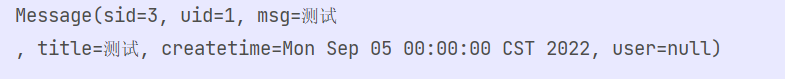
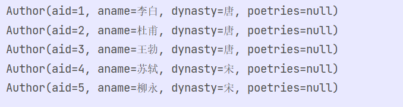
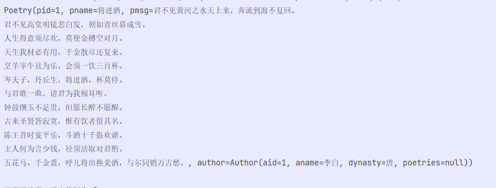
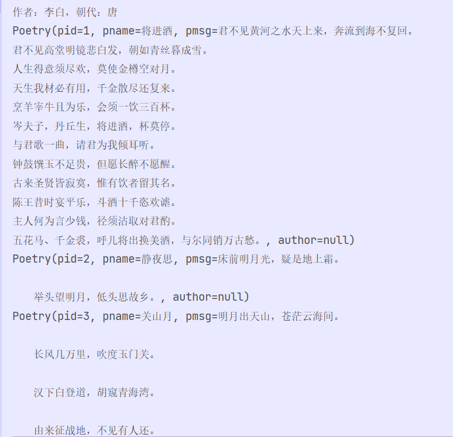
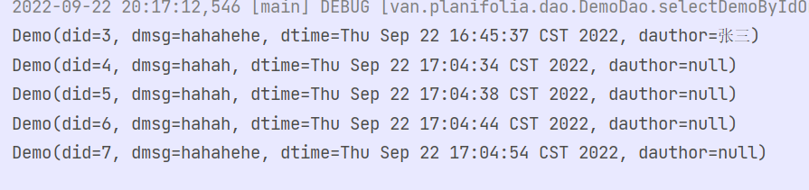
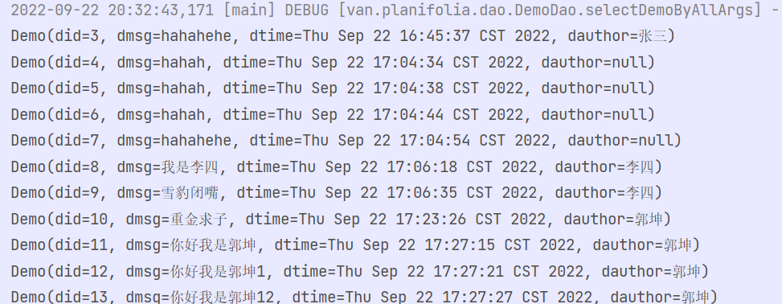
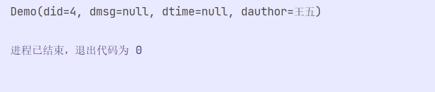
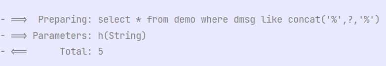

#### MyBatis

##### 简介

*你是否已经厌倦了每次在执行sql语句之前都要去建立连接？你是否还在苦恼于使用自己封装的那繁杂且漏洞百出的JDBC工具类？你是否还要每次在执行完毕查询之后去便利结果集才能拿到想要的对象数据。所以快来使用MyBatis框架吧！它使用简便的配置文件代替了传统的Java代码建立数据库的连接并且使用了池化技术。它完全的接管了jdbc让你不要再去创建statment对象，ResultSet对象只要在mapper文件中编写对应的sql语句就行了。它能够自动的将结果集映射到相应的实体类上，而你要做的仅仅只是为他指定对应的实体类即可。所以这么方便的框架不火速来了解一波？*

##### 第一回 “感受Mybatis的强大，安装MyBatis并且尝试一次Sql查询”

- 首先我们在简介就已经知道了MyBatis是一个持久层的框架，是用来解决繁杂的JDBC代码的所以我们在安装MyBatis之前一定要引入MySql的连接依赖，而且对于Maven项目我们只要添加两块代码就行了。

  ~~~xml
  <!--        mybatis的依赖-->
          <dependency>
              <groupId>org.mybatis</groupId>
              <artifactId>mybatis</artifactId>
              <version>3.5.9</version>
          </dependency>
  <!--        数据库的依赖-->
          <dependency>
              <groupId>mysql</groupId>
              <artifactId>mysql-connector-java</artifactId>
              <version>8.0.19</version>
          </dependency>
  
  ~~~

- 然后我们之前也说了，MyBatis通过一个简单的配置文件来实现对数据库的连接，这点我们完全可以去MyBatis的中文网去查看，上面有详细的教程以及各种需要的配置文件https://mybatis.net.cn/

  - 首先就是最重要的MyBatis.xml核心配置文件，我们在这里可以设置MyBatis的各种设置，开启缓存等等，当然映射文件也是在这里指定的。具体的格式如下。

    ~~~xml
    ?xml version="1.0" encoding="UTF-8" ?>
    <!DOCTYPE configuration
            PUBLIC "-//mybatis.org//DTD Config 3.0//EN"
            "http://mybatis.org/dtd/mybatis-3-config.dtd">
    <configuration>
        // 在这可以引入外部的properties文件然后在下面使用${key.value}来取出再配置文件中保存的值
        <properties resource="db.properties"/>
        // 在这可以为实体类起别名，当然也可以使用包扫描自动扫描包下的实体类
        <typeAliases>
            <package name="van.planifolia.pojo"/>
        </typeAliases>
        <environments default="development">
            <environment id="development">
                <transactionManager type="JDBC"/>
                // 这一块则是数据库连接部分，分别是指定数据库的驱动程序，url连接以及账号与密码。就和传统的JDBC建立连接写的东西一样
                <dataSource type="POOLED">
                    <property name="driver" value="${jdbc.Driver}"/>
                    <property name="url" value="${jdbc.url}"/>
                    <property name="username" value="${jdbc.username}"/>
                    <property name="password" value="${jdbc.password}"/>
                </dataSource>
            </environment>
        </environments>
        //这一块则是指定项目中的Mapper文件，这些文件中是进行sql语句的编写以及实现与实体类的关联的
        <mappers>
            <mapper resource="mapper/DemoMapper.xml"/>
        </mappers>
    </configuration>
    ~~~

    我们在上面使用了配置文件来外部引入数据库中的一些值，使用配置文件的好处则是可以在不改动项目源码的前提下修改项目的一些核心配置，通常是使用.properties形式的文件，里面保存的信息均为key value的形式。

    ~~~properties
    jdbc.username=root
    jdbc.password=010713
    jdbc.url=jdbc:mysql://localhost:3306/mydb04?serverTimezone=GMT%2B8
    jdbc.Driver=com.mysql.cj.jdbc.Driver
    ~~~

    

  - 然后我们要实现最简单的条件查询，此时我们就要创建一个上面所说的Mapper文件用于编写sql语句以及结果集与实体类间的关联。(读者这里可以根据自己的表去创建一个mapper文件并且辨析自己的sql语句我在这只做一个示范)

    ~~~xml
    <?xml version="1.0" encoding="UTF-8" ?>
    <!DOCTYPE mapper
            PUBLIC "-//mybatis.org//DTD Mapper 3.0//EN"
            "http://mybatis.org/dtd/mybatis-3-mapper.dtd">
    // namespace则代表这个mapper文件的唯一标识符
    <mapper namespace="van.planifolia.dao.MessageDao">
    <!--    一对一对应关系，根据sid查到message以及对应的用户信息-->
        //id代表了这个sql语句的id，resultType则代表了这个sql语句的返回值
        <select id="selectMessageBySid" resultType="Message">
            select * from message where sid=#{sid}
        </select>
    </mapper>
    ~~~

  - 那么我们写好了mapper文件我们赶紧把它用上吧。好的先创建一个测试类我们就用MyBatis最原始的执行sql方式来实现一次查询。我们在后面就很少使用这种形式去实现sql查询了。

    ~~~java
    @Test
        public void test() throws IOException {
            //首先我们要使用MyBatis自带的Resources读取到类路径中的mybatis.xml配置文件
            // 奥突然忘记说了，在mybatis中我们会吧mapper文件以及核心配置文件都放在Resource文件夹中，这样就能很方便的读取到信息。
            Reader resourceAsReader = Resources.getResourceAsReader("mybatis.xml");
            // SqlSession是MyBatis中CRUD操作的核心内容，那么我们想要获取SqlSession就需要一个SqlSessionFactory 这个对象它使用了工厂模式
            // 来设计我们想要获取SqlSessionFactory就必须要创建一个SqlSessionFactoryBuilder 然后再去调用它的build(读取到的配置文件资源)
            // 去构建出SqlSessionFactory，然后在调用SqlSessionFactory对象中的openSession方法去拿到SqlSession。rua 超麻烦的，但是到后面
            // 你就知道了这里的麻烦是值得的，sqlSession封装了所以的jdbc操作我们只要传入我们在里面写的SQL语句的坐标 (Mapper文件的命名空间+sqlid)
            // 以及对应的参数就能实现对数据库的操作，这多爽啊。
            SqlSessionFactory build = new SqlSessionFactoryBuilder().build(resourceAsReader);
            SqlSession sqlSession = build.openSession();
            Message msg = sqlSession.selectOne("van.planifolia.dao.MessageDao.selectMessageBySid", 3);
            System.out.println(msg);
        }
    ~~~

    

    

##### 第二回 “完全接管！使用Mapper整合的形式替代传统的Dao”

- 我们上一回已经知道如何使用MyBatis代替传统的JDBC了。那么既然MyBatis是一个持久层的框架那么我们就来看一下如何使用MyBatis完美的接管我们项目中的dao层。

  - 其实我在上一节已经体现到了，明明mapper文件中的命名空间是可以随便填写的但是我却使用了一个类文件的全限定名，那么这就是“Mapper整合“的第一前提。

    那么实际在开发的过程中我们用MyBatis通常是使用Mapper整合的，这种编码风格要求我们在dao层编写好相应的接口并且在接口中添加所以需要的接口方法包括需要的传入参数与返回值。然后我们在Resource文件夹中添加Mapper，然后我们再指定命名空间与sql id的时候就不能随便起了要与dao中接口方法的名保持一致。然后返回的结果要与接口的返回类型或者返回类型的泛型保持一致。当然也可以使用ResultMap的id，这点我们放在下节再讲。总结来说有如下几点。

    1.mapper文件的命名空间要与dao接口的全限定名保持一致

    2.mapper文件的sql语句的id要与dao接口中的方法名保持一致

    3.sql语句的返回类型要与接口中的返回类型或者返回类型的泛型保持一致

  - 下面我就拿一个简单的查询多条作为实例演示一下

    ~~~xml
    //Mapper整合的xml文件
    <?xml version="1.0" encoding="UTF-8" ?>
    <!DOCTYPE mapper
            PUBLIC "-//mybatis.org//DTD Mapper 3.0//EN"
            "http://mybatis.org/dtd/mybatis-3-mapper.dtd">
    // 命名空间指定为对应接口的全限定名
    <mapper namespace="van.planifolia.dao.AuthorDao">
        // sql标签的id要与接口中的方法名保持一致，返回结果就为接口方法的返回类型
        <select id="selectAllAuthor" resultType="van.planifolia.pojo.Author">
            select * from author
        </select>
    </mapper>
    ~~~

    ~~~java
    // dao的接口
    public interface AuthorDao {
       /**
         * 查询全部作者的接口方法
         * @return 作者的List
         */
        List<Author> selectAllAuthor();
    }
    ~~~

    ~~~java
    // 创建一个测试类，来调用这里的dao接口方法
    public class TestDemoSp {
        /**
         * 准备sqlsession
         */
        static SqlSession sqlSession = null;
        static {
            try {
                Reader resourceAsReader = Resources.getResourceAsReader("mybatis.xml");
                sqlSession=new SqlSessionFactoryBuilder().build(resourceAsReader).openSession();
            } catch (IOException e) {
                e.printStackTrace();
            }
        }
        public static void main(String[] args) {
            getAllAuthor();
        }
        static void getAllAuthor(){
            // 我们使用dao整合之后就可以使用sqlSession中的getMapper方法并且为他传入接口类的class对象，mybatis就会为我们生成接口的实现类，然后我们就能流畅的使用这个对象如同使用这个接口的实现类一样去调用接口中的方法
            AuthorDao mapper = sqlSession.getMapper(AuthorDao.class);
            mapper.selectAllAuthor().forEach(System.out::println);
        }
    ~~~

    

- 显然我们使用这个Mapper整合之后虽然要遵循的规则非常的多，但是我们却省了许多编写实现类的功夫，大家可以回想一下之前写dao接口与实现类的时候打代码量。所以在后面我们学习其他框架的时候常常会提起这个概念 "约束大于配置" 我们在使用别人的框架并且遵循他们指定的规则就能节省很多很多的代码量。

##### 第三回 ”Mybatis的高级应用，实现一对一，一对多连表查询“

- 终于来到了重量级的地方，我们在传统的sql中最难的无外乎连表查询了特别是一对多的连表查询。在Mybatis

  中使用一对一的连表查询则需要在实体类中的其中一方引入另外一方的实体类对象，然后在Mapper文件中编写连表的sql语句。

  但是我们知道MyBatis中结果集对实体类中的映射是要求实体类中的属性要与查询到的列明保持一致。所以在不一致的时候我们有两个解决方案 一个是在sql语句中为查询出来的列添加别名，让他强制性的和实体类中的属性保持一致，还有一种通用的方法结果集映射的形式让查询结果与实体类中的属性一致。

  那么我们在使用连表查询的时候必然会导致查询出来的结果与实体类属性不一致并且无法使用别名来解决那么我们就只能使用结果集了，所以对于一对一 一对多的连表查询我们必须要使用resultMap！我们在下面就使用一个一对一一个，一个一对多的案例来展示用法。

  - 首先是一对一的连表查询，比如查询诗歌的时候查询出这个诗歌的作者，并且一个诗歌只能有一个作者。

    ~~~xml
    //诗歌的mapper文件按
    <?xml version="1.0" encoding="UTF-8" ?>
    <!DOCTYPE mapper
            PUBLIC "-//mybatis.org//DTD Mapper 3.0//EN"
            "http://mybatis.org/dtd/mybatis-3-mapper.dtd">
    <mapper namespace="van.planifolia.dao.PoetryDao">
    	//按pid来查询诗歌以及作者信息
        <select id="selectpoetryByPid" resultMap="PoetryWithAuthor" >
            select * from poetry,author where author.aid=poetry.aid and poetry.pid=#{pid}
        </select>
        // 结果映射，我们在使用一对一连表的时候必须要让sql查询出来的结果映射到诗歌实体类属性中的author对象中。
        <!--
    首先最外层是Poetry对象的结果集，其中除了主键是必须要用id标签写的其他的属性要是不一致则使用'<result property="msg"(实体类中的属性名) column="message"(查询到的列名)>'标签来实现映射
    一致的话则可以使用autoMapping="true"属性实现自动映射-->
        <resultMap id="PoetryWithAuthor" type="Poetry" autoMapping="true">
            <id property="pid" column="pid"/>
            <association property="author" javaType="Author" autoMapping="true">
                <id property="aid" column="aid"/>
            </association>
        </resultMap>
    </mapper>
    ~~~

    ~~~java
    // 我们再上面也讲过了Dao的整合所以我们在这就直接使用dao整合的方式来执行测试了。
    public class TestDemoSSp {
        @Test
        public void test() throws IOException {
            // 加载核心配置文件并且获取SqlSession
            Reader resourceAsReader = Resources.getResourceAsReader("mybatis.xml");
            SqlSessionFactory build = new SqlSessionFactoryBuilder().build(resourceAsReader);
            SqlSession sqlSession = build.openSession();
            //获取到PoetryDao的代理对象并且调用里面的查询方法
       System.out.println(sqlSession.getMapper(PoetryDao.class).selectpoetryByPid(1));
        }
    }
    ~~~
    
    
    
    显然可以看到，我们不仅查询到诗歌信息，而且也查到了这首诗中的作者信息。
    
  - 我们从上面这个例子也可以看到可以使用在一个类中引入另外一个对象，然后在Mapper文件中设置对应的结果集映射，就能实现一对一的连表查询。我们对于一对一的查询可以使用这种方式，那么对于一对多是否可以在 ‘一’ 的一方的类中引入 ‘多’ 的一方的List来实现一对多的连表查询呢？说干就干，首先我们要在dao接口中编写好对应的查询方法，那么我们就来拿按照作者查询诗歌的案例来进行演示。
  
    ~~~java
    //就像我们之前说的在实体类中添加另外一方的List对象
    @Data
    public class Author {
        private int aid;
        private String aname;
        private String dynasty;
        private List<Poetry> poetries;
    }
    ~~~
  
    
  
    ~~~xml
    <!--首先，我们就来编写一下连表查询的sql语句,案例为按作者查询诗歌信息-->
    <?xml version="1.0" encoding="UTF-8" ?>
    <!DOCTYPE mapper
            PUBLIC "-//mybatis.org//DTD Mapper 3.0//EN"
            "http://mybatis.org/dtd/mybatis-3-mapper.dtd">
    <mapper namespace="van.planifolia.dao.AuthorDao">
        <!--显然这条sql语句平平无奇就是一个sql语句，实现一个简单的连表查询-->
            <select id="selectAuthorWithPoetry" resultMap="AuthorPoetryResult">
            select * from author,poetry where author.aid=poetry.aid and author.aid=#{aid}
        </select>
        <!--但是这个resultMap就有点意思了，看外层的我们就简单的配置了一波id然后剩下的就使用了自动映射，但是我们看到一对多的时候内部对象的映射换了一个标签换成了collection，而collection的使用方式基本上是和association一样的只不过原本的JavaType换成了oftype并且ofType中写的是List的泛型对象，然后只要对列与实体类中一一实现映射就行了-->
          <resultMap id="AuthorPoetryResult" type="Author" autoMapping="true">
            <id column="aid" property="aid"/>
            <collection property="poetries" ofType="Poetry" autoMapping="true">
                <id column="pid" property="pid"/>
            </collection>
        </resultMap>
    </mapper>
    ~~~
  
    ~~~java
    //对应的dao接口
    public interface AuthorDao {
        /**
         * 查询全部作者的接口方法
         * @return 作者的List
         */
        List<Author> selectAllAuthor();
    }
    ~~~
  
    ~~~java
    //对应的测试方法
    public class TestDemoSSp {
        @Test
        public void test() throws IOException {
            Reader resourceAsReader = Resources.getResourceAsReader("mybatis.xml");
            SqlSessionFactory build = new SqlSessionFactoryBuilder().build(resourceAsReader);
            SqlSession sqlSession = build.openSession();
            Author author = sqlSession.getMapper(AuthorDao.class).selectAuthorWithPoetry(1);
            System.out.println("作者：" + author.getAname() + "，朝代：" + author.getDynasty());
            author.getPoetries().forEach(System.out::println);
        }
    }
    ~~~
  
    
  
- 其实到这里传统的MyBatis操作就已经结束了，我们使用现在的知识完全可以适用绝大部分的工作需求了，那么剩下的就属于一些拓展内容，Mybatis的动态sql与分页插件。

##### 第四回 ”MyBatis中的动态sql与分页插件“

- 显然我们在进行sql查询的时候难免会遇到这些操作，比如如果按照标题查不到我们就按照作者进行查询，比如我们传入多少数据就更新多少而不会影响到其他的数据列。等等这样我们就能使用动态sql很容易的去实现这些操作。

  1. IF最基础的动态sql，所谓if就是实现判断的，就像我们要根据传递过来的内容来动态的实现查询条件。就拿 Demo类中的 “先按照id进行查询，没有id就按照msg进行模糊查询”。当然读者完全可以根据自己的数据库表自己设计需求编写sql语句，我在这只做示例。

     ~~~java
     //首先是Demo实体类表中的信息
     @Data
     public class Demo {
         private Integer did;
         private String dmsg;
         private Date dtime;
         private String dauthor;
     }
     ~~~

     ~~~java
     // Demo的Dao接口，我们在这个例子中会用到selectDemoByIdOrMsg
     public interface DemoDao {
     
         int insertDemo(Demo demo);
     
         int updateDemo(Demo demo);
     
         int deleteDemo(@Param("dids") int[] dids);
     
         List<Demo> selectDemoByIdOrMsg(@Param("did") Integer did,@Param("dmsg") String dmsg);
     
         List<Demo> selectDemoByAllArgs(@Param("dmsg") String dmsg,@Param("dauthor") String dauthor);
         
     }
     
     ~~~

     ~~~xml
     // Demo的Mapper文件
     <!--    动态sql里面的 if
     		显然这只是一个简单的查询语句，然后判断if中的内容是否为空或者空窗然后再将它们拼接上去，所以if的作用不就很明显了吗，当if表达式成立的时候会讲if标签内的内容动态的拼接上去，但是同样你有没有注意到一个点，就是我们在第一句sql后面添加了一个where 1=1 这是因为我们在拼接sql的时候无法确定哪一个sql是第一个所以就必须把where写在外面然后，让需要拼接的sql都用and连接，显然这是一种非常不优雅的解决方案。-->
         <select id="selectDemoByIdOrMsg" resultType="van.planifolia.pojo.Demo">
             select * from demo where 1=1
             
                 <if test="did!=null and did !=0">
                     and did=#{did}
                 </if>
                 <if test="dmsg!=null and dmsg!=''">
                     and dmsg like concat('%',#{dmsg},'%')
                 </if>
             </where>
         </select>
     ~~~

     ~~~java
     //测试类
        @Test
         public void selectDemoByIdOrMsg(){
             //查询did为空但是正文中含h的消息记录
             getDao().selectDemoByIdOrMsg(null,"h").forEach(System.out::println);
         }
     ~~~

     

  2. Where if的好搭档，我们在if中也说了在使用if进行多条件选择判断的时候必须要在第一行sql后面添加上where1=1,非常的不优雅，那么我们今天就使用标签<where>来实现自动的拼接上where语句。我们在上面已经试过了if这次就换个口味 使用chonse when otherwish。什么？你问我这仨是啥玩意，好问题，我们通常知道如果使用多重if else 推荐使用switch case语法糖来替代传统的if eles 那么这个chonese虽然和这玩意很像但是不完全一样。反而倒是很像if  elseif 这种语法格式 在when中自上而下的选择一个成立的去执行其标签体中的内容。若没有成立的则执行otherwish。

     ~~~xml
     <!--    根据Demo表中的条件来实现查询，动态sql中的 choose when otherwise 实现某一个条件进行查询 然后where标签嵌套在最外面能够自动的为第一个sql前面添加上一个where语句-->
         <select id="selectDemoByAllArgs" resultType="van.planifolia.pojo.Demo">
             select * from demo
             <where>
                 <choose>
                     <when test="dauthor!=null and dauthor!=''">
                         dauthor=#{dauthor}
                     </when>
                     <when test="dmsg!=null and dmsg=''">
                         dmsg like concat('%',#{dmsg},'%')
                     </when>
                     <otherwise>
     
                     </otherwise>
                 </choose>
             </where>
         </select>
     
     ~~~

     ~~~java
     // 演示不传任何参数去执行最后的无条件查询   
     @Test
         public void testQueary(){
             List<Demo> demos = getDao().selectDemoByAllArgs("", "");
             PageInfo<Demo> pageInfo = new PageInfo<>(demos);
             demos.forEach(System.out::println);
         }
     ~~~

     

  3. set动态sql 当然if也常常和会和更新的sql语句连用，比如我们在没传入参数的时候则保留原本的数据，传入数据之后才去更新原本的数据，显然我们这样就要用到if判断传入的是否为null或者 “ ”，当然这也会产生一种情况，就是最后一行的，无法去除，所以我们使用set标签，这个标签不仅能够实现最后一个，的去除也能动态的添加上set

     ~~~xml
     <!--    动态sql的set，就像上面所说当我们传入的值为null。‘’的时候不去执行更新操作，-->
         <update id="updateDemo" useGeneratedKeys="true" keyProperty="did">
             update demo
             <set>
                 <if test="dmsg!=null and dmsg!=''">
                     demo.dmsg=#{dmsg},
                 </if>
             </set>
             <set>
                 <if test="dtime!=null and dtime!=''">
                     demo.dtime=#{dtime},
                 </if>
             </set>
             <set>
                 <if test="dauthor!=null and dauthor!=''">
                     demo.dauthor=#{dauthor},
                 </if>
             </set>
             where did=#{did}
         </update>
     
     ~~~

     ~~~java
     // 在这就演示只更新4号id的作者信息    
     @Test
         public void testModify(){
             Demo demo = new Demo();
             demo.setDid(4);
             demo.setDauthor("王五");
             int i = getDao().updateDemo(demo);
             System.out.println(demo);
         }
     ~~~

     

  4. foreach，在sql中我们可能还会遇到where in (arg1，arg2)的这种情况，所以我们的查询条件为一个数组或者集合的时候就需要使用到foreach来一一的便利出传来的数据然后在给他拼接成(arg1，arg2, ---)的形式

     ~~~xml
     <!--    动态sql的 foreach 根据下面的foreach标签就不难猜出它的用法了 首先是collection属性这个属性里面填写的值通常是传递过来的集合或者数组，item则为每次便利出来的数据。是不是很像foreach循环，然后open则是最开始拼接的字符串（ close 则是结束时拼接的字符串-->
     <!--其中有一点需要注意到的是，我们在dao层写的接口是一定要给数组或者列表接口添加注解标注它的属性名的否则它会找不到我们传入的参数名-->
         <delete id="deleteDemo">
             delete from demo
             where did in
             <foreach collection="dids" item="did" separator="," open="(" close=")">
                 #{did}
             </foreach>
         </delete>
     ~~~

     ~~~java
     // 批量删除掉数据库中的 3 5 6 数据    
     @Test
         public void testDelete(){
             int[] dids={3,5,6};
             getDao().deleteDemo(dids);
      
         }
     ~~~

  5. trem放在最后再说确实是因为它比较不重要，因为它属于是那种where的增强版，但是我们在实际中最常用的反而是where而不是这个增强版的标签，这个标签可以根据我们自定义的修改第一个拼接上去的sql语句的前缀与后缀，所以理论上这玩意可以完美的替代where与set 但是，有更简单的where与set为啥不用？

     ~~~xml
     <!--    trim一共有四个属性 prefixOverrides是要被替代的sql片段，prefix是替代上去的sql片段当然这个是前缀还要一个后缀 stuff，是用来替换后面的sql片段的-->
         <select id="selectDemoByIdOrMsg" resultType="van.planifolia.pojo.Demo">
             select * from demo
             <trim prefix="where" prefixOverrides="and">
                 <if test="did!=null and did !=0">
                     and did=#{did}
                 </if>
                 <if test="dmsg!=null and dmsg!=''">
                     and dmsg like concat('%',#{dmsg},'%')
                 </if>
             </trim>
     ~~~

     ~~~java
         @Test
         public void selectDemoByIdOrMsg(){
             //查询did为空但是正文中含h的消息记录
             getDao().selectDemoByIdOrMsg(null,"h").forEach(System.out::println);
         }
     ~~~

     

     拼接后的sql语句

- 至此MyBatis中的动态sql基本上都演示完毕了读者大可根据实际需求然后结合上面的案例来进行实际应用。下面我们就来简单的讲解一下Mybatis中的分页插件，其实分页插件的使用非常非常的简单，只要引入对应的jar包依赖，然后再修改mybatis中的核心配置文件然后再使用两行代码就能很容易的实现分页查询。

  ~~~xml
  <!--首先就是引入对应的依赖-->
   <!--分页的依赖-->
          <dependency>
              <groupId>com.github.pagehelper</groupId>
              <artifactId>pagehelper</artifactId>
              <version>5.3.0</version>
          </dependency>
  ~~~

  ~~~xml
  <!--然后我们要去在核心配置文件中添加几行插件引入代码，不用记只要用去引用就行,并且这个插件要放在environments的上面-->
  
   <plugins>
          <!-- com.github.pagehelper为PageHelper类所在包名 -->
          <plugin interceptor="com.github.pagehelper.PageInterceptor">
          </plugin>
      </plugins>
  ~~~

  ~~~java
      @Test
      public void testQueary(){
          // 调用PageHelper中的startpage方法来指定页面的大小与查询的是第几页
          PageHelper.startPage(1, 2);
          // 查询操作必须要在指定完毕页码大小与下标之后去执行
          List<Demo> demos = getDao().selectDemoByAllArgs("", "");
          System.out.println(demos);
          // 当然我们可以去讲查询到的信息封装成PageInfo 然后我们可以根据PageInfo中的一组api取到分页出来的信息
          PageInfo<Demo> pageInfo = new PageInfo<>(demos);
          System.out.println(pageInfo);
      }
  ~~~

  对于分页我们大可去翻阅源码因为是国人写的注释很详细并且为中文