#### Spring

##### 简介

*神说要有春天，于是spring出现了，它如其名一般的扫清了J2EE繁琐开发的寒冬，将程序员们从繁琐的重复的，不合乎编程逻辑的编码解救出来，开始了松耦合的，面向接口的，统一的编码纪元。他是JavaEE编程中名副其实的春天，‘ 如春风涤尘，云开雾散。 ’*

#### 第一回 ”Spring的搭建以及如何使用Spring管理Bean“

- 我们在这之前已经学习了SpringMVC，Mybatis。如果说这两者分别是Controller层和持久Model层的框架的话那么Spring就是糅合这两框架最好的框架，*Spring的开发者说过 ”市面上的框架已经够多了，我们希望打造一款融合框架的框架，让程序员们更好的使用 ‘轮子’ 而不是去学习新的轮子 “*。所以Spring是一款胶水框架，他引入的控制反转IOC与依赖注入DI这两种新的概念，大大的方便了对象的管理与使用。

- 同样，我们对于一个框架的学习还是要从如何安装开始。经典三件套 导入依赖，配置核心配置文件，测试类，那么我们就按照这经典的三个步骤进行安装测试。

  1. 导入依赖，其实我们在使用SpringMVC的时候就已经帮我们导入了Spring的依赖此时我们只要导入Spring的依赖就ok了。

     ~~~xml
     <!--springmvc-->
             <dependency>
                 <groupId>org.springframework</groupId>
                 <artifactId>spring-webmvc</artifactId>
                 <version>5.2.15.RELEASE</version>
             </dependency>
     ~~~

     此时我们可以在依赖上看见他已经帮我们导入所有的Spring依赖jar包了

     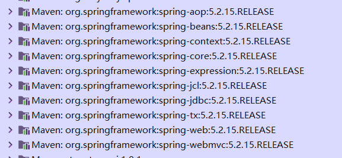

  2. 编写核心配置文件，和SpringMVC的核心配置文件相同的是，他俩的创建方式基本是一样的但是不同的是Spring的配置文件不要添加过多的内容，只要配置我们需要让Spring管理的类就ok了。

     ~~~xml
     <?xml version="1.0" encoding="UTF-8"?>
     <beans xmlns="http://www.springframework.org/schema/beans"
            xmlns:xsi="http://www.w3.org/2001/XMLSchema-instance"
            xmlns:context="http://www.springframework.org/schema/context"
            xsi:schemaLocation="http://www.springframework.org/schema/beans http://www.springframework.org/schema/beans/spring-beans.xsd http://www.springframework.org/schema/context https://www.springframework.org/schema/context/spring-context.xsd">
     	<!--比如这个就将food这个类交给Spring容器来处理-->
         <bean id="food" class="van.planifolia.bean.Food"/>
         
     </beans>
     ~~~

  3. 编写测试类使用在Spring中管理的类,就如同我们在上面配置的一样，在外面没有将Spring整合到Web之前我们获取Spring中注册的bean。都是先获取到Spring容器，然后再根据Spring容器的getBean方法获取到对象实例。
  
     ~~~java
      ApplicationContext ac = new ClassPathXmlApplicationContext("spring.xml");
             System.out.println(ac.getBean("food"));
     ~~~
  
     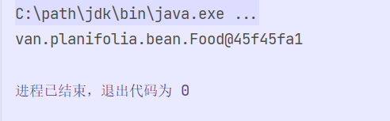
  
     我们可以看我们没有new对象只是通过ApplicationContext就获取到了这个对象的实例。说明Spring容器已经帮我们把Food对象创建好了并且放到了Spring容器中我们想要使用就直接去取就行了。
  
     但是在spring中注册的对象默认为 “单例的” 也就是在不进行任何设置的情况下通过applicationContext去获取对象无论获取多少次拿到的都是同一个对象。所以这就涉及到了Spring中Bean的作用域了。
  
     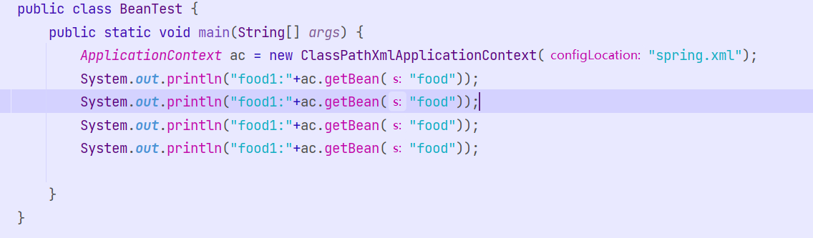
  
     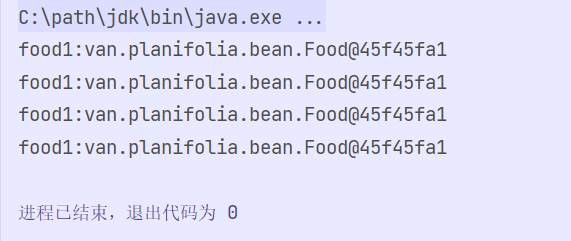
  
- Spring中Bean的作用域，显然我们在上面的测试中可以发现Bean的默认作用域为单例Single，spring只会去创建一个对象实例，然后每次收到获取对象的请求都会返回给他同一个对象实例，也就出现了我们上面的那张图。

  在spring中bean的作用域有如下几类

   1. single (单例的)也是spring中默认的作用域，single修饰的bean只会创建一次对象后面无论获取多少次都会返回这个对象实例。

   2.  prototype (原型的) 这个作用域就像我们正常new出来的bean，我们每次去获取一次beanSpring都会帮我们创建一个对象。

   3. request(一次请求) 这个作用域的bean，spring会在我们每一次请求都会创建一个新的对象，但是在同一个request下都会返回同个对象。

   4. session(一次会话) 这个作用域的bean，spring会为我们的每一次会话创建一个Bean也即是在每一次会话获取的Bean都是同一个实例。

      比如我们在这将bean的作用域修改成了prototype 原型的那么我们每次获取对象都会返回一个新的对象

      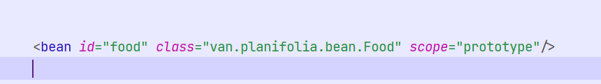

      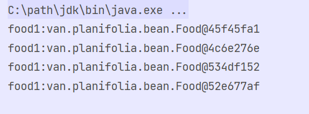

- 所以总着来看，我们使用Spring确实接管了我们传统的new对象的方式，将创建对象的权力交给了Spring容器让他来帮我们创建对象，我们则只是通过application 中的getBean方法就可以获得到这个Bean对象。虽然我们在传统的方法中并没有感受到他的方便之处，倒是感觉到配置Spring的配置文件以及创建ApplicationContext的方法非常的麻烦，所以Spring为我们提供了一套解决方案，使用包扫描加注解的形式实现自动扫描与与bean的依赖注入。

  1. spring中开启包扫描，我们可以通过在spring配置文件中打开包扫描的形式实现Bean的自动注册。

     > 在spring中开启包扫描是十分简单的，只需要添加一行代码并且指明要扫描的包的位置即可
     >
     > ~~~java
     > <?xml version="1.0" encoding="UTF-8"?>
     > <beans xmlns="http://www.springframework.org/schema/beans"
     >        xmlns:xsi="http://www.w3.org/2001/XMLSchema-instance"
     >        xmlns:context="http://www.springframework.org/schema/context"
     >        xsi:schemaLocation="http://www.springframework.org/schema/beans http://www.springframework.org/schema/beans/spring-beans.xsd http://www.springframework.org/schema/context https://www.springframework.org/schema/context/spring-context.xsd">
     > 	<!--开启注解-->
     >     <context:annotation-config/>
     >     <!--开启包扫描并且扫描van.planifolia.bean这个包-->    
     >     <context:component-scan base-package="van.planifolia.bean" />
     > </beans>
     > ~~~
     >
     > 我们在上面开启之后，van.planifolia.bean包下的所有被注解标注的类都会被注册到spring容器中，这个注册Bean的注解名为@Component()这个注解就是负责标记一个类为Spring中的Bean，将他注册到Spring容器中。当然Spring官方为了实现 见名知意，以及划分各个层创造了一系列的注解，分别对应web中的各个层 比如 @Controller，@Service，@Repository，分别标注了controller层，service层，dao层。但是他们实际的用处确实是一样的，我们不妨点入源码可以发现他们底层代码都是@Component。我们下面就来展示一下Spring中使用注解将对象注册到Spring容器中。
     >
     > ~~~java
     > @Component("food")
     > public class Food {
     >     Food(){
     >         System.out.println("food创建了");
     >     }
     > }
     > 
     > public class BeanTest {
     >     public static void main(String[] args) {
     >         ApplicationContext ac = new ClassPathXmlApplicationContext("spring.xml");
     >         Object food = ac.getBean("food");
     >         System.out.println(food);
     >     }
     > }
     > ~~~
     >
     > 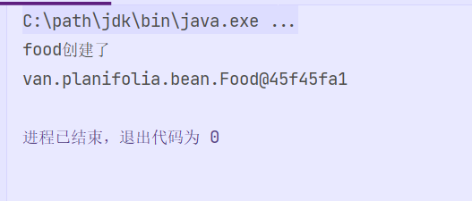

  2. spring中的依赖注入，DI也是Spring中非常重要的一个概念，Spring容器他能在帮我们创建对象之后对他内部的一些成员变量进行注入，通常的注入方式是有两种，一个是构造器注入，此时就需要我们创建一个全参的构造方法。还有一个是Set方法注入，这种方式则需要我们要创建对应属性的Set方法，我们下面就来演示一下这两种注入方式的具体写法。

     > ​	首先是构造器注入，我们这次拿Teacher类，并且注入Food对象属性的案例来做演示
     >
     > Teacher类，我们使用配置的的形式将他注册到Spring中，并且将Spring中food的实例注入到Teacher中的Food属性中。
     >
     > ~~~java
     > @Component("teacher")
     > public class Teacher {
     >     //需要被注入的属性food
     >     private Food food;
     > 
     >     /**
     >      * set注入需要的方法
     >      * @param food food对象
     >      */
     >     public void setFood(Food food) {
     >         this.food = food;
     >     }
     > 
     >     /**
     >      * 构造器注入的构造方法
     >      * @param food 被注入的food对象
     >      */
     >     public Teacher(Food food) {
     >         this.food = food;
     >     }
     > }
     > ~~~
     >
     > 被注入的类Food,我们只要用注解将他注册到Spring容器中
     >
     > ~~~Java
     > @Component("food")
     > public class Food {
     >     Food(){
     >         System.out.println("food创建了");
     >     }
     > }
     > ~~~
     >
     > 下面就是在Spring配置文件中将为Teacher类使用构造注入的方式将Food注入到Teacher中
     >
     > ~~~xml
     >     <bean id="teacher" class="van.planifolia.bean.Teacher">
     >         <constructor-arg index="0" ref="food"/>
     >     </bean>
     > ~~~

     > 然后就是Set注入，就是我们不要在去写构造方法只要写对应的Set方法就ok了，那么我们还是拿Teacher类的例子来测试。
     >
     > ~~~java
     > @Component("teacher")
     > public class Teacher {
     >     //需要被注入的属性food
     >     private Food food;
     > 
     >     /**
     >      * set注入需要的方法
     >      * @param food food对象
     >      */
     >     public void setFood(Food food) {
     >         this.food = food;
     >     }
     > 
     >     /**
     >      * 构造器注入的构造方法
     >      * @param food 被注入的food对象
     >      */
     >     public Teacher(Food food) {
     >         this.food = food;
     >     }
     > }
     > ~~~
     >
     > 被注入的类Food,我们只要用注解将他注册到Spring容器中
     >
     > ~~~Java
     > @Component("food")
     > public class Food {
     >     Food(){
     >         System.out.println("food创建了");
     >     }
     > }
     > ~~~
     >
     > 下面就是在Spring配置文件中将为Teacher类使用构造注入的方式将Food注入到Teacher中
     >
     > ~~~xml
     >   <bean id="teacher" class="van.planifolia.bean.Teacher">
     >         <property name="food" ref="food"/>
     >     </bean>
     > ~~~
     >
     > 当然在Spring中进行依赖注入不仅仅是只能进行对象注入，也可以注入基本数据类型与字符串，但是他们要使用value属性，也就是说在spring中对象类型的注入要用ref，其他则使用value。那么如果对数组类型 List类型 Map类型 Set类型这种我们就要使用特殊的标签，如下。
     >
     > ~~~xml
     > // map类型的注入方式
     > <property name="map">
     >             <map key-type="java.lang.String" value-type="java.lang.Object">
     >                 <entry key="abc" value="123"/>
     >                 <entry key="food" value-ref="food"/>
     >             </map>
     >         </property>
     > // list的注入方式
     >         <property name="maps">
     >             <list>
     >                 <map>
     >                     <entry key="1223" value="abc"/>
     >                 </map>
     >                 <map>
     >                     <entry key="1223" value="abc"/>
     >                 </map>
     >             </list>
     >         </property>
     > //字符串的注入方式
     >         <property name="nub" value="123"/>
     > //列表的注入方式
     >         <property name="nubs">
     >             <array>
     >                 <value>1</value>
     >                 <value>2</value>
     >                 <value>3</value>
     >             </array>
     >         </property>
     > ~~~
     >
     > 

#### 第二回 ”将Spring，SpringMVC，Mybatis整合起来，SSM框架的搭建“

- 我们在之间都说过Spring是一个胶水框架他不仅与引入了AOP，IOC的概念，并且能够很好的融合其他的框架供我们使用。今天我们就来看一下如何使用Spring结合另外俩框架，搭建一个基于SSM的Web项目。

- 首先搭建框架的第一步导入相应的依赖，除掉我们原本就要用到的依赖外我们还要安装Spring-mybatis的依赖。

  > 首先是Myabtis的依赖
  >
  > ~~~xml
  > <!--        mybatis-->
  >         <dependency>
  >             <groupId>org.mybatis</groupId>
  >             <artifactId>mybatis</artifactId>
  >             <version>3.5.9</version>
  >         </dependency>
  > <!--        jdbcConnection-->
  >         <dependency>
  >             <groupId>mysql</groupId>
  >             <artifactId>mysql-connector-java</artifactId>
  >             <version>8.0.19</version>
  >         </dependency>
  > <!--        lombok-->
  >         <dependency>
  >             <groupId>org.projectlombok</groupId>
  >             <artifactId>lombok</artifactId>
  >             <version>1.18.24</version>
  >         </dependency>
  > <!--        德鲁伊-->
  >         <dependency>
  >             <groupId>com.alibaba</groupId>
  >             <artifactId>druid</artifactId>
  >             <version>1.2.8</version>
  >         </dependency>
  > <!--        导入spring-jdbc依赖-->
  >         <dependency>
  >             <groupId>org.springframework</groupId>
  >             <artifactId>spring-jdbc</artifactId>
  >             <version>5.2.15.RELEASE</version>
  >         </dependency>
  > <!--        pageHelper-->
  >         <dependency>
  >             <groupId>com.github.pagehelper</groupId>
  >             <artifactId>pagehelper</artifactId>
  >             <version>5.3.0</version>
  >         </dependency>
  > ~~~
  >
  > 然后是Spring的依赖
  >
  > ~~~xml
  > <!--        springmvc-->
  >         <dependency>
  >             <groupId>org.springframework</groupId>
  >             <artifactId>spring-webmvc</artifactId>
  >             <version>5.2.15.RELEASE</version>
  >         </dependency>
  > <!--        jackson-->
  >         <dependency>
  >             <groupId>com.fasterxml.jackson.core</groupId>
  >             <artifactId>jackson-databind</artifactId>
  >             <version>2.11.0</version>
  >         </dependency>
  >         <dependency>
  >             <groupId>com.fasterxml.jackson.core</groupId>
  >             <artifactId>jackson-annotations</artifactId>
  >             <version>2.11.0</version>
  >         </dependency>
  > <!--        文件的上传-->
  >         <dependency>
  >             <groupId>commons-fileupload</groupId>
  >             <artifactId>commons-fileupload</artifactId>
  >             <version>1.4</version>
  >         </dependency>
  > <!--        阿里云的oos-->
  >         <dependency>
  >             <groupId>com.aliyun.oss</groupId>
  >             <artifactId>aliyun-sdk-oss</artifactId>
  >             <version>3.13.0</version>
  >         </dependency>
  > 
  > ~~~
  >
  > 最后是二者结合的依赖
  >
  > ~~~xml
  > <!--        mybatis与spring连接-->
  >         <dependency>
  >             <groupId>org.mybatis</groupId>
  >             <artifactId>mybatis-spring</artifactId>
  >             <version>2.0.7</version>
  >         </dependency>
  > ~~~
  >
  > 导入如上依赖之后我们就要开始建立如下包，pojo(普通实体类)，dao(数据库访问操作接口)，service(业务包，里面是对dao的进一步封装)，controller(控制层包接受请求与返回请求)。然后我们就要着手开始编写spring的配置文件，因为我们要进行三个框架的整合我们就不仅要在文件中配置spring中的内容，开启注解，包扫描等操作还要配置数据源以及mybatis中的内容。整体的配置文件我粘在下面希望读者能够照着多练习两遍。
  >
  > ~~~xml
  > <?xml version="1.0" encoding="UTF-8"?>
  > <beans xmlns="http://www.springframework.org/schema/beans"
  >        xmlns:xsi="http://www.w3.org/2001/XMLSchema-instance"
  >        xmlns:context="http://www.springframework.org/schema/context"
  >        xmlns:mvc="http://www.springframework.org/schema/mvc"
  >        xsi:schemaLocation="http://www.springframework.org/schema/beans http://www.springframework.org/schema/beans/spring-beans.xsd http://www.springframework.org/schema/mvc https://www.springframework.org/schema/mvc/spring-mvc.xsd http://www.springframework.org/schema/context https://www.springframework.org/schema/context/spring-context.xsd">
  >     <!--    开启包扫描-->
  >     <context:component-scan base-package="van.planifolia"/>
  >     <!--    开启注解-->
  >     <mvc:annotation-driven/>
  >     <!--    放行静态资源-->
  >     <mvc:default-servlet-handler/>
  > 
  >     <!--    配置德鲁伊数据库连接数据源-->
  >     <bean id="dataSource" class="com.alibaba.druid.pool.DruidDataSource">
  >         <property name="driverClassName" value="com.mysql.cj.jdbc.Driver"/>
  >         <property name="url" value="jdbc:mysql://localhost:3306/mydb05?serverTimezone=Asia/Shanghai"/>
  >         <property name="username" value="root"/>
  >         <property name="password" value="010713"/>
  >         <property name="initialSize" value="5"/>
  >         <property name="minIdle" value="5"/>
  >         <property name="maxActive" value="10"/>
  >     </bean>
  >     <bean id="multipartResolver"
  >           class="org.springframework.web.multipart.commons.CommonsMultipartResolver">
  >         <!-- 设置上传文件的最大尺寸为 5MB -->
  >         <property name="maxUploadSize" value="5242880"/>
  >     </bean>
  >     <!--    配整合Mybatis的内容，也就是创建SqlSessionFactory这个bean交给Spring来管理-->
  >     <bean id="sessionFactory" class="org.mybatis.spring.SqlSessionFactoryBean">
  >         <!--        sqlSessionFactory中需要引入数据源的依赖-->
  >         <property name="dataSource" ref="dataSource"/>
  >         <property name="mapperLocations" value="classpath:mapper/*.xml"/>
  >         <!--配置分页插件-->
  >         <property name="plugins">
  >             <array>
  >                 <bean class="com.github.pagehelper.PageInterceptor">
  >                     <property name="properties">
  >                         <!--使用下面的方式配置参数，一行配置一个 -->
  >                         <value>
  >                             params=value1
  >                         </value>
  >                     </property>
  >                 </bean>
  >             </array>
  >         </property>
  > 
  >     </bean>
  >     <!--    配置mapper接口的形式,让他根据接口与Mapper文件自动生成代理实现类-->
  >     <bean class="org.mybatis.spring.mapper.MapperScannerConfigurer">
  >         <property name="basePackage" value="van.planifolia.dao"/>
  >     </bean>
  > </beans>
  > ~~~
  >
  > 当然这毕竟也是springmvc项目我们也要将springmvc配置到web项目中，在web.xml文件中配置springmvc
  >
  > ~~~xml
  > <?xml version="1.0" encoding="UTF-8"?>
  > <web-app xmlns="http://xmlns.jcp.org/xml/ns/javaee"
  >          xmlns:xsi="http://www.w3.org/2001/XMLSchema-instance"
  >          xsi:schemaLocation="http://xmlns.jcp.org/xml/ns/javaee http://xmlns.jcp.org/xml/ns/javaee/web-app_4_0.xsd"
  >          version="4.0">
  >     <!--在web.xml中配置前端控制器来引入Spring的核心配置文件-->
  >     <servlet>
  >         <servlet-name>spring</servlet-name>
  >         <servlet-class>org.springframework.web.servlet.DispatcherServlet</servlet-class>
  >         <init-param>
  >             <param-name>contextConfigLocation</param-name>
  >             <param-value>classpath:spring.xml</param-value>
  >         </init-param>
  >         <load-on-startup>1</load-on-startup>
  >     </servlet>
  >     <!--请求路径映射-->
  >     <servlet-mapping>
  >         <servlet-name>spring</servlet-name>
  >         <url-pattern>/</url-pattern>
  >     </servlet-mapping>
  >     <!--编码过滤器-->
  >     <filter>
  >         <filter-name>EncodingFilter</filter-name>
  >         <filter-class>org.springframework.web.filter.CharacterEncodingFilter</filter-class>
  >         <init-param>
  >             <param-name>encoding</param-name>
  >             <param-value>utf-8</param-value>
  >         </init-param>
  >     </filter>
  >     <filter-mapping>
  >         <filter-name>EncodingFilter</filter-name>
  >         <url-pattern>/**</url-pattern>
  >     </filter-mapping>
  > </web-app>
  > ~~~
  >

#### 第三回 “Spring种的AOP”

##### 1.前话

- 其实这里本应该写在学习Spring中的，但是因为那时候某些原因(~~真不是偷懒~~)Spring部分的笔记没有太认真的撰写，希望在后面空闲的时候对这一部分进行补全吧。

##### 2.什么是AOP

- 可以说其他大部分的还念并不是很重要但是Spring的三大特性这个概念是非常的重要（IOC,DI,AOP），那么什么是AOP呢？aop是面向切面编程，它是对oop(面向对象编程)的补全，注意是补全而不是替代。它是用于将那些与核心业务无关的但是却经常用得到的，被多个类使用的公共行为与逻辑抽取成一个个的切面(Aspect)，在需要用到他们的地方使用切入点（Pointcut）将切面动态的织入（Weaving）进去完成代码的增强。

##### 3.为啥子要用AOP呢

- ~~其实这一节好像一堆废话，明明在上面已经说了~~，aop是对oop编程的补充，Java是一个纯oop面向对象的编程语言，当我们去要执行一个与当前类没有继承关系的类的时候需要引入该类的对象，这样才能调用被引入类的方法。当然这样无疑造成了代码的耦合性高，所以我们使用aop编程可以将这些公共的代码变成切面动态植入，无需引入对象即可使用。

- 举一个非常经典的例子，比如一个项目中所有的核心操作(增删改)都要先进行权限校验，然后是执行完毕的日志记录。我若不使用aop就必须在每个类中引入这两个操作类的对象，然后来执行这两个类的权限校验，日志记录方法。但是我们要是使用了aop完全可以将这两个公共方法抽取成切面然后再需要他们的地方织入即可。

  引入aop之前

  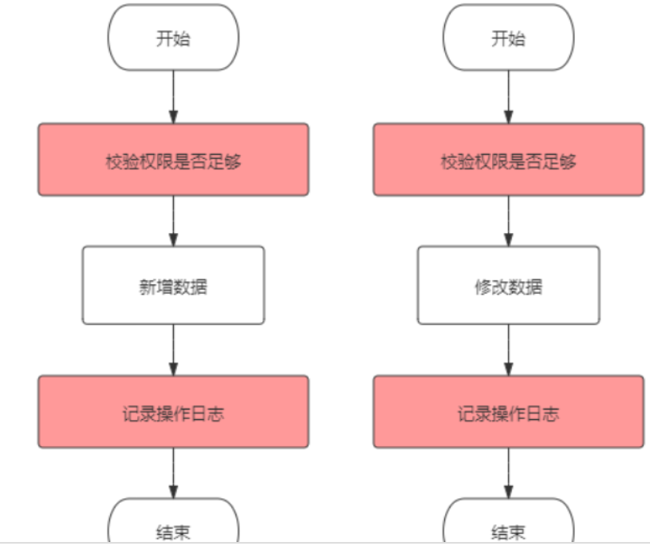

  引入aop之后

  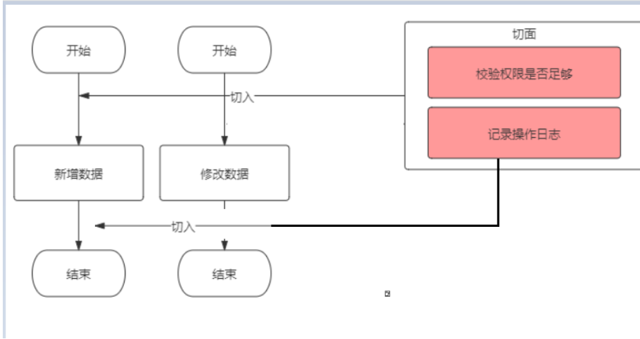

##### 4.AOP的体系结构

- 其实这里的概念也是蛮重要的不过也不难记，aop需要的无外乎这几种。1.在哪切入，也就是切面要切入的位置在哪里。2.什么时候切入，也就是方法执行前增强还是方法执行后增强。3.切入后要干啥，就是我们编写的切面执行的业务。具体的结构看下面这张图片。

  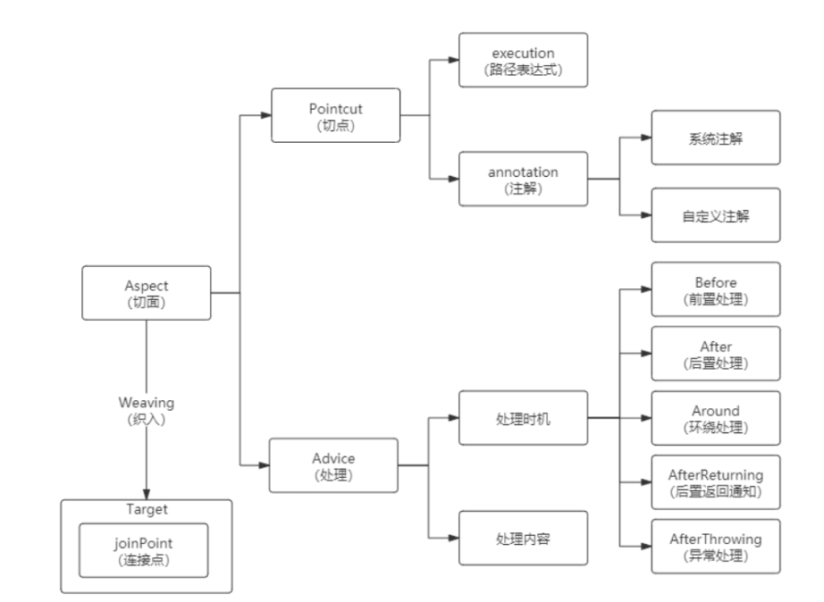

- 我们分别来解析一下上面途中的这些专业名词

  1. 切面(Aspect) 切面说的就是切点(Pointcut)与处理(Advice),切点是用来标注我们要到底将处理(Advice)织入到那个位置的标记。可以是路径表达式也可以是注解。而处理(Advice)则就是我们要织入的功能代码以及他们处理的时机。
  2. 连接点(JoinPoint)这个玩意其实就是我们要切入的地方，在 Spring AOP 中，一个连接点总是代表一个方法执行。
  3. 切点(Pointcut) 切点其实就一个功能，白话说就是标记要再那里织入代码。可以使用两种方式来标记分别是路径表达式，和注解
  4. 处理(Advice) 处理可以分为两部分，处理的时机与处理的内容，处理时机即为何时处理，方法前，方法后，异常中等等等。处理的内容就是我们编写的功能代码，切面要干的事情
  5. 织入(Weaving) 织入就是通过动态代理的方法再目标对象方法中插入切面的过程。

##### 5.AOP的原理

- AOP的底层是动态代理，我们通过对比AOP的功能以及代理模式的特性其实就能知道。它必定是使用动态代理模式的机制来实现的。通过动态代理实现再不改变源代码的情况下对目标方法的增强。再Spring中的AOP底层就使用了CGLIB动态代理与JDK动态代理。这俩动态代理的具体特性在这不做赘述了，读者可以去翻阅设计模式那一章节。Spring会根据被织入类的特性自己选择合适的一方，若目标类实现了接口就会选择JDK动态代理，若目标类没有实现接口就会动态选择CGLIB动态代理，然后从容器中获取代理后的对象。显然我们要使用spring的AOP就得保证他满足不被final修饰或者任意实现了一个接口。

 ##### 6.AOP的使用案例

- 演示AOP案例是需要在Spring容器中的，那么我们只需要搭建一个Spring框架托管的项目即可，但是处于方便程度与复习之前的知识来看我们不妨直接创建一个Web项目，在Web项目中引入Spring框架，然后再里面做AOP的案例测试。

- 使用表达式的形式实现AOP

  > 首先我们要先将Spring框架搭建好，创建Web项目以及导入Spring的依赖我们就不在演示了。但是这里有一个特殊的，使用AOP要引入Spring的切面依赖
  >
  > spring-aspects
  >
  > ~~~xml
  > <dependencies>
  >         <dependency>
  >             <groupId>javax.servlet</groupId>
  >             <artifactId>javax.servlet-api</artifactId>
  >             <version>4.0.1</version>
  >             <scope>provided</scope>
  >         </dependency>
  > <!--        spring的核心依赖-->
  >         <dependency>
  >             <groupId>org.springframework</groupId>
  >             <artifactId>spring-webmvc</artifactId>
  >             <version>5.2.15.RELEASE</version>
  >         </dependency>
  > <!--        spring的切面依赖-->
  >         <dependency>
  >             <groupId>org.springframework</groupId>
  >             <artifactId>spring-aspects</artifactId>
  >             <version>5.2.9.RELEASE</version>
  >         </dependency>
  >     </dependencies>
  > ~~~
  >
  > 创建spring配置文件以及再web.xml中配置springmvc框架
  >
  > ~~~java
  > <?xml version="1.0" encoding="UTF-8"?>
  > <beans xmlns="http://www.springframework.org/schema/beans"
  >        xmlns:xsi="http://www.w3.org/2001/XMLSchema-instance"
  >        xmlns:context="http://www.springframework.org/schema/context"
  >        xmlns:mvc="http://www.springframework.org/schema/mvc" xmlns:aop="http://www.springframework.org/schema/aop"
  >        xsi:schemaLocation="http://www.springframework.org/schema/beans http://www.springframework.org/schema/beans/spring-beans.xsd http://www.springframework.org/schema/context https://www.springframework.org/schema/context/spring-context.xsd http://www.springframework.org/schema/mvc https://www.springframework.org/schema/mvc/spring-mvc.xsd http://www.springframework.org/schema/aop https://www.springframework.org/schema/aop/spring-aop.xsd">
  > <!--开启包扫描-->
  >     <context:component-scan base-package="van.planifolia.*"/>
  > <!--开启注解驱动-->
  >     <mvc:annotation-driven/>
  > <!--开启aspect注解-->
  >     <aop:aspectj-autoproxy/>
  > </beans>
  > ~~~
  >
  > web.xml
  >
  > ~~~xml
  > <?xml version="1.0" encoding="UTF-8"?>
  > <web-app xmlns="http://xmlns.jcp.org/xml/ns/javaee"
  >          xmlns:xsi="http://www.w3.org/2001/XMLSchema-instance"
  >          xsi:schemaLocation="http://xmlns.jcp.org/xml/ns/javaee http://xmlns.jcp.org/xml/ns/javaee/web-app_4_0.xsd"
  >          version="4.0">
  >     <!--    配置编码过滤前-->
  >     <filter>
  >         <filter-name>EncodingFilter</filter-name>
  >         <filter-class>org.springframework.web.filter.CharacterEncodingFilter</filter-class>
  >         <init-param>
  >             <param-name>encoding</param-name>
  >             <param-value>utf-8</param-value>
  >         </init-param>
  >     </filter>
  >     <filter-mapping>
  >         <filter-name>EncodingFilter</filter-name>
  >         <url-pattern>/*</url-pattern>
  >     </filter-mapping>
  > <!--    配置SpringMVC以及映射路径-->
  >     <servlet>
  >         <servlet-name>spring</servlet-name>
  >         <servlet-class>org.springframework.web.servlet.DispatcherServlet</servlet-class>
  >         <init-param>
  >             <param-name>contextConfigLocation</param-name>
  >             <param-value>classpath:spring.xml</param-value>
  >         </init-param>
  >     </servlet>
  >     <servlet-mapping>
  >         <servlet-name>spring</servlet-name>
  >         <url-pattern>/</url-pattern>
  >     </servlet-mapping>
  > 
  > </web-app>
  > ~~~
  >
  > 
  >
  > 我们先创建service层将要实现的业务成搭建好
  >
  > ~~~java
  > public interface UserService {
  >     /**
  >      * 添加操作
  >      */
  >     void save();
  >     /**
  >      * 删除操作
  >      */
  >     void remove();
  >     /**
  >      * 修改操作
  >      */
  >     void modify();
  >     /**
  >      * 查询操作
  >      */
  >     void search();
  > }
  > ~~~
  >
  > 实现类
  >
  > ~~~java
  > @Service("userService")
  > public class UserServiceImpl implements UserService {
  >     @Override
  >     public void save() {
  >         System.out.println("执行了添加操作");
  >     }
  > 
  >     @Override
  >     public void remove() {
  >         System.out.println("执行了删除操作");
  >     }
  > 
  >     @Override
  >     public void modify() {
  >         System.out.println("执行了修改操作");
  >     }
  > 
  >     @Override
  >     public void search() {
  >         System.out.println("执行了查询操作");
  >     }
  > }
  > ~~~
  >
  > 然后我们要创建一个切面类，我们根据上面的体系结果大致也能分析出切面类中的内容。他主要是有两部分组成 1.切入点，2.通知。切入点的话是需要一个空的方法作为载体的，并且在方法上要使用@pointcut的注解来为他指定要切入的位置，可以使用两种方式一种是execution表达式一种是自定义注解，我们在这先使用execution表达式。然后对于通知我们则需要另外定于一个方法，在方法中编写要增强织入的业务代码，然后再通知方法上面添加注解来指定增强的时机，具体可以看下面的源码我写是十分详细。
  >
  > ~~~java
  > /**
  >  * Created by Intellij IDEA 
  >  * 创建一个测试切面类，并且标注这个类为切面类
  >  * @author Planifolia.Van
  >  * @version 1.0
  >  * @date 2022/11/11 16:59
  >  */
  > @Component
  > @Aspect
  > public class TestAspect {
  >     /**
  >      * 这个空方法是必要的他是作为切入点的载体而他上面的@Pointcut注解是真正标记这个切入点位置的，
  >      * Pointcut中可以使用两种方式一种是execution表达式一种是自定义注解。我们再这就先使用execution表达式
  >      * 我们再这就先使用execution表达式，execution表达式也是有很严格的语法规范的具体如下
  >      * execution(* 包名字.类名.方法名 (一般使用..代表任意参数))我再下面写个例子读者可以意会一下
  >      * execution(void van.planifolia.service.*.* (..)) 再van.planifolia.service包中的所有类中的任意参数但是返回值为void的方法
  >      */
  >     @Pointcut("execution(void van.planifolia.service.impl.*.* (..))")
  >     public void pointCarrier(){}
  > 
  >     /**
  >      * 通知方法们也就是我们织入的业务代码，我们可以使用注解来指定他处理的时机
  >      * @Before() 返回值后处理
  >      * @After() 方法前处理
  >      * @Around() 环绕处理需要在里面指定逻辑
  >      * @AfterThrowing() 异常后处理
  >      * 比如下面这个方法我采用的就是前置处理
  >      */
  >     @Before("pointCarrier()")
  >     public void beforeAdvice(){
  >         System.out.println("前置权限校验");
  >     }
  > }
  > 
  > ~~~
  >
  > 然后我们就可以编写一个Controller类来实现对业务层的调用了。
  >
  > ~~~java
  > @RestController
  > public class UserController {
  >     /**
  >      * 注入Service层
  >      */
  >     @Resource(name = "userService")
  >     UserService userService;
  > 
  >     /**
  >      * 编写Controller方法
  >      * @return 测试结果
  >      */
  >     @GetMapping("/Save")
  >     public String save(){
  >         userService.save();
  >         return "插入成功";
  >     }
  > }
  > ~~~
  >
  > 然后我们执行代码可以发现，确实在业务代码执行前输出了 前置权限校验 这句话。说明我们的通知生效了。然后你可以发现我们这个是使用了接口的模式，他应该是采用jdk动态代理，那如果我们不定义接口呢？他是否会自动使用cglib完成动态代理呢？下面这个例子我们就使用不带接口的并且测试一下比较通用的环绕通知。
  >
  > 首先我们还是要定义一个Service，不过这个Service不在继承接口了
  >
  > ~~~java
  > @Service("userServiceSp")
  > public class UserServiceImplSp {
  >     public void search() {
  >         System.out.println("执行了查询操作");
  >     }
  > }
  > ~~~
  >
  > 然后是在原有的切面类中田间一个切入点与环绕通知方法，环绕通知为什么强大，因为他只需要你在合适的位置编写合适的代码然后就能实现其他所有的通知注解的功能。
  >
  > ~~~java
  >  /**
  >      * 我们在这就使用Around来模拟环绕通知
  >      * @param joinPoint 连接点也就是被增强的那个方法
  >      */
  >     @Around("pointCarrierSp()")
  >     public void aroundAdvice(ProceedingJoinPoint joinPoint){
  >         System.out.println("方法前通知");
  >         try {
  >             // 这一句就代表方法执行，写在他上面的就是方法前通知，写在他后面的就是返回后通知，写在finally中的就是最终通知
  >             // 写在catch中的就是异常后通知
  >             joinPoint.proceed();
  >             System.out.println("方法返回后通知");
  >         } catch (Throwable throwable) {
  >             System.out.println("异常通知");
  >             throwable.printStackTrace();
  >         }finally {
  >             System.out.println("最终通知");
  >         }
  >     }
  > ~~~
  >
  > 然后我们在控制层中田间一个方法，用来调用Service中的查询。
  >
  > ~~~java
  >     /**
  >      * 编写Controller方法查询
  >      * @return 测试结果
  >      */
  >     @GetMapping("/Search")
  >     public String search(){
  >         userServiceImplSp.search();
  >         return "查询成功";
  >     }
  > ~~~
  >
  > 然后我们测试，发现确实在方法执行的前后带上了我们写在环绕通知中的代码，对于异常通知则需要在Service中发生了错误的时候才会出现。
  
- 我们之前也说了Spring中的AOP是有两种实现方式的，一种是使用表达式，一种是使用自定义注解。其实我们可以发现使用表达式的话还是比较复杂难懂的，所以我们下面就使用自定义注解的形式来使用AOP

  > 使用注解的话配置文件是不需要进行任何修改的，因为我们在spring的配置文件中已经提前配置了AOP的注解驱动等一系列配置。我们就在UserServiceImplSp中继续做实验吧就不创建新的Service层了。
  >
  > 都说使用自定义注解了那么我们就要先创建一个自定义注解来作为AOP的标记。当然肯定不是必须使用自定义的，在这他只是作为一个标记罢了，我们也可以使用Spring或者jdk中自带的注解来作为标记，但是使用我们自定义的能够更加的灵活。
  >
  > ~~~java
  > /**
  >  * 用来标注目标方法的注解,运行时起效，以及只可以标注在方法上面
  >  * @author dell
  >  */
  > @Retention(RetentionPolicy.RUNTIME)
  > @Target(ElementType.METHOD)
  > public @interface AopTarget {
  >     String value() default "";
  > }
  > 
  > ~~~
  >
  > 然后我们这个测试想要使用AOP来做一个模拟权限验证的操作，使用注解的方法为每个controller方法都添加上权限比如save方法对应save权限，search对应search权限，当权限不足的不让继续访问并且返回权限不足，有对应权限的让正常执行。这也我们就需要在切面类中模拟用户的权限信息了因为我们并没有登录所以无法获取真正的权限，所以就直接在切面类中创建一个List里面保存上当前模拟用户的权限目前只有查询权限。
  >
  > ~~~java
  > @Component
  > @Aspect
  > public class TestAspect {
  >     /**
  >      * 权限List
  >      */
  >     private List<String> permissions = new ArrayList<>();
  > 
  >     /**
  >      * 模拟当前用户的权限，只有查询和删除
  >      */
  >     public TestAspect() {
  >         permissions.add("search");
  >         permissions.add("remove");
  >     }
  >      /**
  >      * 创建第三个切入点，作为注解标记的测试,使用注解的切入点就非常简单了，只要在在@pointcut中添加
  >      * "@annotation(里面填写我们要作为标记的注解全限定名)"，然后这个切入点就会根据我们写入的注解标注的方法作为目标来进行
  >      * 切面织入
  >      */
  >     @Pointcut("@annotation(van.planifolia.annotation.AopTarget)")
  >     public void pointCarrierAnt() {
  >     }
  >         /**
  >      * 使用注解标注的权限检验方法
  >      * @param joinPoint 连接点 也就是我们被增强的方法
  >      * @return 需要返回的信息
  >      * @throws Throwable 抛出的异常
  >      */
  >     @Around("pointCarrierAnt()")
  >     public Object throwingAdvice(ProceedingJoinPoint joinPoint) throws Throwable {
  >         // 首先我们要获取当前拦截方法的Method对象，可以通过我们传入的参数 连接点(被增强方法封装的)对象
  >         MethodSignature methodSignature = (MethodSignature) joinPoint.getSignature();
  >         Method method = methodSignature.getMethod();
  >         // 然后我们获取方法上注解标记的权限需求，也就是我们自定义方法上的属性
  >         AopTarget annotation = method.getAnnotation(AopTarget.class);
  >         String value = annotation.value();
  >         // 然后我们要去判断当前这个被标记的方法上的这个权限在List中到底有没有这个属性值，若没有则直接返回权限不足的提示，
  >         // 因为我们这个是被增强到Controller方法之前上的所以这里返回会直接显示到页面上
  >         if (!permissions.contains(value)) {
  >             return "Insufficient permissions！";
  >         }
  >         // 存在的话我们就正常返回让他正常走,就是调用这个方法
  >         return joinPoint.proceed();
  >     }
  > }
  > 
  > ~~~
  >
  > 然后剩下的就是让我们在controller层上要标注的方法上添加注解并且在注解上添加权限信息即可，注意添加的权限要与我们后面list中模拟的对应一下。
  >
  > ~~~java
  > @RestController
  > public class UserController {
  >     /**
  >      * 注入Service层
  >      */
  >     @Resource(name = "userService")
  >     UserService userService;
  >     @Resource(name = "userServiceSp")
  >     UserServiceImplSp userServiceImplSp;
  > 
  >     /**
  >      * 编写Controller方法保存
  >      * @return 测试结果
  >      */
  >     @AopTarget("save")
  >     @GetMapping("/Save")
  >     public String save(){
  >         userService.save();
  >         return "插入成功";
  >     }
  > 
  >     /**
  >      * 编写Controller方法查询
  >      * @return 测试结果
  >      */
  >     @AopTarget("search")
  >     @GetMapping("/Search")
  >     public String search(){
  >         userServiceImplSp.search();
  >         return "查询成功";
  >     }
  > 
  > }
  > ~~~
  >
  > 然后我们分别请求 Search与Save会发现只用Search也就是我们模拟的权限可以正常执行完毕，而Save却不行，显然我们使用注解方法来进行AOP织入也是好用的。
  >
  > 

#### 第四回 “Spring中的事务管理”

- 我们在上一章讲解了Spring中的AOP，并且也提过一嘴Spring中的事务管理也是使用AOP进行实现的，但是因为使用AOP去手写事务管理实在是太麻烦了所以我们就只做了事务模拟。但是在Spring中提供的事务管理使用着非常的简单，我们今天就来具体讲解一下Spring中的事务，并且回顾一下事务的概念。

##### 1.事务的概念以及特点

- 首先事务这个概念我们其实在学习MySql的时候就讲了。对于事务这一块来说，他的概念还是比较重要的。

  `概念：`

  事务是用来确保数据一致性完整性的结局方案。他要求被定义成事务的一系列操作必须全部执行或者全部不执行。

  `事务的四个原则(ACID):`

  原子性(atomicity): 事务是一个原子操作, 由一系列动作组成。 事务的原子性确保动作要么全部完成要么完全不起作用。

  持久性(durability): 一旦事务提交, 无论发生什么系统错误, 它的结果都不应该受到影响。 通常情况下, 事务的结果被写到持久化存储器中。

  一致性(consistency)：就像能量守恒一样，事务执行前后的总量必须不变。

  隔离性(isolation): 可能有许多事务会同时处理相同的数据, 因此每个事物都应该与其他事务隔离开来, 防止数据损坏。

  ​      但是当时我们只仅仅在Mysql的窗口中使用了事务，以及模拟了事务的回滚提交等操作。但是我们在实际开发中显然是需要通过Java代码去控制事务的，对于传统的jdbc的话我们是使用连接类中的 `connection.setAutoCommit(false)` 来关闭事务的自动提交并且控制事务的提交与回滚的。但是我们使用了Spring与Mybatis整合之后就没必要再使用传统的事务提交了，Spring为我们提供了一些列的事务管理方案。我们只需要去引入Spring中相关的依赖 `spring-tx` 来引入Spring中的事务管理模块即可使用。我们再下面就使用一个买书的案例来演示事务的一些来操作。

##### 2.Spring中的事务实现方式

- 在Spring中有两种事务的实现方式一种是编程式事务管理，也就是将事务管理的代码直接写在业务层代码中，并且需要在Spring配置文件中进行大量的xml标签配置。然后在使用try catch代码块捕捉异常，当出现异常的时候需要进行事务的回滚等操作。显然这种事务管理非常的麻烦，我们不妨使用Spring中提供的另外一种声明式事务管理。
- 声明式事务管理的话我们可以将事务代码从业务层中分离开来， 事务管理作为一种横切关注点【切面】, 可以通过 AOP 方法模块化。Spring 通过 Spring AOP 框架支持声明式事务管理。
- 我们在下面就通过声明式事务来进行具体的演示操作。

##### 3.使用Spring中的事务进行模拟操作

- 我们下面要通过 卖书 案例来模拟Spring中的声明式事务操作。因为我们并不需要前端进行访问所以我们可以不搭建MVC项目。就直接使用Spring来提供事务管理，Mybatis实现对数据库的连接并操作。

- 搭建Spring框架以及Mybatis的操作就不在详细演示了，下面直接粘贴依赖代码以及Spring的配置文件。

  > 首先是整个项目的Maven依赖
  >
  > ~~~java
  >  <dependencies>
  > <!--        Spring-->
  >         <dependency>
  >             <groupId>org.springframework</groupId>
  >             <artifactId>spring-webmvc</artifactId>
  >             <version>5.2.15.RELEASE</version>
  >         </dependency>
  > <!--        jdbc-->
  >         <dependency>
  >             <groupId>mysql</groupId>
  >             <artifactId>mysql-connector-java</artifactId>
  >             <version>8.0.19</version>
  >         </dependency>
  > <!--        mybatis-->
  >         <dependency>
  >             <groupId>org.mybatis</groupId>
  >             <artifactId>mybatis</artifactId>
  >             <version>3.5.9</version>
  >         </dependency>
  > <!--        SpringMybatis-->
  >         <dependency>
  >             <groupId>org.mybatis</groupId>
  >             <artifactId>mybatis-spring</artifactId>
  >             <version>2.0.7</version>
  >         </dependency>
  > <!--        德鲁伊-->
  >         <dependency>
  >             <groupId>com.alibaba</groupId>
  >             <artifactId>druid</artifactId>
  >             <version>1.2.8</version>
  >         </dependency>
  > <!--        spring-jdbc-->
  >         <dependency>
  >             <groupId>org.springframework</groupId>
  >             <artifactId>spring-jdbc</artifactId>
  >             <version>5.2.15.RELEASE</version>
  >         </dependency>
  > <!--        spring事务-->
  >         <dependency>
  >             <groupId>org.springframework</groupId>
  >             <artifactId>spring-tx</artifactId>
  >             <version>5.2.15.RELEASE</version>
  >         </dependency>
  >     </dependencies>
  > ~~~
  >
  > 然后是核心的Spring配置文件
  >
  > ~~~xml
  > <?xml version="1.0" encoding="UTF-8"?>
  > <beans xmlns="http://www.springframework.org/schema/beans"
  >        xmlns:xsi="http://www.w3.org/2001/XMLSchema-instance"
  >        xmlns:context="http://www.springframework.org/schema/context" xmlns:tx="http://www.alibaba.com/schema/stat"
  >        xsi:schemaLocation="http://www.springframework.org/schema/beans http://www.springframework.org/schema/beans/spring-beans.xsd http://www.springframework.org/schema/context https://www.springframework.org/schema/context/spring-context.xsd http://www.alibaba.com/schema/stat http://www.alibaba.com/schema/stat.xsd">
  > <!--    首先开启包扫描-->
  >     <context:component-scan base-package="van.planifolia"/>
  > <!--    引入配置文件-->
  >     <context:property-placeholder location="db.properties"/>
  > <!--    配置数据源-->
  >     <bean id="dataSource" class="com.alibaba.druid.pool.DruidDataSource">
  >         <property name="driverClassName" value="${jdbc.driver}"/>
  >         <property name="url" value="${jdbc.url}"/>
  >         <property name="username" value="${jdbc.username}"/>
  >         <property name="password" value="${jdbc.password}"/>
  >     </bean>
  > <!--    配置SqlSession-->
  >     <bean id="sqlSession" class="org.mybatis.spring.SqlSessionFactoryBean">
  >         <property name="dataSource" ref="dataSource"/>
  >     </bean>
  > <!--    为创建的Dao接口生成实现类-->
  >     <bean class="org.mybatis.spring.mapper.MapperScannerConfigurer">
  >         <property name="sqlSessionFactoryBeanName" value="sqlSession"/>
  >         <property name="basePackage" value="van.planifolia.dao"/>
  >     </bean>
  > <!--    开启注解的包扫描-->
  >     <tx:annotation-driven/>
  > </beans>
  > ~~~
  >
  > 然后我们编写dao层以及service层来模拟用户买书的操作。我们先是不使用事务，并且模拟出不安全的情况。
  >
  > 首先是编写dao层的代码，首先我们分析用户买书的业务操作。首先我们是要查询书本的价格，然后是检查用户的金额是否足够本次买书操作，够的话就执行金额减少操作。然后是检查书本的库存剩余是否够用户购买，够的话书本库存减一操作。然后方法完毕。那么我们目前已经知道的就要写五个dao操作了，分别是 查询用户余额，查询书本库存。修改用户余额，修改书本库存。
  >
  > 我们下面就按照这四个需求来编写dao操作。我们在这即使用了注解的形式创建Sql语句，也使用Mapper文件的形式编写Sql语句，显然这两种方法都有他们的优缺点。使用注解的话是更方便简介的。无需再创建多余的文件。但是使用xml文件的形式能够更见灵活的编写Sql语句，所以我的建议是若为简单的查询Sql语句我们不妨使用注解，若为繁杂的嵌套查询等等还是使用mapper文件更好的一点。
  >
  > ~~~java
  > public interface BookDao {
  >     /**
  >      * 根据用户名查询用户的余额信息
  >      * @param username 用户名字
  >      * @return 用户的余额信息
  >      */
  >     @Select("select balance from account where username = #{username}")
  >     int selectAccount(String username);
  > 
  >     /**
  >      * 根据书本编号查询书本库存
  >      * @param isbn 书本编号
  >      * @return 书本的库存
  >      */
  >     int selectBookStock(String isbn);
  > 
  >     /**
  >      * 根据isbn查询书本的价格
  >      * @param isbn 书本编号
  >      * @return 书本的价格
  >      */
  >     @Select("select price from book where isbn = #{isbn}")
  >     int selectBookPrice(String isbn);
  > 
  >     /**
  >      * 更新账户的信息
  >      * @param username 用户的账号
  >      * @param price 书本的价格
  >      */
  >     @Update("update account set balance = balance - #{price} where username=#{username}")
  >     void updateAccount(@Param("username") String username,@Param("price") int price);
  > 
  >     /**
  >      * 更新书本库存的信息
  >      * @param isbn 书本的编号
  >      */
  >     void updateBookStock(String isbn);
  > }
  > ~~~
  >
  > 对应的Mapper文件，需要注意的是要在spring配置文件的SqlSession中配置Mapper文件扫描，以及注意Mapper文件的命名空间要与Dao接口保持一致
  >
  > ~~~xml
  > <?xml version="1.0" encoding="UTF-8" ?>
  > <!DOCTYPE mapper
  >         PUBLIC "-//mybatis.org//DTD Mapper 3.0//EN"
  >         "http://mybatis.org/dtd/mybatis-3-mapper.dtd">
  > <mapper namespace="van.planifolia.dao.BookDao">
  >     <update id="updateBookStock">
  >         update book_stock
  >         set stock = stock-1
  >         where isbn = #{isbn}
  >     </update>
  > 
  >     <select id="selectBookStock" resultType="java.lang.Integer">
  >         select stock
  >         from book_stock
  >         where isbn = #{isbn}
  >     </select>
  > </mapper>
  > ~~~
  >
  > 然后我们要开始编写Service层了，Service层其实我们要用到上面我们创建的五个dao操作。首先是查询书本的金额，然后检查书本库存，书本库存减一，检查用户金额，用户金额减去书本价格。其实我们这也写是很不合理的，但是我们这里的目的是为了展示不使用事务管理会出现的问题才这也写的。
  >
  > ~~~java
  > // 接口
  > public interface BookService {
  >     /**
  >      * 用户买书的业务接口
  >      * @param username 用户名
  >      * @param isbn 书本编号
  >      */
  >     void buyBook(String username,String isbn);
  > }
  > // 实现类
  > @Service("bookService")
  > public class BookServiceImpl implements BookService{
  > 
  >     @Resource(name = "bookDao")
  >     private BookDao bookDao;
  > 
  >     /**
  >      * 用户买书的业务的方法
  >      * @param username 用户名
  >      * @param isbn 书本编号
  >      */
  >     @Override
  >     public void buyBook(String username, String isbn) {
  >         // 首先我们查询一波这本书的价格
  >         int price = bookDao.selectBookPrice(isbn);
  >         // 然后我们验证库存是否够
  >         int stock = bookDao.selectBookStock(isbn);
  >         //若库存不够我们也是要抛出异常的
  >         if (stock <= 0){
  >             throw new RuntimeException("库存不足");
  >         }
  >         // 够的话库存减一
  >         bookDao.updateBookStock(isbn);
  >         // 然后我们验证当前用户的余额是否够买书的
  >         int balance = bookDao.selectAccount(username);
  >         if (balance < price){
  >             throw new RuntimeException("余额不足,无法购买");
  >         }
  >         // 够的话修改用户的余额
  >         bookDao.updateAccount(username,price);
  >     }
  > }
  > 
  > ~~~
  >
  > 然后就是编写测试类了，我们先模拟正常的购买(金额与库存皆够的情况)
  >
  > ~~~java
  > public class AccountTest {
  >     public static void main(String[] args) {
  >         // 我们通过这种方式获取到Spring容器
  >         ApplicationContext app = new ClassPathXmlApplicationContext("spring.xml");
  >         // 获取到BookService这个bean
  >         BookService bean = app.getBean(BookService.class);
  >         // 执行购书方法，我们在这先让他正常购买一次看看
  >         bean.buyBook("栗毅","1001");
  >     }
  > }
  > ~~~
  >
  > 通过调试上面的代码，我们可以发现确实正常的执行了，此时用户的金额已经不够了，我们在执行一次，此时必然是会抛出金额不足的异常的，并且正常的逻辑用户没有购买成功，书本的数量也是不会减少的，但是我们调试发现书本的数量信息确实减少了，这显然无法满足我们的需求，所以我们就要引入Spring中的事务来让他发生异常的时候能够对数据进行回滚。
  >
  > Spring官方已经把事务管理给我们封装的足够简单了，我们只需要在Service中的要被事务管理的方法上添加相应的注解@Transactional，这个方法就会被事务管理，但凡方法中出现任何错误都会执行回滚操作。我们在方法上加上相应的注解此时在执行一次看看
  >
  > ~~~java
  >     @Override
  >     @Transactional
  >     public void buyBook(String username, String isbn) {
  >         // 首先我们查询一波这本书的价格
  >         int price = bookDao.selectBookPrice(isbn);
  >         // 然后我们验证库存是否够
  >         int stock = bookDao.selectBookStock(isbn);
  >         //若库存不够我们也是要抛出异常的
  >         if (stock <= 0){
  >             throw new RuntimeException("库存不足");
  >         }
  >         // 够的话库存减一
  >         bookDao.updateBookStock(isbn);
  >         // 然后我们验证当前用户的余额是否够买书的
  >         int balance = bookDao.selectAccount(username);
  >         if (balance < price){
  >             throw new RuntimeException("余额不足,无法购买");
  >         }
  >         // 够的话修改用户的余额
  >         bookDao.updateAccount(username,price);
  >     }
  > ~~~
  >
  > 我们在调试代码的时候发现之前写错了一点，从而导致数量仍然进行了减一。我检查才发现是我在引入
  >
  > <tx:annation-driver/>的时候没有引入对应的命名空间导致的，而且没有在Spring中配置对应的事务管理，会导致会爆出无法创建TransactionalManger Bean的依赖，所以修改后的Spring文件如下。
  >
  > ~~~java
  > <?xml version="1.0" encoding="UTF-8"?>
  > <beans xmlns="http://www.springframework.org/schema/beans"
  >        xmlns:xsi="http://www.w3.org/2001/XMLSchema-instance"
  >        xmlns:context="http://www.springframework.org/schema/context" xmlns:tx="http://www.springframework.org/schema/tx"
  >        xsi:schemaLocation="http://www.springframework.org/schema/beans http://www.springframework.org/schema/beans/spring-beans.xsd http://www.springframework.org/schema/context https://www.springframework.org/schema/context/spring-context.xsd http://www.springframework.org/schema/tx http://www.springframework.org/schema/tx/spring-tx.xsd">
  > <!--    首先开启包扫描-->
  >     <context:component-scan base-package="van.planifolia"/>
  > <!--    引入配置文件-->
  >     <context:property-placeholder location="db.properties"/>
  > <!--    配置数据源-->
  >     <bean id="dataSource" class="com.alibaba.druid.pool.DruidDataSource">
  >         <property name="driverClassName" value="${jdbc.driver}"/>
  >         <property name="url" value="${jdbc.url}"/>
  >         <property name="username" value="${jdbc.username}"/>
  >         <property name="password" value="${jdbc.password}"/>
  >     </bean>
  > <!--    配置SqlSession-->
  >     <bean id="sqlSession" class="org.mybatis.spring.SqlSessionFactoryBean">
  >         <property name="dataSource" ref="dataSource"/>
  >         <property name="mapperLocations" value="classpath:mapper/*.xml"/>
  > 
  >     </bean>
  > <!--    为创建的Dao接口生成实现类-->
  >     <bean class="org.mybatis.spring.mapper.MapperScannerConfigurer">
  >         <property name="sqlSessionFactoryBeanName" value="sqlSession"/>
  >         <property name="basePackage" value="van.planifolia.dao"/>
  >     </bean>
  > <!--    配置Spring中的事务管理器，并且为其注入数据源-->
  >     <bean id="transactionManager" class="org.springframework.jdbc.datasource.DataSourceTransactionManager">
  >         <property name="dataSource" ref="dataSource"/>
  >     </bean>
  > <!--    开启注解的包扫描-->
  >     <tx:annotation-driven/>
  > </beans>
  > ~~~
  >
  > 此时我们再次执行代码会发现确实虽然爆出余额不足的错误，但是书本的数量没有减一，这就说明我们的事务管理成功的执行了回滚操作。

##### 4.事务的传播机制

- 我们有没有想过一个问题，要是我们这个事务方法被其他事务方法调用会发生什么，就比如说我们循环购买5本书，但是我们的钱只够购买两本的，此时会发生什么。这就涉及到Spring中的事务传播机制了。Spring中的事务传播机制可以分为如下7种，我们可以通过指定传播机制来实现对应的事务结果。

  > 首先是我们来介绍一下Spring种的事务七种传播机制
  >
  > 1. Reqired(必须的)：这个我们根据名字可以分析出他是必须要运行在事务中的，如果当前没有事务则创建一个事务，若当前有事务则加入当前的事务
  > 2. Requred_New(必须为新的)：这个则是必须创建一个新的事务，若当前有事务则挂起当前的事务开辟一个新的事务。
  > 3. Supports(支持):这个则为当前有事务则加入，没事务则可以不运行在事务中
  > 4. Not_Supports(不支持)：这个则是此方法不会允许在事务中，若有事务则挂起当前事务
  > 5. Mandatory(强制性的)：这个必须运行在别人的事务中，若此时没有事务则抛出异常
  > 6. Never(从不)：这个不能运行在事务中，若此时有事务则抛出异常
  > 7. Nested(嵌套的)：这个若是此时没事务则开辟一个事务，若有事务则在事务内部创建一个事务。
  >
  > 这七种我们作为了解，最常见的是前两个传播机制。我们下面也会使用循环买书来演示前两个传播机制以及讲解他们的原理。
  >
  > 此时我们在Service中在创建一个方法，这个方法传入的是一个书单List，方法内部根据这个List循环调用我们上面编写的买书方法，但是有一点我们要修改的是，在事务注解中指定传播机制，我们先使用REQUIRED这个传播机制，此时这个人有100块钱 测试一下结果。
  >
  > ~~~java
  >     /**
  >      * 循环购书的方法
  >      * @param isbns 书的list
  >      * @param username 买书的用户
  >      */
  >     @Override
  > 	@Transactional
  >     public void byBooks(List<String> isbns, String username) {
  >         for (String isbn : isbns) {
  >             this.buyBook(username,isbn);
  >         }
  >     }
  > }
  > ~~~
  >
  > ~~~java
  > public class AccountTest {
  >     public static void main(String[] args) {
  >         // 我们通过这种方式获取到Spring容器
  >         ApplicationContext app = new ClassPathXmlApplicationContext("spring.xml");
  >         // 获取到BookService这个bean
  >         BookService bean = app.getBean(BookService.class);
  >         // 执行购书方法，我们在这先让他正常购买一次看看
  >         List<String> isbns = new ArrayList<>();
  >         isbns.add("1001");
  >         isbns.add("1002");
  >         bean.byBooks(isbns,"栗毅");
  >     }
  > }
  > ~~~
  >
  > 我们调试上面的代码可以得知，第一本书确实是购买了，第二本书出现了异常。但是数据库中的数据都没有发生变化说明，数据是发生回滚了，我们结合REQUIRED事务传播机制可以得知，因为byBooks开启了一个事务所以循环的两次事务不会创建新的而是加入此事务，然后此事务中发生了异常所以，全部回滚导致，第一次的购书也回滚了。这样就会导致一本书都没法购买。
  >
  > 若我们将内部事务buyBook设置成REQUIRED_NEW则会出现另外一种情况。若为REQUIRED_NEW的话，她肯定会出现这样的现象，第一本书购买成功，第二本书购买失败。然后用户的钱与书的数量都会发生减一操作。但是我们在使用上面代码的时候发现仍然是没有减一，然后事务全部回滚了，余额既没有减一库存也没有减少。然后我们发现这两个事务是无法写在同一个Service中的于是我又创建了一个Service将购买多个写到了新的Service中再次测试发现可以了。
  >
  > ~~~java
  > @Service("testService")
  > public class TestService {
  >     @Resource(name = "bookService")
  >     private BookService bookService;
  > 
  >     @Transactional
  >     public void byBooks(List<String> isbns, String username) {
  >         for (String isbn : isbns) {
  >             bookService.buyBook(username,isbn);
  >         }
  >     }
  > }
  > ~~~
  >
  > 虽然我现在还不知到为啥会这样，但是这样写确实好使。
  >
  > 具体的事务执行流程图我们可以看下面这个图片思路非常的清晰
  >
  > 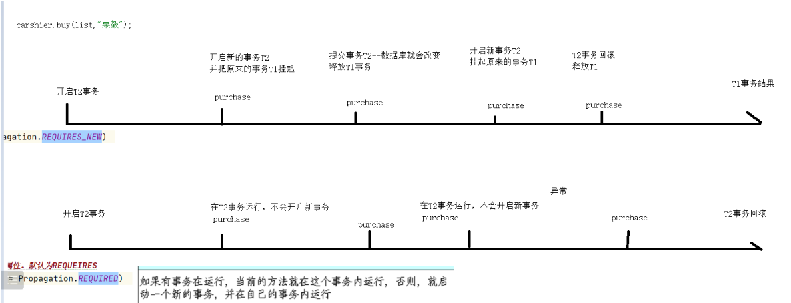
  >
  > 

##### 5.并发事务导致的问题

- 我们在学习MySql的时候也是探讨过这个问题，在并发情况下难免会发生。脏读，幻读，不可重复读。三大问题。

  > - 脏读: 对于两个事物 T1, T2, T1  读取了已经被 T2 更新但 还没有被提交的字段. 之后, 若 T2 回滚, T1读取的内容就是临时且无效的.
  > - 不可重复读:对于两个事物 T1, T2, T1  读取了一个字段, 然后 T2 更新了该字段. 之后, T1再次读取同一个字段, 值就不同了.
  > - 幻读:对于两个事物 T1, T2, T1  从一个表中读取了一个字段, 然后 T2 在该表中插入了一些新的行. 之后, 如果 T1 再次读取同一个表, 就会多出几行.

- mysql也为我们提出了事务的解决方案。在Spring中的事务也是有解决方案的。Spring提供了五个隔离级别来解决并发下的事务问题。

  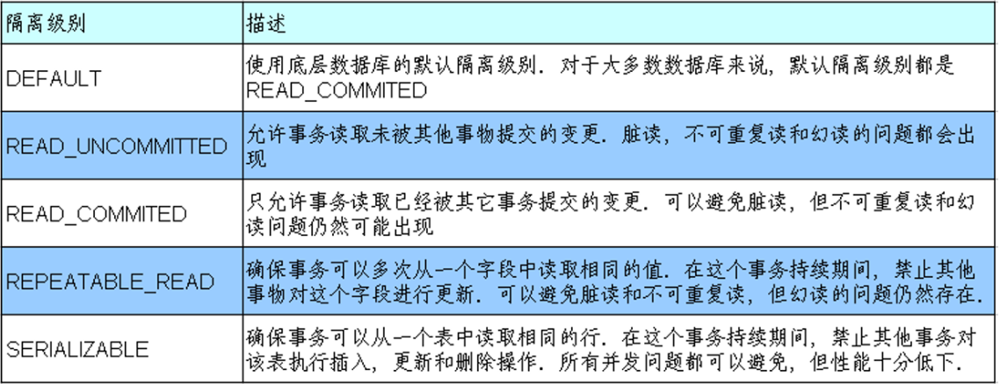

- spring默认的就是采用数据库自带的隔离级别，MySql默认的为可重复读。

  因为这个不太好演示要并发下操作，我们在这就先制作概念讲述，而具体的使用方法则也是在注解内部添加isolation = Isolation.*这种即可实现事务隔离级别的修改。

##### 6.设置事务注解的一系列其他属性

- 设置回滚事务属性

  ​		默认情况下事务是只有发生未检出异常才会回滚的也就是(RuntimeException/Error)这两种异常会导致回滚，但是对于已检查异常则不会发生回滚。我们仍然是可以通过注解内部的属性进行配置的 rollbackFor 和 noRollbackFor 属性来配置。这两个属性被声明为 Class[] 类型的, 因此可以为这两个属性指定多个异常类.

- 设置超时时间

  ​		这个就没什么内容了就是单纯的设置事务执行的时间超时了就直接报错

  具体的配置代码见下面

  ~~~java
  @Transactional(
              // 隔离级别为可重复度
              isolation = Isolation.REPEATABLE_READ,
              // 传播机制为必须为新事务
              propagation = Propagation.REQUIRES_NEW,
              // 出现运行时异常，io异常，Sql异常回滚
              rollbackFor = {RuntimeException.class, IOException.class, SQLException.class},
              // 空指针异常不回滚
              noRollbackFor = {NullPointerException.class},
              // 超时时间为2s
              timeout = 2
      )
      public void byBooks(List<String> isbns, String username) {
          for (String isbn : isbns) {
              bookService.buyBook(username,isbn);
          }
      }
  ~~~

  想验证超时时间的话，也很简单就直接再事务内部线程休眠三秒即可，然后运行时就会发现抛出了超时异常。