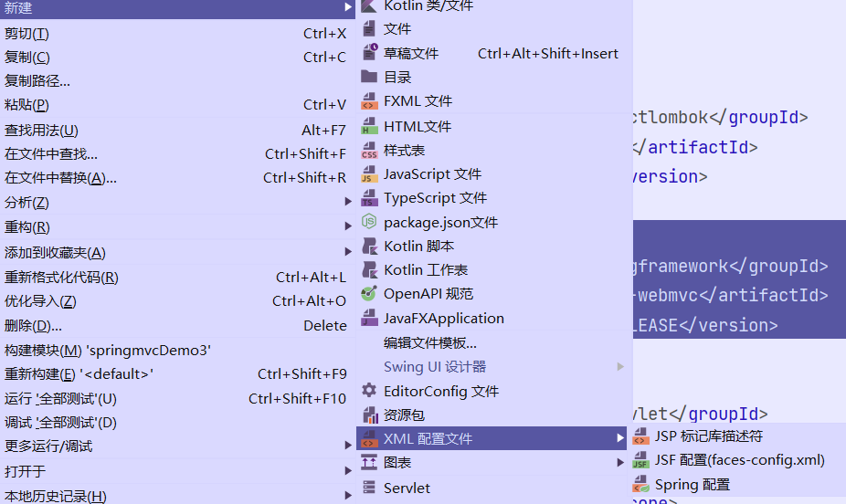
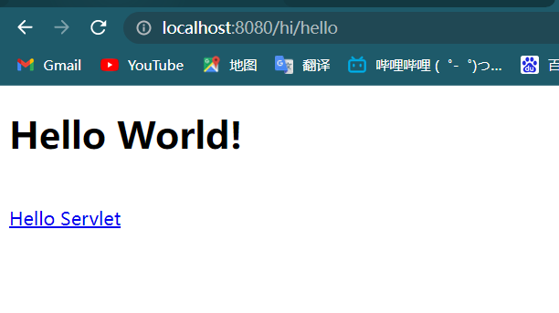
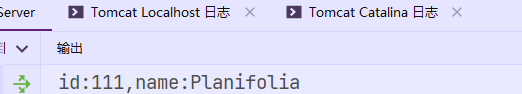
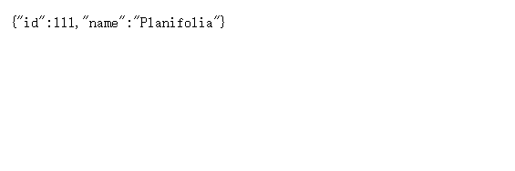
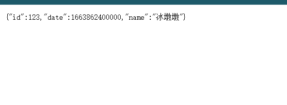

#### SpringMVC

##### 简介

*在我们传统的方法写controller层实现请求跳转与响应返回的时候的时候是用servlet来实现的，但是因为servlet天生的原生性(几乎对请求与响应数据的处理没做任何封装)所以我们在使用servlet接受与返回数据的时候都要把数据进行二次获取与封装，比如把前端传递过来的参数一一获取出来封装成对象，然后把响应的数据封装成对象再次塞进去，所以后i来就有了yspringmvc这个框架，他接管了我们Java企业级项目中的Controller层，如果说mybatis是M层的框架那么SpringMVC就是C层的框架*

##### 第一回 ”SpringMVC的搭建与简单使用“

- 首先SpringMVC和MyBatis同样都是系统框架，我们在引入安装的时候都要去引入相应的Jar包或者依赖，然后再修改对应的配置文件才能够使用。

  1. 引入SpringMVC的maven依赖，同样我们对于之前没用过的依赖可以去maven中心仓库去搜索对应的，然后剩下的就是粘贴就行了

     ~~~xml
             <dependency>
                 <groupId>org.springframework</groupId>
                 <artifactId>spring-webmvc</artifactId>
                 <version>5.2.15.RELEASE</version>
             </dependency>
     ~~~

  2. 我们再引入jar包之后就和大部分的框架一样要去创建其相应的配置文件了，首先就是springmvc的核心配置文件springmvc.xml,再这个文件中我们可以配置springmvc中的所有功能，比如注解，包扫描等等。而且我们创建的时候非常的简单。只需要再引入依赖之后再resource文件夹右键创建xml文件再里面选取spring的xml配置文件，我们选择就ok了

     

  3. 然后我们就要着手于修改配置文件，再里面添加controller类的包扫描，开启注解等等

     ~~~xml
     <?xml version="1.0" encoding="UTF-8"?>
     <beans xmlns="http://www.springframework.org/schema/beans"
            xmlns:xsi="http://www.w3.org/2001/XMLSchema-instance"
            xmlns:context="http://www.springframework.org/schema/context"
            xmlns:mvc="http://www.springframework.org/schema/mvc"
            xsi:schemaLocation="http://www.springframework.org/schema/beans http://www.springframework.org/schema/beans/spring-beans.xsd http://www.springframework.org/schema/context https://www.springframework.org/schema/context/spring-context.xsd http://www.springframework.org/schema/cache http://www.springframework.org/schema/cache/spring-cache.xsd">
     <!--    开启包扫描，当然这个包扫描的位置要指定为我们controller类所在的包-->
         <context:component-scan base-package="com.example.controller"/>
     <!--    开启注解-->
         <mvc:annotation-driven/>
     </beans>
     ~~~

  4. 然后我们要去web.xml文件中去注册springmvc，其实说起来我们也发现了SpringMvc也是基于Sertvlet进行的二次封装，他大大减少了程序员在获取前台传递的数据，以及后台往前台发送数据时的工作，但是本质上还是一个Servlet所以我们要在web.xml文件中将他注册进去。注册的方法几乎和servlet的注册方法一样只不过映射的路径为 ‘ / ’ 即整个项目，那么这个项目的所有请求于相应都会被SpringMVC托管了。

     ~~~xml
     <?xml version="1.0" encoding="UTF-8"?>
     <web-app xmlns="http://xmlns.jcp.org/xml/ns/javaee"
              xmlns:xsi="http://www.w3.org/2001/XMLSchema-instance"
              xsi:schemaLocation="http://xmlns.jcp.org/xml/ns/javaee http://xmlns.jcp.org/xml/ns/javaee/web-app_4_0.xsd"
              version="4.0">
     <!--    注册SpringMVC-->
         <servlet>
             <servlet-name>springmvc</servlet-name>
             <servlet-class>org.springframework.web.servlet.DispatcherServlet</servlet-class>
     <!--        读取SpringMVC的核心配置文件-->
             <init-param>
                 <param-name>contextConfigLocation</param-name>
                 <param-value>classpath:springmvc.xml</param-value>
             </init-param>
         </servlet>
     <!--    设置SpringMVC的请求路径映射-->
         <servlet-mapping>
             <servlet-name>springmvc</servlet-name>
             <url-pattern>/</url-pattern>
         </servlet-mapping>
     </web-app>
     ~~~

  5. 创建controller类，controller类取代了传统Servlet作为处理请求与响应的工具，所有我们可以单独建立一个controller包用来装它，并且controller类的 创建非常简单，不需要继承，不需要实现，只要创建一个普通类并且在它的上面添加@Controller注解就完事了。

     ~~~java
     //标注这个类为Controller类
     @Controller
     //为这个类指明映射路径
     @RequestMapping("hi")
     public class TestCOntroller {
         //为类中的方法指明映射路径
         @RequestMapping("hello")
         public String test(){
             //写要跳转到的路径
             return "/index.jsp";
         }
     }
     ~~~

  6. 在浏览器测试一波

     

     我们可以看到使用了springmvc之后可以在一个Controller中写多个响应方法，每一个方法都代表一个请求，使用注解@RequestMapping可以放到类上面代表这一层类，放在方法上面则代表这个方法对应的映射路径。

- SpringMvc最大的方便之处其实不在这里而是对请求参数的自动绑定与封装上，我们可以在controller函数的参数列表与前端传递来的数据保持一致，或者在方法的参数列表上添加那些数据名字对应的实体类上。就能将前端传递过来的数据自动的绑定到传入参数上。来试一波。

  1. 使用多个参数列表的形式绑定

     ~~~html
     //前端表单
     <form action="/hi/hello" method="get">
         <input type="text" name="id">
         <input type="text" name="name">
         <input type="submit" value="提交">
     </form>
     ~~~

     ~~~java
     //创建一个方法，可以看到我们写的传入参数是和表单信息一致的   
     @RequestMapping("hello")
         public String test(Integer id,String name){
             System.out.println("id:" + id + ",name:" + name);
             return "";
         }
     ~~~

     打印出来的信息

     

  2. 封装成对象的形式，使用封装对象我们只要将参数列表替换成一个实体对象即可，但是这个对象的属性要与表单元素保持一致，并且提供get set方法。

     

- 我们可以发现，传统的controller return中写的是跳转的路径，但是我们很多请求都是要返回Json数据的，SpringMVC当然为我们想到这方面了，只需要添加上一个小小的注解 @ResponseBody 就能将传统的跳转变成返回json数据到前端，当然这需要我们引入对应的jar包 jackson。

  ~~~xml
          <dependency>
              <groupId>com.fasterxml.jackson.core</groupId>
              <artifactId>jackson-core</artifactId>
              <version>2.11.0</version>
          </dependency>
          <dependency>
              <groupId>com.fasterxml.jackson.core</groupId>
              <artifactId>jackson-databind</artifactId>
              <version>2.11.0</version>
          </dependency>
          <dependency>
              <groupId>com.fasterxml.jackson.core</groupId>
              <artifactId>jackson-annotations</artifactId>
              <version>2.11.0</version>
          </dependency>
  ~~~

  结果

  

  

  但是我们要是接受的数据中要是有Date日期类型的数据我们就不能这样直接绑定上了，我们需要在实体类上Date属性上添加@DateTimeFormat(pattern = "日期格式")注解，然后就可以正常的绑定到实体类上了。

  ~~~html
  <form action="/hi/hello" method="get">
      <input type="text" name="id">
      <input type="text" name="name">
      <input type="date" name="date">
      <input type="submit" value="提交">
  </form>
  ~~~

  ~~~java
  @RequestMapping("hi")
  @ResponseBody
  public class TestCOntroller {
      //为类中的方法指明映射路径
      @RequestMapping("hello")
      public User test(User user){
          return user;
      }
  }
  ~~~

  ~~~java
  @Data
  public class User {
      private Integer id;
      @DateTimeFormat(pattern = "yyyy-MM-dd")
      private Date date;
      private String name;
  }
  ~~~

  结果

  

##### 第二回  “使用SpringMVC结合传统的web项目”

- 我们上一节已经简单的学习了如何快速的搭建一个SpringMVC项目，那么我们今天就来将SpringMVC结合到我们之前写的项目上去，具体操作方法也并不难只要配置几个配置文件就能实现。

  1.在原本的项目上添加SpringMVC框架。首先我们将原本项目中的controller层中的servlet全部删掉，然后在依赖导入SpringMVC，这一步就不做演示了比较的简单。然后就是创建SpringMVC核心配置文件并且修改web.xml

  ~~~xml
  <!-- 创建SpringMVC核心配置文件 -->
  
  <?xml version="1.0" encoding="UTF-8"?>
  <beans xmlns="http://www.springframework.org/schema/beans"
         xmlns:xsi="http://www.w3.org/2001/XMLSchema-instance"
         xmlns:context="http://www.springframework.org/schema/context"
         xmlns:mvc="http://www.springframework.org/schema/mvc"
         xsi:schemaLocation="http://www.springframework.org/schema/beans http://www.springframework.org/schema/beans/spring-beans.xsd http://www.springframework.org/schema/context https://www.springframework.org/schema/context/spring-context.xsd http://www.springframework.org/schema/mvc https://www.springframework.org/schema/mvc/spring-mvc.xsd">
  <!--开启包扫描,扫描我们的controller类-->
      <context:component-scan base-package="van.planifolia.controller"/>
   <!--    开启注解驱动-->
      <mvc:annotation-driven/>
  <!--    放行静态资源-->
      <mvc:default-servlet-handler/>
  </beans>
      
  <!-- 修改web.xml文件 -->
  
  <?xml version="1.0" encoding="UTF-8"?>
  <web-app xmlns="http://xmlns.jcp.org/xml/ns/javaee"
           xmlns:xsi="http://www.w3.org/2001/XMLSchema-instance"
           xsi:schemaLocation="http://xmlns.jcp.org/xml/ns/javaee http://xmlns.jcp.org/xml/ns/javaee/web-app_4_0.xsd"
           version="4.0">
  <!--配置SpringMVC-->
      <servlet>
          <servlet-name>springmvc</servlet-name>
          <servlet-class>org.springframework.web.servlet.DispatcherServlet</servlet-class>
  <!--        加载核心配置文件-->
          <init-param>
              <param-name>contextConfigLocation</param-name>
              <param-value>classpath:springmvc.xml</param-value>
          </init-param>
      </servlet>
  <!--    接管所有的请求-->
      <servlet-mapping>
          <servlet-name>springmvc</servlet-name>
          <url-pattern>/</url-pattern>
      </servlet-mapping>
  <!--配置编码过滤器-->
      </web-app>
  
  
  ~~~

  2.在Controller包中添加Controller，每一个Controller可以对应一类请求。通常可以根据我们的实体类的数量来创建，对一张标的crud 对应一个Controller。我们用得到的共有三张表，User表，Emp表，Dept表所以我们就来创建三个Controller对应这三张表的增删改查操作。

  > ​	UserController
  >
  > ~~~java
  > 
  > /**
  >  * Created by Intellij IDEA 
  >  * 用户层的 Controller 目前只用作登录与注册操作
  >  * @author Planifolia.Van
  >  * @version 1.0
  >  * @date 2022/9/26 9:39
  >  */
  > 
  > @Controller
  > @RequestMapping("User")
  > public class UserController {
  >      @RequestMapping("Login")
  >     public String login(User user, HttpSession session) {
  >         
  >     }
  >     @RequestMapping("Regist")
  >     public String regist(User user, HttpSession session) {
  >         
  >     }
  > }
  > 
  > ~~~
  >
  > DeptController
  >
  > ~~~java
  > /**
  >  * Created by Intellij IDEA 
  >  * Dept层的Controller目前只做查询全部的功能
  >  * @author Planifolia.Van
  >  * @version 1.0
  >  * @date 2022/9/24 12:31
  >  */
  > @Controller
  > @RequestMapping("/Dept")
  > public class DeptController {
  >     
  > 
  >     /**
  >      * 查询全部的部门信息
  >      * @return 全部的部门信息
  >      */
  >     @RequestMapping("/GetAll")
  >     @ResponseBody
  >     public ComResult getAllDept() {
  >        
  >     }
  > }
  > ~~~
  >
  > EmpController
  >
  > ~~~java
  > 
  > /**
  >  * Created by Intellij IDEA 
  >  * Emp层的Controller负责员工的 插入 查询全部 按id删除 按id修改 的操作
  >  * @author Planifolia.Van
  >  * @version 1.0
  >  * @date 2022/9/24 12:31
  >  */
  > @Controller
  > @RequestMapping("/Emp")
  > public class EmpController {
  >     /**
  >      * 创建实体类
  >      */
  >     MyBatisUtil<EmpDao> myBatisUtil = new MyBatisUtil<>();
  > 
  >     /**
  >      * 查询全部的员工信息
  >      * @return 全部的员工信息
  >      */
  >     @RequestMapping("/GetAll")
  >     @ResponseBody
  >     public ComResult getAllEmp() {
  >         
  >     }
  > 
  >     /**
  >      * 按照id删除单条员工
  >      * @param eid 员工id
  >      * @return 公共的结果
  >      */
  >     @RequestMapping("/Remove")
  >     @ResponseBody
  >     public ComResult removeEmp( int eid) {
  >         
  >     }
  > 
  >     /**
  >      * 根据传递过来的员工进行修改
  >      * @param emp 新的员工信息
  >      * @return 公共的结果
  >      */
  >     @RequestMapping("/Modify")
  >     @ResponseBody
  >     public ComResult modifyEmp(@RequestBody Emp emp){
  >         
  >     }
  > 
  >     /**
  >      * 添加一条emp信息
  >      * @param emp 被添加的emp信息
  >      * @return 公共的结果
  >      */
  >     @RequestMapping("/Add")
  >     @ResponseBody
  >     public ComResult addEmp(Emp emp){
  >         
  >     }
  > ~~~

  3.创建完毕Controller层之后我们就要开始着手写这些层的Dao操作了，首先对于Dao层我们可以使用传统的BaseDao，SimpleDao。但是非常的不优雅啊。我们都已经学习了MyBatis了不使用是不是有点说不过去啊。但是在没引入Spring框架之前使用MyBatis还是挺费劲的因为会涉及到事务的操作。所以下面我就来简单的介绍一下自己封装的工具类。

  > ​	MyBatisUtil：为了简化获取Dao接口代理实现类以及管理事务而生！
  >
  > ~~~java
  > /**
  >  * Created by Intellij IDEA 
  >  * 工具类获取dao接口对应的实现类
  >  * @author Planifolia.Van
  >  * @version 1.0
  >  * @date 2022/9/23 16:13
  >  */
  > public class MyBatisUtil<T> {
  >     public SqlSession sqlSession=null;
  >     static SqlSessionFactory sessionFactory =null;
  > 
  >     /*
  >       获取sqlSession,加载mybatis.xml核心文件,因为这一块只要执行一次所以我直接把他写在静态代码块中
  >      */
  >     static {
  >         try {
  >             Reader reader = Resources.getResourceAsReader("mybatis.xml");
  >             sessionFactory=new SqlSessionFactoryBuilder().build(reader);
  > 
  >         } catch (IOException e) {
  >             e.printStackTrace();
  >         }
  >     }
  > 
  >     /**
  >      * 此方法用于打开一个SqlSession,每一个涉及到 增 删 改的 SqlSession都对应一个事务,像这种事务都需要去调用下面的事务提交
  >      * @param aClass dao接口的class对象
  >      * @return 返回的接口实现类对象
  >      */
  >     public T getDao(Class<T> aClass){
  >         sqlSession=sessionFactory.openSession();
  >         return sqlSession.getMapper(aClass);
  >     }
  > 
  >     /**
  >      * sqlSession的提交与关闭
  >      */
  >     public  void sqlSessionCommit(){
  >         sqlSession.commit();
  >         sqlSession.close();
  >     }
  > }
  > ~~~

    4.然后我们就要往这个项目里引入MyBatis框架，同样基础的导入依赖就不在展示了，直接创建核心配置文件。然后我们已经介绍了上面的工具类。那么也就是我们要去使用Mapper接口的方法了。流程就是创建所有需要的接口方法然后根据接口方法去创建Mapper映射文件，在映射文件中添加sql标签，同样使用Mapper整合的时候要注意需要遵守的几个要点，在这也不赘述了。

  > MyBatis.xml
  >
  > ~~~xml
  > <?xml version="1.0" encoding="UTF-8" ?>
  > <!DOCTYPE configuration
  >         PUBLIC "-//mybatis.org//DTD Config 3.0//EN"
  >         "http://mybatis.org/dtd/mybatis-3-config.dtd">
  > <!--引入数据源的配置文件按-->
  > <configuration>
  >     <properties resource="db.properties"/>
  > <!--开启包扫描自动对应上实体类-->
  >     <typeAliases>
  >         <package name="van.planifolia.pojo"/>
  >     </typeAliases>
  >     <plugins>
  >         <!-- 引入分页插件 -->
  >         <plugin interceptor="com.github.pagehelper.PageInterceptor">
  >         </plugin>
  >     </plugins>
  > <!--配置数据源的内容-->
  >     <environments default="development">
  >         <environment id="development">
  >             <transactionManager type="JDBC"/>
  >             <dataSource type="POOLED">
  >                 <property name="driver" value="${jdbc.Driver}"/>
  >                 <property name="url" value="${jdbc.url}"/>
  >                 <property name="username" value="${jdbc.username}"/>
  >                 <property name="password" value="${jdbc.password}"/>
  >             </dataSource>
  >         </environment>
  >     </environments>
  > <!--引入三个Mapper文件-->
  >     <mappers>
  >         <mapper resource="mapper/DeptDao.xml"/>
  >         <mapper resource="mapper/EmpDao.xml"/>
  >         <mapper resource="mapper/UserDao.xml"/>
  >     </mappers>
  > 
  > </configuration>
  > ~~~
  >
  > 
  >
  > 
  >
  > DeptDao
  >
  > ~~~java
  > public interface DeptDao {
  >     /**
  >      * 查询全部部门
  >      * @return 全部部门信息
  >      */
  >     public List<Dept> getAllDept();
  > }
  > ~~~
  >
  > DeptMapper
  >
  > ~~~xml
  > <?xml version="1.0" encoding="UTF-8" ?>
  > <!DOCTYPE mapper
  >         PUBLIC "-//mybatis.org//DTD Mapper 3.0//EN"
  >         "http://mybatis.org/dtd/mybatis-3-mapper.dtd">
  > <mapper namespace="van.planifolia.dao.DeptDao">
  >     <select id="getAllDept" resultType="van.planifolia.pojo.Dept">
  >         select * from tb_dept
  >     </select>
  > </mapper>
  > ~~~
  >
  > 
  >
  > UserDao
  >
  > ~~~java
  > public interface UserDao {
  >     /**
  >      * 按照name与Pass去查询用户,也就是登录
  >      * @param username 用户名
  >      * @param password 用户密码
  >      * @return 查询到的用户对象
  >      */
  >     User selectUserByNameAndPass(@Param("username") String username,@Param("password") String password);
  > 
  >     /**
  >      * 插入一个用户记录,也就是注册
  >      * @param user 被插入的用户对象
  >      * @return 更新的行数
  >      */
  >     int insertUser(User user);
  > 
  > }
  > ~~~
  >
  > UserMapper
  >
  > ~~~xml
  > <?xml version="1.0" encoding="UTF-8" ?>
  > <!DOCTYPE mapper
  >         PUBLIC "-//mybatis.org//DTD Mapper 3.0//EN"
  >         "http://mybatis.org/dtd/mybatis-3-mapper.dtd">
  > <mapper namespace="van.planifolia.dao.UserDao">
  > 
  >     <insert id="insertUser">
  >         insert into t_user(username, password, realname) VALUES (#{username},#{password},#{realname})
  >     </insert>
  > 
  >     <select id="selectUserByNameAndPass" resultType="User">
  >         select * from t_user where username=#{username} and password=#{password}
  >     </select>
  >     
  > </mapper>
  > ~~~
  >
  > 
  >
  > EmpDao
  >
  > ~~~java
  > public interface EmpDao {
  >     /**
  >      * 按照id查询
  >      * @param eid 员工id
  >      * @return 单个员工信息
  >      */
  >     Emp getEmpById(int eid);
  > 
  >     /**
  >      * 按照id删除员工
  >      * @param eid 员工id
  >      * @return 受影响的行数
  >      */
  >     int removeEmp(int eid);
  > 
  >     /**
  >      * 添加一个员工信息
  >      * @param emp 被添加的员工信息
  >      * @return 受影响的行数
  >      */
  >     int addEmp(Emp emp);
  > 
  >     /**
  >      * 查询全部员工信息
  >      * @return 全部员工的list
  >      */
  >     List<Emp> getAllEmp();
  > 
  >     /**
  >      * 修改一个员工信息
  >      * @param emp 修改的信息
  >      * @return 更新的行数
  >      */
  >     int modifyEmp(Emp emp);
  > }
  > 
  > ~~~
  >
  > EmpMapper
  >
  > ~~~xml
  > 
  > <?xml version="1.0" encoding="UTF-8" ?>
  > <!DOCTYPE mapper
  >         PUBLIC "-//mybatis.org//DTD Mapper 3.0//EN"
  >         "http://mybatis.org/dtd/mybatis-3-mapper.dtd">
  > <mapper namespace="van.planifolia.dao.EmpDao">
  >     
  >     <insert id="addEmp">
  >         insert into tb_emp(name, age, job, salary, entrydate, managerid, dept_id)
  >         values (#{name}, #{age}, #{job}, #{salary}, #{entrydate}, #{managerid}, #{deptid})
  >     </insert>
  >     
  >     <update id="modifyEmp">
  >         update tb_emp
  >         set name=#{name},
  >             age=#{age},
  >             job=#{job},
  >             salary=#{salary},
  >             entrydate=#{entrydate},
  >             dept_id=#{deptid},
  >             managerid=#{managerid}
  >         where id = #{id}
  >     </update>
  > 
  >     <delete id="removeEmp">
  >         delete
  >         from tb_emp
  >         where id = #{eid}
  >     </delete>
  > 
  > 
  >     <select id="getEmpById" resultType="van.planifolia.pojo.Emp">
  >         select id, name, age, job, salary, entrydate, managerid, dept_id deptid
  >         from tb_emp
  >         where id = #{eid}
  >     </select>
  > 
  >     <select id="getAllEmp" resultMap="EmpWithDept">
  >         select id, name, age, job, salary, entrydate, managerid, dept_id deptid,did,dname,address
  >         from tb_emp,tb_dept
  >         where tb_dept.did=tb_emp.dept_id
  >     </select>
  >     
  >     <resultMap id="EmpWithDept" type="Emp" autoMapping="true">
  >         <id column="id" property="id"/>
  >         <association property="dept" javaType="Dept" autoMapping="true">
  >             <id property="did" column="did"/>
  >         </association>
  >     </resultMap>
  > 
  > </mapper>
  > ~~~

  5.在Controller中调用dao层，其实我们在之前没用Dao的时候确实也是在Servlet中去调用Dao的在引入了SpringMVC之后也是同样在Controller方法中去调用Dao来实现数据的请求，然后根据前端的需求来选择返回数据还是跳转。

  > DeptController 是负责查询全部的部门信息的
  >
  > ~~~java
  > @Controller
  > @RequestMapping("/Dept")
  > public class DeptController {
  >     /**
  >      * 引入dao层
  >      */
  >     MyBatisUtil<DeptDao> myBatisUtil = new MyBatisUtil<>();
  > 
  >     /**
  >      * 查询全部的部门信息
  >      *
  >      * @return 全部的部门信息
  >      */
  >     @RequestMapping("/GetAll")
  >     @ResponseBody
  >     public ComResult getAllDept() {
  >         // 获取dao层并且查询到信息保存到 List 中
  >         List<Dept> allDept = myBatisUtil.getDao(DeptDao.class).getAllDept();
  >         //关闭session
  >         myBatisUtil.sqlSessionCommit();
  >         //返回数据
  >         return new ComResult(200, "ok", allDept);
  >     }
  > }
  > 
  > ~~~
  >
  > EmpController 对员工进行增删改查
  >
  > ~~~java
  > 
  > @Controller
  > @RequestMapping("/Emp")
  > public class EmpController {
  >     /**
  >      * 创建实体类
  >      */
  >     MyBatisUtil<EmpDao> myBatisUtil = new MyBatisUtil<>();
  > 
  >     /**
  >      * 查询全部的员工信息
  >      * @return 全部的员工信息
  >      */
  >     @RequestMapping("/GetAll")
  >     @ResponseBody
  >     public ComResult getAllEmp() {
  >         List<Emp> allEmp = myBatisUtil.getDao(EmpDao.class).getAllEmp();
  >         return new ComResult(200, "OK", allEmp);
  >     }
  > 
  >     /**
  >      * 按照id删除单条员工
  >      * @param eid 员工id
  >      * @return 公共的结果
  >      */
  >     @RequestMapping("/Remove")
  >     @ResponseBody
  >     public ComResult removeEmp( int eid) {
  >         System.out.println(eid);
  >         ComResult comResult;
  >         if (myBatisUtil.getDao(EmpDao.class).removeEmp(eid) > 0) {
  >             comResult = new ComResult(200, "ok");
  >         } else {
  >             comResult = new ComResult(5000, "erro");
  >         }
  >         myBatisUtil.sqlSessionCommit();
  >         return comResult;
  >     }
  > 
  >     /**
  >      * 根据传递过来的员工进行修改
  >      * @param emp 新的员工信息
  >      * @return 公共的结果
  >      */
  >     @RequestMapping("/Modify")
  >     @ResponseBody
  >     public ComResult modifyEmp(@RequestBody Emp emp){
  >         ComResult comResult;
  >         System.out.println(emp);
  >         if (myBatisUtil.getDao(EmpDao.class).modifyEmp(emp) > 0) {
  >             comResult = new ComResult(200, "ok");
  >         } else {
  >             comResult = new ComResult(5000, "erro");
  >         }
  >         myBatisUtil.sqlSessionCommit();
  >         return comResult;
  >     }
  > 
  >     /**
  >      * 添加一条emp信息
  >      * @param emp 被添加的emp信息
  >      * @return 公共的结果
  >      */
  >     @RequestMapping("/Add")
  >     @ResponseBody
  >     public ComResult addEmp(Emp emp){
  >         ComResult comResult;
  > 
  >         if (myBatisUtil.getDao(EmpDao.class).addEmp(emp) > 0) {
  >             comResult = new ComResult(200, "ok");
  >         } else {
  >             comResult = new ComResult(5000, "erro");
  >         }
  > 
  >         myBatisUtil.sqlSessionCommit();
  >         return comResult;
  >     }
  > ~~~
  >
  > UserController，用户的登录操作
  >
  > ~~~java
  > @Controller
  > @RequestMapping("User")
  > public class UserController {
  >     /**
  >      * 引入Dao层
  >      */
  >     MyBatisUtil<UserDao> util = new MyBatisUtil<>();
  > 
  >     /**
  >      * 用户的登录操作,在登录完毕之后会将用户对象保存到Session中然后跳转到主页
  >      *
  >      * @param user    要登录的用户对象
  >      * @param session HttpSession
  >      * @return 要跳转的网页
  >      * 1
  >      */
  >     @RequestMapping("Login")
  >     public String login(User user, HttpSession session) {
  >         //获取daao
  >         UserDao userDao = util.getDao(UserDao.class);
  >         //执行dao,拿到对应的用户对象
  >         User tempUser = userDao.selectUserByNameAndPass(user.getUsername(), user.getPassword());
  >         //根据查询到的结果来判断是否登录成功
  >         if (tempUser != null) {
  >             session.setAttribute("user", user);
  >             return "/mainsp.html";
  >         } else {
  >             return "/login.html";
  >         }
  >     }
  > }
  > ~~~
  >
  > 

  6.到现在我们就已经完成了后台的搭建，只要对Controller发出一个对应的请求他就会给你返回一个对应的数据。说到了数据我们其实有必要聊一聊通用返回对象的事情，对于异步的请求我们常常会去返回一个Json对象，但是我们查询出来的对象各种各样，有数组，有对象，等等而且只传递结果信息的话很难告诉前端我们后端的查询是否成功，所有很必要去封装一个公共的返回对象来实现返回结果的通用化，这个返回结果需要的内容有 code “标记码” msg “简短的消息” data “要传递过去的数据” 使用这种返回结果能够规范化我们的返回结果。

  > 
  >
  > ~~~java
  > public class ComResult {
  > 
  >     private int code;
  >     private String msg;
  >     private Object data;
  > 
  >     public ComResult(int code, String msg, Object data) {
  >         this.code = code;
  >         this.msg = msg;
  >         this.data = data;
  >     }
  > 
  >     public ComResult(int code, String msg) {
  >         this.code = code;
  >         this.msg = msg;
  >     }
  > 
  >     public ComResult() {
  >     }
  > 
  >     public int getCode() {
  >         return code;
  >     }
  > 
  >     public void setCode(int code) {
  >         this.code = code;
  >     }
  > 
  >     public String getMsg() {
  >         return msg;
  >     }
  > 
  >     public void setMsg(String msg) {
  >         this.msg = msg;
  >     }
  > 
  >     public Object getData() {
  >         return data;
  >     }
  > 
  >     public void setData(Object data) {
  >         this.data = data;
  >     }
  > }
  > ~~~

  7.那么剩下的就剩前端页面了，我们在这不做展示，直接复制粘贴然后对接一下数据就ok了。

##### 第三回 “Spring中的编码过滤器，拦截器，文件上传模块”

- SpringMVC中的基础功能我们已经写完了，那么剩下的就是SpringMVC中的一些高级特性与文件上传了。

  1. 首先就是编码过滤器，众所周知乱码一直都是Web开发中绕不开的一个内容，因为网络传输ISO8859与我们页面显示中的UTF-8有很大的区别，所以我们在涉及到request与response的时候都需要进行编码转换，所以我们不妨将编码转换这一块写成过滤器让所有的请求与响应都经过这个过滤器，这种我们在传统的web已经写过了，在SpringMVC中也帮我们实现了这块我们只要在webxml中配置这个就可以了。

     ~~~xml
     <!--配置编码过滤器-->
         <filter>
             <filter-name>EncodingFilter</filter-name>
             <filter-class>org.springframework.web.filter.CharacterEncodingFilter</filter-class>
             <!--配置编码信息-->
             <init-param>
                 <param-name>encoding</param-name>
                 <param-value>utf-8</param-value>
             </init-param>
         </filter>
         <filter-mapping>
             <filter-name>EncodingFilter</filter-name>
             <url-pattern>/*</url-pattern>
         </filter-mapping>
     ~~~

  2. 拦截器，在传统Web项目中我们是使用了一个过滤器来实现的未登录拦截，判断session中是否有对应的用户对象若有则放行没用则拦截。在MVC中也为我们提供了一套拦截器，只要我们实现HandlerInterceptor接口，并且重写preHandle方法，然后再里面return true则是放行 return false则为拦截，同样拦截器也需要在SpringMVC核心配置文件中进行配置。

     > ​	springmvc.xml
     >
     > ~~~xml
     > <!--    配置拦截器-->
     >     <mvc:interceptors>
     >         <mvc:interceptor>
     >             <mvc:mapping path="/**"/>
     >             <mvc:exclude-mapping path="/login.html"/>
     >             <mvc:exclude-mapping path="/User/Login"/>
     >             <mvc:exclude-mapping path="/favicon.ico"/>
     > 
     >             <bean class="van.planifolia.interceptor.LoginInterceptor"/>
     >         </mvc:interceptor>
     >     </mvc:interceptors>
     > ~~~
     >
     > LoginInterceptor
     >
     > ~~~java
     > 
     > public class LoginInterceptor implements HandlerInterceptor {
     >     @Override
     >     public boolean preHandle(HttpServletRequest request, HttpServletResponse response, Object handler) throws Exception {
     >         System.out.println("1111");
     > 
     >         Object user = request.getSession().getAttribute("user");
     >         if (user!=null){
     >             return true;
     >         }
     >         response.sendRedirect("/login.html");
     >         return false;
     >     }
     > }
     > ~~~
     >
     > 
     >
     > 