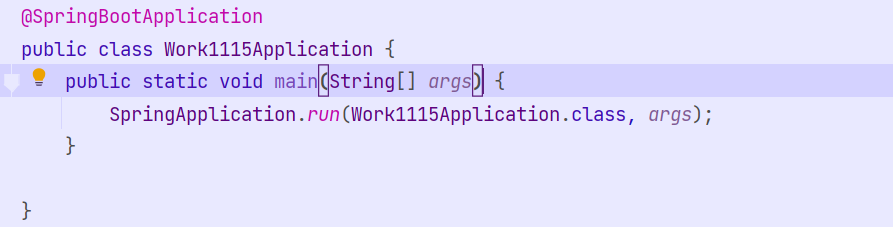
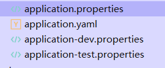
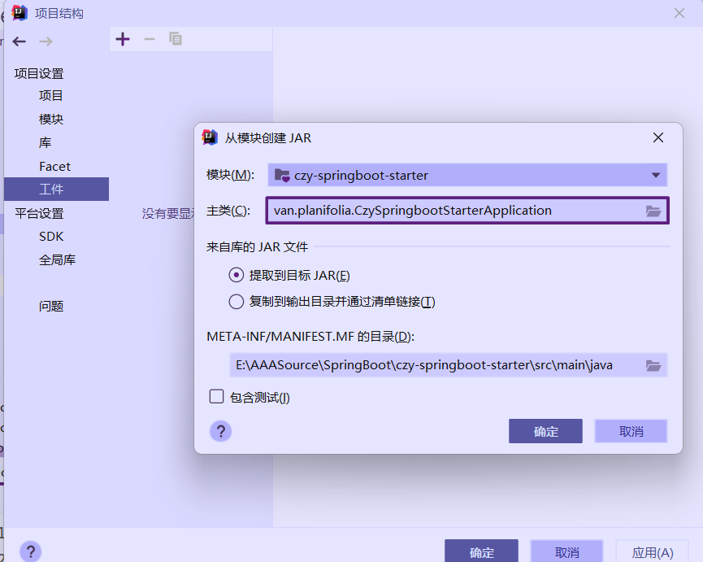

## SpringBoot

### 序

​	*我们从今天开始就进入了SpringBoot模块的学习了，SpringBoot是基于Spring4.0开发的一套新的IOC框架。他完全的继承了源Spring框架中的所有特性比如IOC,DI,以及AOP。并且解决了那些传统Spring框架中的繁琐问题，比如需要配置繁杂的xml文件。虽然使用注解能够简化部分xml标签的配置但是仍然是要配置包扫描等等，并且还要再web.xml文件中配置SpringMVC。那么SpringBoot的诞生就是为了解决这一问题，让开发者不在去劳心编写配置文件，做到真正的开箱即用。SpringBoot框架使用了特定的方式来进行配置【自动装配类】，从而使开发人员不再需要定义样板化的配置。通过这种方式，Spring Boot致力于在蓬勃发展的快速应用开发领域(rapid application development)成为领导者。* 

### 第一章 SpringBoot的介绍以及快速入门

#### 1. 什么是SpringBoot

- 其实我们在上面的序中也说了SpringBoot是Spring的一个子项目。是为了解决Spring中产生的一些列问题而出现的。他完美的继承了Spring框架中的一些非常经典的设计IOC 控制反转，DI 依赖注入，AOP 面向切面编程。并且简化了框架的使用，让用户无需配置大量的xml标签就能够直接使用整个框架。做到真正的开箱即用。显然当我们不要对框架进行配置的时候，那么框架的内部一定帮我们做了大量的配置工作。这就是SpringBoot的自动装配原理。这个原理我们会在后面着重讲解。

#### 2. SpringBoot的特点

- SpringBoot的特点其实就是Spring的那些痛点。总结一下大概就是下面的这六条

  > 1. 可以创建单独的Spring工程，而且SpringBoot内部是使用maven/Gradle进行管理的所以我们可以将我们创建的工程打成jar包或者war包的形式发布运行
  > 2. SpringBoot内置的TomCat/Jetty等Servlet容器，无需配置即可使用
  > 3. SpringBoot提供了大量的starter项目对象模型配置，用来简化传统的Maven配置，我们使用某个Spring提供的功能组件或者第三方组件的时候只要引入相应的stater依赖就能直接导入这个组件的核心依赖，以及这个组件所依赖的内容，并且还能根据springboot中的配置文件进行自动装配操作。所以说这个starter也是SpringBoot中非常重要的一个部分。我们后面有机会也是会手写starter来进行更深一层的探讨的。
  > 4. 尽可能的配置Spring中的类，让我们无需再去编写xml配置文件，我们在SpringBoot中除了要用application配置文件对SpringBoot中一些必要的属性进行配置之外几乎不会编写任何的配置文件。
  > 5. 提供生产就绪型功能：提供可以直接在生产环境中使用的功能，如性能指标、应用信息和应用健康检查。 
  > 6. 无需编写任何xml文件，也绝对没有任何代码生成。

#### 3. 使用IDEA快速创建一个SpringBoot项目

- IDEA作为世界上最好用的编程软件必然会为我们提供一个简便的创建SpringBoot项目的方法，我们下面就使用图文描述的形式来讲解一下如何使用IDEA快速的创建一个SpringBoot程序。

  > 首先是创建SpringBoot项目的必要内容，jdk版本必须大于等于1.8，maven版本必须3.2.5以上，开发软件需要选择IDEA(因为我们是使用IDEA来快速创建SpringBoot项目)。当然你也可以选择其他的编辑软件，然后去Spring的官网下载对应的项目压缩包进行导入。
  >
  > 做好以上准备之后我们就可以打开我们的编辑器，和往常一样点击创建新项目会进入到这个页面，并且点击左侧的SpringInitializer进入到这个设置项目信息的页面，第一行的服务器默认应该是 *start.spring.io*，如果我们进不去的话可以替换成我这个使用阿里云的服务器来创建。
  >
  > 
  >
  > 我们设置好之后点击下一步会进入到下面这个界面，我们在这可以选择SpringBoot的版本以及默认装入的maven依赖，这些依赖我们同样可以在创建完毕项目之后再为他添加进去。当我们挑选完要用的之后点击完成即可创建一个SpringBoot项目。
  >
  > 

#### 4. SpringBoot项目的结构

- 我们再上面创建完毕项目之后他应该是会给我们默认打开一个项目窗口的，这个项目窗口我们会发现它为我们创建了许多的文件夹以及默认创建的文件，我们下面就给大家介绍一下SpringBoot项目的具体结构。

  > 首先我们来放一个完整点的图片，我们可以看到其实和传统的Web项目的区别并不是很大，一个Java文件夹用来保存Java文件的，一个resource用来保存资源文件的。还有一个pom文件这个是用来配置maven依赖的。但是我们会发现它默认为我们创建了一个Application类文件，以在resource文件夹中创建了两个文件夹以及一个application.properties文件。我们会在后面对这些进行逐一的讲解
  >
  > 
  >
  > 首先是java文件夹下的Application类，这个类就是所谓的SpringBoot启动类，通过运行这个类就能将SpringBoot项目启动起来，当然SpringBoot项目内置了TomCat服务器启动的时候TomCat服务器也会随之启动。并且这个上面的注解是和SpringBoot的自动装配有着很大的关系我们会在后面进行讲解。
  >
  > 
  >
  > 然后是resource文件夹，这个文件夹下面有若干子文件夹
  >
  > ​	其中static是用来存放静态资源的
  >
  > ​	templates用来存放模板引擎的这些我们后面都会进行讲解
  >
  > ​	对于html网页的话我们可以直接放到resource文件夹下面。
  >
  > 对于application.propetrties则是用来对springboot中的核心内容以及后续添加的一些模块类进行配置的，这也涉及到自动装配的原理，我们会在后面进行具体讲解。我们现在只要知道可以在这个配置文件中可以配置springboot中的一些列参数即可。
  >
  > 

#### 5. SpringBoot中的配置文件

- 在SpringBoot中这个自动生成的配置文件可以说是我们在整个SpingBoot项目中需要进行配置的东西了，我们所有的内容包括tomcat的端口号，项目的访问路径。以及数据库的连接信息等等都需要在这个配置文件中进行一些列的配置。当然往底层了说这个配置文件与SpringBoot的自动装配原理也有着不小的关系，我们今天就暂且先简单的介绍一些SpringBoot中的这个配置文件。

  > 1. SpringBoot中的配置文件种类
  >
  >    在SpringBoot中是有两种配置文件的。一种是.properties的配置文件这种配置文件是使用k-v(键值对) 的形式来保存配置信息的，当然我们在之前的web项目中也使用过.properties文件来保存数据库的连接信息等。
  >
  >    第二种则是.yaml文件形式的配置文件，yaml文件是一种新型的标记型语言，这种语言相较于properties文件是更加的灵活易用，我们在这里作为配置文件使用的话需要注意的就是它的缩进了，在yaml文件中缩进代表层级关系下一层要比上一层缩进一个空格，并且上一层的结尾处要加上:我们在编写的时候idea会给我们相关的提示无需太过担心，但是yaml文件的语法格式是稍微有一点点复杂的想要完全掌握的话需要单独了解一下，但是对于我们只用它来配置SpringBoot的话掌握它的缩进格式就足够了。
  >
  >    并且这两种配置文件是可以同时存在的，并且对于配置不同的内容这两种配置文件是互补的关系，若是对于相同的配置内容则.properties配置文件的优先级比较高。我们下面就来使用这两种配置文件同时修改tomcat的端口号以及项目的访问路径来作为测试。
  >
  >    ~~~properties
  >    # 在properties文件中配置端口号为8082，访问路径为/czy
  >    # 应用名称
  >    spring.application.name=work-1115
  >    # 应用服务 WEB 访问端口
  >    server.port=8082
  >    # 配置访问路径为/czy
  >    server.servlet.context-path=/czy
  >    ~~~
  >
  >    ~~~yaml
  >    # 在yaml文件中配置端口号为8081，访问路径为/aaa
  >    # 应用名称
  >    spring:
  >      application:
  >        name: work-1115
  >    # tomcat的端口号
  >    server:
  >      port: 8081
  >      servlet:
  >        context-path: /aaa
  >    
  >    ~~~
  >
  >    显然根据我们测试可以得知properties中的配置是优先生效的，访问项目需要使用8081端口以及/aaa路径进行访问。
  >
  > 2. 在不同环境下切换配置文件
  >
  >    在开发环境以及测试环境中肯定是不能使用同一套配置的，在切换环境中必然会修改配置文件中的内容，但是当我们要修改bug的时候还是要从生产环境中切换回来又要修改一次配置文件，显然这样是非常不合理的所以，在SpringBoot中我们可以创建多个配置文件以适应不同的环境，并且我们可以在主配置文件中对这些配置文件进行修改选择的操作。
  >
  >    创建不同配置文件的形式就是在application后面添加 -环境 并且在主配置文件中可以对这些环境进行选择，如下图，我们把要配置的内容写在子配置文件中然后再主配置文件中切换这些配置文件
  >
  >    
  >
  >    ~~~properties
  >    # 选择需要的配置文件,等号后面写的就是子配置文件-后面的内容
  >    spring.profiles.active=dev
  >    ~~~
  >
  >    调试后我们发现确实，是按照application-dev.properties文件中的配置信息执行的
  >
  > 3. 在SpringBoot类中读取application配置文件中的内容
  >
  >    我们在开发完毕会将一些一些api的配置信息，以及后期可能要修改的内容写在配置文件中，因为我们的项目一旦被打成包，那么里面的内容都会是.class形式的文件，非常不方便我们修改。那么我们不妨将这些信息编写到application配置文件中，然后再编写一个配置类读取其中的信息，然后我们又可以再项目中使用这个配置类中的属性来进行一系列的操作。
  >
  >    就比如我们要将当前用户的appid，以及私钥，以及api的网关地址从配置文件中读取出来，我们的具体案例如下。
  >
  >    首先我们再配置文件中设定这些信息以供配置类读取
  >
  >    ~~~java
  >    # 设置单独的配置信息供配置类读取
  >    czy.api.message.url= http://www.baidu.com
  >    czy.api.message.key= dascxzwewqdsa1654
  >    czy.api.message.appid= 7896352142
  >    ~~~
  >
  >    ​	然后我们要编写配置类并且关联上配置文件，这里会用到一个注解@ConfigurationProperties，这个注解是用来关联SpringBoot的核心配置文件的，可以指定配置文件中的前缀，然后通过set注入的方式将配置文件中的值注入到这个配置类中。
  >
  >    ~~~java
  >    @Component
  >    // 这个注解的作用就是用来关联SpringBoot核心配置文件的信息的，当然也可以指定前缀
  >    @ConfigurationProperties(prefix = "czy.api.message")
  >    @Data
  >    public class CzyConfig {
  >        private String url;
  >        private String key;
  >        private String appid;
  >    }
  >    ~~~
  >
  >    ​	然后我们就要在Controller类中直接注入这个配置类就能读取到其中的信息了,奥差点忘了说SpringBoot中如何访问Controller了，就和SpringMvc中的方法一模一样，直接编写一个Controller类然后添加@Controller注解，然后编写Controller方法，设置关联映射即可实现Controller的访问，并且得益于SpringBoot中的 statre 依赖它自动帮我们添加了转json的对应工具包，我们只要return自己想返回的值即可。
  >
  >    ~~~java
  >    @RestController
  >    public class TestController {
  >        @Resource(name = "czyConfig")
  >        private CzyConfig config;
  >    
  >        /**
  >         * 返回配置信息的Controller方法
  >         * @return 需要的信息
  >         */
  >        @RequestMapping("/Message")
  >        public Object getMessage(){
  >            return config;
  >        }
  >    }
  >    ~~~
  >
  >    显然经过调试我们发现我们请求这个Controller确实可以读取到我们写在配置文件中的信息
  >
  >    那么除了使用配置类的形式我们能否不使用配置类只读取一条信息呢？显然是可以的，这样就要使用到另外一个注解了@Value（）这个注解的方法给某个字段注入相应的值@Value注解中要写入这个属性的详细名字,但是需要注意 我们在注解括号内要使用 ${} 来取配置文件中的数据否则就会直接将()中的内容注入到这个属性中
  >
  >    ~~~java
  >    @RestController
  >    public class TestController {
  >    
  >        @Resource(name = "czyConfig")
  >        private CzyConfig config;
  >        /**
  >         * 我们也可以使用@Value这个注解的方法给某个字段注入相应的值@Value注解中要写入这个属性的详细名字,但是需要注意
  >         * 我们在注解括号内要使用 ${} 来取配置文件中的数据否则就会直接将()中的内容注入到这个属性中
  >         */
  >        @Value("${spring.profiles.active}")
  >        private String active;
  >    
  >        /**
  >         * 返回配置信息的Controller方法
  >         *
  >         * @return 需要的信息
  >         */
  >        @RequestMapping("/Message")
  >        public Object getMessage() {
  >            return config;
  >        }
  >    
  >        @RequestMapping("/Active")
  >        public Object getActive() {
  >            return active;
  >        }
  >    }
  >    
  >    ~~~
  >
  >    我们经过调试访问上面的路径发现确实是可以取到单条数据的信息的

- 然后大家会发现我建子包都是与主启动类平级的，在SpringBoot项目中自己创建的子包必须写在与SpringBoot启动类平级的位置。

#### 6.SpringBoot中配置三大组件

- 我们在传统的Web项目中通常是去使用xml文件的形式去注册Servlet，Filter，Listener。那么我们在使用了SpringBoot之后就每一Web.xml文件了，那么我们如何去配置这些东西呢？在SpringBoot中采取了一种新的配置方法，使用配置类的方法来讲我们需要的组件注册到Spring容器中，他们的套路比较类似。首先是要创建一个配置类，然后在配置类中创建一个个的方法，将我们需要的组件注册到Spring容器中。

  > 具体的案例我们可以看下面的代码，注释已经打的十分详细了
  >
  > ~~~java
  > @Configuration
  > public class MyConfig {
  >     /**
  >      *     将本地的组件交给Spring管理的方法，就是创建一个方法这个方法上面添加Bean注解，这个方法的返回值为我们要注册的实例对象
  >      * 在这个方法内部则需要创建出这个对象的实例并且使用return语句返回。
  >      *     但是若这种类型的对象因为需要配置其他的东西从而被SpringBoot框架包装了一层我们则需要创建其对应的包装对象，并且按照
  >      * 包装对象的方法来给他设置信息并且返回包装对象，就像这个方法一样。
  >      * @return ServletRegistrationBean
  >      */
  >     @Bean
  >     public ServletRegistrationBean<HttpServlet> servletRegistrationBean(){
  >         // 创建Servlet的包装类对象
  >         ServletRegistrationBean<HttpServlet> servletRegistrationBean = new ServletRegistrationBean<>();
  >         // 为这个包装类对象设置名字，请求路径，具体要被管理的Servlet对象
  >         servletRegistrationBean.setName("myServlet");
  >         servletRegistrationBean.addUrlMappings("/my");
  >         servletRegistrationBean.setServlet(new MyServlet());
  >         return servletRegistrationBean;
  >     }
  >     /**
  >      * 这个方法和上面Servlet的方法一模一样，就不多说了
  >      * @return FilterRegistrationBean
  >      */
  >     @Bean
  >     public FilterRegistrationBean<Filter> filterRegistrationBean(){
  >         FilterRegistrationBean<Filter> filterRegistrationBean = new FilterRegistrationBean<>();
  >         filterRegistrationBean.setName("myFilter");
  >         filterRegistrationBean.addUrlPatterns("/*");
  >         filterRegistrationBean.setFilter(new MyFilter());
  >         return filterRegistrationBean;
  >     }
  > }
  > ~~~
  >
  > 然后我们经过调试发现确实是可以实现和之前传统web项目中的功能一样能够正确的访问到Servlet的
  >
  > 显然这种使用@Bean注解的方式不仅仅是用来注册这些组件的，它还可以注册一些普通的Bean，就比如下面，我们创建一个普通的Bean对象，然后使用这种方式将他注册到Spring容器中，然后在Controller
  >
  > 中拿到这个对象并且调用它的toString方法。
  >
  > 被注册的类
  >
  > ~~~java
  > public class MyBean {
  >     @Override
  >     public String toString() {
  >         return "MyBean{}";
  >     }
  > }
  > ~~~
  >
  > 使用@Bean的方法将MyBean注册到Spring容器中
  >
  > ~~~java
  >    /**
  >      * 当然使用这种方法肯定是可以注册普通的Bean类的，我们使用这种方法将普通的Bean类注册到Spring容器中然后就可以在任何地方获取
  >      * 到他们的实例对象
  >      * @return 注册的Bean对象
  >      */
  >     @Bean
  >     public MyBean registMyBean(){
  >         return new MyBean();
  >     }
  > ~~~
  >
  > 然后我们在用到它的地方将他注入进去
  >
  > ~~~java
  > @RestController
  > public class MyController {
  >     /**
  >      * 然后,我们在这使用Resource注入可以发现它注册的时候为这个bean注册是使用方法的名字进行注入的
  >      */
  >     @Resource(name = "registMyBean")
  >     private MyBean myBean;
  >     @RequestMapping("/mybean")
  >     public String  myBean(){
  >         return myBean.toString();
  >     }
  > }
  > 
  > ~~~
  >
  > 然后我们经过调试可以发现，确实我们不仅没有报空指针异常而且还成功的调用了myBean对象的toString方法。但是我们在注入的时候故意的使用了Resource注入，发现它为这个bean注册是使用方法的名字进行注入的，所以我们在Resource中的name属性为方法的名字

### 第二章 SpringBoot的底层原理

- 在这一章我们会着重的讲解一下SpringBoot中的底层原理，比如自动包扫描，自动装配，以及starter的具体实现原理。我们都知道越是方便的框架那么他的底层实现就是越巧妙且晦涩，而且这一块内容更是面试中的重中之重，所以我们在这单使用一整章来对他们进行具体的研讨。

#### 1.SpringBoot中的包扫描

- 我们在快速入门中就讲了我们在SpringBoot中创建包必须要在主启动类的平级位置，才能被SPringBoot扫描到并且注册到容器中，那么我们就要想了，它底层的实现必然是默认扫描的主启动类同级别的所有包内容。我们能否修改它包扫描的位置，答案是必然的它既然提供了这个功能就必定会提供修改它的方法，我们在下面就会使用翻阅源码+截图+讲解的方式来探究SpringBoot中的自动包扫描。

  > 首先我们创建一个SpringBoot项目它唯一存在Java代码的地方就是它的主启动类，那么它的一切一切的机制就必定是写在这个类中的。我们点进来可以看到这个主启动类啥玩意都没有就一个注解没办法只能点进这个注解一探究竟。然后我们会看到这样的画面。
  >
  > 其中上面的四个元注解不多解释没啥用
  >
  > 然后@SpringBootConfiguration则是标注了当前这个类为Spring的配置类
  >
  > @ComponentScan则是用来配置包扫描信息的，内置到了@SpringBootApplication中让我们可以直接在主启动类上的注解中配置额外的包扫描
  >
  > 那么剩下的就一个注解了@EnableAutoConfiguration，显然这个注解即起到了自动装配的功能又起到了自动扫描包的功能，那么它显然又是一个复合注解我们不妨点进去看一下
  >
  > 
  >
  > 点进去果然又是一个复合注解也是和我们猜想的一模一样，其中带了一个注解，并且导入了一个类，其实我们不妨可以剧透一下这个导入类的就是进行的自动装配的类我们在下一节讲解。而这个注解则就是自动扫描包的注解。我们也是点进去这个自动扫描包的注解看看。
  >
  > 
  >
  > 这个注解只导入了一个类，现在我们就可以断言了这个类就是自动扫描包的原理所在，直接点进去看看。
  >
  > 
  >
  > 点进这个Registrar类之后我们发现他是有两个方法，第一个方法里面我们会发现有一个getPackageName，显然这个就是获取包名字的方法，我们打上断点会发现它返回的值就是我们当前启动类所在的包路径van.planifolia。那么它就会将这个包下的所有包以及子包扫描并且注册到Spring容器中
  >
  > 
  >
  > 然后对于能否手动指定扫描包的位置那么当然是可以的，我们上面也说了注解@ComponentScan就是来指定包扫描信息的，我们可以在这注解中配置包扫描。但是新版的Spring中直接把这个注解是集成到主启动类上面，也就是说我们可以直接在著启动类中配置包扫描的信息。甚至还可以配置指定排除被扫描的；类。
  >
  > ~~~java
  > @SpringBootApplication(scanBasePackages = {"van.planifolia"},exclude = {})
  > ~~~

#### 2.SpringBoot中的自动装配原理

- 我们在上一小节中探讨了自动包扫描的底层实现，在SpringBoot中有一个更加重量级的原理就是自动装配，SpringBoot中那么多类我们为什么可以直接使用而不用在去配置他们的实例对象，以及他们的内部属性呢？就像传统的ssm项目我们要在web.xml文件中配置DispatcherServlet，而在Springboot项目中我们直接就可以使用Controller来实现请求相应，这都是要得益于SPringBoot中的自动装配。下面我们接着上一节继续讲解自动装配的原理。

  > 首先我们回到上一届的第二步骤，我们已经分析出来了这个导入的AutoConfigurationimportxxx.class
  >
  > 就是自动装配的核心所在，我们直接点进去看一波。
  >
  > 
  >
  > 点进去我们发现这是一个类啊，而且这个类中嵌套了许多内部类，第一次看这尼玛太乱了。我们也只好去一个个的方法去看，直到看到了这个方法getAutoConfigurationEntry()获取自动配置类条目，显然这个不就是我们要找的方法吗，那么我们不妨来看一下这个方法到底干了什么，看下面的图片。擦，对于这种核心方法应该给他多少加点代码注释啊，我们不妨使用调试的功能来对这个方法进行逐一探究。
  >
  > 
  >
  > 首先第一行它是判断了当前导入它的地方是否加入了自动装配这个注解，加入了就继续走，没有则返回空。
  >
  > 然后他是扫描排除的注解信息然后根据 spring-boot-autoconfigure-2.3.7.RELEASE.jar这个jar包下的 META-INF/spring.factories 文件中的信息挑选出来所有的候选类。注意这些类只是候选配置类，他们不一定会全部加载到Spring容器中。
  >
  > 然后回根据排除注解获取到所有要被排除的类，然后将这些要被排除的类从集合中排除出去。
  >
  > 最后将所有要排除出去的配置类排除之后就要进行过滤了，这个过滤也是非常非常的巧妙，他会根据我们在maven依赖中添加的starter配置来选择要留下来来自动装配类，比如我们只添加了web的starter那么经过这次过滤他只会留下web相关的配置类其他的都会被过滤掉。这里通过什么过滤的我们一会再说。
  >
  > 然后执行到最后我们就得到了要被自动装配的类列表。
  >
  > 然后通过 SpringFactoriesLoader 这个机制创建bean实例将他们放到Spring容器中。
  >
  > 这就是SpringBoot中的自动装配流程。
  >
  > ​	那么问题来了，SpringBoot是如何过滤出来这要被加载的类的呢？又是如何配置这些类的属性的呢？这些配置类与我们的配置文件application.properties有什么关系呢？我们在下面就举两个例子来进行演示。
  >
  > 1. DipatchServletAutoConfiguration 
  >
  >    我们在调试程序的时候发现了他加载的时候确实加载的23条中有这个类我们直接搜索这个类看看。根据这个类的注解信息我们简单可以得出，这个类是一个配置类，并且他的内部静态类提供了更多的信息。
  >
  >    其中我们看到这个注解@ConditionalOnClass，这个注解我们现在这剧透一下他就是来决定当前类是否要被真正加载到Spring容器中的原因，我们从下个例子就能得出为啥了。现在先放一放。
  >
  >    然后我们看他加了其他的两个注解@Configuration，@EnableConfigurationProperties。这俩说明他的内部静态类是一个配置类，并且这个配置类关联了一个配置文件类WebMvcProperties
  >
  >    
  >
  > 
  >
  > ​	我们继续往下看他的静态内部类，已经非常明显了，他在这注册了一个Bean对象并且根据		 WebMvcProperties.class里的配置信息将他需要的属性注入了进去，最后将DispatcherServlet交给了Spring容器供我们使用。
  >
  > 
  >
  > ​	我们现在已经知道了这些配置类是如何自动装配进去并且设置属性值的了，但是他们是如何关联到配置文件的还是不太清晰，别急 `救赎之道，就在其中(WebMvcProperties.class)`,直接点进去，擦果然这个人我见过，我们之前关联配置文件不就是这样写的吗，使用 @ConfigurationProperties(prefix = "spring.mvc")注解来关联配置类中所有以spring.mvc开头的。并且类内部已经设定好了默认的属性值我们就算不配置也能正常使用。
  >
  > 
  >
  > 好了其实到现在我们已经知道这些我们需要的对象是咋通过xxxAutoConfiguration 装配到Spring容器中的了也知道他们的内部属性是咋设置的了也知道他们是如何关联上配置文件的了，那么就剩下最后一个了Spring是怎样通过条件判断他们是否要被加载进去的呢？我们通过下个例子敬请见证！
  >
  > 2. CouchbaseDataAutoConfiguration
  >
  >    我们这次找一个我们没引入starter依赖的类看看，首先老规矩点进去看看吧。擦直接爆红了我们上面也说了他正是利用了这个注解来实现的当@ConditionalOnClass注解中的类不存在的时候这个被@ConditionalOnClass注解的类就会被过滤掉，从而实现starter依赖添加而加载，不添加则被过滤。
  >
  >    

- 经过了上面的代码调试其实读者都已经对自动装配大致有了一个理解那么大家来记忆下面这段自动装配的概念的时候应该就会比较容易。

  > 在SpringBoot的主启动类中添加了一个注解@SpringBootApplication，这个注解其实是一个复合注解，他内部不仅添加了组件扫描注解@ComponentScan而且添加了自动配置注解@EnableAutoConfiguration，这个自动配置注解也是一个复合注解他内部添加了一个@AutoConfigurationPackage注解用来实现包扫描，扫描所有和主启动类同级的类，而且导入了一个类AutoConfigurationImportSelector.calss，这个类就是自动装配的核心。这个类中有一个方法getAutoConfigurationEntry（）这个方法会读取SpringBoot-autoConfig.jar包下的MATA-INF下的spring.factory文件中写的所有xxxAutoConfig类到一个集合中。然后SpringBoot会对这些类进行一波去重与排除，最后剩下的类还要进行一次筛选。通过@ConditionalOnClass来判断当前类被加载的条件是否满足。简单点说也就是在maven依赖中是否引入了相应的starter依赖包从而筛选出那些真正需要被加载那些不需要被加载。然后就是通过SpringBoot的类加载工厂将这些自动装配类加载进去，然后这些自动装配类会将他们真正要注册进去的Bean通过@Bean注解+注册方法的形式注册进去。从而让我们无需配置就能直接使用。

#### 3.自定义SpringBoot中的Starter启动依赖

- 我们在最开始讲SpringBoot的入门的时候了解到了Starter启动依赖这个东西，在SpringBoot中他不仅能帮你把核心的功能依赖引入也能为你自动装配需要使用的核心配置，那么我们这一小节就模拟SPringBoot中的Starter依赖自定义一个。

  > 首先创建自定义starter依赖首先是要满足两个条件
  >
  > 1.能够根据自动配置项目所需要的配置信息，也就是自动加载依赖环境 。
  >
  > 2.能够配置文件，亦或是根据自身的默认值自己创建一个Bean对象并且交予Spring容器处理
  >
  > 而且我们不妨在参照我们上一小节举得两个例子来对照，首先我们是需要一个属性类，xxxProperties这个类的职责就是暂时保存配置属性信息，并且将类内部的字段关联到配置文件中。然后我们要创建一个xxxService类这个类就是我们真正的业务所在，负责执行我们需要提取出来公共使用的业务。然后就是xxxAutoConfiguration类，这个类负责完成自动装配功能并且将需要使用的业务类注册到容器中。然后就是创建MATE-INF包并且在保重创建spring.factory文件里面填写要被扫描的信息。我们下面就用代码演示的形式来创建一个Starter启动依赖。
  >
  > 首先按照上面说的先创建Properties类，并且设置一些字段，并且使用注解关联核心配置文件
  >
  > ~~~java
  > /**
  >  * Created by Intellij IDEA 
  >  * CzyStarter的配置类,需要使用ConfigurationProperties标注这是一个属性类，并且关联属性文件的开头
  >  * @author Planifolia.Van
  >  * @version 1.0
  >  * @date 2022/11/17 16:05
  >  */
  > @Data
  > @ConfigurationProperties("spring.czy")
  > public class CzyProperties {
  >     private String name;
  >     private String address;
  >     private String age;
  > }
  > ~~~
  >
  > 然后我们要创建业务类，里面封装了我们要使用的业务代码,里面我们要使用属性类所以直接使用构造器注入
  >
  > ~~~java
  > public class CzyService {
  >     /**
  >      * 引入属性文件，并且使用构造器注入
  >      */
  >     private CzyProperties czyProperties;
  > 
  >     public CzyService(CzyProperties czyProperties) {
  >         this.czyProperties = czyProperties;
  >     }
  > 
  >     /**
  >      * 调用模拟业务方法
  >      */
  >     public void show(){
  >         System.out.println("姓名：" + czyProperties.getName());
  >         System.out.println("年龄：" + czyProperties.getAge());
  >         System.out.println("地址：" + czyProperties.getAddress());
  >     }
  > }
  > ~~~
  >
  > 最后就是创建AutoConfiguration类在内部将业务类注册到Spring容器中，并且因为我们的Properties类已经被声明为配置文件类已经被注册到SPring容器中了我们在这直接注入使用即可。
  >
  > ~~~java
  > /**
  >  * Created by Intellij IDEA 
  >  * 创建自动装配类，注解自上而下依次讲解
  >  * 1.开启属性配置关联类为CzyProperties
  >  * 2.标注此类为配置类
  >  * 3.就算核心配置文件不写也允许此类加载如spring容器
  >  * 4.当CzyProperties类存在的时候才会自动装配
  >  *
  >  * @author Planifolia.Van
  >  * @version 1.0
  >  * @date 2022/11/17 16:11
  >  */
  > @EnableConfigurationProperties(CzyProperties.class)
  > @Configuration
  > @ConditionalOnProperty(prefix = "spring.czy", value = "enabled", matchIfMissing = true)
  > @ConditionalOnClass(CzyProperties.class)
  > public class CzyAutoConfiguration {
  >     /**
  >      * 因为注册CzyService需要一个类CzyProperties，而且这个类我们已经标注为属性文件类了，我们只要使用
  >      * 自动注入的方式获取到此类就ok了
  >      */
  >     @Autowired
  >     private CzyProperties czyProperties;
  >     /**
  >      * 然后我们要在这个方法中自动装配CzyService,使用方法注册的形式,当容器中没这个Bean的时候才去注册
  >      */
  >     @Bean
  >     @ConditionalOnMissingBean
  >     public CzyService czyService() {
  >         return new CzyService(czyProperties);
  >     }
  > }
  > ~~~
  >
  > 然后我们还要创建一个spring.factory文件，并且将我们刚才写的配置类添加进去，需要在resource文件夹下创建MATE-INF文件夹，并且创建spring.factory文件，在里面添加如下代码。
  >
  > ~~~java
  > org.springframework.boot.autoconfigure.EnableAutoConfiguration=van.planifolia.config.CzyAutoConfiguration
  > ~~~
  >
  > 然后我们starter类基本上已经写好了剩下的就是将他们打包，并且注册到maven核心仓库中就可以在其他项目中使用了。
  >
  > 对于打包，SPringBoot框架也为我们提供了打包方法我们只要进入到项目结构，选择工件然后选择相关的主启动类然后构建工件点击确定。
  >
  > 
  >
  > 然后我们再第一栏找到构建，选择最后的构建工件即可生成jar包
  >
  > 
  >
  > 然后我们就可以将刚才生成的jar包（out文件夹中）使用maven命令将他注册到仓库中，我们再其他工程就可以直接引用了,具体的maven命令如下。
  >
  > ~~~powershell
  > mvn install:install-file -DgroupId=van.planifolia -DartifactId=czy-springboot-starter -Dversion=1.0.0 -Dpackaging=jar -Dfile=D:\\czy-springboot-starter.jar
  > ~~~
  >
  > 然后我们在另外一个项目测试是否可以使用。先使用下面的依赖引入对应的starter，然后我们创建一个Controller类，然后调用Service类中的show方法看看结果
  >
  > ~~~xml
  > <dependency>
  >             <groupId>van.planifolia</groupId>
  >             <artifactId>czy-springboot-starter</artifactId>
  >             <version>1.0.0</version>
  >         </dependency>
  > ~~~
  >
  > ~~~java
  > @RestController
  > public class TestController {
  >     /**
  >      * 将需要使用的业务类注入
  >      */
  >     @Resource(name = "czyService")
  >     private CzyService czyService;
  > 
  >     /**
  >      * 调用czyService中的show方法
  >      * @return 测试
  >      */
  >     @RequestMapping("/czy")
  >     public String test(){
  >         czyService.show();
  >         return "123";
  >     }
  > }
  > ~~~
  >
  > 经过调试发现确实可以使用show但是因为我们没有在application.properties文件中进行任何配置所以输出的内容均为null，我们下面再核心配置文件中配置一些信息在运行一次查看结果。
  >
  > ~~~java
  > spring.czy.name=czy
  > spring.czy.age=18
  > spring.czy.address=hn
  > ~~~
  >
  > 配置之后我们发现确实可以读取到对应的信息了，那么我们自定义starter启动类就算是成功了。

### 第三章 SpringBoot整合数据源

#### 1.SpringBoot连接数据库

- 没啥好说的所有的Web框架最后都逃不过连接数据库的命运，对于新时代的SpringBoot框架那么他连接数据库必然是要必传统的Spring框架要方便得多的。往简单了说只要引入俩依赖，并且再核心配置文件中配置几行信息我们就能连接上数据库了。

  > 首先引入依赖是跑不掉的，我们要连的是MySql数据库首先要引入MySql-jdbc的对应依赖，然后只要再引入jdbc的starter启动依赖即可使用了。并且现在德鲁伊这个数据源因为其性能好可配置性高，大家更喜欢使用德鲁伊作为数据源，那么我在这就直接换成druid数据源；
  >
  > ~~~xml
  > <!--        MySql-java-->
  >         <dependency>
  >             <groupId>mysql</groupId>
  >             <artifactId>mysql-connector-java</artifactId>
  >         </dependency>
  > <!--        jdbcStarter-->
  >         <dependency>
  >             <groupId>org.springframework.boot</groupId>
  >             <artifactId>spring-boot-starter-jdbc</artifactId>
  >         </dependency>
  > <!--        使用德鲁伊数据源-->
  >         <dependency>
  >             <groupId>com.alibaba</groupId>
  >             <artifactId>druid-spring-boot-starter</artifactId>
  >             <version>1.2.15</version>
  >         </dependency>
  > ~~~
  >
  > 然后我们要配置数据源信息，因为使用了德鲁伊会与原生的配置略有差别但是差别不大，直接上配置文件了，下面依次配置的是驱动name，数据库url连接，用户名字，密码，初始连接数，最大活跃连接数，可以看到德鲁伊是默认使用连接池的并且给我们提供了连接池的配置方法
  >
  > ~~~yaml
  > spring:
  >   datasource:
  >     druid:
  >       driver-class-name: com.mysql.cj.jdbc.Driver
  >       url: jdbc:mysql://localhost:3306/usermessage?serverTimezone=Asia/Shanghai
  >       username: root
  >       password: 010713
  >       initial-size: 5
  >       max-active: 10
  > ~~~
  >
  > 然后我们使用测试类，查看是否能够获取到对应的数据库连接，运行结果发现确实是获得到了连接信息并且我们使用了德鲁伊也可以从控制台看到具体的连接信息
  >
  > ~~~java
  > @SpringBootTest
  > class Work1117ApplicationTests {
  >     
  >     @Resource(name = "dataSource")
  >     private DataSource dataSource;
  > 
  >     @Test
  >     void contextLoads() {
  >         System.out.println(dataSource);
  >     }
  > }
  > ~~~
  >
  > 需要注意的是我们再SPringBoot中进行测试必须使用SpringBoot提供的测试类，或者仿照他这个测试类写新的测试类，单纯使用junit是无法启动Spring容器的。

#### 2.SpringBoot中对数据库进行操作

- 我们到现在一提起来对数据库操作必然先想到的是MyBatis因为他的dao代理实在是太方便了，其实再SpringBoot中已经为我们封装了一个工具类供我们进行数据库操作使用，也是非常方便的但是我们今天的主角是MyBatis，在这就简单的对这个工具类演示一波。

  > 我们分别使用这个工具类进行增删改查，以及多条查询操作
  >
  > ~~~java
  >     @Test
  >     void contextLoads() {
  >         // 首先我们要根据数据源来创建JdbcTemplate
  >         JdbcTemplate jdbcTemplate = new JdbcTemplate(dataSource);
  >         // 调用JdbcTemplate中的update方法，执行插入语句
  >         jdbcTemplate.update("insert into user(t_username, t_age, t_address , id) VALUES (?,?,?,?)", 123, 18, "aaa", 9);
  >         // 调用queryForList方法查询全部的信息
  >         System.out.println(jdbcTemplate.queryForList("select * from user"));
  >         // 更新方法修改id为2的人的年纪为199
  >         jdbcTemplate.update("update user set t_age=? where id=?", 199, 2);
  >         // 删除id为2的人的信息
  >         jdbcTemplate.update("delete from user where id=?", 2);
  >         // 查询单条语句比较复杂我们需要使用BeanPropertyRowMapper对象给他指定要返回值的类型
  >         System.out.println(jdbcTemplate.queryForObject("select * from user where id=?", new BeanPropertyRowMapper<User>(User.class), 1));
  >     }
  > }
  > ~~~
  >
  > 我们发现，这种方式并不算复杂但是，对于单条查询需要指定BeanPropertyRowMapper对象，而且对于列名与字段名不一致的情况解决方案就只有起别名并且对于一对多一对一查询很难实现，所以我们对于简单的sql可以使用这种方式，对于复杂的sql还是推荐使用mybatis。

- 那么如何再SpringBoot中引入mybatis呢？也是非常的简单只要添加对应的starter依赖就ok了，那些复杂的SqlSessionFactory的配置都通过SpringBoot的自动装配帮我们解决好了。我们只要再配置文件中指定一下对应的mapper文件扫描就ok了

  > 首先就是引入maven依赖，也没啥好说的官网随便一翻就找到了
  >
  > ~~~xml
  >         <dependency>
  >             <groupId>org.mybatis.spring.boot</groupId>
  >             <artifactId>mybatis-spring-boot-starter</artifactId>
  >             <version>2.1.0</version>
  >         </dependency>
  > ~~~
  >
  > 然后我们要分别创建service层，controller层，pojo层，以及mapper文件夹这里我就不做一步步演示了因为我们再之前学习ssm的时候已经使用的太多了。
  >
  > 然后我们要再配置文件中指定mapper文件的位置以及启动日志输出
  >
  > ~~~yml
  > mybatis:
  >   mapper-locations: classpath:/mapper/*.xml
  >   configuration:
  >     log-impl: org.apache.ibatis.logging.stdout.StdOutImpl
  > ~~~
  >
  > 然后我们就开始编写一个查询操作再测试mybatis是否成功整合完毕，首先是编写dao接口，创建UserDao接口类以及UserMapper.xml文件关联接口，以便后面实现代理类
  >
  > ~~~java
  > // userDao接口
  > public interface UserDao {
  >     /**
  >      * 查询全部
  >      * @return 全部的User信息
  >      */
  >     List<User> selectAll();
  > }
  > ~~~
  >
  > ~~~xml
  > // userMapper文件
  > 
  > <?xml version="1.0" encoding="UTF-8" ?>
  > <!DOCTYPE mapper
  >         PUBLIC "-//mybatis.org//DTD Mapper 3.0//EN"
  >         "http://mybatis.org/dtd/mybatis-3-mapper.dtd">
  > <mapper namespace="van.planifolia.dao.UserDao">
  > <!--    User表的ResultMap-->
  >     <resultMap id="UserResult" type="van.planifolia.pojo.User">
  >         <id column="id" property="id"/>
  >         <result column="t_username" property="username"/>
  >         <result column="t_age" property="age"/>
  >         <result column="t_address" property="address"/>
  >     </resultMap>
  > 
  > <!--    查询全部-->
  >     <select id="selectAll" resultMap="UserResult">
  >         select * from user
  >     </select>
  > </mapper>
  > ~~~
  >
  > 然后我们要再主启动类上开启Dao接口扫描注解为@MapperScan（basePackage=path）
  >
  > 通过这个注解就能指定对应的dao接口包进行扫描并且生成代理实现类,但是这样写的话idea左侧不会出现被Spring管理的图标标记，所以有强迫症的小伙伴可以直接再接口上添加注解@Mapper，也可以将当前接口标注为Mapper接口从而生成代理实现类。
  >
  > 剩下的就是写Service，写Controller了，因为实在没啥说的老一套的注入，我下面只做代码粘贴不在详细讲解。
  >
  > Service接口与实现类
  >
  > ~~~java
  > /**
  >  * Created by Intellij IDEA 
  >  * Service接口
  >  * @author Planifolia.Van
  >  * @version 1.0
  >  * @date 2022/11/17 18:24
  >  */
  > public interface UserService {
  >     /**
  >      * 获取全部的用户信息
  >      * @return 全部的用户信息List
  >      */
  >     List<User> getAllUserMessage();
  > }
  > 
  > /**
  >  * Created by Intellij IDEA 
  >  * Service的实现类
  >  * @author Planifolia.Van
  >  * @version 1.0
  >  * @date 2022/11/17 18:25
  >  */
  > @Service("userService")
  > public class UserServiceImpl implements UserService {
  >     @Resource
  >     private UserDao userDao;
  >     /**
  >      * 查询全部的实现方法
  >      * @return 全部的用户信息
  >      */
  >     @Override
  >     public List<User> getAllUserMessage() {
  >         return userDao.selectAll();
  >     }
  > }
  > ~~~
  >
  > Controller层
  >
  > ~~~java
  > /**
  >  * Created by Intellij IDEA 
  >  * User的控制层
  >  * @author Planifolia.Van
  >  * @version 1.0
  >  * @date 2022/11/17 18:24
  >  */
  > @RestController
  > public class UserController {
  >     @Resource
  >     private UserService userService;
  > 
  >     /**
  >      * 查询全部用户的控制器
  >      * @return 全部用户信息
  >      */
  >     @RequestMapping("/all")
  >     public List<User> getAllUser(){
  >         return userService.getAllUserMessage();
  >     }
  > }
  > ~~~
  >
  > 然后我们再浏览器请求发现确实得到了我们查询的全部信息，那么说明我们的mybatis已经成功整合到了SpringBoot项目当中。

#### 3.引入PageHelper分页插件以及实现对单表的增删改查操作

- PageHelper分页插件是我们之前非常常用并且好用的一款分页插件，他会对我们查询出来的结果进行进一步的封装，然后提供分页信息等等，那么我们下面就再SpringBoot中使用PageHelper实现对单表的增删改查操作，其实也就多条查询能用得到分页。

  > 首先使用一个模块必然是引入他的starter依赖，进入pagehelper的官网我们就可以找到。
  >
  > ~~~xml
  >    <dependency>
  >             <groupId>com.github.pagehelper</groupId>
  >             <artifactId>pagehelper-spring-boot-starter</artifactId>
  >             <version>1.2.3</version>
  >         </dependency>
  >         <dependency>
  >             <groupId>org.projectlombok</groupId>
  >             <artifactId>lombok</artifactId>
  >         </dependency>
  > ~~~
  >
  > 然后剩下的增删改查操作就是写mapper文件，写dao接口，写service层，写controller层。这些我也是直接粘贴代码了。
  >
  > mapper文件
  >
  > ~~~java
  > <?xml version="1.0" encoding="UTF-8" ?>
  > <!DOCTYPE mapper
  >         PUBLIC "-//mybatis.org//DTD Mapper 3.0//EN"
  >         "http://mybatis.org/dtd/mybatis-3-mapper.dtd">
  > <mapper namespace="van.planifolia.dao.UserDao">
  >     <!--    User表的ResultMap-->
  >     <resultMap id="UserResult" type="van.planifolia.pojo.User">
  >         <id column="id" property="id"/>
  >         <result column="t_username" property="username"/>
  >         <result column="t_age" property="age"/>
  >         <result column="t_address" property="address"/>
  >     </resultMap>
  >     <!--    插入一条记录-->
  >     <insert id="insertUser">
  >         insert into user (t_username, t_age, t_address)
  >         values (#{username}, #{age}, #{address});
  >     </insert>
  >     <!--    更新操作-->
  >     <update id="updateUser">
  >         update user
  >         <set>
  >             <if test="username !=null and username != '' ">
  >                 t_username=#{username},
  >             </if>
  >             <if test="age !=null and age != '' ">
  >                 t_age=#{age},
  >             </if>
  >             <if test="address !=null and address != '' ">
  >                 t_address=#{address},
  >             </if>
  >         </set>
  >         <where>
  >             id=#{id}
  >         </where>
  >     </update>
  >     <!--    删除用户记录-->
  >     <delete id="deleteUser">
  >         delete
  >         from user
  >         where id = #{id}
  >     </delete>
  >     <!--    查询全部-->
  >     <select id="selectAll" resultMap="UserResult">
  >         select *
  >         from user
  >     </select>
  >     <!--    查询单条-->
  >     <select id="selectUserById" resultMap="UserResult">
  >         select *
  >         from user
  >         where id = #{id}
  >     </select>
  > </mapper>
  > ~~~
  >
  > dao接口
  >
  > ~~~java
  > package van.planifolia.dao;
  > 
  > import org.apache.ibatis.annotations.Mapper;
  > import van.planifolia.pojo.User;
  > 
  > import java.util.List;
  > 
  > /**
  >  * @author dell
  >  */
  > @Mapper
  > public interface UserDao {
  >     /**
  >      * 查询全部
  >      * @return 全部的User信息
  >      */
  >     List<User> selectAll();
  > 
  >     /**
  >      * 插入一条记录
  >      * @param user 要被插入的记录
  >      * @return 受影响的行数
  >      */
  >     int insertUser(User user);
  > 
  >     /**
  >      * 根据用户id删除用户
  >      * @param id 被删除用户的id
  >      * @return 受影响的行数
  >      */
  >     int deleteUser(Integer id);
  > 
  >     /**
  >      * 修改操作
  >      * @param user 修改的信息
  >      * @return 受影响的行数
  >      */
  >     int updateUser(User user);
  > 
  >     /**
  >      * 根据用户的id查询信息
  >      * @param id 用户的id
  >      * @return 查询到的信息
  >      */
  >     User selectUserById(Integer id);
  > }
  > 
  > ~~~
  >
  > Service接口
  >
  > ~~~java
  > package van.planifolia.service;
  > 
  > import com.github.pagehelper.PageInfo;
  > import van.planifolia.pojo.User;
  > 
  > /**
  >  * Created by Intellij IDEA 
  >  * Service接口
  >  * @author Planifolia.Van
  >  * @version 1.0
  >  * @date 2022/11/17 18:24
  >  */
  > public interface UserService {
  >     /**
  >      * 查询全部的实现方法
  >      * @return 全部的用户信息
  >      * @param pageIndex 页面索引
  >      * @param pageSize 页面大小
  >      */
  >     PageInfo<User> getAllUserMessage(Integer pageSize, Integer pageIndex);
  > 
  >     /**
  >      * 根据id查询用户
  >      * @param id 用户的id
  >      * @return 单条用户信息
  >      */
  >     User getUserById(Integer id);
  > 
  >     /**
  >      * 插入一条用户信息
  >      * @param user 用户信息
  >      * @return 受影响的行数
  >      */
  >     int addUser(User user);
  > 
  >     /**
  >      * 根据id删除用户
  >      * @param id 被删除用户的id
  >      * @return 受影响的行数
  >      */
  >     int deleteUser(Integer id);
  > 
  >     /**
  >      * 更新一条用户信息
  >      * @param user 要更新的用户
  >      * @return 受影响的行数
  >      */
  >     int updateUser(User user);
  > }
  > 
  > ~~~
  >
  > Service实现类
  >
  > ~~~java
  > package van.planifolia.service.impl;
  > 
  > import com.github.pagehelper.PageHelper;
  > import com.github.pagehelper.PageInfo;
  > import org.springframework.stereotype.Service;
  > import van.planifolia.dao.UserDao;
  > import van.planifolia.pojo.User;
  > import van.planifolia.service.UserService;
  > 
  > import javax.annotation.Resource;
  > 
  > /**
  >  * Created by Intellij IDEA 
  >  * Service的实现类
  >  * @author Planifolia.Van
  >  * @version 1.0
  >  * @date 2022/11/17 18:25
  >  */
  > @Service("userService")
  > public class UserServiceImpl implements UserService {
  >     @Resource
  >     private UserDao userDao;
  > 
  >     /**
  >      * 查询全部的实现方法
  >      * @return 全部的用户信息
  >      * @param pageIndex 页面索引
  >      * @param pageSize 页面大小
  >      */
  >     @Override
  >     public PageInfo<User> getAllUserMessage(Integer pageSize, Integer pageIndex) {
  >         // 设置分页大小以及页码
  >         PageHelper.startPage(pageIndex, pageSize);
  >         // 将查询到的信息封装到PageInfo中并且返回
  >         return new PageInfo<>(userDao.selectAll());
  >     }
  > 
  >     /**
  >      * 查询单条用户
  >      * @param id 用户的id
  >      * @return 单条用户信息
  >      */
  >     @Override
  >     public User getUserById(Integer id) {
  >         return userDao.selectUserById(id);
  >     }
  > 
  >     /**
  >      * 插入一条用户信息
  >      * @param user 用户信息
  >      * @return 受影响的行数
  >      */
  >     @Override
  >     public int addUser(User user) {
  >         return userDao.insertUser(user);
  >     }
  >     /**
  >      * 根据id删除用户
  >      * @param id 被删除用户的id
  >      * @return 受影响的行数
  >      */
  >     @Override
  >     public int deleteUser(Integer id) {
  >         return userDao.deleteUser(id);
  >     }
  >     /**
  >      * 更新一条用户信息
  >      * @param user 要更新的用户
  >      * @return 受影响的行数
  >      */
  >     @Override
  >     public int updateUser(User user) {
  >         return userDao.updateUser(user);
  >     }
  > }
  > 
  > ~~~
  >
  > controller层
  >
  > ~~~java
  > package van.planifolia.controller;
  > 
  > import org.springframework.web.bind.annotation.RequestBody;
  > import org.springframework.web.bind.annotation.RequestMapping;
  > import org.springframework.web.bind.annotation.RestController;
  > import van.planifolia.pojo.User;
  > import van.planifolia.result.ComResult;
  > import van.planifolia.service.UserService;
  > 
  > import javax.annotation.Resource;
  > 
  > /**
  >  * Created by Intellij IDEA 
  >  * User的控制层
  >  *
  >  * @author Planifolia.Van
  >  * @version 1.0
  >  * @date 2022/11/17 18:24
  >  */
  > @RestController
  > public class UserController {
  >     @Resource
  >     private UserService userService;
  > 
  >     /**
  >      * 查询全部用户的控制器
  >      *
  >      * @param pageIndex 页面索引
  >      * @param pageSize  页面大小
  >      * @return 全部用户信息
  >      */
  >     @RequestMapping("/all")
  >     public ComResult getAllUser(Integer pageSize, Integer pageIndex) {
  >         return new ComResult(200, "查询成功", userService.getAllUserMessage(pageSize, pageIndex));
  >     }
  > 
  >     /**
  >      * 查询单条用户
  >      *
  >      * @param id 用户的id
  >      * @return 单条用户信息
  >      */
  >     @RequestMapping("/one")
  >     public ComResult getOneUser(Integer id) {
  >         return new ComResult(200, "查询成功", userService.getUserById(id));
  >     }
  > 
  >     /**
  >      * 插入一条用户信息
  >      *
  >      * @param user 用户信息
  >      * @return 公共的结果集
  >      */
  >     @RequestMapping("/add")
  >     public ComResult addOneUser(@RequestBody User user) {
  >         System.out.println(userService.addUser(user));
  >         return new ComResult(200, "添加成功");
  >     }
  > 
  >     /**
  >      * 根据id删除用户
  >      *
  >      * @param id 被删除用户的id
  >      * @return 公共的结果集
  >      */
  >     @RequestMapping("/remove")
  >     public ComResult removeUser(Integer id) {
  >         System.out.println(userService.deleteUser(id));
  >         return new ComResult(200, "删除成功");
  >     }
  > 
  >     /**
  >      * 更新一条用户信息
  >      *
  >      * @param user 要更新的用户
  >      * @return 公共的结果集
  >      */
  >     @RequestMapping("/modify")
  >     public ComResult modifyUser(@RequestBody User user) {
  >         System.out.println(userService.updateUser(user));
  >         return new ComResult(200, "修改成功");
  >     }
  > }
  > 
  > ~~~
  >
  > 最后的User实体类
  >
  > ~~~java
  > package van.planifolia.pojo;
  > 
  > import lombok.Data;
  > 
  > /**
  >  * Created by Intellij IDEA 
  >  *
  >  * @author Planifolia.Van
  >  * @version 1.0
  >  * @date 2022/11/17 17:30
  >  */
  > @Data
  > public class User {
  >     private Integer id;
  >     private String username;
  >     private String age;
  >     private String address;
  > }
  > 
  > ~~~
  >
  > 
  >
  > 剩下的就是使用postman进行逐一测试了，我已经测过了全部都可以正常使用的。读者可以课下自己测试。

### 第四章 SpringBoot中的小组件

- 这一张我们会讲解一下SpringBoot中的一些小组件，比如SpringBoot中的定时任务，SwaggerApi文档，以及thymeleaf模板引擎。这些小组件能够帮助我们提高开发效率，以及满足一些特殊的需求。

#### 1.SpringBoot中的定时器

- 在实际开发中我们必然会用到定时任务，就像每天的新闻推送，天气预报。通常都会每天都请求一次。所以我们就需要使用定时任务来进行实现。当然我们在没使用SpringBoot之前JDK是提供了一个TimeTask类的。但是这个类非常非常的难用。我曾经就使用过这个类来实现定时任务。但是我们引入SpringBoot之后。他为我们提供了定时器组件，然后我们就只要添加两个注解就能实现定时任务了。

  我们具体使用也是非常非常的简单。只要引入依赖，创建定时任务类，添加定时任务方法。在方法上面添加定时任务注解 `@Scheduled()` ，然后再注解中编写cron表达式。最后在启动类上面添加注解运行就ok拉。下面我们就简单的举一个例子。

  > 首先当然就是引入Starter依赖了。百度随便一搜就出来了。
  >
  > ~~~xml
  >  <!--引入定时器的依赖-->
  >         <dependency>
  >             <groupId>org.springframework.boot</groupId>
  >             <artifactId>spring-boot-starter-quartz</artifactId>
  >         </dependency>
  > ~~~
  >
  > 然后编写定时任务类TimeTask并且在类中添加定时任务方法设定好cron表达式
  >
  > ~~~java
  > /**
  >  * Created by Intellij IDEA 
  >  * 定时任务类，需要将他注册到Spring容器中
  >  * @author Planifolia.Van
  >  * @version 1.0
  >  * @date 2022/11/18 16:03
  >  */
  > @Component
  > public class TimeTask {
  >     /**
  >      * 定时任务方法，需要在方法上添加注解 @Scheduled(cron="cron表达式")
  >      */
  >     @Scheduled(cron = "0/5 * * * * ? ")
  >     public void test(){
  >         System.out.println("测试");
  >     }
  > }
  > ~~~
  >
  > cron表达式是一种定时任务的格式我们可以使用cron表达式计算器来计算出需要的规则表达式，比如我们在注解中写的代表着每5s执行一次。cron计算器网址如下 https://cron.qqe2.com/
  >
  > 最后就是在SpringBoot启动类上添加对应的注解以开启相应的功能。
  >
  > ~~~java
  > @SpringBootApplication
  > @MapperScan(basePackages = "van.planifolia.dao")
  > @EnableScheduling
  > public class Work1117Application {
  >     public static void main(String[] args) {
  >         SpringApplication.run(Work1117Application.class, args);
  >     }}
  > 
  > ~~~
  >
  > 我们启动SPringBoot服务就会发现每隔5秒在控制台输出一句话。说明配置成功了

#### 2.SpringBoot整合Swagger2

- 在真正的企业开发中我们单纯的在代码中编写注释文档是不够的，因为我们的代码不仅要给同为程序员的开发者看，也要给测试人员，前端人员看。甚至对于一些完全分离的企业来说，测试人员与前端人员根本就看不懂你的源码。那么我们这时候就需要写一份API文档了，告诉他们都有什么接口，测试的时候要给什么参数，会返回什么结果，这个api方法是用来干啥的。那些参数是必须的，那些是可省略的。这些都是我们要写在API文档上的。显然这份工作会落到我们开发人员的头上。对于早期的开发模式会将很大一段时间拿来编写api文档。当然现在许多的动态API文档组件出现了，我们只要将他配置到项目中并且进行合适的配置他就会根据我们的接口自动生成api文档，我们今天就要将动态API文档Swagger2整合到SpringBoot项目当中。

  > 为了方便测试不用再写一套Controller方法了，我们就再昨天写的项目基础上加上Swagger2来作为演示。
  >
  > 1. 首先对于SpringBoot引入一个新组件第一件事不就是找对应的依赖。这次需要引入的是两个分别为Swagger2以及Swagger的图形化界面
  >
  >    ~~~xml
  >    <!--引入swagger2的依赖-->
  >            <dependency>
  >                <groupId>com.spring4all</groupId>
  >                <artifactId>swagger-spring-boot-starter</artifactId>
  >                <version>1.9.1.RELEASE</version>
  >            </dependency>
  >            <!--swagger图形化界面-->
  >            <dependency>
  >                <groupId>com.github.xiaoymin</groupId>
  >                <artifactId>swagger-bootstrap-ui</artifactId>
  >                <version>1.9.6</version>
  >            </dependency>
  >    ~~~
  >
  > 2. 引入之后我们是要写一个配置类配置一下Swagger中的一些属性的
  >
  >    ~~~java
  >    /**
  >     * Created by Intellij IDEA 
  >     * Swagger2的配置类，需要标注他为配置类
  >     * @author Planifolia.Van
  >     * @version 1.0
  >     * @date 2022/11/18 16:35
  >     */
  >    @Configuration
  >    public class SwaggerConfig {
  >        /**
  >         * Swagger的核心功能类Docket，要把他注册到容器中
  >         * @return Docket对象
  >         */
  >        @Bean
  >        public Docket docketBean(){
  >            return new Docket(DocumentationType.SWAGGER_2);
  >        }
  >    }
  >    
  >    ~~~
  >
  > 3. 然后我们要在主启动类中添加注解@EnableSwagger2开启Swagger2，就和之前开启定时器一样， 其实此时我们已经能够访问Swagger页面了，当然此时的页面是没进行任何配置的都是默认的。大家可以先运行起来看一下效果 。
  >
  > 4. 我们能够成功进入就代表配置成功了，但是我们进去没有任何提示并且信息都是默认的并且不是我们当前项目的信息，下面我们就来配置Swagger页面的项目信息。当然这个配置是要在Config类中进行配置的，并且Swagger提供了链式编程，让我们配置起来非常的高效。究极版本如下，注释也是非常的详细读者仔细看一下就ok了
  >
  >    ~~~java
  >    /**
  >     * Created by Intellij IDEA 
  >     * Swagger2的配置类，需要标注他为配置类
  >     * @author Planifolia.Van
  >     * @version 1.0
  >     * @date 2022/11/18 16:35
  >     */
  >    @Configuration
  >    public class SwaggerConfig {
  >        /**
  >         * Swagger的核心功能类Docket，要把他注册到容器中
  >         * @return Docket对象
  >         */
  >        @Bean
  >        public Docket docketBean(){
  >            // 我们要配置Swagger界面的属性的话可以直接在new出来的Docket对象后面直接.方法进行配置
  >    
  >            return new Docket(DocumentationType.SWAGGER_2)
  >                    // 设置组名字
  >                    .groupName("UserMessageCRUD")
  >                    // 设置Api的信息，这里面他要的是一个ApiInfo对象，我们可以在这给他new出来也可单独写一个方法来进行配置
  >                    .apiInfo(new ApiInfo(
  >                            // 项目的标题
  >                            "用户信息CRUD",
  >                            // 描述
  >                            "对User表的增删改查操作",
  >                            // 版本号
  >                            "1.2.1",
  >                            // 服务条款地址
  >                            "https://alibaba.com",
  >                            // 开发者的信息
  >                            new Contact("Planifolia.Van","https://www.planifolia.van","zhenyuncui@gmail.com"),
  >                            // 执照，以及许可地址
  >                            "百度",
  >                            "https://baidu.com",
  >                            // 拓展信息
  >                            new ArrayList<>()
  >                            // 开启筛选
  >                    )).select()
  >                    // 使用请求路径筛选。所有请求路径开头为user的
  >                    .paths(e -> e.startsWith("/user"))
  >                    // 使用包扫描。扫描controller包下的
  >                    .apis(RequestHandlerSelectors.basePackage("van.planifolia.controller"))
  >                    .build();
  >        }
  >    }
  >    
  >    ~~~
  >
  >    
  >
  > 5. 然后我们再次进入到Swagger的ui界面可以看到确实是有了我们刚才配置的那些信息，但是我们发现对于这些api方法的描述以及对api的参数描述，返回值是缺失的。所以我们下面要对这些信息进行配置。配置这些东西大概要用到下面这些注解，这些注解都是用来标注Api的各个属性的，代码就简单的粘一下吧，毕竟这玩意又没啥好说的。
  >
  >    > - @Api：修饰整个类，描述Controller的作用
  >    > - @ApiOperation：描述一个类的一个方法，或者说一个接口
  >    > - @ApiImplicitParam：一个请求参数
  >    > - @ApiImplicitParams：多个请求参数
  >    > - @ApiModel：用对象来接收参数
  >    > - @ApiModelProperty：用对象接收参数时，描述对象的一个字段
  >
  >    ~~~java
  >    @RestController
  >    @RequestMapping("/user")
  >    @Api("对用户表进行操作的api类")
  >    public class UserController {
  >        @Resource
  >        private UserService userService;
  >    
  >        /**
  >         * 查询全部用户的控制器
  >         *
  >         * @param pageIndex 页面索引
  >         * @param pageSize  页面大小
  >         * @return 全部用户信息
  >         */
  >        @GetMapping("/all")
  >        @ApiOperation("获取全部用户的信息")
  >        @ApiImplicitParams({
  >                @ApiImplicitParam(name = "pageSize"
  >                        , value = "分页页面的大小"
  >                        , required = true
  >                        , dataType = "String"
  >                ),
  >                @ApiImplicitParam(name = "pageIndex"
  >                        , value = "当前的页码"
  >                        , required = true
  >                        , dataType = "String"
  >                )
  >        })
  >        public ComResult getAllUser(Integer pageSize, Integer pageIndex) {
  >            return new ComResult(200, "查询成功", userService.getAllUserMessage(pageSize, pageIndex));
  >        }
  >    
  >        /**
  >         * 查询单条用户
  >         *
  >         * @param id 用户的id
  >         * @return 单条用户信息
  >         */
  >        @GetMapping("/one")
  >        @ApiOperation("按照id获取用户信息")
  >        @ApiImplicitParam(
  >                name = "id",
  >                value = "用户id",
  >                required = true,
  >                dataType = "int"
  >        )
  >        public ComResult getOneUser(Integer id) {
  >            return new ComResult(200, "查询成功", userService.getUserById(id));
  >        }
  >    
  >        /**
  >         * 插入一条用户信息
  >         *
  >         * @param user 用户信息
  >         * @return 公共的结果集
  >         */
  >        @PostMapping("/add")
  >        @ApiOperation("添加一条用户信息")
  >        public ComResult addOneUser(@RequestBody User user) {
  >            System.out.println(userService.addUser(user));
  >            return new ComResult(200, "添加成功");
  >        }
  >    
  >        /**
  >         * 根据id删除用户
  >         *
  >         * @param id 被删除用户的id
  >         * @return 公共的结果集
  >         */
  >        @ApiOperation("按照id删除用户信息")
  >        @ApiImplicitParam(
  >                name = "id",
  >                value = "用户id",
  >                required = true,
  >                dataType = "int"
  >        )
  >        @DeleteMapping("/remove")
  >        public ComResult removeUser(Integer id) {
  >            System.out.println(userService.deleteUser(id));
  >            return new ComResult(200, "删除成功");
  >        }
  >    
  >        /**
  >         * 更新一条用户信息
  >         *
  >         * @param user 要更新的用户
  >         * @return 公共的结果集
  >         */
  >        @PutMapping("/modify")
  >        @ApiOperation(value = "按照id删除用户信息",notes = "123")
  >        public ComResult modifyUser(@RequestBody User user) {
  >            System.out.println(userService.updateUser(user));
  >            return new ComResult(200, "修改成功");
  >        }
  >    }
  >    
  >    ~~~
  >
  >    ~~~java
  >    @Data
  >    @ApiModel("用户的信息")
  >    public class User {
  >        @ApiModelProperty(name = "id", value = "用户id", required = true, dataType = "int")
  >        private Integer id;
  >        @ApiModelProperty(name = "username", value = "用户名字", dataType = "String")
  >        private String username;
  >        @ApiModelProperty(name = "age", value = "用户年龄", dataType = "String")
  >        private String age;
  >        @ApiModelProperty(name = "address", value = "用户住址", dataType = "String")
  >        private String address;
  >    }
  >    
  >    ~~~

#### 3.SpringBoot整合thymeleaf模板引擎

- 这一块内容其实属于选学内容，因为我们之前也已经学习了vue前后端分离技术，基本上使用vue+element框架就能实现对后端传入数据的各种各样展示了，而thymeleaf是个什么东西呢？它和jsp类似是一种模板引擎只不过他是作用到html网页上的。我们使用thymeleaf能够像使用jstl一样在html页码中读取并且展示数据。下面我们就来展示一下如何整合thymeleaf并且对数据进行简单的展示操作。

  > 1. 首先第一步当然是引入相关的starter依赖了
  >
  >    ~~~xml
  >      <dependency>
  >                <groupId>org.springframework.boot</groupId>
  >                <artifactId>spring-boot-starter-thymeleaf</artifactId>
  >            </dependency>
  >    ~~~
  >
  > 2. 引入过后我们就要写一个简单的页面对数据进行最简单的展示操作了，但是需要注意的是，我们使用thymeleaf管理html网页就必须将页面写到resource/templates 文件夹里面并且需要使用controller来实现页面间的路由无法直接访问templates中的html网页。当然我们这里的controller类是用于页面路由的所以就不能让他返回json数据格式了。
  >
  >    控制器类
  >
  >    ~~~java
  >    @Controller
  >    public class PageController {
  >        /**
  >         * 用来跳转到主页的Controller
  >         * @param model 存放数据的中间类
  >         * @return index.html
  >         */
  >        @RequestMapping("/Index")
  >        public String index(Model model){
  >            // 存放到model中的数据可以直接使用thymeleaf取到
  >            model.addAttribute("msg","你好世界！");
  >            // 要跳转到的页面
  >            return "index";
  >        }
  >    }
  >    ~~~
  >
  >    前端页面
  >
  >    ~~~html
  >    <!DOCTYPE html>
  >    <html lang="en" xmlns:th="http://www.thymeleaf.org">
  >    <head>
  >        <meta charset="UTF-8">
  >        <title>Title</title>
  >    </head>
  >    <body>
  >    <!--使用标签th:text="${变量}" 可以取出来我们在controller中存放的属性-->
  >    <h2 th:text="${msg}"></h2>
  >    </body>
  >    </html>
  >    ~~~
  >
  > 3. `th:`不仅能够绑定text也能绑定value属性用来给输入框进行赋值操作
  >
  >    修改上一小节的前端页面
  >
  >    ~~~html
  >    <!DOCTYPE html>
  >    <html lang="en" xmlns:th="http://www.thymeleaf.org">
  >    <head>
  >        <meta charset="UTF-8">
  >        <title>Title</title>
  >    </head>
  >    <body>
  >    <!--使用标签th:text="${变量}" 可以取出来我们在controller中存放的属性-->
  >    <h2 th:text="${msg}"></h2>
  >    <!--使用标签th:value="${变量}" 可以取出来我们在controller中存放的属性并且赋给input作为初始值-->
  >    <input type="text" th:value="${msg}">
  >    </body>
  >    </html>
  >    ~~~
  >
  > 4. Thymeleaf提供了一些内置对象用来操作数据，内置对象可以在前端页面直接使用引用方式为#引用当然这些对象以及其内部方法必须要写在${}中我们就简单测试几个
  >
  >    > ${#strings.isEmpty(key)}	判断字符串是否为空，如果为空返回true，否则返回false
  >    > ${#strings.contains(msg,‘T’)}	判断字符串是否包含指定的子串，如果包含返回true，否则返回false
  >    > ${#strings.startsWith(msg,‘a’)}	判断当前字符串是否以子串开头，如果是返回true，否则返回false
  >    > ${#strings.endsWith(msg,‘a’)}	判断当前字符串是否以子串结尾，如果是返回true，否则返回false
  >    > ${#strings.length(msg)}	返回字符串的长度
  >    > ${#strings.indexOf(msg,‘h’)}	查找子串的位置，并返回该子串的下标，如果没找到则返回-1
  >    > ${#strings.substring(msg,2,5)}	截取子串，用法与JDK的subString方法相同
  >    > ${#strings.toUpperCase(msg)}	字符串转大写
  >    > ${#strings.toLowerCase(msg)}	字符串转小写
  >
  >    在controller中添加一个变量 str :  "hello world"
  >
  >    修改前端页面,其实会发现这些方法和Java中的字符串方法没啥两样对照使用就行了
  >
  >    ~~~html
  >    <!DOCTYPE html>
  >    <html lang="en" xmlns:th="http://www.thymeleaf.org">
  >    <head>
  >        <meta charset="UTF-8">
  >        <title>Title</title>
  >    </head>
  >    <body>
  >    <!--使用标签th:text="${变量}" 可以取出来我们在controller中存放的属性-->
  >    msg:<h2 th:text="${msg}"></h2>
  >    str:<h2 th:text="${str}"></h2>
  >    <!--使用标签th:value="${变量}" 可以取出来我们在controller中存放的属性并且赋给input作为初始值-->
  >    <input type="text" th:value="${msg}">
  >     
  >    全部转化为大写：

  >    字符串的长度为：

  >    截取字符串2-6位：

  >    追加两边字符串：

  >    </body>
  >    </html
  >    ~~~
  >
  > 5. 内置操作时间对象的方法，这些方法是不是也是很眼熟很简单，是就对了没啥好说的直接使用就行了
  >
  >    ${#dates.format(key)}	格式化日期，默认的以浏览器默认语言为格式化标准
  >    ${#dates.format(key,‘yyyy/MM/dd’)}	按照自定义的格式做日期转换
  >    ${#dates.year(key)}	取年
  >    ${#dates.month(key)}	取月
  >    ${#dates.day(key)}	取日
  >
  >    在controller方法添加一个时间对象 `model.addAttribute("date", LocalDate.now());`
  >
  >    修改前端页面
  >
  >    ~~~html
  >    <!DOCTYPE html>
  >    <html lang="en" xmlns:th="http://www.thymeleaf.org">
  >    <head>
  >        <meta charset="UTF-8">
  >        <title>Title</title>
  >    </head>
  >    <body>
  >    <!--使用标签th:text="${变量}" 可以取出来我们在controller中存放的属性-->
  >    msg:<h2 th:text="${msg}"></h2>
  >    str:<h2 th:text="${str}"></h2>
  >    <!--使用标签th:value="${变量}" 可以取出来我们在controller中存放的属性并且赋给input作为初始值-->
  >    
===============================================================================================

  >    <input type="text" th:value="${msg}"> 
  >    
  >    
===============================================================================================

  >     
  >    全部转化为大写： 
  >    
  >    字符串的长度为： 
  >    
  >    截取字符串2-6位： 
  >    
  >    追加两边字符串： 
  >    
  >    
===============================================================================================

  >     
  >    将时间转化为浏览器默认格式： 
  >    将时间转化为指定格式： 
  >    取年： 
  >    </body>
  >    </html>
  >    ~~~
  >
  > 6. 条件判断，条件判断是所有编程语言绕不过去的坎，在thymeleaf中你甚至可以使用switch case来实现条件判断
  >
  >    修改前端页面
  >
  >    ~~~html
  >    字符串的长度是否大于5： 5}">确实大于5
  >    确实小于5 
  >    字符串的长度为：
  >    

  >        
长度1

  >        
长度10

  >        
长度11

  >        
长度20

  >    

  >    ~~~
  >
  > 7. 循环便利，补全上最后的循环，我们使用thyemleaf就能展示任何数据了
  >
  >    首先在controller中分别添加一个list和一个map
  >
  >    ~~~java
  >     List<String> strings = new ArrayList<>();
  >            strings.add("漳州");
  >            strings.add("豫州");
  >            strings.add("荆州");
  >            Map<String,List<String>> address = new HashMap<>();
  >            address.put("地区",strings);
  >            model.addAttribute("address",address);
  >    ~~~
  >
  >    修改前端页面，展示这个map
  >
  >    ~~~html
  >    <!--取出map中的k与v，然后循环输出v-->
  >    

  >        
  >        
  >            
  >        
  >    

  >    ~~~
  >
  > 8. 在thymeleaf中提供了和jsp中一模一样的 域属性 request，session，application。并且可以调用这里面的方法就像java代码一样。
  >
  >    ~~~html
  >    
  >    
  >    
  >    ~~~
  >
  > 9. 跳转连接的写法，我们可以取controller中传来的数据作为请求参数舒勇thymeleaf来进行连接跳转
  >
  >    接受请求的controller
  >
  >    ~~~java
  >    
  >        /**
  >         * 接受前端请求的controller
  >         * @param msg1 消息1
  >         * @param msg2 消息2
  >         * @return 消息输出到网页
  >         */
  >        @RequestMapping("/show")
  >        @ResponseBody
  >        public String show(String msg1,String msg2){
  >            return msg1+","+msg2;
  >        }
  >    }
  >    ~~~
  >
  >    发送请求的html
  >
  >    ~~~html
  >    <a th:href="@{show?msg1='haha'&msg2='hehe'}">静态参数跳转连接</a>
  >    <a th:href="@{show(msg1=${msg},msg2=${str})}">动态参数跳转连接</a>
  >    ~~~
  >
  >    当然使用thymeleaf能够很好的支持restfull风格，对此我们要修改controller代码以及前端页面代码
  >
  >    ~~~java
  >     /**
  >         * 接受前端请求的controller
  >         * @param msg1 消息1
  >         * @param msg2 消息2
  >         * @return 消息输出到网页
  >         */
  >        @RequestMapping("/showsp/{msg1}/{msg2}")
  >        @ResponseBody
  >        public String showSp(@PathVariable String msg1, @PathVariable String msg2){
  >            return msg1+","+msg2;
  >        }
  >    ~~~
  >
  >    ~~~html
  >    <a th:href="@{/showsp/{msg1}/{msg2} (msg1=${msg},msg2=${str})}">restfull风格的请求</a>
  >    ~~~
  >
  >    这样我们就会发现浏览器栏的请求地址就变成了restfull风格不在有参数的名字写在浏览器上面
  >
  >    
  >
  >    

### 第四章SpringBoot整合MyBatisPlus

- 今天我们就来学习一些Mybatis-plus这个持久层框架。要说mybatis-plus并不是一个新的框架，更像是对MyBatis的增强包，它在MyBatis的基础上进行了一些列的增强与拓展，但是并不是替代是互补的关系，使用MyBatis-Plus进行单表操作的时候无需编写sql语句以及Mapper文件。但是对于多表查询还是要使用传统的MyBatis。

  MyBatis-plus官网：https://baomidou.com/pages/24112f/

#### 1.SpringBoot中引入MP

- 引入一个新的东西第一件要干到事必然是引入相关的依赖了。我们可以进入mp的官网，它内部必然会提供相关的依赖信息，在SpringBoot项目中只要引入对应的starter依赖即可。但是需要注意的是这个Mybatis-plus是基于MyBatis的所以我们要先引入MyBatis的依赖在引入Mp的。

  > 下面基本上就是jdbc，mysql，mp，以及一些杂七杂八的依赖了
  >
  > ~~~xml
  >     <dependencies>
  >         <dependency>
  >             <groupId>org.springframework.boot</groupId>
  >             <artifactId>spring-boot-starter-web</artifactId>
  >         </dependency>
  >         <dependency>
  >             <groupId>org.springframework.boot</groupId>
  >             <artifactId>spring-boot-starter-test</artifactId>
  >             <scope>test</scope>
  >             <exclusions>
  >                 <exclusion>
  >                     <groupId>org.junit.vintage</groupId>
  >                     <artifactId>junit-vintage-engine</artifactId>
  >                 </exclusion>
  >             </exclusions>
  >         </dependency>
  >         <!--mp依赖-->
  >         <dependency>
  >             <groupId>com.baomidou</groupId>
  >             <artifactId>mybatis-plus-boot-starter</artifactId>
  >             <version>3.5.0</version>
  >         </dependency>
  >         <!--        MySql-java-->
  >         <dependency>
  >             <groupId>mysql</groupId>
  >             <artifactId>mysql-connector-java</artifactId>
  >         </dependency>
  >         <!--        jdbcStarter-->
  >         <dependency>
  >             <groupId>org.springframework.boot</groupId>
  >             <artifactId>spring-boot-starter-jdbc</artifactId>
  >         </dependency>
  >         <!--        使用德鲁伊数据源-->
  >         <dependency>
  >             <groupId>com.alibaba</groupId>
  >             <artifactId>druid-spring-boot-starter</artifactId>
  >             <version>1.2.15</version>
  >         </dependency>
  >         <!--        mybatis-->
  >         <dependency>
  >             <groupId>org.mybatis.spring.boot</groupId>
  >             <artifactId>mybatis-spring-boot-starter</artifactId>
  >             <version>2.1.0</version>
  >         </dependency>
  > <!--        lombook-->
  >         <dependency>
  >             <groupId>org.projectlombok</groupId>
  >             <artifactId>lombok</artifactId>
  >         </dependency>
  >         <!--引入swagger2的依赖-->
  >         <dependency>
  >             <groupId>com.spring4all</groupId>
  >             <artifactId>swagger-spring-boot-starter</artifactId>
  >             <version>1.9.1.RELEASE</version>
  >         </dependency>
  >         <!--swagger图形化界面-->
  >         <dependency>
  >             <groupId>com.github.xiaoymin</groupId>
  >             <artifactId>swagger-bootstrap-ui</artifactId>
  >             <version>1.9.6</version>
  >         </dependency>
  >     </dependencies>
  > ~~~
  >
  > 引入依赖之后我们自然是要先配置application文件配置数据库信息
  >
  > ~~~yml
  > spring:
  >   datasource:
  >     druid:
  >       driver-class-name: com.mysql.cj.jdbc.Driver
  >       url: jdbc:mysql://localhost:3306/usermessage?serverTimezone=Asia/Shanghai
  >       username: root
  >       password: 010713
  >       initial-size: 5
  >       max-active: 10
  > mybatis-plus:
  >   configuration:
  >     log-impl: org.apache.ibatis.logging.stdout.StdOutImpl
  > ~~~
  >
  > 然后是数据库相关的文件，我们只写了一个user表来测试单表的crud操作
  >
  > ~~~sql
  > DROP TABLE IF EXISTS `user`;
  > CREATE TABLE `user`  (
  >   `t_username` varchar(255) CHARACTER SET utf8 COLLATE utf8_general_ci NULL DEFAULT NULL,
  >   `id` int(11) NOT NULL AUTO_INCREMENT,
  >   `t_age` varchar(10) CHARACTER SET utf8 COLLATE utf8_general_ci NULL DEFAULT NULL,
  >   `t_address` varchar(255) CHARACTER SET utf8 COLLATE utf8_general_ci NULL DEFAULT NULL,
  >   PRIMARY KEY (`id`) USING BTREE
  > ) ENGINE = InnoDB AUTO_INCREMENT = 309293058 CHARACTER SET = utf8 COLLATE = utf8_general_ci ROW_FORMAT = Dynamic;
  > 
  > -- ----------------------------
  > -- Records of user
  > -- ----------------------------
  > INSERT INTO `user` VALUES ('曹操', 1, '18', '河北');
  > INSERT INTO `user` VALUES ('找铿', 3, '36', '广州');
  > INSERT INTO `user` VALUES ('袁术', 309293057, '16', '郑州');
  > ~~~
  >
  > 然后我们就创建一下相关的实体类，User对应user表，但是需要注意的是，表的列名以及表名可能和实体类中的字段名不一致。mp当然为我们提供了相关的解决办法，使用注解可以配置列与字段之间的联系。
  >
  > - @TableName("user") 设置实体类在数据库中的表名
  > - @TableId(type = IdType.AUTO) 标注为主键字段并且可以在属性中设置主键的自增方式
  > - @TableField(value = "t_username") 标注实体类中字段对应的数据库列名
  > - @TableField(exist = false) 设置这一个字段在数据库中不存在
  >
  > 具体的实体类代码如下
  >
  > ~~~java
  > @Data
  > @ApiModel("用户的信息")
  > @TableName("user")
  > public class User {
  > 
  >     @TableId(type = IdType.AUTO)
  >     @ApiModelProperty(name = "id", value = "用户id",  dataType = "int")
  >     private Integer id;
  > 
  >     @TableField(value = "t_username")
  >     @ApiModelProperty(name = "username", value = "用户名字", dataType = "String")
  >     private String username;
  > 
  >     @TableField(value = "t_age")
  >     @ApiModelProperty(name = "age", value = "用户年龄", dataType = "String")
  >     private String age;
  > 
  >     @TableField(value = "t_address")
  >     @ApiModelProperty(name = "address", value = "用户住址", dataType = "String")
  >     private String address;
  > }
  > 
  > ~~~
  >
  > 至此，mp的安装就已经结束了，我们会在下一届对它的内置crud方法进行一波测试。

#### 2.MyBatis-plus的CRUD

- 我们上面也说了在Mp中它已经内置了一系列的单表增删改查操作，并且无需编写sql语句，那么我们这一小节就在测试类中对它的增删改查操作进行一波测试。

  > ​	首先就是查询操作，mp中默认提供了两大类查询一个是按照id查询，我们直接传入id数据就ok了还提供了一种条件查询，并且mp提供了一个条件类，内部提供了一系列的方法供我们设置条件，然后我们只要将设置好的条件当作参数传给条件查询方法即可。
  >
  > 我们先来看一下按照id查询的操作。很简单就是调用一个方法吧id作为参数传递进去即可正常使用了，并且可以传入id的集合进行批量查询，并且由于我们配置了日志输出工具可以在控制台看到sql语句的执行代码
  >
  > ~~~java
  >     @Test
  >     void queryTest() {
  >         // 首先是按照id查询信息直接调用selectById传入对应的id即可
  >         System.out.println(userDao.selectById(1));
  >         // 然后是按照id们进行批量查询，我们可以传入一个id集合来进行查询
  >         System.out.println(userDao.selectBatchIds(Arrays.asList(1, 3)));
  >     }
  > ~~~
  >
  > 生成的sql语句，以及结果
  >
  > ~~~txt
  > ==>  Preparing: SELECT id,t_username AS username,t_age AS age,t_address AS address FROM user WHERE id=? 
  > ==> Parameters: 1(Integer)
  > <==    Columns: id, username, age, address
  > <==        Row: 1, 曹操, 18, 河北
  > <==      Total: 1
  > Closing non transactional SqlSession [org.apache.ibatis.session.defaults.DefaultSqlSession@447521e]
  > User(id=1, username=曹操, age=18, address=河北)
  > ~~~
  >
  > 然后我们在来看一下指定条件的查询操作，这种查询相较于主键查询当然是更灵活的，可以自定义查询条件。
  >
  > ~~~java
  >     @Test
  >     void queryTest() {
  >         // 最后就是按照条件进行查询我们可以自定义条件按
  >         System.out.println(
  >                 userDao.selectList(
  >                     // 我们首先是要创建查询条件对象，并且使用链式编程为它设置条件
  >                         new QueryWrapper<User>()
  >                                 // 条件1 名字里带操的
  >                                 .like("t_username", "操")
  >                                 // 使用了or代表两个条件任意满足即可，若不使用or则为默认and连接
  >                                 .or()
  >                                 // 条件2代表id为1的
  >                                 .eq("id", 1)
  >                 )
  >         );
  >     }
  > ~~~
  >
  > 生成的sql语句，以及结果，我们发现它生成的sql语句确实是和我们给出的条件相吻合的。
  >
  > ~~~txt
  > ==>  Preparing: SELECT id,t_username AS username,t_age AS age,t_address AS address FROM user WHERE (t_username LIKE ? OR id = ?) 
  > ==> Parameters: %操%(String), 1(Integer)
  > <==    Columns: id, username, age, address
  > <==        Row: 1, 曹操, 18, 河北
  > <==      Total: 1
  > Closing non transactional SqlSession [org.apache.ibatis.session.defaults.DefaultSqlSession@96abc76]
  > [User(id=1, username=曹操, age=18, address=河北)]
  > 
  > ~~~
  >
  > ​	然后是添加操作，添加操作我们在没看具体代码之前大致可以想出也没什么复杂的我们只要给被添加的内容(实体类对象)作为参数传递过去，mp就会为我们生成插入的sql语句并且将实体类对象属性作为插入的内容进行填充。这里主键生成是有一点内容的，可以在实体类中使用注解@TableId进行配置
  >
  > ~~~java
  >     @Test
  >     void insertTest() {
  >         // 显然我们可以看到插入就这一个方法insert，并且传入参数为User对象。
  >         // 但是你会发现我并没传入主键id，在mp中它会自动生成主键id但是有具体的生成策略的，我们可以在实体类中使用
  >         // 注解 @TableId(type = IdType.AUTO) 进行配置，点进去IdType这个类可以看到具体的生成策略，我们在这
  >         // 使用的是自动增长
  >         userDao.insert(
  >                 new User().setAddress("河北").setUsername("袁绍").setAge("68")
  >         );
  >     }
  > ~~~
  >
  > 执行的sql语句,很显然这种主键策略使用的数据库中内置的主键生成策略
  >
  > ~~~txt
  > ==>  Preparing: INSERT INTO user ( t_username, t_age, t_address ) VALUES ( ?, ?, ? ) 
  > ==> Parameters: 袁绍(String), 68(String), 河北(String)
  > <==    Updates: 1
  > ~~~
  >
  > ​	删除操作，其实删除操作和查询操作是基本相同的，大致分为两大类按照id删除，按照条件删除。并且id删除细分为单条id以及多条id集合删除。条件删除则需要创建条件对象并且设置条件。
  >
  > ~~~java
  >     @Test
  >     void deleteTest(){
  >         // 第一种按照单条id删除
  >         userDao.deleteById(309293058);
  >         // 第二种则是按照id们进行批量删除
  >         userDao.deleteBatchIds(Arrays.asList(309293059,309293060));
  >         // 第三种就是按照条件进行删除的了编写方法几乎和查询一样
  >         userDao.delete(
  >                 new UpdateWrapper<User>()
  >                 .eq("t_username","袁绍")
  >         );
  >     }
  > ~~~
  >
  > sql语句
  >
  > ~~~txt
  > ==>  Preparing: DELETE FROM user WHERE (t_username = ?) 
  > ==> Parameters: 袁绍(String)
  > <==    Updates: 1
  > ==>  Preparing: DELETE FROM user WHERE id IN ( ? , ? ) 
  > ==> Parameters: 309293059(Integer), 309293060(Integer)
  > <==    Updates: 2
  > ~~~
  >
  > ​	最后就是更新的操作了，更新其实也没啥按照正常逻辑必然是两种更新一种按照id更新一种按照条件更新，不过mp种提供了使用lambda表达式的条件对象LambdaxxxWrapper，因为具体的使用方法都是一样的我在这就只那Update操作进行演示了。
  >
  > ~~~java
  > @Test
  >     public void updateTest() {
  >         // 可以按照id进行修改，这个id属性要直接放到传入的user对象种
  >         userDao.updateById(new User().setUsername("原皮").setAddress("河北").setAge("38").setId(309293057));
  >         // 然后是第二种，按照条件继续修改，这里条件我们使用LambdaUpdateWrapper
  >         LambdaUpdateWrapper<User> lambdaUpdateWrapper = new LambdaUpdateWrapper<>();
  >         // 使用LambdaUpdateWrapper第一个参数必须使用方法引用的方式否则会爆出莫名的错误
  >         lambdaUpdateWrapper
  >                 // eq方法代表是否相等
  >                 .eq(User::getUsername, "原皮")
  >                 .or()
  >                 // between代表在两者之间
  >                 .between(User::getAge, 8, 18);
  >         userDao.update(new User().setUsername("原皮").setAddress("河北").setAge("38").setId(309293057), lambdaUpdateWrapper);
  >     }
  > }
  > 
  > ~~~
  >
  > sql语句
  >
  > ~~~txt
  > ==>  Preparing: UPDATE user SET t_username=?, t_age=?, t_address=? WHERE (t_username = ? OR t_age BETWEEN ? AND ?) 
  > ==> Parameters: 原皮(String), 38(String), 河北(String), 原皮(String), 8(Integer), 18(Integer)
  > <==    Updates: 2
  > 
  > ==>  Preparing: UPDATE user SET t_username=?, t_age=?, t_address=? WHERE id=? 
  > ==> Parameters: 原皮(String), 38(String), 河北(String), 309293057(Integer)
  > <==    Updates: 1
  > ~~~
  >
  > ​	分页操作，在mp种内置了基于 MyBatis 物理分页，开发者无需关心具体操作，配置好插件之后，写分页等同于普通 List 查询，使用方法和PageHelper分页插件基本上一样，我们只要设置好页码大小以及当前页码即可，mp也是为我们封装了一个分页对象Page，需要注意的是包千万别导错了。而且在使用分页之前我们还是要配置一下分页拦截器，只要写一个配置类注册一个bean即可
  >
  > ~~~java
  > @Configuration
  > public class MPConfig {
  >     /**
  >      * 配置mp的分页拦截器
  >      * @return 分页拦截器对象
  >      */
  >     @Bean
  >     public MybatisPlusInterceptor mybatisPlusInterceptor() {
  >         MybatisPlusInterceptor interceptor = new MybatisPlusInterceptor();
  >         interceptor.addInnerInterceptor(new PaginationInnerInterceptor(DbType.MYSQL));
  >         return interceptor;
  >     }
  > }
  > ~~~
  >
  > ~~~java
  >     @Test
  >     public void selectPageTest() {
  >         // 用来设置分页的信息
  >         Page<User> pageCfg = new Page<>(1,3);
  >         // 执行查询语句,这里要将上面创建的页码配置信息放进去，然后调用selectPage方法
  >         Page<User> page = userDao.selectPage(pageCfg, null);
  >         System.out.println("pageSize:"+page.getSize());
  >         System.out.println("pageMsg:"+page.getRecords());
  >         System.out.println("total:"+page.getTotal());
  >     }
  > ~~~
  >
  > sql语句以及结果
  >
  > ~~~java
  > ==>  Preparing: SELECT COUNT(*) AS total FROM user 
  > ==> Parameters: 
  > <==    Columns: total
  > <==        Row: 5
  > <==      Total: 1
  > ==>  Preparing: SELECT id,t_username AS username,t_age AS age,t_address AS address FROM user LIMIT ? 
  > ==> Parameters: 3(Long)
  > <==    Columns: id, username, age, address
  > <==        Row: 1, 原皮, 38, 河北
  > <==        Row: 3, 找铿, 36, 广州
  > <==        Row: 309293057, 原皮, 38, 河北
  > <==      Total: 3
  > Closing non transactional SqlSession [org.apache.ibatis.session.defaults.DefaultSqlSession@774d8276]
  > pageSize:3
  > pageMsg:[User(id=1, username=原皮, age=38, address=河北), User(id=3, username=找铿, age=36, address=广州), User(id=309293057, username=原皮, age=38, address=河北)]
  > total:5
  > ~~~
  >
  > 其实我们发现使用mp进行数据库操作我们完全不需要编写sql语句可以说是纯粹的面向对象操作。我们所有的单表操作都可以通过mp中提供的Wrapper中的方法进行设置，但是对于sql编写比较熟练的人还是感觉直接写sql更加的方便好用一点，但是对于没学过sql语句的人使用mp确实可以提高开发效率。

#### 3.使用Mp替换MyBatis

- 使用mp替换传统的MyBatis，之前也说了mp是对mybatis的拓展插件，并且无需mapper文件的创建了，那么我们只需要把service层中的代码换成调用baseMapper中预先提供的方法然后手动为他设置查询条件即可。

  > ~~~java
  > /**
  >  * Created by Intellij IDEA 
  >  * Service的实现类
  >  * @author Planifolia.Van
  >  * @version 1.0
  >  * @date 2022/11/17 18:25
  >  */
  > @Service("userService")
  > public class UserServiceImpl implements UserService {
  >     @Resource
  >     private UserDao userDao;
  > 
  >     /**
  >      * 查询全部的实现方法
  >      * @return 全部的用户信息
  >      * @param pageSize 页面大小
  >      * @param pageIndex 页面索引
  >      */
  >     @Override
  >     public Page<User> getAllUserMessage(Integer pageSize, Integer pageIndex) {
  >         // 使用MP的分页以及查询全部信息,首先创建分页对象
  >         Page<User> page = new Page<>(pageIndex,pageSize);
  >         // 将查询到的信息封装到Page中并且返回
  >         return userDao.selectPage(page, null);
  >     }
  > 
  >     /**
  >      * 查询单条用户
  >      * @param id 用户的id
  >      * @return 单条用户信息
  >      */
  >     @Override
  >     public User getUserById(Integer id) {
  >         return userDao.selectById(id);
  >     }
  > 
  >     /**
  >      * 插入一条用户信息
  >      * @param user 用户信息
  >      * @return 受影响的行数
  >      */
  >     @Override
  >     public int addUser(User user) {
  >         return userDao.insert(user);
  >     }
  >     /**
  >      * 根据id删除用户
  >      * @param id 被删除用户的id
  >      * @return 受影响的行数
  >      */
  >     @Override
  >     public int deleteUser(Integer id) {
  >         return userDao.delete(
  >                 new QueryWrapper<User>().eq("id",id)
  >         );
  >     }
  >     /**
  >      * 更新一条用户信息
  >      * @param user 要更新的用户
  >      * @return 受影响的行数
  >      */
  >     @Override
  >     public int updateUser(User user) {
  >         return userDao.update(
  >                 user,
  >                 new UpdateWrapper<User>().eq("id",user.getId())
  >         );
  >     }
  > }
  > 
  > ~~~
  >
  > 对于其他层的代码我们无需做任何改变，其实这也体现出来我们使用分层开发的优越之处，耦合性极低在这只是修改了业务层的实现类就将mybatis框架替换成了mp。