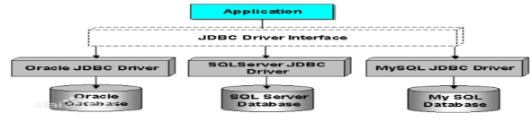
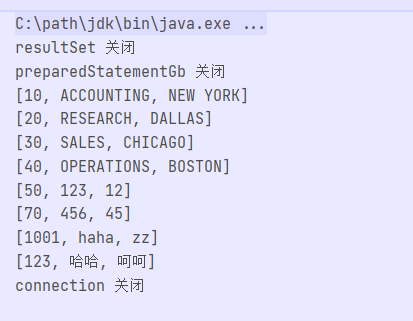

## 

*引言*

​    从今天其我们就进入了JDBC的学习，虽然我们在后面的学习中几乎从来不会去写原生的JDBC代码，但是这是我们Java连接MySQL的开始也是基础。所以我们要深刻理解JDBC的设计模式以及熟练敲出jdbc中的 ’五步走‘ 的代码结构。

## JDBC第一天

##### 1.什么是jdbc

- jdbc是Java官方开发的一组用于连接数据库，执行SQL语句的一组api，用户只需要通过jdbc去连接上数据库然后通过对应的一些方法传入sql语句与相应的参数就可以对数据库执行相应的sql操作。并且jdbc是一组接口，他并没有对相应的增删改进行具体的实现而只是制定了一组接口剩下的具体实现交给相应的数据库厂商进行。

- 为什么jdk只创建一组接口而不是去直接实现他们的功能？

  因为目前市面上有许许多多的数据库软件，如果jdk对每一种数据库程序都开发一套jdbc程序那么必然是很大的工作量，而且对每一种数据库创建一组api也不利于程序员们的使用与学习。而且如果数据库厂商对自己的数据库进行了升级那么jdk是不是也要随之升级否则就无法连接上数据库，这显然是不合理的，所以jdk不妨就只去创建一组接口，剩下的交给数据库厂商这样既制定了规范又能减少工作量。

  

##### 2.jdbc的基础操作

- 我们在上面也进行探讨了jdbc是用来干啥的 1.与数据库建立连接 2.创建sql/预编译sql 3.执行sql语句 4.处理结果集 5.关闭资源。这四项就是jdbc为我们提供的api，我们通过这些功能就能完美的与数据库建立来连接并且执行crud操作。

- jdbc的五步走，经典代码要牢记

  - 1.加载驱动

    首先我们在使用jdbc之前我们需要去引入对应的jar包并且去加载对应的jdbc驱动，然后我们才能使用jdbc中的内容对数据库进行操作，虽然目前新版本的MySQL已经不需要加载驱动，读者大可根据自己的版本来决定是否要添加这一项。

    ~~~xml
    mysql与java的连接jar包
    <!-- https://mvnrepository.com/artifact/mysql/mysql-connector-java -->
            <dependency>
                <groupId>mysql</groupId>
                <artifactId>mysql-connector-java</artifactId>
                <version>8.0.27</version>
            </dependency>
    ~~~

    ~~~java
    //加载驱动 括号内写的是驱动类的全限定名
    Class.forName("com.mysql.cj.jdbc.Driver");
    ~~~

  - 2.创建连接

    我们在执行sql语句之前是要先和数据库建立好连接的，这是就用到了我们jdbc中的三大接口之一Connection与唯一的类DriverManger,我们获取到Connection对象之后就可以通过Connection对象去获取Statment

    ~~~java
     //获取连接 
    //getConnection方法括号中写的是jdbc的连接地址具体格式如下
    // jdbc:数据库://ip地址:数据库端口号/数据库名
    Connection connection = DriverManager.getConnection("jdbc:mysql://localhost:3306/mydb01");
    
    ~~~

  - 3.创建/预编译sql语句

    我们在获取connection连接之后就可以通过connection去获取stament对象，获取到这个对象之后我们就可以去通过这个对象中的方法执行我们要执行的sql语句，同样对于预编译的sql语句我们可以通过connection中的对应方法获取PreparedStatment SQL预编译对象。

    ~~~java
    //创建非预编译的sql语句，通过createStatement()方法
    Statement statement = connection.createStatement();
    //创建预编译的sql语句，我们可以通过prepareStatement方法并且给他传入对应的sql语句来创建预编译
    PreparedStatement preparedStatement = connection.prepareStatement("select * from dept where deptno=?");
    ~~~

  - 4.执行sql语句

    我们通过上一步之后就可以去执行对应的sql语句了，对于非预编译语句我们需要在执行的时候为他传入sql语句，若为预编译的语句我们则需要给他设置对应的预编译指值也就是我们之前用？作为占位符的内容，然后执行完毕之后若为查询语句则会返回一个结果集，我们要使用while循环去便利这个结果集，而对于增删改的更新操作则会返回影响的行数。

    ~~~java
    //预编译模式下的更新与查询操作
    
    PreparedStatement preparedStatement = connection.prepareStatement("select * from dept where deptno=?");
    preparedStatement.setInt(1,10);
            ResultSet resultSet = preparedStatement.executeQuery();
    		
            while (resultSet.next()){
                System.out.println(resultSet.getObject(1));
                System.out.println(resultSet.getObject(2));
            }
            PreparedStatement ps1 = connection.prepareStatement("insert into  dept values(?,?,?) ");
            ps1.setObject(1,1234);
            ps1.setObject(2,"hehe");
            ps1.setObject(3,"haha");
            if(ps1.executeUpdate()>0){
                System.out.println("插入成功！");
            }
        }
    
    //非预编译的更新与查询操作
            Statement statement = connection.createStatement();
            ResultSet resultSet1 = statement.executeQuery("select * from dept");
            while (resultSet1.next()){
                System.out.println(resultSet.getObject(1));
                System.out.println(resultSet.getObject(2));
            }
            Statement statement2 = connection.createStatement();
            int i = statement2.executeUpdate("delete from dept where deptno=1");
            if (i>0){
                System.out.println("删除完毕");
            }
    ~~~

  - 5.关闭资源
  
    我们在获取完毕查询结果(结果集)后需要将之前使用的一些资源给他关闭，比如Connection，Statment，ResultSet。并且关闭的顺序尽量要从后往前进行关闭。
  
    ~~~java
    ResultSet.close();
    Statment.close();
    Connection.close();
    ~~~
  
  ##### 3.处理多行结果集
  
  - 对于查询到的多行结果要如何处理，我们都知道在执行完毕查询语句之后会返回一个ResultSet结果集，这个结果集可以保存单行数据也可以保存多行数据，但是ResultSet有一个特性，他是有一个next指针，初始的时候next指针是指向第一行数据的上一行的，所以我们再去取数据的时候必须先执行一次next（）
  
    方法，才能去取值。我们上面也说了resultset是可以保存多行数据的，并且有一个next指针的，所以我们不妨就使用while循环去判断resultSet.next()，若返回值不为false就继续执行next若为false则终止，然后再while循环内部去去result中的值。
  
    ~~~java
     Statement statement = connection.createStatement();
            ResultSet resultSet1 = statement.executeQuery("select * from dept");
    //使用while循环去便利resultSet来取其中的结果
            while (resultSet1.next()){
                System.out.println(resultSet.getObject(1));
                System.out.println(resultSet.getObject(2));
            }
    ~~~
  

## JDBC第二天

##### 1.回顾传统jdbc写法

- 我们回顾上面写jdbc代码的时候发现每去写一次都会有许多的重复工作，比如重复的建立连接，重复的释放连接，所以对我们程序员来说不妨去封装一两个工具方法去实现加载驱动，创建连接和关闭连接。

##### 2.着手封装工具类

- 首先我们要做的是加载驱动，对于加载驱动我们其实只需要执行一遍那么我们就不妨将他们放在static代码块中，只在加载类的时候去执行一次，

  ~~~java
  static {
          //加载驱动
          try {
              Class.forName("com.mysql.cj.jdbc.Driver");
          } catch (ClassNotFoundException e) {
              e.printStackTrace();
          }
      }
  ~~~

  

- 然后我们要抽取公共代码对于创建连接来说就那一句代码，我们只要创建一个方法让他返回Connection类型的数据然后直接return 通过DriverManger获得到的Connection就行了。同样我们要去做一个简单的异常处理当出现异常的时候去return null就行了

  ~~~java
   /**
       * 获取数据库连接
       *
       * @param dbName 连接的数据库名字
       * @return 返回数据库连接，当出现异常的时候返回null
       */
      public static Connection getConnection(String dbName, String uname, String upass) {
          try {
              return DriverManager.getConnection(CONNECTION_URL.replace("DBNAME", dbName), uname, upass);
          } catch (SQLException throwables) {
              throwables.printStackTrace();
          }
          return null;
      }
  ~~~

- 然后对于关闭资源也同样的很简单，我们只要传入对应的三个资源就可以了，但是我们要进行一些非空的判断否则我们如果不做非空判断那么很容易就会出现空指针异常。

  ~~~java
  
   /**
       * 关闭数据库连接 
       * <b>会回收所有资源包括传进来的以及类中的临时资源</b>
       *
       * @param connection 数据库的连接
       * @param statement  数据库的ps对象
       * @param resultSet  数据库的结果集资源
       */
      public static void simpleClose(Connection connection, Statement statement, ResultSet resultSet) {
  
          //结果集关闭
          if (resultSet != null) {
              try {
                  resultSet.close();
              } catch (SQLException e) {
                  e.printStackTrace();
              }
              resultSet = null;
              System.out.println("resultSet 关闭");
          }
  
          if (resultSetGb != null) {
              try {
                  resultSetGb.close();
              } catch (SQLException e) {
                  e.printStackTrace();
              }
              resultSetGb = null;
              System.out.println("resultSetGb 关闭");
  
          }
  
  
          if (statement != null) {
              try {
                  statement.close();
              } catch (SQLException e) {
                  e.printStackTrace();
              }
              statement = null;
              System.out.println("statement 关闭");
  
          }
          if (preparedStatementGb != null) {
              try {
                  preparedStatementGb.close();
              } catch (SQLException e) {
                  e.printStackTrace();
              }
              System.out.println("preparedStatementGb 关闭");
              preparedStatementGb = null;
  
          }
  
  
          if (connectionGb != null) {
              try {
                  connectionGb.close();
              } catch (SQLException e) {
                  e.printStackTrace();
              }
              connectionGb = null;
              System.out.println("connectionGb 关闭");
  
          }
  
          if (connection != null) {
              try {
                  connection.close();
              } catch (SQLException e) {
                  e.printStackTrace();
              }
              connection = null;
              System.out.println("connection 关闭");
  
          }
  
      }
  ~~~

- 我们已经封装了获取资源与关闭资源的方法了然后我们也发现我们每次去创建statement，执行statement，处理RulstSet非常的麻烦所以我们想我们能不能也去封装一些工具类去完成查询操作与更新操作，说来就来。首先我们分析到对于执行sql语句的公共内容，他们都需要一个Sql语句，并且我们要是去实现预编译的话还需要一个参数来完成预处理，而且对于Connection资源我们可能会在后面仍然会用到。所以不妨直接不关闭他，当最后不在使用sql的时候再去关闭connection资源。

- 所以我们分析到了对于我们的更新语句我们只需要传入Connection对象，sql语句，以及一组值作为预编译的参数，显然我们的参数是不定长的使用可变参数是比较合适的。而且返回值为更新的行数 int类型。

  而对于查询语句因为我们可能会要返回多行，那么我们就可以使用List套List的形式去完成这个需求，内部List保存查询结果的一行，外部List用来保存所有的行，最后只要返回外部List就行了，参数的话还是和更新操作类似，需要连接，sql语句，一组数值作为参数。

  ~~~java
   public static int simpleUpdate(String sql, Connection connection, Object... args) {
  
          PreparedStatement statement = null;
          int i = 0;
  
          try {
              // 创建预编译
              if (connection == null) {
                  return 0;
              }
              statement = connection.prepareStatement(sql);
  
              // 便利参数数组去添加到预编译sql中
              if (args != null && args.length != 0) {
                  for (int j = 0; j < args.length; j++) {
                      statement.setObject(j + 1, args[j]);
                  }
              }
              //执行sql
              i = statement.executeUpdate();
          } catch (SQLException throwables) {
              throwables.printStackTrace();
          } finally {
              // 关闭资源
              simpleClose(null, statement, null);
          }
          return i;
      }
  
      /**
       * 将结果集封装为List并且自关闭资源的查询工具类 
       * <b>但是为了方便Connection不会自动关闭</b>
       *
       * @param sql        sql语句
       * @param connection 连接
       * @param args       查询参数
       * @return List封装的结果集
       */
      public static List<Object> simpleQueryToList(String sql, Connection connection, Object... args) {
          //变量作用域提升
          ResultSet resultSet = null;
          List<Object> outList = null;
  
          try {
              //调用其他方法去执行sql
              resultSet = simpleQuery(sql, connection, args);
  
              //创建一个外部数据保存全部信息
              outList = new ArrayList<>();
  
              //便利每一行
              while (resultSet.next()) {
  
                  //创建list保存一行中的具体信息
                  List<Object> inList = new ArrayList<>();
                  for (int i = 1; i <= resultSet.getMetaData().getColumnCount(); i++) {
                      inList.add(resultSet.getObject(i));
                  }
                  //将行信息保存到全部信息中
                  outList.add(inList);
              }
  
          } catch (Exception e) {
              e.printStackTrace();
          }finally {
              simpleClose(null, null, resultSet);
  
          }
          return outList;
      }
  ~~~

- 我们已经将查询 更新 以及获取连接 关闭连接的方法已经封装好了，下面我们就进入测试类简单的测试一下。

  ~~~java
  // 测试封装的获取连接与封装成List的查询方法与关闭资源方法   
      @Test
      public void test2() throws Exception {
          //通过工具类获取连接
          Connection connection = SimpleJDBC.getConnection("mydb01","root","010713");
          //通过工具类去执行sql语句
          List<Object> objects = SimpleJDBC.simpleQueryToList("select * from dept ", connection, null);
          for (Object object : objects) {
              System.out.println(object);
          }
          // 对于我们没有在外部创建的资源只要给他传入null值就行了
          SimpleJDBC.simpleClose(connection,null,null);
      }
  ~~~

  

- 我们发现一件事，我们在实际开发中将数据封装到List中还是有点不合理，因为我们很可能会将数据转存到实体类中。如果我们继续使用List去存储数据的话那么我们在取数据的时候要让数据内容与实体类中的属性保持一致的话就要去记住我们之前往里面存数据时的顺序，因为在List中保存的数据是没有标记的，是按照顺序而来的。

  所以我们要是想去准确的从封装的集合中取到内容，并且转存到实体类中我们可以借助key value保存信息的Map！我们将列的名保存为key，将列的值保存为value那么这一个map对象就保存了一行的数据。然后我们再把这一个个的Map再去保存到List中这样就保存了整张表的信息。

  实体类：Java中关联数据库的类被成为实体类，其中数据库中的一张表要与Java中的一个实体类对应，并且实体类中的每一个字段都要与数据库中的列一一对应，包括字段的名字，数据类型。而且实体类应该将字段私有化并且提供公共的get set方法以及toString方法。

  将结果集封装成Map的代码

  ~~~java
   /**
       *
       * 将结果封装成Map的子关闭资源查询工具类 
       * <b>但是为了方便Connection不会自动关闭</b>
       *
       * @param sql        sql语句
       * @param connection 数据库连接
       * @param args       预编译参数
       * @return 结果集List
       */
      public static List<Map<String, Object>> simpleQueryToListSp(String sql, Connection connection, Object... args) {
  
          ResultSet resultSet = null;
          List<Map<String, Object>> outList = null;
  
          try {
              //执行简单查询获取结果集
              resultSet = simpleQuery(sql, connection, args);
              //外部list保存每一列
              outList = new ArrayList<>();
              while (resultSet.next()) {
                  //没便利一列就创建一个map来保存这一列的数据
                  Map<String, Object> inMap = new HashMap<>();
                  //获取每一行的列并且将它保存入map
                  for (int i = 1; i <= resultSet.getMetaData().getColumnCount(); i++) {
                      inMap.put(resultSet.getMetaData().getColumnName(i), resultSet.getObject(i));
                  }
                 //将每一行的信息也就是map保存外部list中  
                  outList.add(inMap);
              }
          } catch (Exception e) {
              e.printStackTrace();
              return null;
          }finally {
              simpleClose(null, null, resultSet);
          }
          //返回整张表
          return outList;
      }
  ~~~

  将封装转化成实体类的代码 

  ~~~java
   @Test
      public void test1() throws Exception {
          Connection connection = SimpleJDBC.getConnection("mydb01","root","010713");
  		//接收到封装了整张表的maps
          List<Map<String, Object>> maps = SimpleJDBC.simpleQueryToListSp("select * from dept ", connection);
          //创建一个Dept类型的List来存放实体类
          List<Dept> depts = new ArrayList<>();
  		
          //便利整张表的map并且抽取出每一行将他们转存成Dept然后再将Dept对象保存到List中这样我们就得到了一个保存了全部Dept对象的List
          for (Map<String, Object> map : maps) {
              Dept dept = new Dept();
              dept.setDeptno(
                      (Integer) map.get("deptno")
              );
              dept.setDname((String) map.get("dname"));
              dept.setLoc((String) map.get("ioc"));
              System.out.println(dept);
          }
      }
  ~~~

  ## JDBC第三天

  ##### 1. DAO模式
  
  - 什么是dao模式
  
    DAO(Data Access Object 数据 访问 对象)三个字母大写那么他肯定就是三个英文字母的缩写，他其实是一种广大程序员约定成俗的一种设计模式DAO是分层设计种的一层主要是用来实现Java程序对数据库进行访问操作的，在这一层中通常是接收传递过来的数据然后根据数据去执行jdbc操作然后再返回执行的结果。
  
  - DAO中的内容
  
    在dao中一般包括如下内容 1.数据库访问工具(封装的jdbc工具类) 2.数据实体类(通常一个数据库表建立一个实体类并且实体类中的属性要与表的字段名) 3.DAO接口(对应前台的数据库请求来定制规则) 4.DAO实现类(实现具体的接口功能)
  
  - DAO实例(部门表的简单增删改查)
  
    在DAO模式中首先就是要基于数据库表来建立实体类，并且在实体类中创建的属性要严格的与数据库表中的字段保持一致这虽然不是硬性要求，但是为了后面的方便与编码的规范外面推荐让表中的字段与数据库保持一致。
  
    ~~~java
    Dept 实体类
        public class Dept {
    
        private int deptno;
        private String dname;
    
        public Dept(int deptno, String dname, String loc) {
            this.deptno = deptno;
            this.dname = dname;
            this.loc = loc;
        }
    
        public Dept() {
        }
    
        public int getDeptno() {
            return deptno;
        }
    
        public void setDeptno(int deptno) {
            this.deptno = deptno;
        }
    
        public String getDname() {
            return dname;
        }
    
        public void setDname(String dname) {
            this.dname = dname;
        }
    
        public String getLoc() {
            return loc;
        }
    
        public void setLoc(String loc) {
            this.loc = loc;
        }
    
        private String loc;
    
        @Override
        public String toString() {
            return "Dept{" +
                    "deptno=" + deptno +
                    ", dname='" + dname + '\'' +
                    ", loc='" + loc + '\'' +
                    '}';
        }
    }
    
    ~~~
  
    
  
    然后就是创建dao接口，dao接口是比较重要的一环，你要根据上面给出的需求去创建对应的方法接口然后还要根据前端传来的数据与需要返回的数据创建方法以及设置参数与返回值。
  
    ~~~java
    显然对于需求明确的deptDao，只要去写对应的部门类的增删改查操作就行了，比如部门的查询，按id查询，一个返回部门对象类型的List一个返回对象就🆗了
        
        public interface DeptDao {
    
        /**
         * 数据插入dept表
         * @param dept 插入的一行数据
         * @return 更新的行数
         */
        int insertIntoDept(Dept dept);
    
        /**
         * 删除一行数据
         * @param deptno 部门编号
         * @return 更新的行数
         */
        int deleteFromDept(int deptno);
    
        /**
         * 更新部门信息
         * @param dept 新的部门信息
         * @return 更新的行数
         */
        int updateToDept(Dept dept);
    
        /**
         * 根据deptno查询一行数据
         * @param deptno 部门编号
         * @return 查询的结果
         */
        Dept selectByDeptno(int deptno);
    
        /**
         * 查询部门表的全部信息
         * @return 部门信息的List
         */
        List<Dept> selectAll();
    }
    
        
    ~~~
  
    
  
    然后就是编写dao的实现类，dao的实现类就相较于数据库的设计和对于需求不明确dao接口的设计则简单多了只需要去根据需求调用一下jdbc方法然后处理一下返回结果就ok了
  
    ~~~java
    然后增删改操作基本上都是基于我们之前封装的JDBC工具类中的方法，我们要做的就是传入sql语句与参数然后处理一下返回的信息就行了
        
        public class DeptDaoImpl implements DeptDao {
        @Override
        public int insertIntoDept(Dept dept) {
    
            Connection connection = SimpleJDBC.getConnection("mydb01", "root", "010713");
    
            return SimpleJDBC.simpleUpdate("insert into dept values(?,?,?)", connection, dept.getDeptno(), dept.getDname(), dept.getLoc());
        }
    
        @Override
        public int deleteFromDept(int deptno) {
            Connection connection = SimpleJDBC.getConnection("mydb01", "root", "010713");
            return SimpleJDBC.simpleUpdate("delete from dept where deptno = ?",connection,deptno);
        }
    
        @Override
        public int updateToDept(Dept dept) {
            Connection connection = SimpleJDBC.getConnection("mydb01", "root", "010713");
            return SimpleJDBC.simpleUpdate("update dept set dname=?,loc=? where deptno=?",connection,dept.getDname(),dept.getLoc(),dept.getDeptno());
    
        }
    
        @Override
        public Dept selectByDeptno(int deptno) {
            Connection connection = SimpleJDBC.getConnection("mydb01", "root", "010713");
            List<Map<String, Object>> maps = SimpleJDBC.simpleQueryToListSp("select * from dept where deptno=?", connection, deptno);
            Map<String, Object> deptMap = maps.get(0);
            Dept dept = new Dept();
            dept.setDeptno((Integer) deptMap.get("deptno"));
            dept.setDname((String) deptMap.get("dname"));
            dept.setLoc((String) deptMap.get("loc"));
            return dept;
        }
    
        @Override
        public List<Dept> selectAll() {
            Connection connection = SimpleJDBC.getConnection("mydb01", "root", "010713");
            List<Map<String, Object>> maps = SimpleJDBC.simpleQueryToListSp("select * from dept", connection);
            List<Dept> deptList = new ArrayList<>();
            for (Map<String, Object> deptMap : maps) {
                Dept dept = new Dept();
                dept.setDeptno((Integer) deptMap.get("deptno"));
                dept.setDname((String) deptMap.get("dname"));
                dept.setLoc((String) deptMap.get("loc"));
                deptList.add(dept);
            }
            return deptList;
        }
    }
    ~~~
  
    然后我们就可以编写测试类了，但是我们在测试类中只是模拟数据的传入，来检验我们的功能是否正确。
  
    ~~~java
    public class DeptDaoTest {
        @Test
        public void test1(){
            DeptDao deptDao = new DeptDaoImpl();
            System.out.println(deptDao.selectByDeptno(1234));
        }
        @Test
        public void test2(){
            DeptDao deptDao = new DeptDaoImpl();
            deptDao.selectAll().forEach(System.out::println);
        }
        @Test
        public void test3(){
            Dept dept = new Dept(1234,"测试","河南");
            DeptDao deptDao = new DeptDaoImpl();
            System.out.println(deptDao.insertIntoDept(dept));
        }
        @Test
        public void test4(){
            DeptDao deptDao = new DeptDaoImpl();
            System.out.println(deptDao.deleteFromDept(1234));
        }
        @Test
        public void test5(){
            DeptDao deptDao = new DeptDaoImpl();
            Dept dept = new Dept(1234,"测试改","郑州");
            System.out.println(deptDao.updateToDept(dept));
        }
    }
    
    ~~~
  
    总结上面的代码来看的话，我们dao程序的编写格式就和我们之前所说的对应上了，实体类去关联数据库表，dao层负责去使用jdbc工具类来接收参数，然后返回需要的数据来完成上层提出来的数据库操作需求。
  
  
  
  ## JDBC第四天
  
  ##### 1.使用DAO模式去完成简单的控制台记账本
  
  - 通常对于一个企业级的项目我们不会是一上来就进行编码实现的，首先是需要进行需求分析有专门的人员去见甲方人员共同探讨获取到用户的具体需求以及想要这个程序来干什么，分析得出整个系统的输入输出都是那些。然后分析完毕会得到需求分析报告交给数据库设计人员来设计数据库。数据库设计完毕之后才轮到编码实现。然后就是测试，修改，维护等一系列操作了。我们可以看到其实编码实现在我们整个项目中的时间占比还是比较少的。
  
  - 显然对于我们的记账本需求则算非常的明显了，数据库层面有用户表，账单表，账单类型表。账单中要注明属于那个用户的账单，要注明属于哪个类型的账单。然后字段信息就是常规的账单日期，账单明细，账单金额等等。而对于用户表要有账号，密码因为要实现登录与注册功能，账单类型就是方便对账单进行归类来实现类别查询的。对于系统的具体需求，也可分为两大类。用户类的 用户的注册与登录。账单类的增删改查操作，但是有一点要注意的是查与曾都是要对应当前登录的用户的，比如小明登录则增删改的对象都是小明的账单，而不能是其他用户的账单。
  
  - 分析完毕上面的需求之后，我们就要开始建项目了，数据库与数据库内容我们暂时不讨论。直接根据数据库表来建立实体类。分别是用户类，订单类，订单类型类。而且需要注意的是表中是以t_开头的我们在建立实体类的时候可以把 t下划线取消掉。因为这一块的代码比较的繁琐只粘贴一下属性信息，gs方法不在粘贴了
  
    ~~~java
    订单类
    public class AccountBook {
        private int abid;
        private int categoty_id;
        private String details;
        private LocalDateTime create_datetime;
        private BigDecimal money;
        private int user_id;
        private Category category;
        private Users users;
    }
    订单类型类
    public class Category {
        private int cid;
        private String name;
        private String pic;
        private int type;
    }
    用户类
    public class Users {
        private Integer uid;
        private String email;
        private String nikename;
        private String password;
    }
    ~~~
  
  - 实体类建立完毕之后我们要开始着手写dao接口，整个系统有两类需求一个是订单类的系列操作，一个是用户的系列操作需要划分为用户dao与订单dao。用户dao负责登录与注册的功能需求，订单dao则负责订单的增删改查操作。
  
    ~~~java
    用户模块的dao接口
    public interface UsersDao {
    
        /**
         * 注册用户信息
         * @param users 要插入的Users对象
         * @return 更新的行数
         */
        int register(Users users);
    
        /**
         * 登录
         * @param user 登录的用户信息
         * @return 是否登录成功
         */
        Object login(Users user);
    
    }
    用户模块的dao实现类
        public class UserDaoImpl implements UsersDao {
    
        @Override
        public int register(Users users) {
            //返回执行插入操作之后的受影响行数
            return SimpleJDBC.
                    simpleUpdate("insert into t_user values(?,?,?,?)"
                            , SimpleJDBC.getConnection("mydb03", "root", "010713")
                            , users.getUid()
                            , users.getEmail()
                            , users.getNikename()
                            , users.getPassword()
                    );
        }
            
    //登录成功后会返回一个Users对象
        @Override
        public Object login(Users user) {
            List<Map<String, Object>> maps = SimpleJDBC.simpleQueryToListSp("select * from t_user where nikename=? and password=?"
                    , SimpleJDBC.getConnection("mydb03", "root", "010713")
                    , user.getNikename()
                    , user.getPassword()
            );
            Users users = new Users();
            if (maps!=null&&!maps.isEmpty()){
                users.setUid((Integer) maps.get(0).get("uid"));
                users.setNikename((String) maps.get(0).get("nikename"));
                users.setEmail((String) maps.get(0).get("email"));
                users.setPassword((String) maps.get(0).get("password"));
            }else {
                return null;
            }
            return users;
        }
    }
    
    ~~~
  
  - 然后就是订单模块的dao操作了，对于订单模块也无外乎是对订单表的增删改查操作，其中查询操作要根据当前登录的用户来实现，只会查询到当前登录用户的订单信息。这点轻松并不难，因为我们登录的时候会返回一个Users对象我们只要返回的这个对象保存到全据变量中就能实现对登录用户信息的保存。
  
    ~~~java
    订单的dao接口
        public interface BillDao {
        /**
         * 根据用户id去查询订单信息
         * @param username 用户id
         * @return 订单信息
         */
        List<AccountBook> selectAccountByUser(String username);
    
        /**
         * 根据用户id与账单类别去查询
         * @param username 用户id
         * @param typeName 账单类别
         * @return 账单信息
         */
        List<AccountBook> selectAccountByUserAndType(String username,String typeName);
    
        /**
         * 根据用户的id与账单的id去查询
         * @param username 用户id
         * @param abid 账单id
         * @return 单个账单信息
         */
        AccountBook selectAccountBookByUserAndId(String username,int abid);
    
        /**
         * 插入一条账目信息
         * @param accountBook 订单类对象
         * @return 受影响的行数
         */
        int insertIntoBill(AccountBook accountBook);
    }
    
    订单的dao实现类
        public class BillDaoImpl implements BillDao {
    
        @Override
        public List<AccountBook> selectAccountByUser(String username) {
            List<Map<String, Object>> maps = SimpleJDBC.simpleQueryToListSp(
                    "select *\n" +
                            "from t_user tu,t_account_book tac,t_category tc\n" +
                            "where tu.uid=tac.user_id\n" +
                            "and tac.category_id=tc.cid\n" +
                            "and tu.nikename=?"
                    , SimpleJDBC.getConnection()
                    , username);
            List<AccountBook> pojoList = new ArrayList<>();
            if (maps == null || maps.isEmpty()) {
                return null;
            }
            for (Map<String, Object> map : maps) {
                AccountBook accountBook = new AccountBook();
    
                Category category = new Category();
                category.setName((String) map.get("name"));
    
                Users users = new Users();
                users.setNikename(username);
    
                accountBook.setAbid((Integer) map.get("abid"));
                accountBook.setDetails((String) map.get("details"));
                accountBook.setCreate_datetime((LocalDateTime) map.get("create_datetime"));
                accountBook.setMoney((BigDecimal) map.get("money"));
                accountBook.setCategory(category);
                accountBook.setUsers(users);
    
                pojoList.add(accountBook);
            }
            return pojoList;
        }
    
        @Override
        public List<AccountBook> selectAccountByUserAndType(String username, String typeName) {
            List<Map<String, Object>> maps = SimpleJDBC.simpleQueryToListSp(
                     "select *\n" +
                             "from t_account_book tab,t_category tc,t_user tu\n" +
                             "where tab.category_id=tc.cid\n" +
                             "and  tu.uid=tab.user_id\n" +
                             "and tc.name=?\n" +
                             "and tu.nikename=?"
                    , SimpleJDBC.getConnection()
                    , typeName, username);
            List<AccountBook> pojoList = new ArrayList<>();
            if (maps == null || maps.isEmpty()) {
                return null;
            }
            for (Map<String, Object> map : maps) {
                AccountBook accountBook = new AccountBook();
    
                Category category = new Category();
                category.setName((String) map.get("name"));
    
                Users users = new Users();
                users.setNikename(username);
    
                accountBook.setAbid((Integer) map.get("abid"));
                accountBook.setDetails((String) map.get("details"));
                accountBook.setCreate_datetime((LocalDateTime) map.get("create_datetime"));
                accountBook.setMoney((BigDecimal) map.get("money"));
                accountBook.setCategory(category);
                accountBook.setUsers(users);
    
                pojoList.add(accountBook);
            }
            return pojoList;
        }
    
        @Override
        public AccountBook selectAccountBookByUserAndId(String username, int abid) {
            List<Map<String, Object>> maps = SimpleJDBC.simpleQueryToListSp(
                    "select * from t_account_book tab,t_user tu where abid=? and  nikename=? "
                    , SimpleJDBC.getConnection()
                    , abid, username);
    
            if (maps == null || maps.isEmpty()) {
                return null;
            }
            AccountBook accountBook = new AccountBook();
            for (Map<String, Object> map : maps) {
    
                Category category = new Category();
                category.setName((String) map.get("name"));
    
                Users users = new Users();
                users.setNikename(username);
    
                accountBook.setAbid((Integer) map.get("abid"));
                accountBook.setDetails((String) map.get("details"));
                accountBook.setCreate_datetime((LocalDateTime) map.get("create_datetime"));
                accountBook.setMoney((BigDecimal) map.get("money"));
                accountBook.setCategory(category);
                accountBook.setUsers(users);
            }
            return accountBook;
        }
    
        @Override
        public int insertIntoBill(AccountBook accountBook) {
            try {
                ResultSet resultSet = SimpleJDBC.simpleQuery("select * from t_category where cid=?"
                        , SimpleJDBC.getConnection(), accountBook.getCategoty_id());
                if (!resultSet.next()) {
                    System.out.println("无此类别的账单，请检查输入是否正确或者联系管理员添加");
                    return 0;
                }
            } catch (Exception e) {
                e.printStackTrace();
            }
            return SimpleJDBC.simpleUpdate("insert into t_account_book values(?,?,?,?,?,?)"
                    , SimpleJDBC.getConnection()
                    , accountBook.getAbid()
                    , accountBook.getCategoty_id()
                    , accountBook.getDetails()
                    , accountBook.getCreate_datetime()
                    , accountBook.getMoney()
                    , accountBook.getUser_id());
    
        }
    }
    
    其实发现代码虽然多但是都是是一个套路处理传来的参数然后传入到jdbc工具类中然后再执行工具类得到结果，将结果进一步封装得到需要的数据格式返回给上一层。
    
    ~~~
  
  - 然后我们下面就是要编写控制台来模拟前台界面来实现命令的传递与执行结果的返回，其实整个系统中最难的就是控制台代码的编写，在控制台中我们还要实现登录的持久化不能用户登录完毕查询一次就无法继续查询添加了，所以我们需要在这一块费点时间
  
    ~~~java
    public class UserConsole {
        //依赖注入
        static UsersDao usersDao = new UserDaoImpl();
        static BillDao billDao = new BillDaoImpl();
    
        public static void main(String[] args) {
            mainUi();
        }
    
        /**
         * 主界面的方法
         */
        public static void mainUi() {
            Scanner scanner = new Scanner(System.in);
            System.out.println("++++++++++++++++++++++++++++++++++++++");
            System.out.println("++++++++++++  选择你的功能 +++++++++++++");
            System.out.println("++++++++ 1.登录 2.注册 3.退出系统 +++++++");
            System.out.println("++++++++++++++++++++++++++++++++++++++");
            int orderMain = scanner.nextInt();
            mainMenu(orderMain, scanner);
        }
    
        /**
         * 主菜单的模块方法
         *
         * @param order   指令
         * @param scanner 输入流
         */
        public static void mainMenu(int order, Scanner scanner) {
            switch (order) {
                case 1:
                    System.out.println("输入你的登录名称:");
                    String userNameLg = scanner.next();
                    System.out.println("请输入你的密码");
                    String userpassLg = scanner.next();
                    Users usersLg = new Users();
                    usersLg.setNikename(userNameLg);
                    usersLg.setPassword(userpassLg);
                    login(usersLg,scanner);
                    break;
                case 2:
                    System.out.println("输入你注册的用户名称:");
                    String userNameRg = scanner.next();
                    System.out.println("请输入你的密码");
                    String userPassRg = scanner.next();
                    System.out.println("请输入邮箱");
                    String emailRg = scanner.next();
                    Users usersRg = new Users();
                    usersRg.setNikename(userNameRg);
                    usersRg.setPassword(userPassRg);
                    usersRg.setEmail(emailRg);
                    regist(usersRg);
                    break;
                case 3:
                    System.out.println("bye~");
                    return;
                default:
                    System.out.println("输入格式不对,请重试！");
                    System.out.println("++++++++++++++++++++++++++++++++++++++");
                    System.out.println("++++++++++++  选择你的功能 +++++++++++++");
                    System.out.println("++++++++ 1.登录 2.注册 3.退出系统 +++++++");
                    System.out.println("++++++++++++++++++++++++++++++++++++++");
                    order = scanner.nextInt();
                    mainMenu(order, scanner);
            }
        }
    
        /**
         * 登录的控制器层
         * @param users 用户信息
         * @param scanner 输入流
         */
        public static void login(Users users, Scanner scanner) {
            System.out.println(usersDao.login(users));
            users= (Users) usersDao.login(users);
            if (users!=null) {
                System.out.println("登录成功！");
                userMenu(users, scanner);
            } else {
                System.out.println("登录失败！请检查用户名与密码");
                mainUi();
            }
        }
    
        /**
         * 注册的控制器层
         * @param users 用户的注册信息
         */
        public static void regist(Users users){
            int register = usersDao.register(users);
            if (register>0){
                System.out.println("注册成功");
            }else {
                System.out.println("注册失败");
            }
            mainUi();
    
        }
    
        /**
         * 用户操作菜单模块
         * @param users 用户信息
         * @param scanner 输入流
         */
        public static void userMenu(Users users, Scanner scanner) {
    
            System.out.println("++++++++++++++++++++++++++++++++++++++");
            System.out.println("++++++++++++++ "+" 用户："+users.getNikename()+ " ++++++++++++++");
            System.out.println("++++++++++++  选择你的功能 +++++++++++++");
            System.out.println("++++++++++++ 1.查询全部订单  +++++++++++");
            System.out.println("++++++++++++ 2.类别查询订单  +++++++++++");
            System.out.println("+++++++++++ 3.订单id查询订单  +++++++++++");
            System.out.println("++++++++++ 4.添加一条订单信息  ++++++++++");
            System.out.println("++++++++++++  5.登出系统  ++++++++++++");
            System.out.println("++++++++++++++++++++++++++++++++++++++");
    
            int order = scanner.nextInt();
    
            switch (order) {
                case 1:
                    List<AccountBook> accountBooks = billDao.selectAccountByUser(users.getNikename());
                    if (accountBooks==null||accountBooks.isEmpty()){
                        System.out.println("查询不到信息");
                    }else {
                        System.out.println("++++++++++++ 用户:"+users.getNikename()+" ++++++++++++++");
                        for (AccountBook accountBook : accountBooks) {
                            System.out.println(accountBook);
                        }
                    }
                    sleepUtil();
                    userMenu(users, scanner);
                    break;
                case 2:
                    System.out.println("请输入账单类别");
                    System.out.println("(请输入下列的一种)");
                    System.out.println("交通,电影,早餐,午餐,晚餐,娱乐,教育,旅游,购物,油费,宠物,看病,饮料,礼物,其他,工资,额外收入,零碎收入");
                    String typeName = scanner.next();
                    List<AccountBook> accountBooks1 = billDao.selectAccountByUserAndType(users.getNikename(), typeName);
                    if (accountBooks1 == null || accountBooks1.isEmpty()) {
                        System.out.println("没找到具体信息");
                    }else {
                        for (AccountBook accountBook : accountBooks1) {
                            System.out.println(accountBook);
                        }
                    }
                    sleepUtil();
                    userMenu(users, scanner);
                    break;
                case 3:
                    System.out.println("请输入账单id");
                    int id = scanner.nextInt();
                    AccountBook accountBook = billDao.selectAccountBookByUserAndId(users.getNikename(), id);
                    if (accountBook == null) {
                        System.out.println("没找到具体信息");
                    }else {
                        System.out.println(accountBook);
                    }
                    sleepUtil();
                    userMenu(users, scanner);
                    break;
                case 4:
                    AccountBook accountBook1 = new AccountBook();
                    accountBook1.setUser_id(users.getUid());
                    System.out.println("请输入账单信息");
                    String msg = scanner.next();
                    accountBook1.setDetails(String.valueOf(msg));
                    accountBook1.setCreate_datetime(LocalDateTime.now());
                    System.out.println("输入金额");
                    BigDecimal bigDecimal = scanner.nextBigDecimal();
                    accountBook1.setMoney(bigDecimal);
                    System.out.println("输入类别(请输入编号)");
                    System.out.println("交通,电影,早餐,午餐,晚餐,娱乐,教育,旅游,购物,油费,宠物,看病,饮料,礼物,其他,工资,额外收入,零碎收入");
                    int typeid = scanner.nextInt();
                    accountBook1.setCategoty_id(typeid);
                    int i = billDao.insertIntoBill(accountBook1);
                    if (i>0){
                        System.out.println("插入成功");
                    }else {
                        System.out.println("插入失败");
                    }
                    sleepUtil();
                    userMenu(users, scanner);
                    break;
                case 5:
                    mainUi();
                    break;
                default:
                    System.out.println("请输入正确的指令");
                    sleepUtil();
            }
    
        }
        public static void sleepUtil(){
            try {
                System.out.println("三秒后返回上一级");
                TimeUnit.SECONDS.sleep(3);
            } catch (InterruptedException e) {
                e.printStackTrace();
            }
        }
    }
    
    ~~~
  
    
  
  
  
  