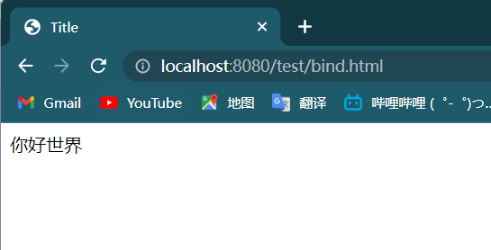

### VUE

##### *本章简介*

*VUE是一个非常成熟的前端框架，明后两天我们将会去简单的学习一下VUE的基本操作，如何使用Vue完成标签的绑定，接管标签的内容显示，以及控制前端标签的循环，完成一些判断等等。可以说VUE框架的引入让我们能够像使用 JSTL 那样去编写HTML网页，可以使用简单的标签属性就能够像js一样方便的控制代码的执行流程与逻辑判断，总的来说vue的引入极大的简化了我们在前端展示数据的工作。*

##### 第一回 ”初次见面，Vue的基本语法与常用属性“

- 如何使用Vue，首先Vue是使用js编写的一个前端框架。我们使用的时候要从外部进行引入，其引入方法就和jQuery的方法一样可以使用静态js文件也可以使用cnd联网引入。

  > ​	cdn地址：
  >
  > 
  >另外一种则就是静态引入了，将项目内的Vue使用引入Vue框架
  
- 简单的Vue元素显示

  1. 在vue中提供了一套语法规则来让我们将页面中的标签元素绑定到js代码中以及实现数据的绑定。

     > ​	代码具体如下

     ~~~html
     <!DOCTYPE html><html lang="en"><head>    <meta charset="UTF-8">    <title>Title</title>
         </head>
         
         <body>
             <!--需要被绑定的标签一定要设置一个id来为标记-->    
             

                 <!--我们可以使用 {{}} 插值表达式的形式很方便的展示我们在vue中定义的变量--> 
                 {{msg}}    
             
</body>
     </html>
     ~~~

     

- vue中的指令

  在vue中就是依靠这些指令来完成数据与标签元素的绑定，以及标签元素的时间监听等等，其大致可以分为几种，1.数据显示（v-text，v-html） 2.逻辑判断（v-show，v-if） 3.事件监听（v-on/@） 4.流程控制（v-for）

  5.表单双向绑定（v-bind）

  1. 数据显示类的

     v-text，v-text的使用方式就像一个标签的属性一样，而他的功能则是给双标签中赋值，并且是   "原封不动"(不会解析html标签内容) 的覆盖掉标签中原本的内容。

     ~~~html
     
     <body>
         

             
         

     </body>
     
     ~~~

     v-html,v-html的使用方式和v-text几乎一样，只不过v-html会将里面的html标签解析成具体的html样式，其他的就和v-text一模一样了

  2. 逻辑判断的

     v-show,v-show则是用来控制标签元素是否显示的，当被v-show控制的标签中v-show中的条件满足了则会去显示标签中的内容，反之则不会显示。

     ~~~html
     
     <body>
         

             {{msg1}}
             {{msg2}}
         

     </body>
     
     </html>
     ~~~

     这串代码的执行结果应该是显示msg1，不显示msg2

     v-if，v-if则也是控制标签显示的，其使用效果则和v-show一模一样但是如果是使用v-show则不是真正的移除标签元素则是给标签添加上display属性，而v-if则是会移除掉整个标签，外面通过查看网页源码就能很清晰的发现这个特性。

  3. 事件监听的

     v-on/@属性 我们只使用jQuery的时候可以知道标签元素有很多的监听事件，比如点击，失去焦点，键盘按下，等等在vue中同样给我们提供了许多的事件监听。可以使用v-on/@绑定一些事件从而去触发我们在js中写的一些方法。

     ~~~html
     <body>
         

             {{msg1}}
             {{msg2}}
         

     </body>
     
     ~~~

     在vue中事件属性的引入能够让我们很方便的将标签的事件绑定到我们在vue对象中定义的函数，从而实现事件的监听操作。并且使用简写方式@符号可以完全的替代v-on:当然事件不仅仅只要click而且还有blur失去焦点，回车按钮，鼠标移入等等 但是最常见的就是

  4. v-for，v-for就是喜闻乐见的循环属性了，他具体的编写格式为v-for="e in lists",从list中获取到每一个元素放到e中算一次循环，所以我们可以根据这个特性来便利出lists中的全部内容。

     ~~~html
     <body>
         

             
{{msg}}

         

     </body>
     
     </html>
     ~~~

     使用这个v-for属性能够让我们像jstl中的foreach一样去循环便利数组中的内容

  5. v-bind/:，v-bind/:也是实行数据绑定的只不过v-bind是用来接管value属性的，被：/v-bind托管的属性可以在属性值中直接编写vue中定义的属性

     ~~~html
     
     <body>
         

             <input :value="msgs">
             {{msgs}}
         

     </body>
     
     </html>
     ~~~

  6. v-model，这个属性比较的特殊，v-model可以实现表单元素与vue对象中元素的双向绑定，也就是在表单中修改的时候会影响到vue中，修改vue中的属性同样会影响到表单的控件

     ~~~java
     <body>
         

             <input v-model="msgs">
             {{msgs}}
         

     </body>
     
     </html>
     ~~~

##### 第二回 ”强大的Vue，使用Vue实现一点简单的网页小程序“

- 我们在上一章节已经讲了vue的基础用法以及vue如何使用属性去接管传统的标签来实现数据的显示，那么我们今天就来使用Vue来实现一些网页简单小程序的编写。

  1. axios()实现异步的提交，我们在vue中使用异步提交技术就不能使用传统的ajax了则需要使用第三方的axios，他的使用方式几乎和ajax一模一样并且比ajax更加的方便与易用。我们下面就使用一个简单的天气预报来演示axios的使用方式。
     - 前端代码我们就不研究了，直接拿别人的源码来用，我们只需要在js代码中使用axios对别人提供好的api网页发出请求，并且使用vue中的插值表达式或者属性绑定的方式显示到前端中。具体细节可以看一下下面的代码，注释非常的详细。

  ~~~html
  <!DOCTYPE html>
  <html lang="en">
    <head>
      <meta charset="UTF-8" />
      <meta name="viewport" content="width=device-width, initial-scale=1.0" />
      <meta http-equiv="X-UA-Compatible" content="ie=edge" />
      <title>天知道</title>
      <link rel="stylesheet" href="css/reset.css" />
      <link rel="stylesheet" href="css/tianindex.css" />
    </head>
  
    <body>
      

        

          

          

            <!-- 使用vue将要查找的城市绑定到data中的city对象 -->
            <input
              type="text"
              v-model="city"
              class="input_txt"
              placeholder="请输入查询的天气"
            />
            <!-- 将按钮绑定提交到getMsg方法中 -->
            <button class="input_sub" @click="getMsg">
              搜 索
            </button>
          

          

            <a href="javascript:;">北京</a>
            <a href="javascript:;">上海</a>
            <a href="javascript:;">广州</a>
            <a href="javascript:;">深圳</a>
          

        

        <ul class="weather_list">
          
          <!--循环我们查到的数据并且使用插值表达式显示到前端中-->
          <li v-for="e in msgs">
            
{{e.fengxiang}}

            

              <b>{{e.low}}</b>
              ~
              <b>{{e.high}}</b>
            

            
{{e.date}}

          </li>
        </ul>
      

      <!-- 开发环境版本，包含了有帮助的命令行警告 -->
      
      <!-- 官网提供的 axios 在线地址 -->
      
  
      <!-- 自己的js -->
      
    </body>
  </html>
  
  ~~~

  2. element与Vue的结合，使用Element搭建出一个简单的布局。
     - element是饿了么开发的一款前端页面，他容易上手并且能够并且必须要搭配Vue使用，能够非常方便的将Vue中的数据绑定到Element页面中。我们可以在element官方手册上查到大量(几乎我们所有要用得到的)布局与控件。

  ~~~html
  <!DOCTYPE html>
  <html lang="en">
  <head>
      <meta charset="UTF-8">
      <title>Title</title>
  </head>
  <!-- 引入样式 -->
  <link rel="stylesheet" href="https://unpkg.com/element-ui/lib/theme-chalk/index.css">
  <!-- 开发环境版本，包含了有帮助的命令行警告 -->
  
  <!-- 引入组件库 -->
  
  <body>
  

  
      <el-container>
          <el-aside width="200px">Aside</el-aside>
          <el-container>
              <el-header>Header</el-header>
              <el-main>Main</el-main>
              <el-footer>Footer</el-footer>
          </el-container>
      </el-container>
  
  

  
  </body>
  
  ~~~

  

##### 第三回 “使用Vue改造项目吧！Vue在Element框架上的CRUD”

- 我们在上一章节已经讲了vue的基础用法以及vue如何使用属性去接管传统的标签来实现数据的显示，所以说vue让我们能在html网页上如Jsp中一样方便的取出后端传递过来的数据，能够在网页不发生表单提交与跳转的前提上使用 “Ajax异步” 的实现数据像后台的提交。并且对于数据沟通的格式使用了对前后端都非常友好的 ”JSON数据“ ，促进了 ”网页数据规范化“ 的生成。

- 在学习Vue的CRUD之前我们要先了解一些东西，也就是我们在第一段正文中用引号标注的内容。

  1. ajax异步请求，这个我们在写web项目的时候曾经大篇幅的讲解，并且在Vue中被axios()完美的代替了。

  2. JSON数据，json可以说是前端与后端之间沟通的桥梁，能够被前端以及后端完美的识别，所以自然而然的就成为了前后端进行数据传递的中间件。*JSON天生是桥梁，但桥梁不一定为JSON*。

  3. 网页数据传递规范化，我们在使用Vue+异步请求之后就要考虑网页传递数据的规范化了，通常我们看别人发布的接口基本上都会有 code(状态码)，msg(事件消息)，data(传递的数据)，其中状态码作为请求是否成功的标准，事件消息则为请求的简单回应消息，data则为响应回来的数据。

     我们在这只做简单的讲解一下具体的应用就放在下面阐述了。

- 就拿我们之前写过的一个员工管理系统来做示例吧，使用vue来替代传统的jsp+servlet的增删改查。

  1. 用户登录后的全表查询

     - 首先我们就先拿最简单的查询来说吧，我们在登录成功之后会希望跳转到一个主页面，主页面会显示所有的用户信息，其实这个功能我们使用传统的跳转也能很容易的实现，并且用户在使用的时候也并没有什么违和感，但是我们在这作为演示就使用vue来实现一遍。

     - 在写代码之前我们要知道vue使用的是异步请求，也就是是在网页中的js代码使用ajax去发出请求的所以我们在登录之后就不要再去跳转到查询全部的Servlet中了，直接跳转到主页面然后通过主页面中的ajax请求去请求查询全部的servlet，并且使用Vue的拿手好戏数据绑定到前端要显示的控件上。

       登录的页面与Servlet

       ~~~java
  <%@ page contentType="text/html;charset=UTF-8" language="java" %>
       <html>
       <head>
           <title>Title</title>
       </head>
       <body>
       <form action="/UserServlet/login" method="post">
           昵称<input type="text" name="username">
           密码<input type="password" name="password">
           <input type="submit" value="提交">
           <input type="button" value="注册" onclick="location.href='regist.jsp'">
       </form>
       </body>
       ~~~
       
       ~~~java
       // 使用单个Servlet去处理多个请求的技术我们在上面已经具体的探讨过了
       @WebServlet("/UserServlet/*")
       public class UserServlet extends HttpServlet {
       
           UserDao userDao = new UserDao();
       
           @Override
           protected void service(HttpServletRequest req, HttpServletResponse resp) throws ServletException, IOException {
       
               String requestURL = req.getRequestURL().toString();
               String[] strs = requestURL.split("/");
               String method = strs[strs.length - 1];
               switch (method) {
                   case "login":
                       login(
                               req.getParameter("username"),
                               req.getParameter("password"),
                               req,
                               resp
                       );
                       break;
       
                   case "regist":
                       User user = new User();
                       user.setUsername(req.getParameter("username"));
                       user.setRealname(req.getParameter("realname"));
                       user.setPassword(req.getParameter("password"));
                       System.out.println(user);
                       regist(user, req, resp);
                       break;
                   case "check":
                       check(req.getParameter("un"), resp, req);
                       break;
                   default:
                       System.out.println("def");
               }
           }
       
       private void login(String email, String password, HttpServletRequest req, HttpServletResponse resp) throws IOException {
               User login = userDao.login(email, password);
               if (login != null) {
                   req.getSession().setAttribute("user", login);
                   resp.sendRedirect("/mainsp.html");
               } else {
                   resp.sendRedirect("/login.jsp");
              }
           }
       }   
       
       ~~~
       
       ~~~html
       //对于登录成功后进去主页则就比较复杂了，要在html页面中引入vue js axios等来实现查询到的信息显示
       
       <!DOCTYPE html>
       <html lang="en">
       <head>
           <meta charset="UTF-8">
           <title>Title</title>
       </head>
       <!-- 引入样式 -->
       <link rel="stylesheet" href="https://unpkg.com/element-ui/lib/theme-chalk/index.css">
       <!-- 开发环境版本，包含了有帮助的命令行警告 -->
       
       <!-- 引入组件库 -->
       
       <!-- 官网提供的 axios 在线地址 -->
       
       <!--引入qs-->
       
       
       <body>
       

           <el-container>
               <el-aside width="200px">Aside</el-aside>
               <el-container>
                   <el-button type="primary" @click="popMenuAdd" round >添加一个</el-button>
                   <el-main>
                       <el-table
                               :data="empMsgs"
                               style="width: 100%">
                           <el-table-column
                                   prop="id"
                                   label="编号"
                           ></el-table-column>
                           <el-table-column
                                   prop="name"
                                   label="姓名"
                           ></el-table-column>
                           <el-table-column
                                   prop="age"
                                   label="年龄"
                                   >
                           </el-table-column>
                           <el-table-column
                                   prop="entrydate"
                                   label="入职日期"
                                   >
                           </el-table-column>
                           <el-table-column
                                   prop="job"
                                   label="岗位">
                           </el-table-column>
                           <el-table-column
                                   prop="dept.name"
                                   label="部门名称">
                           </el-table-column>
                           <el-table-column
                                   prop="dept.address"
                                   label="部门地址">
                           </el-table-column>
                           <el-table-column
                                   prop="salary"
                                   label="工资">
                           </el-table-column>
                           <el-table-column
                                   fixed="right"
                                   label="操作"
                                   width="200">
                               <template slot-scope="scope">
                                   <el-button @click="removeOne(scope.row.id)" type="text" size="small">删除</el-button>
                                   <el-button @click="popMenuModify(scope.row)" type="text" size="small">编辑</el-button>
                               </template>
                           </el-table-column>
                       </el-table>
       
                   </el-main>
                   <el-footer></el-footer>
               </el-container>
           </el-container>
           

       </body>
       
       // 显然我们发现我们登录完毕后跳转到主页然后再使用axios来异步请求数据并没有简便多少，但是为了能再html网页中展
           示出我们查询到的数据我们就不得不去使用vue(当然也有一些其他的框架能实现后台传入的数据显示)从而写大量的js代码，所以vue并不是完全替代了jsp，我们要根据具体的使用情况来选择合适的数据展示形式。
       ~~~
     
  2.  实现数据单条的删除操作。
  
     - 同样这个功能也是比较的简单，我们只需要在每一行数据后面天机一个按钮。而且这个按钮是负责触发删除事件的，并且在触发删除事件的同时会将这一行信息的数据传递给js，然后由js中的方法使用axios往后台发出一次异步请求，后台执行完毕之后再回调初始化页面的函数实现页面的刷新。
  
       ~~~html
       <body>
       

           <el-container>
               <el-aside width="200px">Aside</el-aside>
               <el-container>
                   <el-button type="primary" @click="popMenuAdd" round >添加一个</el-button>
                   <el-main>
                       <el-table
                               :data="empMsgs"
                               style="width: 100%">
                           <el-table-column
                                   prop="id"
                                   label="编号"
                           ></el-table-column>
                           <el-table-column
                                   prop="name"
                                   label="姓名"
                           ></el-table-column>
                           <el-table-column
                                   prop="age"
                                   label="年龄"
                                   >
                           </el-table-column>
                           <el-table-column
                                   prop="entrydate"
                                   label="入职日期"
                                   >
                           </el-table-column>
                           <el-table-column
                                   prop="job"
                                   label="岗位">
                           </el-table-column>
                           <el-table-column
                                   prop="dept.name"
                                   label="部门名称">
                           </el-table-column>
                           <el-table-column
                                   prop="dept.address"
                                   label="部门地址">
                           </el-table-column>
                           <el-table-column
                                   prop="salary"
                                   label="工资">
                           </el-table-column>
                           <el-table-column
                                   fixed="right"
                                   label="操作"
                                   width="200">
                               <template slot-scope="scope">
                                   <el-button @click="removeOne(scope.row.id)" type="text" size="small">删除</el-button>
                                   <el-button @click="popMenuModify(scope.row)" type="text" size="small">编辑</el-button>
                               </template>
                           </el-table-column>
                       </el-table>
       
                   </el-main>
                   <el-footer></el-footer>
               </el-container>
           </el-container>
       
           <!--修改弹出框的代码-->
           <el-dialog
                   title="提示"
                   :visible.sync="dialogVisible"
                   width="30%"
           >
       
               <el-form label-width="80px" :model="empMsg">
                   <el-form-item label="名字">
                       <el-input v-model="empMsg.name"></el-input>
                   </el-form-item>
                   <el-form-item label="年龄">
                       <el-input v-model="empMsg.age"></el-input>
                   </el-form-item>
                   <el-form-item label="入职日期">
                       <el-date-picker
                               v-model="empMsg.entrydate"
                               type="date"
                               placeholder="选择日期"
                               style="width: 100%">
                       </el-date-picker>
                   </el-form-item>
                   <el-form-item label="岗位">
                       <el-input v-model="empMsg.job"></el-input>
                   </el-form-item>
                   <el-form-item label="工资">
                       <el-input v-model="empMsg.salary" style="width: 100%"></el-input>
                   </el-form-item>
                   <el-form-item label="经理编号">
                       <el-input v-model="empMsg.managerid"></el-input>
                   </el-form-item>
                   <!-- 部门名称的下拉框 -->
                   <el-form-item label="部门">
                       <el-select v-model="empMsg.deptid" placeholder="请选择">
                           <el-option
                                   v-for="item in deptMsgs"
                                   :key="item.id"
                                   :label="item.name"
                                   :value="item.id"
                                   style="width: 100%">
                           </el-option>
                       </el-select>
                   </el-form-item>
               </el-form>
       
               
           <el-button @click="dialogVisible = false">取 消</el-button>
           <el-button type="primary" @click="modifyEMp">确 定</el-button>
         
           </el-dialog>
           

       
       
       </body>
       
       
       </html>    
       ~~~
  
       ~~~java
       @WebServlet("/EmpServlet/*")
       public class EmpServlet extends HttpServlet {
           EmpDao empDao = new EmpDao();
           @Override
           protected void service(HttpServletRequest req, HttpServletResponse resp) throws ServletException, IOException {
               // 拿到请求的具体内容
               String requestURL = req.getRequestURL().toString();
               String[] strs = requestURL.split("/");
               String method = strs[strs.length - 1];
               // 然后我们可以根据请求内容来决定要去执行哪一个方法，
               switch (method){
                   case "AllEmp":
                       getAllEmpSp(req, resp);
                       break;
                   case "Add":
                       try {
                           addOneEmp(req, resp);
                       } catch (ParseException e) {
                           e.printStackTrace();
                       }
                       break;
                   case "GetOneEmp":
                       getOneEmp(req,resp);
                       break;
                   case "Modify":
                       modifyEmpById(req,resp);
                       break;
                   case "Remove":
                       removeEmpByIdSp(req,resp);
                       break;
                   default:
               }
           }
           private void getAllEmpSp(HttpServletRequest request,HttpServletResponse response) throws ServletException, IOException {
               List<Emp> allEmp = empDao.getAllEmp();
               ComResult result = new ComResult(200,"OK",allEmp);
               String result_json = JSON.toJSONString(result);
               response.getWriter().print(result_json);
           }
       	/**
            * 根据id删除一个用户
            * @param request 请求
            * @param response 响应
            * @throws IOException
            */
            private void removeEmpByIdSp(HttpServletRequest request,HttpServletResponse response) throws IOException {
               int eid = Integer.parseInt(request.getParameter("eid"));
               System.out.println(eid);
               int i = empDao.removeEmp(eid);
                //判断dao层执行的结果然后将封装成ComResult (统一的结果对象)然后返回给前端
               if (i>0){
                   ComResult result = new ComResult(200,"OK");
                   String s = JSON.toJSONString(result);
                   response.getWriter().print(s);
               }else {
                   ComResult result = new ComResult(500,"ERRO");
                   String s = JSON.toJSONString(result);
                   response.getWriter().print(s);
               }
           }
           }
       ~~~
  
     - 显然我们在上面的代码中使用了CommonResult（统一结果集）也就是将返回的结果信息封装到了一个统一对象中，这个对象除了有要携带的数据还要有状态码(与前端人员约定好的一套code用来判断是否成功)，结果消息(一段简单的描述)。但是对于**增删改**操作一般不会去添加返回数据只需要添加上返回状态码与消息即可。
  
     - 我们发现我们对于这种删除操作使用vue+axios能够大幅度的提高用户的使用体验，用户只需要点击一下按钮就能实现用户的单行删除而不要收到页面跳转的影响。
  
  3. 单条添加，在主页以弹出对话框的形式实现数据的添加。
  
     - 我们如果想要使用弹出框的形式进行数据的添加，就像点击一个按钮就会弹出一个输入框，我们在输入框中填入数据点击提交按钮弹框消失数据添加到数据库并且刷新页面。根据这些需求我们就能分析出来了。首先需要一个弹出框，弹出框中的内容是与数据库对应的表单。很庆幸我们这些内容都能在element中找到对应的信息。然后我们要去写一个便利用于暂时存储表单中填充的数据tempMsg，以及要写一个提交的函数，这个函数会随着表单提交而发出一个异步请求到对应的添加servlet然后将tempMsg存到数据库中。
  
       ~~~html
       <!DOCTYPE html>
       <html lang="en">
       <head>
           <meta charset="UTF-8">
           <title>Title</title>
       </head>
       <!-- 引入样式 -->
       <link rel="stylesheet" href="https://unpkg.com/element-ui/lib/theme-chalk/index.css">
       <!-- 开发环境版本，包含了有帮助的命令行警告 -->
       
       <!-- 引入组件库 -->
       
       <!-- 官网提供的 axios 在线地址 -->
       
       <!--引入qs-->
       
       
       <body>
       

           <el-container>
               <el-aside width="200px">Aside</el-aside>
               <el-container>
                   <el-button type="primary" @click="popMenuAdd" round >添加一个</el-button>
                   <el-main>
                       <el-table
                               :data="empMsgs"
                               style="width: 100%">
                           <el-table-column
                                   prop="id"
                                   label="编号"
                           ></el-table-column>
                           <el-table-column
                                   prop="name"
                                   label="姓名"
                           ></el-table-column>
                           <el-table-column
                                   prop="age"
                                   label="年龄"
                                   >
                           </el-table-column>
                           <el-table-column
                                   prop="entrydate"
                                   label="入职日期"
                                   >
                           </el-table-column>
                           <el-table-column
                                   prop="job"
                                   label="岗位">
                           </el-table-column>
                           <el-table-column
                                   prop="dept.name"
                                   label="部门名称">
                           </el-table-column>
                           <el-table-column
                                   prop="dept.address"
                                   label="部门地址">
                           </el-table-column>
                           <el-table-column
                                   prop="salary"
                                   label="工资">
                           </el-table-column>
                           <el-table-column
                                   fixed="right"
                                   label="操作"
                                   width="200">
                               <template slot-scope="scope">
                                   <el-button @click="removeOne(scope.row.id)" type="text" size="small">删除</el-button>
                                   <el-button @click="popMenuModify(scope.row)" type="text" size="small">编辑</el-button>
                               </template>
                           </el-table-column>
                       </el-table>
       
                   </el-main>
                   <el-footer></el-footer>
               </el-container>
           </el-container>
        <!--添加弹出框的代码-->
           <el-dialog
                   title="提示"
                   :visible.sync="dialogVisibleAdd"
                   width="30%"
           >
       
               <el-form label-width="80px" :model="addMsg">
                   <el-form-item label="名字">
                       <el-input v-model="addMsg.name"></el-input>
                   </el-form-item>
                   <el-form-item label="年龄">
                       <el-input v-model="addMsg.age"></el-input>
                   </el-form-item>
                   <el-form-item label="入职日期">
                       <el-date-picker
                               v-model="addMsg.entrydate"
                               type="date"
                               placeholder="选择日期"
                               style="width: 100%">
                       </el-date-picker>
                   </el-form-item>
                   <el-form-item label="岗位">
                       <el-input v-model="addMsg.job"></el-input>
                   </el-form-item>
                   <el-form-item label="工资">
                       <el-input v-model="addMsg.salary" style="width: 100%"></el-input>
                   </el-form-item>
                   <el-form-item label="经理编号">
                       <el-input v-model="addMsg.managerid"></el-input>
                   </el-form-item>
                   <!-- 部门名称的下拉框 -->
                   <el-form-item label="部门">
                       <el-select v-model="addMsg.deptid" placeholder="请选择">
                           <el-option
                                   v-for="item in deptMsgs"
                                   :key="item.id"
                                   :label="item.name"
                                   :value="item.id"
                                   style="width: 100%">
                           </el-option>
                       </el-select>
                   </el-form-item>
               </el-form>
       
               
           <el-button @click="dialogVisibleAdd = false">取 消</el-button>
           <el-button type="primary" @click="addEmp">确 定</el-button>
         
           </el-dialog>
       
       

       </body>
       
       </html>
       ~~~
  
       ~~~java
       @WebServlet("/EmpServlet/*")
       public class EmpServlet extends HttpServlet {
           EmpDao empDao = new EmpDao();
           @Override
           protected void service(HttpServletRequest req, HttpServletResponse resp) throws ServletException, IOException {
               // 拿到请求的具体内容
               String requestURL = req.getRequestURL().toString();
               String[] strs = requestURL.split("/");
               String method = strs[strs.length - 1];
               // 然后我们可以根据请求内容来决定要去执行哪一个方法，
               switch (method){
                   case "AllEmp":
                       getAllEmpSp(req, resp);
                       break;
                   case "Add":
                       try {
                           addOneEmp(req, resp);
                       } catch (ParseException e) {
                           e.printStackTrace();
                       }
                       break;
                   default:
               }
           }
            /**
            * 获取全部的员工信息
            * @param request req
            * @param response resp
            * @throws ServletException
            * @throws IOException
            */private void getAllEmpSp(HttpServletRequest request,HttpServletResponse response) throws ServletException, IOException {
               List<Emp> allEmp = empDao.getAllEmp();
               ComResult result = new ComResult(200,"OK",allEmp);
               String result_json = JSON.toJSONString(result);
               response.getWriter().print(result_json);
           }
       
           /**
            * 添加一个新员工
            * @param request 请求
            * @param response 响应
            * @throws ParseException
            * @throws IOException
            */
           private void addOneEmp(HttpServletRequest request,HttpServletResponse response) throws ParseException, IOException {
               Emp emp = new Emp();
               Dept dept = new Dept();
       
               dept.setId(Integer.parseInt(request.getParameter("deptid")));
               emp.setManagerid(Integer.parseInt(request.getParameter("managerid")));
               emp.setName(request.getParameter("name"));
               emp.setAge(Integer.parseInt(request.getParameter("age")));
               emp.setSalary(new BigDecimal(request.getParameter("salary")));
               SimpleDateFormat sdf = new SimpleDateFormat("yyyy-MM-dd");
               emp.setEntrydate(sdf.parse(request.getParameter("entrydate")));
               emp.setJob(request.getParameter("job"));
               emp.setDept(dept);
               int i = empDao.addEmp(emp);
               //封装结果集
               ComResult comResult = null;
               if (i>0){
                   comResult=new ComResult(200,"OK");
               }else {
                   comResult= new ComResult(500,"ERRO");
               }
               //将结果集返回到前端中
               String s = JSON.toJSONString(comResult);
               response.getWriter().print(s);
           }
       }
       
       ~~~
  
  4. 那么就剩最后一个了，当个元素的修改
  
     - 其实修改是和添加基本一致的，不同的是我们要在点击修改的时候将原本的数据回显到修改的表单中，其实这个并不难反而很简单，我们在进行删除的时候就能获取到一行的全部数据，所以我们在点击这一行的时候将数据通过触发函数绑定到data中的对象，然后再将这个对象信息双向绑定到我们要回显的表单上即可。因为我们再表单上修改的时候同样会修改data中的数据所以我们再点击提交按钮的时候将这个数据提交给后台就行了。因为和添加重复代码太多我们在这就只粘贴部分前端代码了。
  
       ~~~html
       <!--添加弹出框的代码-->
           <el-dialog
                   title="提示"
                   :visible.sync="dialogVisibleAdd"
                   width="30%"
           >
       
               <el-form label-width="80px" :model="addMsg">
                   <el-form-item label="名字">
                       <el-input v-model="addMsg.name"></el-input>
                   </el-form-item>
                   <el-form-item label="年龄">
                       <el-input v-model="addMsg.age"></el-input>
                   </el-form-item>
                   <el-form-item label="入职日期">
                       <el-date-picker
                               v-model="addMsg.entrydate"
                               type="date"
                               placeholder="选择日期"
                               style="width: 100%">
                       </el-date-picker>
                   </el-form-item>
                   <el-form-item label="岗位">
                       <el-input v-model="addMsg.job"></el-input>
                   </el-form-item>
                   <el-form-item label="工资">
                       <el-input v-model="addMsg.salary" style="width: 100%"></el-input>
                   </el-form-item>
                   <el-form-item label="经理编号">
                       <el-input v-model="addMsg.managerid"></el-input>
                   </el-form-item>
                   <!-- 部门名称的下拉框 -->
                   <el-form-item label="部门">
                       <el-select v-model="addMsg.deptid" placeholder="请选择">
                           <el-option
                                   v-for="item in deptMsgs"
                                   :key="item.id"
                                   :label="item.name"
                                   :value="item.id"
                                   style="width: 100%">
                           </el-option>
                       </el-select>
                   </el-form-item>
               </el-form>
       
               
           <el-button @click="dialogVisibleAdd = false">取 消</el-button>
           <el-button type="primary" @click="addEmp">确 定</el-button>
         
           </el-dialog>
       
       </html>
       ~~~
  

##### 总结

*为期两天其实只能学习一点Vue的皮毛芝士，我们简单的了解了Vue如何托管前端标签元素，如何保存数据，如何将数据显示到前端标签上。根据这些特性之后我们又可以结合element实现对后端传递过来的数据展示到前端，并且再次结合axios异步请求能够很舒服的完成之前 JSP+Servlet+Jstl才能实现的功能。尽管我们不是学前端的，但是对于Vue，Element这种炙手可热的前端框架了解一点还是对我们有用的。*

@Data 2022/09/20

@Author Planifolia.Van